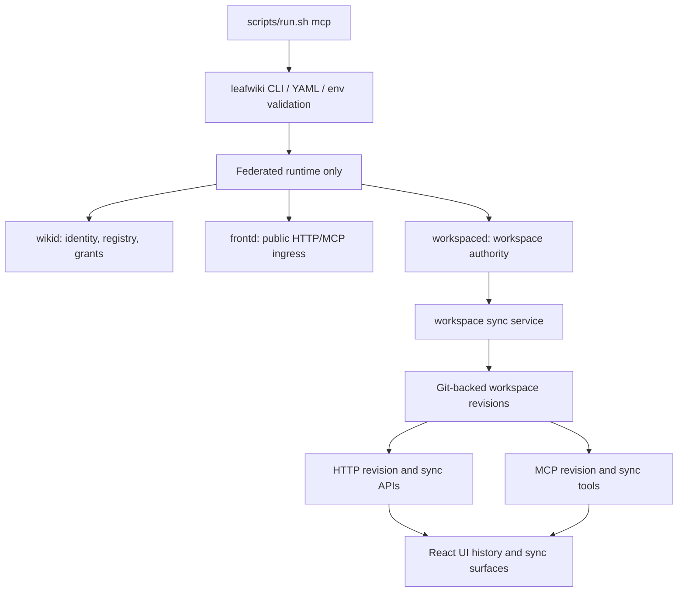
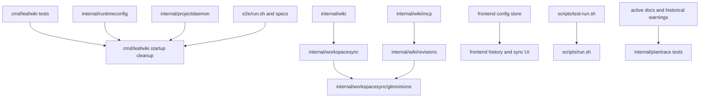
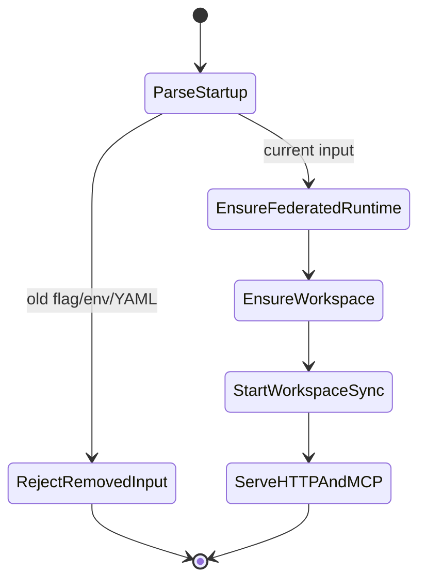

<!-- leafwiki
version: 1
page:
  id: frsc-plan-20260620
  title: Federated Runtime Sync Cleanup
  created_at: "2026-06-20T22:13:23Z"
  updated_at: "2026-06-20T22:13:23Z"
  creator_id: system
  last_author_id: system
tags:
  - plans
fields:
  type: cleanup
-->

# Federated Runtime Sync Cleanup Implementation Plan

## Goal & Context

### Objective

Remove legacy runtime, revision, sync-mode, MCP-compatibility, wrapper, and E2E seeding paths so LeafWiki always uses the federated daemon and Git-backed workspace sync for workspace runtimes.

### Context

- Current Codex thread ID: unavailable in this planning runtime.
- Conversation link: unavailable.
- Notion tickets: none provided.
- Bug reports: none provided.
- Workflow: `docs/plans/planning.aibasic.txt`.
- Observation artifact: `docs/plans/federated-runtime-sync-cleanup.OBSERVE.md`.
- Context artifact: `docs/plans/federated-runtime-sync-cleanup.CONTEXT.md`.
- Decision artifact: `docs/plans/federated-runtime-sync-cleanup.DECISION.md`.
- Dependent plans:
  - `docs/plans/federated-workspaces.PLAN.md`
  - `docs/plans/wikid-frontd-extraction.PLAN.md`
  - `docs/plans/workspace-sync.PLAN.md`
  - `docs/plans/mcp_transport_unification.PLAN.md`
  - `docs/plans/remove.sidecar.PLAN.md`
- Prerequisites:
  - Existing federated runtime tests are passable or known-failing failures are documented.
  - Implementation agent follows `@/Users/jakubtomanik/.codex/RTK.md` and runs shell commands through `rtk`.
  - Work happens in the current checkout unless the user explicitly requests a worktree.

### Decisions from Discussion

**Key Decisions:**

1. Remove `RuntimeStackLegacy`, `LEAFWIKI_RUNTIME_STACK`, and the legacy branch in daemon startup.
   - Reason: federated runtime is now the only supported runtime.

2. Remove workspace-sync opt-in and opt-out flags/envs.
   - Reason: Git-backed workspace sync is mandatory for workspace runtimes.

3. Remove legacy page-snapshot revision mode.
   - Reason: Git-backed workspace history is the authoritative history model.

4. Drop or ignore old snapshot revision data.
   - Reason: migration is out of scope and would preserve complexity that the cleanup is meant to remove.

5. Remove UI/API mode branching.
   - Reason: clients should not reason about legacy revision versus Git-backed history.

6. Remove old MCP compatibility flags.
   - Reason: current startup uses `--mcp`; old boolean flags should no longer parse.

7. Remove legacy API-key seeding support.
   - Reason: E2E auth stores now use the `wikid` layout.

8. Remove ignored wrapper compatibility flags.
   - Reason: stale configs should fail rather than silently appearing valid.

9. Old flags/envs fail unknown.
   - Reason: the user chose hard failure instead of tailored compatibility.

10. Keep legacy auth DB cleanup.
    - Reason: it is bounded upgrade protection and not the legacy runtime.

11. Keep historical docs with warnings.
    - Reason: plan pages are historical artifacts, but stale instructions must be labeled.

**Alternatives Considered:**

- Keep old flags parseable but ignored.
  - Rejected because it keeps stale configs alive.

- Migrate snapshot revisions to Git.
  - Rejected because Git history is authoritative after this change and migration is high-risk extra work.

- Delete `internal/projectdaemon`.
  - Rejected because descriptor/control and STDIO attach still depend on it.

- Remove disabled auth or root `/mcp`.
  - Rejected as out of scope for this cleanup.

**Open Questions Resolved:**

- Q: Should old flags/envs fail unknown?
  - A: Yes.

- Q: Should old revision data migrate?
  - A: No. Drop or ignore it.

- Q: Should `enableRevision` remain in API/config?
  - A: No.

- Q: Should `enableWorkspaceSync` remain in API/config?
  - A: It may remain as `true` temporarily as a capability signal, but it must stop driving mode branches.

- Q: Should historical plans be deleted?
  - A: No. Keep them with historical warnings.

## Summary

The implementation removes old product modes at their input seams, then simplifies the runtime, workspace, revision, UI, scripts, E2E, and docs layers to match one contract:

- Federated runtime only.
- Workspace sync always on for workspace runtimes.
- Git-backed workspace revisions only.
- Removed flags and env vars fail.
- Active docs teach only the current contract.

## Scope Boundaries

### In Scope

- Remove legacy runtime stack constants, env resolution, startup branches, and tests.
- Remove workspace-sync enable/disable CLI flags, YAML keys, wrapper flags, env vars, config matching fields, and tests.
- Remove legacy page-snapshot revision feature flags, startup wiring, baseline revisions, page-save side effects, and mode branches.
- Keep or move shared revision DTO/model types that Git-backed workspace history still uses.
- Convert HTTP revision routes and MCP revision tools to Git-backed workspace history only.
- Register workspace sync routes/tools by default for workspace runtimes.
- Remove `enableRevision` from HTTP config, MCP config, frontend config types, schemas, and tests.
- Keep `enableWorkspaceSync: true` only as a short-term capability signal if required.
- Collapse frontend history and workspace sync UI to Git-backed behavior.
- Remove old MCP compatibility flags.
- Remove ignored wrapper compatibility flags.
- Remove legacy API-key seeding path.
- Update active docs and historical-plan warnings.
- Update unit, integration, wrapper, and E2E tests.

### Out of Scope / Deferred

- Migrating legacy snapshot revisions to Git.
- Deleting old snapshot revision files from user data dirs.
- Removing descriptor/control primitives.
- Renaming `projectdaemon`.
- Removing disabled-auth workflows.
- Removing root `/mcp`.
- Removing `leafwiki-local-mcp`.
- Adding historical asset revision support to Git-backed history.
- Full removal of `enableWorkspaceSync` from every API response if doing so would break clients in this slice.
- Large frontend redesign of history UI.

### Intentional Limitations

- Old snapshot data remains on disk and unread.
- Git-backed revision asset reads remain unsupported unless already implemented by workspace sync.
- Removed envs require explicit validation because env vars do not naturally fail unknown.
- Descriptor metadata may still say `wikid-frontd` as a constant.

## Assumptions

- Workspace-owning runtimes are `runtimeWikiFull` and `runtimeWikiWorkspaceOnly`.
- `runtimeWikiControlPlaneOnly` should not initialize workspace sync.
- Git-backed workspace revisions already provide page list/get/compare/restore behavior needed by history routes and tools.
- Existing `workspacesync` and `gitrevisions` tests are the right safety net for Git-backed history.
- `scripts/run.sh mcp` remains the user-facing STDIO wrapper.
- Direct `leafwiki --mcp=stdio` remains supported.
- Removed CLI flags can fail through Go `flag` unknown-option behavior.
- Removed YAML keys can fail through existing config-file unknown-key validation after they are removed from allowed key lists.
- Removed env vars must be detected explicitly when they are LeafWiki-owned env names.

## Impact Analysis

### Existing Code Impact

| File | Change | Downstream Impact |
|---|---|---|
| `internal/projectdaemon/roles.go` | Remove `RuntimeStackLegacy`; keep federated constant | Runtime stack no longer selects behavior |
| `internal/projectdaemon/config.go` | Remove revision/sync/max-history mode fields from config matching if no longer needed | Descriptor hashes may change; tests must cover stale descriptor cleanup |
| `internal/runtimeconfig/config.go` | Remove `EnableRevision`, possibly `EnableWorkspaceSync`, `MaxRevisionHistory`, and legacy runtime selector fields | Startup config cannot carry old modes |
| `internal/runtimeconfig/startup.go` | Remove YAML keys and service defaults for removed modes | Config files with old keys fail unknown |
| `cmd/leafwiki/main.go` | Remove old CLI flags/env resolution/runtime branches | Startup always uses federated path |
| `cmd/leafwiki/main.go` | Add removed-env validation | Old envs fail generically |
| `cmd/leafwiki/main.go` | Collapse `authStorageDirForRuntime` to `wikid` auth path | Auth/API-key verification always uses `wikid` stores |
| `cmd/leafwiki/main.go` | Remove old single-owner `wiki.NewWiki` server path | Only `runWikidFrontdOwner` owns runtime startup |
| `internal/wiki/wiki.go` | Remove revision/sync conflict and legacy revision startup | Workspace runtimes always use sync; no baseline snapshot revisions |
| `internal/wiki/page_route_factories.go` | Remove `RevisionSideEffect` from page-save orchestrators | Page mutations no longer write snapshot revisions |
| `internal/wiki/mcp_route_factory.go` | Remove legacy revision use cases from route construction | MCP revision tools use workspace callbacks only |
| `internal/wiki/revisions/routes.go` | Register routes by default and remove `usesWorkspaceRevisions` branch | HTTP revision routes are Git-backed |
| `internal/wiki/revisions/use_cases.go` | Remove or split legacy service-backed use cases | Keep response DTOs needed by Git history |
| `internal/wiki/mcp/routes.go` | Remove optional gates for workspace sync/revision | Tools are present by default where workspace services exist |
| `internal/wiki/mcp/tools_revisions.go` | Remove legacy revision branches | MCP revision tools are Git-backed |
| `internal/wiki/workspacesync/routes.go` | Remove `EnableWorkspaceSync` gate | Sync endpoints exist for workspace runtimes |
| `internal/wiki/auth/routes.go` | Remove `enableRevision`; keep `enableWorkspaceSync: true` if needed | Frontend config contract changes |
| `internal/wiki/mcp/types.go` | Remove `EnableRevision`; keep sync capability if needed | MCP config schema changes |
| `ui/leafwiki-ui/src/lib/api/config.ts` | Remove `enableRevision`; make sync capability optional/true | Frontend stops hiding features by old mode |
| `ui/leafwiki-ui/src/stores/config.ts` | Remove mode defaults that hide history/sync | UI assumes current capabilities |
| `ui/leafwiki-ui/src/App.tsx` | Make history route availability unconditional | History routes no longer depend on config mode flags |
| `ui/leafwiki-ui/src/features/viewer/useToolbarActions.tsx` | Always show history action when allowed by auth/read-only mode | Toolbar reflects mandatory history |
| `ui/leafwiki-ui/src/features/history/PageHistoryContent.tsx` | Remove legacy labels/assets branch | History UI uses Git-backed "version" behavior |
| `ui/leafwiki-ui/src/features/tree/TreeView.tsx` | Remove sync gating | Validation/snapshot UI is always active for editable workspaces |
| `scripts/run.sh` | Remove sync opt-out, runtime-stack forwarding, ignored compatibility flags | Wrapper rejects stale options |
| `scripts/test-run.sh` | Flip compatibility tests to unknown failures | Shell wrapper contract updated |
| `e2e/run.sh` | Remove legacy revision defaults and sync env gating | E2E runs current mode by default |
| `e2e/seed_mcp_api_keys.go` | Remove runtime-stack flag/env and legacy stores | E2E seeds only `wikid` auth stores |
| `e2e/tests/mcpClient.ts` | Stop forwarding removed runtime envs | STDIO clients no longer inherit stale selectors |
| Active docs | Rewrite optional-mode wording | User docs match current behavior |
| Historical plan docs | Add/update historical warnings | Old examples do not look current |

### Existing Tests Requiring Updates

| File | Change | Downstream Impact |
|---|---|---|
| `cmd/leafwiki/main_test.go` | Remove old runtime-stack, enable-revision, enable-workspace-sync, old MCP compat expectations | CLI contract becomes default-only |
| `internal/runtimeconfig/*_test.go` | Remove allowed config keys/defaults for old modes | YAML old keys fail unknown |
| `internal/projectdaemon/*_test.go` | Update config hash/mismatch expectations if fields are removed | Descriptor tests stay focused on current metadata/control |
| `internal/wiki/wiki_test.go` | Remove `EnableRevision` setup and legacy baseline tests | Workspace sync becomes default setup path |
| `internal/wiki/revisions/routes_test.go` | Remove legacy branch cases | Route tests assert Git-backed callbacks |
| `internal/wiki/mcp/mcp_integration_test.go` | Tool listing/config expectations updated | Sync/revision tools default; `enableRevision` absent |
| `internal/wiki/mcp/tools_revisions_test.go` | Assert Git-backed revision tools | No service-backed branches |
| `internal/wiki/pagesave/effects_test.go` | Remove `RevisionSideEffect` tests or move to deleted-code cleanup | Page-save no longer writes snapshot revisions |
| `internal/core/revision/*_test.go` | Delete legacy service/fs-store tests or retain only shared model tests | Snapshot service no longer supported |
| `internal/workspacesync/*_test.go` | Strengthen Git-backed revision coverage | New authoritative history path |
| `e2e/seed_mcp_api_keys_test.go` | Remove legacy store tests | Seeds always use `wikid` stores |
| `scripts/test-run.sh` | Expect old wrapper flags/envs to fail | Wrapper compatibility removed |
| `e2e/tests/*.spec.ts` with sync gates | Remove `E2E_ENABLE_WORKSPACE_SYNC` requirements | Sync is default test mode |
| `ui/leafwiki-ui` tests if present | Update config/history UI assumptions | No legacy branch |
| `internal/plantrace/*_test.go` | Add warnings for historical docs that mention removed flags | Historical docs stay safe |

### Module & Target Boundaries

| Area | Boundary |
|---|---|
| Startup/runtime | `cmd/leafwiki`, `internal/runtimeconfig`, `internal/projectdaemon` |
| Workspace runtime | `internal/wiki`, `internal/workspacesync`, `internal/wikid` |
| Revision HTTP/MCP | `internal/wiki/revisions`, `internal/wiki/mcp` |
| Legacy revision storage | `internal/core/revision`, `internal/wiki/pagesave` |
| Frontend config/history/sync UI | `ui/leafwiki-ui/src` |
| Wrapper/harness | `scripts`, `e2e` |
| Docs | `README.md`, `docs/*.md`, historical `docs/plans/*.PLAN.md` |

### Access Control

| Type/File | Public API | Internal/Private |
|---|---|---|
| `--mcp` | Keep public | N/A |
| `--enable-mcp`, `--mcp-stdio` | Remove public parse support | N/A |
| `--enable-revision`, `--enable-workspace-sync`, `--disable-workspace-sync` | Remove public parse support | N/A |
| `LEAFWIKI_*` removed envs | Fail unknown | N/A |
| `--internal-project-daemon`, `--internal-runtime-role` | Not public docs | Keep internal |
| `/api/config.enableRevision` | Remove | N/A |
| `/api/config.enableWorkspaceSync` | Keep true if needed | Not a mode switch |
| `/mcp` and `/mcp/workspaces/:id` | Keep public local MCP routes | Private workspace MCP remains descriptor-protected |
| `project-daemon.json` | Not a user API | Keep trusted descriptor contract |

## Architecture & Design

### Architecture Non-Goals

- Do not redesign runtime role supervision.
- Do not rename `projectdaemon`.
- Do not change OAuth/client registration.
- Do not create snapshot-to-Git migration tooling.
- Do not introduce asset history for Git-backed revisions.
- Do not remove disabled-auth local workflows.

### Required Components

#### Architecture Diagram



#### Module Structure Tree

```markdown
cmd/leafwiki/
  main.go                  # startup flags, env validation, runtime attach/start
internal/runtimeconfig/
  config.go                # startup config shape
  startup.go               # YAML keys and daemon service defaults
internal/projectdaemon/
  roles.go                 # federated role constants
  config.go                # descriptor/config identity
internal/wiki/
  wiki.go                  # workspace sync initialization, no snapshot revisions
  page_route_factories.go  # no RevisionSideEffect
  mcp_route_factory.go     # Git-backed revision callbacks
internal/wiki/revisions/
  routes.go                # Git-backed HTTP revision routes
  use_cases.go             # response DTOs or remaining neutral helpers
internal/wiki/mcp/
  routes.go
  tools_revisions.go
  tools_config.go
internal/workspacesync/
  service.go
  gitrevisions/store.go
ui/leafwiki-ui/src/
  lib/api/config.ts
  stores/config.ts
  App.tsx
  features/history/
  features/tree/
  features/viewer/
scripts/
  run.sh
  test-run.sh
e2e/
  run.sh
  seed_mcp_api_keys.go
  tests/
docs/
  README.md
  revisions.md
  workspace-sync.md
  mcp.md
  plans/
```

#### Dependency Graph



#### Key Design Decisions

1. Removed CLI flags are not registered.
2. Removed YAML keys are not listed in allowed config keys.
3. Removed env vars are explicitly rejected because envs do not have a parser.
4. Descriptor/control remains intact.
5. `runtimeStack` descriptor metadata can remain as constant `wikid-frontd`.
6. Workspace sync initializes for workspace runtimes by construction, not by option.
7. Git-backed workspace revisions are the only HTTP/MCP history backend.
8. `enableRevision` is removed from public config.
9. `enableWorkspaceSync` is not a mode switch; if kept, it is always true.
10. Historical docs stay, active docs are rewritten.

#### Pattern References

- `cmd/leafwiki/main.go` - startup flag/env resolution and daemon dispatch.
- `internal/runtimeconfig/startup.go` - YAML config key allowlist and service defaults.
- `internal/wikid/auth_storage.go` - bounded legacy auth DB cleanup to keep.
- `internal/workspacesync/service.go` - Git-backed revision list/get/restore entrypoints.
- `internal/workspacesync/gitrevisions/store.go` - Git history storage.
- `internal/wiki/revisions/routes.go` - HTTP revision route shape to preserve while removing legacy backend.
- `internal/wiki/mcp/tools_revisions.go` - MCP revision tool behavior to collapse.
- `scripts/test-run.sh` - wrapper contract tests.
- `e2e/run.sh` - local E2E mode defaults.
- `internal/plantrace/workspace_route_docs_test.go` - historical warning test pattern.

#### Concurrency & Data Isolation

| Component | Isolation | Reason |
|---|---|---|
| `wikid` | Global runtime state under `~/.leafwiki` | Owns identity, registry, grants |
| `workspaced` | Workspace-local data/root dirs | Owns workspace services and sync |
| Workspace sync | Per workspace Git repo under data dir | Prevents cross-workspace revision mixing |
| STDIO attach | Descriptor/token protected private MCP | Avoids public auth bypass |
| E2E seeds | `wikid` auth stores only | Matches current runtime identity layout |

#### State Machine Documentation



## Test Specifications

**Key Principle:** Write failing tests before implementation code. Every removed flag/env should have a negative test, and every old gate should have a positive default-path test.

### Test Non-Goals

- No migration tests from snapshot revision data to Git history.
- No deletion tests for old snapshot revision files on disk.
- No new browser design snapshots.
- No new asset-history tests for Git-backed revisions.

### Test Types Required

| Included | Type | When Required | Scope |
|---|---|---|---|
| Yes | Unit Tests | Always | CLI/config/env parsing, option normalization, route gates |
| Yes | Integration Tests | Required | Wiki startup, revision routes, MCP tools, workspace sync |
| Yes | E2E Tests | Required | Wrapper startup, STDIO/API-key MCP, workspace sync/history browser flows |

### Gherkin Test Scenarios

#### Unit Test Scenarios

##### Happy Path Scenarios

```gherkin
Given no legacy runtime env is set
When LeafWiki startup config is built
Then the runtime stack is federated
And no legacy runtime selector is consulted
```

```gherkin
Given a workspace runtime is initialized
When Wiki services start
Then workspace sync is initialized
And the tree is reconciled from the filesystem through workspace sync
```

```gherkin
Given MCP tools are listed for a workspace runtime
When the server is constructed
Then workspace sync tools are registered
And revision tools are registered
And no enable-revision flag is required
```

##### Error Scenarios

```gherkin
Given the CLI is invoked with "--enable-revision"
When flags are parsed
Then startup fails with an unknown flag error
```

```gherkin
Given the CLI is invoked with "--enable-workspace-sync"
When flags are parsed
Then startup fails with an unknown flag error
```

```gherkin
Given the CLI is invoked with "--enable-mcp"
When flags are parsed
Then startup fails with an unknown flag error
```

```gherkin
Given "LEAFWIKI_RUNTIME_STACK" is set
When startup validates environment variables
Then startup fails with an unknown environment variable error
```

```gherkin
Given a config file contains "enable-revision"
When config mode loads the file
Then config validation fails because the key is unknown
```

##### Edge Case Scenarios

```gherkin
Given a control-plane-only runtime is initialized
When Wiki services start
Then workspace sync is not opened
And identity/control routes still work
```

```gherkin
Given a stale descriptor was written before revision/sync config fields were removed
When LeafWiki starts
Then stale or mismatched descriptor handling remains deterministic
And the runtime can recover through normal descriptor cleanup or restart
```

##### Corner Case Scenarios

```gherkin
Given a Git-backed revision asset is requested
When the revision asset route is called
Then the response is not found or unsupported
And the response does not try to read legacy snapshot blobs
```

##### Implementation Notes

- Use existing `cmd/leafwiki/main_test.go` helpers for CLI startup parsing.
- Prefer one table-driven test for removed CLI flags and one for removed env vars.
- Use `os.LookupEnv`-style semantics for removed envs so even empty-set envs fail if present.
- Preserve tests for `--internal-project-daemon` and `--internal-runtime-role`.

##### Test Target Locations

- `cmd/leafwiki/main_test.go`
- `internal/runtimeconfig/startup_test.go`
- `internal/projectdaemon/config_test.go`
- `internal/wiki/wiki_test.go`
- `internal/wiki/mcp/*_test.go`
- `internal/wiki/revisions/*_test.go`

#### Integration Tests Scenarios

##### Happy Path Scenarios

```gherkin
Given LeafWiki starts with default local arguments
When a page is edited
Then workspace sync records a Git-backed revision
And HTTP revision list returns that revision
And MCP wiki_list_revisions returns the same revision
```

```gherkin
Given scripts/run.sh mcp starts a native STDIO client
When the dry-run command is printed
Then it includes "--mcp=stdio"
And it does not include "--enable-workspace-sync"
And it does not include "LEAFWIKI_RUNTIME_STACK"
```

```gherkin
Given E2E API-key users are seeded
When the seed helper runs
Then users and API keys are written to wikid auth stores
And no legacy root users.db, sessions.db, or api_keys.db is created
```

##### Error Scenarios

```gherkin
Given scripts/run.sh mcp is invoked with "--mode legacy"
When arguments are parsed
Then the wrapper fails with an unknown option error
```

```gherkin
Given scripts/run.sh mcp is invoked with "--disable-workspace-sync"
When arguments are parsed
Then the wrapper fails with an unknown option error
```

```gherkin
Given LEAFWIKI_RUN_MCP_RUNTIME_STACK is set
When scripts/run.sh mcp starts
Then the wrapper fails with an unknown environment variable error
```

##### Edge Case Scenarios

```gherkin
Given old root auth DB files exist in a wikid data dir
When the federated runtime starts
Then CleanupLegacyAuthDBs removes only the known auth DB files
And wikid auth stores are opened under the current auth layout
```

##### Corner Case Scenarios

```gherkin
Given old snapshot revision directories exist under .leafwiki
When workspace sync and history routes operate
Then Git-backed history is used
And old snapshot directories are not read
```

##### Implementation Notes

- For route tests, inject workspace revision callbacks and assert legacy use cases are not required.
- For wrapper tests, use `scripts/test-run.sh` and avoid starting a real daemon unless necessary.
- For E2E seed tests, verify absence of legacy DBs and presence of `wikid` auth stores.

##### Test Target Locations

- `internal/wiki/revisions/routes_test.go`
- `internal/wiki/mcp/mcp_integration_test.go`
- `internal/workspacesync/service_test.go`
- `internal/workspacesync/gitrevisions/store_test.go`
- `e2e/seed_mcp_api_keys_test.go`
- `scripts/test-run.sh`

#### E2E Tests Scenarios

##### Happy Path Scenarios

```gherkin
Given local E2E starts without E2E_ENABLE_WORKSPACE_SYNC
When the app loads and a page is edited
Then workspace sync status is available
And page history shows Git-backed versions
```

```gherkin
Given a native STDIO disabled-auth MCP client connects
When it writes a page
Then the page appears in the UI
And wiki_list_revisions shows the Git-backed change
```

```gherkin
Given a native STDIO API-key MCP client connects
When two users edit pages in separate workspaces
Then each workspace records Git-backed revisions with the correct actor
And cross-workspace access remains denied
```

##### Error Scenarios

```gherkin
Given a stale config uses "--enable-mcp"
When LeafWiki starts
Then startup fails before serving
And the error is an unknown flag failure
```

##### Edge Case Scenarios

```gherkin
Given a page history view opens for a page with no historical assets
When the Git-backed revision is selected
Then no legacy asset tab is shown
And the UI still allows preview, raw text, changes, and restore where authorized
```

##### Corner Case Scenarios

```gherkin
Given a workspace has validation errors from raw Markdown files
When the tree view loads
Then the sync validation banner appears without relying on an enableWorkspaceSync config gate
```

##### Implementation Notes

- Remove `E2E_ENABLE_WORKSPACE_SYNC` as a requirement for workspace-sync specs.
- Keep `E2E_ENABLE_MCP_LOCAL` and `E2E_ENABLE_MCP_API_KEYS_LOCAL` gates where they protect local MCP runs.
- Run focused E2E after unit and integration tests pass.

##### Test Target Locations

- `e2e/run.sh`
- `e2e/tests/workspace-sync.spec.ts`
- `e2e/tests/history.spec.ts`
- `e2e/tests/mcp-stdio-disable-auth.spec.ts`
- `e2e/tests/mcp-stdio-api-keys.spec.ts`
- `e2e/tests/federated-workspaces.spec.ts`

## Implementation

### Implementation Non-Goals

- Do not rework all revision response DTOs unless required to remove legacy service imports.
- Do not remove old data from user disks.
- Do not remove `run.sh mcp`.
- Do not remove service mode `leafwiki daemon`.
- Do not change auth/OAuth policy.
- Do not change route identity or workspace ID semantics.

### Implementation Steps

#### Phase 1: Pin Removed Inputs

1. Add failing CLI tests in `cmd/leafwiki/main_test.go` for:
   - `--enable-revision`
   - `--enable-workspace-sync`
   - `--enable-mcp`
   - `--mcp-stdio`
   - `--max-revision-history`

2. Add failing YAML config tests in `internal/runtimeconfig/startup_test.go` or existing config tests for:
   - `enable-revision`
   - `enable-workspace-sync`
   - `max-revision-history`

3. Add failing removed-env tests for:
   - `LEAFWIKI_RUNTIME_STACK`
   - `LEAFWIKI_ENABLE_REVISION`
   - `LEAFWIKI_ENABLE_WORKSPACE_SYNC`
   - `LEAFWIKI_MAX_REVISION_HISTORY`
   - `LEAFWIKI_ENABLE_MCP`
   - `LEAFWIKI_MCP_STDIO`

4. Add failing wrapper tests in `scripts/test-run.sh` for:
   - `--disable-workspace-sync`
   - `--enable-workspace-sync`
   - `--mode`
   - `--endpoint`
   - `--mcp-stdio-bin`
   - `--server-log`
   - `LEAFWIKI_RUN_MCP_RUNTIME_STACK`
   - `LEAFWIKI_RUN_MCP_ENABLE_WORKSPACE_SYNC`
   - `LEAFWIKI_RUN_MCP_SERVER_LOG`

#### Phase 2: Remove Startup And Runtime Selectors

1. Remove `RuntimeStackLegacy`.
2. Replace `resolveRuntimeStack` and `resolveRuntimeStackForStartup` with a constant federated value or inline assignment.
3. Add `rejectRemovedLeafWikiEnv()` early in startup parsing.
4. Remove CLI fields and flag registrations for removed flags.
5. Remove env resolution for removed flags.
6. Remove `EnableRevision`, `EnableWorkspaceSync` as mode switches, and `MaxRevisionHistory` from runtime config where possible.
7. Collapse `attachOrStartRuntimeDaemon` to `attachOrStartFederatedProjectDaemon`.
8. Delete `attachOrStartProjectDaemon`.
9. Remove the old single-owner branch in `runProjectDaemonOwner`.
10. Simplify `authStorageDirForRuntime` to current `wikid` auth storage.
11. Keep `wikid.CleanupLegacyAuthDBs`.

#### Phase 3: Make Workspace Sync Default Backend Behavior

1. Update `WikiOptions`:
   - Remove `EnableRevision`.
   - Remove or deprecate `EnableWorkspaceSync` as a caller-controlled mode.
   - Keep an internal workspace-sync-disabled path only for control-plane-only mode if required.

2. Update `NewWiki` and `initCoreServices`:
   - Workspace runtimes always open workspace sync.
   - Startup always reconciles through workspace sync.
   - Watcher starts for workspace runtimes.
   - Welcome page behavior remains correct when sync validation leaves tree unloaded.

3. Update workspace sync routes:
   - Remove `EnableWorkspaceSync` route gate.
   - Keep nil-service protection for control-plane-only or tests.

4. Update workspace manager and runtime config:
   - Remove forced setting of sync/revision booleans in federated helpers when no longer needed.
   - Keep data/root workspace identity intact.

#### Phase 4: Remove Legacy Snapshot Revision Wiring

1. Remove `revision.Service` creation from `Wiki`.
2. Remove `ensureBaselineRevisions`.
3. Remove `RevisionSideEffect` from page-save orchestrator creation.
4. Remove legacy revision use cases that require `revision.Service`.
5. Keep or move shared revision DTO/model structs used by workspace sync.
6. Convert HTTP revision routes to always use workspace revision callbacks.
7. Convert MCP revision tools to always use workspace revision callbacks.
8. Keep revision asset responses explicitly unsupported/not found for Git-backed history.
9. Delete tests that only prove snapshot revision storage, unless shared DTO behavior still needs them.

#### Phase 5: Collapse API And UI Mode Branching

1. Remove `enableRevision` from:
   - `/api/config`
   - MCP `configOutput`
   - MCP schema/tests
   - frontend `Config` type
   - frontend config store

2. Keep `enableWorkspaceSync: true` in config responses only if required by existing clients.
3. Update frontend:
   - `App.tsx` creates history routes unconditionally.
   - `useToolbarActions` shows history without mode flags.
   - `PageHistoryContent` uses Git-backed "version" terminology and removes legacy asset tab paths.
   - `RestoreRevisionDialog` collapses Git-backed copy.
   - `TreeView` polls/shows sync status and snapshot restore without mode gate.

4. Update UI tests or E2E expectations:
   - "Revision History" wording becomes "History" or "Version History" consistently.
   - No legacy asset tab for Git-backed history.

#### Phase 6: Clean Scripts And E2E Harness

1. Update `scripts/run.sh`:
   - Remove runtime-stack env handling.
   - Remove workspace-sync env/flags.
   - Remove ignored sidecar-era flags.
   - Remove `--server-log`.
   - Add wrapper removed-env rejection.
   - Stop appending `--enable-workspace-sync`.

2. Update `scripts/README.md`:
   - Remove sync opt-out docs.
   - Remove server-log compatibility docs.
   - Keep `run.sh mcp` examples current.

3. Update `e2e/run.sh`:
   - Remove legacy `--enable-revision=true` default.
   - Stop requiring `E2E_ENABLE_WORKSPACE_SYNC`.
   - Stop writing `enable-revision` or `enable-workspace-sync` config keys.
   - Remove `--disable-workspace-sync --server-arg` shims.

4. Update `e2e/seed_mcp_api_keys.go`:
   - Remove `--runtime-stack`.
   - Remove runtime-stack env precedence.
   - Remove `openLegacyAuthStores`.
   - Seed `wikid` auth stores only.

5. Update `e2e/tests/mcpClient.ts`:
   - Stop forwarding removed runtime stack envs.

#### Phase 7: Documentation And Historical Warnings

1. Rewrite active docs:
   - `README.md`
   - `docs/README.md`
   - `docs/revisions.md`
   - `docs/workspace-sync.md`
   - `docs/mcp.md`
   - `scripts/README.md`
   - `config/leafwiki.service.example.yml`

2. Historical plans:
   - Keep files.
   - Add visible historical warnings where old examples say removed flags are current or ignored.
   - Update `internal/plantrace` tests to enforce warnings for the highest-risk historical pages.

3. Make docs explicit:
   - Git-backed history is default.
   - Removed flags/envs fail unknown.
   - Old snapshot revision data is ignored.
   - Historical plans may show old examples.

#### Phase 8: Broad Verification And Cleanup

1. Run focused Go tests after each backend slice.
2. Run shell wrapper tests.
3. Run frontend lint/build.
4. Run focused E2E suites.
5. Run broader `rtk go test ./...` if feasible.
6. Search for removed symbols:

```bash
rtk rg -n "RuntimeStackLegacy|LEAFWIKI_RUNTIME_STACK|enable-revision|enable-workspace-sync|disable-workspace-sync|enableRevision|--enable-mcp|--mcp-stdio|mcp-stdio-bin|server-log|openLegacyAuthStores"
```

7. Inspect diff for accidental deletion of descriptor/control, disabled-auth, root `/mcp`, or historical plan pages.

## Verification

### Required Commands

```bash
rtk go test ./cmd/leafwiki ./internal/runtimeconfig ./internal/projectdaemon ./internal/wikid
rtk go test ./internal/wiki ./internal/wiki/revisions ./internal/wiki/mcp ./internal/workspacesync ./internal/workspacesync/gitrevisions
rtk bash scripts/test-run.sh
rtk npm --prefix ui/leafwiki-ui run lint
rtk npm --prefix ui/leafwiki-ui run build
```

### Required Focused E2E

```bash
rtk env E2E_RUN_MODE=local ./e2e/run.sh tests/workspace-sync.spec.ts
rtk env E2E_RUN_MODE=local ./e2e/run.sh tests/history.spec.ts
rtk env E2E_RUN_MODE=local E2E_ENABLE_MCP_LOCAL=1 ./e2e/run.sh tests/mcp-disable-auth.spec.ts
rtk env E2E_RUN_MODE=local E2E_ENABLE_MCP_LOCAL=1 E2E_MCP_CLIENT_TRANSPORT=stdio ./e2e/run.sh tests/mcp-stdio-disable-auth.spec.ts
rtk env E2E_RUN_MODE=local E2E_ENABLE_MCP_API_KEYS_LOCAL=1 E2E_MCP_CLIENT_TRANSPORT=stdio ./e2e/run.sh tests/mcp-stdio-api-keys.spec.ts
```

### Optional Broad Verification

```bash
rtk go test ./...
rtk env E2E_RUN_MODE=local ./e2e/run.sh tests/federated-workspaces.spec.ts
```

## Definition Of Done

- `RuntimeStackLegacy` is gone.
- `LEAFWIKI_RUNTIME_STACK` and `LEAFWIKI_RUN_MCP_RUNTIME_STACK` no longer select runtime behavior and fail as removed/unknown envs when set.
- `attachOrStartRuntimeDaemon` has no legacy branch, or the function is collapsed into the federated startup path.
- The old single-workspace owner startup path is removed.
- Workspace sync is mandatory for workspace runtimes.
- `--enable-workspace-sync`, `--disable-workspace-sync`, YAML `enable-workspace-sync`, and related envs fail unknown.
- `--enable-revision`, YAML `enable-revision`, `LEAFWIKI_ENABLE_REVISION`, and `max-revision-history` knobs are removed.
- Legacy page-snapshot revision service wiring is removed from startup, page-save side effects, HTTP routes, MCP tools, and UI behavior.
- Old snapshot revision data is not migrated and is not read by current history flows.
- HTTP and MCP revision APIs use Git-backed workspace revisions.
- `/api/config` and MCP config no longer expose `enableRevision`.
- Frontend history and sync UI no longer branch on legacy revision mode.
- `--enable-mcp` and `--mcp-stdio` fail as unknown flags.
- Ignored wrapper compatibility flags fail as unknown.
- E2E seed helper writes only `wikid` auth stores.
- Legacy auth DB cleanup remains.
- Descriptor/control primitives, `<data-dir>/.leafwiki/project-daemon.json`, disabled-auth, root `/mcp`, `scripts/run.sh mcp`, and direct `--mcp=stdio` remain supported.
- Active docs describe only federated runtime plus always-on Git-backed workspace sync.
- Historical plans remain, with warnings where they mention stale flags or ignored compatibility.
- All required verification commands pass, or environment-gated failures are documented with exact command output and rationale.

