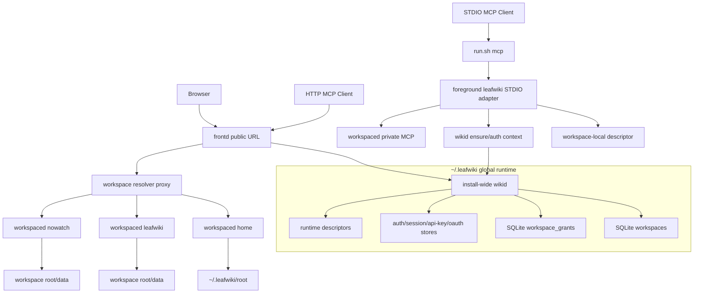
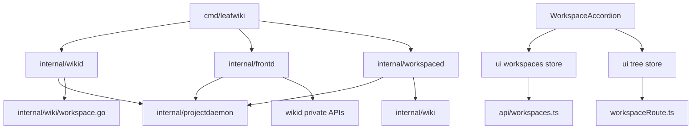
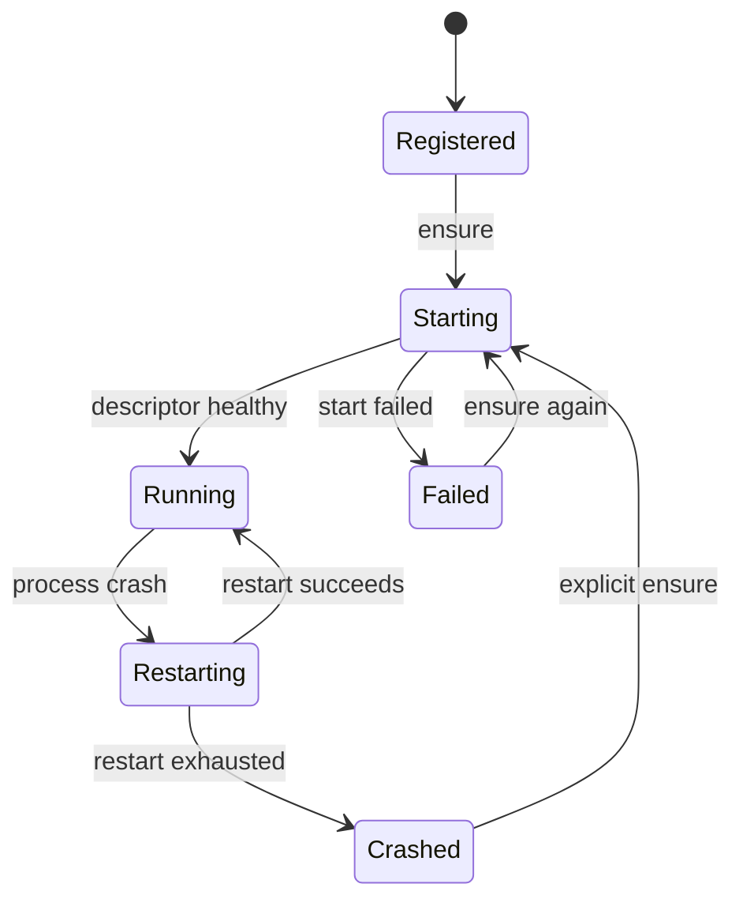

<!-- leafwiki
version: 1
page:
  id: plan-federated-workspaces-plan
  title: Federated Workspaces Implementation Plan
  created_at: "2026-06-17T07:30:00Z"
  updated_at: "2026-06-17T07:30:00Z"
  creator_id: codex
  last_author_id: codex
-->

# Federated Workspaces Implementation Plan

> **For agentic workers:** REQUIRED SUB-SKILL: Use `superpowers:subagent-driven-development` or `superpowers:executing-plans` to implement this plan task-by-task. Steps use checkbox (`- [ ]`) syntax for tracking.

**Goal:** Implement LeafWiki federated workspaces so one install-wide `wikid` and one `frontd` can coordinate multiple workspace-scoped `workspaced` daemons through one UI and stable MCP surfaces.

**Architecture:** Promote the landed `wikid-frontd-workspaced` extraction from a project-scoped runtime into an install-wide runtime under `~/.leafwiki`. Keep `frontd` thin and workspace-aware, keep `workspaced` authoritative for workspace semantics, add a durable registry plus role-only grants in `wikid`, and preserve `run.sh mcp` through descriptor-first direct attach to `workspaced`.

**Tech Stack:** Go, Gin, existing `internal/projectdaemon` descriptor/control patterns, existing `internal/wikid`/`internal/frontd`/`internal/workspaced` packages, React/Vite frontend, Zustand stores, Playwright E2E, shell wrapper tests.

---

## Goal & Context

### Objective

Build the first federated local LeafWiki runtime with global workspace registry, central grants, home workspace bootstrap, lazy non-home workspace startup, workspace-aware `frontd` routes, multi-workspace sidebar UI, HTTP MCP workspace selection, and STDIO MCP direct attach to `workspaced`.

### Context

- Source workflow: `docs/plans/planning.aibasic.txt`.
- Observation artifact: `docs/plans/federated-workspaces.OBSERVE.md`.
- Context artifact: `docs/plans/federated-workspaces.CONTEXT.md`.
- Decision artifact: `docs/plans/federated-workspaces.DECISION.md`.
- Discovery source: `docs/discovery/federated-workspaces-session-daemon.md`.
- Prerequisite implementation plan: `docs/plans/wikid-frontd-extraction.PLAN.md`.
- Current runtime baseline: landed `wikid-frontd` extraction branch.
- Current thread ID: not exposed to the agent in this environment.
- Conversation link: not available.
- Notion tickets: none provided.
- Bug reports: none provided.
- Prerequisites:
  - The `wikid-frontd` extraction must remain landed and passing.
  - The implementation agent must use `rtk` for shell commands.
  - The implementation agent must not revert unrelated working tree changes.
  - The implementation agent must preserve `scripts/run.sh mcp` as the public MCP wrapper surface.

## Decisions From Discussion

**Key Decisions:**

1. Promote `wikid` into an install-wide user-session daemon.
   - Reason: federation needs one registry, one identity domain, one grant store, and one supervisor for all local workspaces.

2. Do not keep project-scoped `wikid` runtimes as children.
   - Reason: that would preserve an unnecessary hierarchy and complicate STDIO, auth, and descriptors.

3. Use `~/.leafwiki` as the global data root.
   - Reason: it matches the settled home workspace model and existing default workspace layout.

4. Reserve `home` as the home workspace ID.
   - Reason: the home workspace is always created, registered, started, and attached without external interaction.

5. Keep workspace registry durable and separate from runtime descriptors.
   - Reason: registry entries survive restarts; descriptors describe live processes.

6. Keep grants separate from registry.
   - Reason: registry says what exists; grants say who can see or use it.

7. Use role-only grants for v1.
   - Reason: this is the minimal central authorization model that can later grow capability overrides.

8. Derive capability-shaped actor context from roles.
   - Reason: the daemon boundary should be extensible even while local handlers still use roles.

9. Keep `frontd` thin.
   - Reason: workspace semantics belong in `workspaced`.

10. Use workspace-aware browser routes under `/w/:workspaceId/...`.
    - Reason: the selected page route must include workspace identity.

11. Use workspace-aware API routes under `/api/workspaces/:workspaceId/...`.
    - Reason: `frontd` needs one stable public API surface that can route to many workspaces.

12. Keep `/mcp` as the public HTTP MCP bootstrap route.
    - Reason: clients should not need to know a workspace ID before initial auth/session setup.

13. Add `/mcp/workspaces/:workspaceId` for explicit HTTP MCP routing.
    - Reason: deterministic clients can bind directly when they already know the workspace.

14. Keep STDIO MCP workspace-scoped and direct to `workspaced`.
    - Reason: `wikid` should ensure lifecycle and actor context, not carry steady-state MCP JSON-RPC traffic.

15. Make workspace sync and Git-backed revisions mandatory in federated runtime.
    - Reason: every federated workspace should have one durable, auditable resource model.

16. Do not add filesystem isolation.
    - Reason: LeafWiki auth controls API/MCP/frontend access, not OS-level access to local files.

**Alternatives Considered:**

- Nested global/project `wikid` hierarchy - rejected because it keeps a needless control layer.
- Single global data database for all workspaces - rejected because it fights per-workspace roots, data dirs, and agents.
- Starting every registered workspace at login - rejected because it scales poorly.
- Capability override grants in v1 - rejected because role-only is enough.
- Permanent STDIO through `wikid` - rejected because `workspaced` should own workspace MCP transport.
- Requiring `/mcp/workspaces/:id` for bootstrap - rejected because `/mcp` remains compatibility route.
- Normalized cross-workspace search/activity API - rejected because proxy-first v1 should reveal real needs first.

**Open Questions Resolved:**

- Q: Where is global state?
  - A: `~/.leafwiki`, with global control state under `~/.leafwiki/wikid` and runtime descriptors under `~/.leafwiki/runtime`.
- Q: What is home workspace storage?
  - A: `workspaceId=home`, `dataDir=~/.leafwiki`, `rootDir=~/.leafwiki/root`.
- Q: Where is the registry?
  - A: `~/.leafwiki/wikid/wikid.db`, in the `workspaces` table.
- Q: Where are grants?
  - A: `~/.leafwiki/wikid/wikid.db`, in the `workspace_grants` table.
- Q: How are non-home workspace IDs generated?
  - A: Generate once from a URL-safe display-name slug plus short canonical-path hash, then persist.
- Q: How does STDIO MCP attach?
  - A: Descriptor-first direct attach to `workspaced`; missing/stale descriptor asks install-wide `wikid` to ensure the workspace and retries.
- Q: How should healthy config mismatch behave?
  - A: Hard fail in v1.

## Summary

This plan turns LeafWiki from a one-workspace extracted runtime into a federated local runtime. The global `wikid` owns durable workspace registry, role-only grants, global auth stores, runtime descriptors, `frontd`, and child `workspaced` lifecycle. `frontd` remains the only public human/HTTP ingress and gains only shell-level federation APIs plus workspace-aware proxying. `workspaced` remains the workspace authority.

The implementation is intentionally proxy-first. It does not add cross-workspace search, batch operations, or normalized content APIs. The visible product change is one frontend with multiple workspace accordion panes in the sidebar, while page/editor/history routes include workspace ID.

## Scope Boundaries

### In Scope

- Add install-wide `wikid` global path/layout support under `~/.leafwiki`.
- Add registry storage and service in `internal/wikid`.
- Add role-only grant storage and capability derivation in `internal/wikid`.
- Add workspace ID to descriptor/config/runtime identity where needed.
- Add global `wikid` descriptor under `~/.leafwiki/runtime/wikid.json`.
- Change federated workspace-local descriptors to describe `workspaced` direct attach information.
- Add home workspace bootstrap.
- Add first-contact non-home workspace registration.
- Add lazy non-home workspace ensure/start behavior.
- Add per-workspace child supervision keyed by workspace ID.
- Add small `frontd` APIs:
  - `GET /api/workspaces`
  - `GET /api/workspaces/:workspaceId/status`
  - `POST /api/workspaces/:workspaceId/ensure`
- Add workspace-aware API proxying under `/api/workspaces/:workspaceId/*`.
- Add workspace-aware browser routes under `/w/:workspaceId/...`.
- Add HTTP MCP workspace selection and session binding.
- Add explicit HTTP MCP workspace route `/mcp/workspaces/:workspaceId`.
- Preserve `run.sh mcp`.
- Add STDIO direct attach to `workspaced` with actor context resolved through `wikid`.
- Refactor frontend route/API/store layers to carry workspace IDs.
- Add multi-workspace accordion sidebar.
- Make workspace sync mandatory in federated runtime.
- Add Go, shell, frontend, and E2E tests.

### Out Of Scope / Deferred

- Cross-workspace search.
- Cross-workspace recent activity.
- Cross-workspace batch operations.
- Remote or cross-machine federation.
- Signed workspace assertions.
- Capability allow/deny overrides.
- Per-workspace branding.
- Migration of old auth stores.
- Filesystem-level sandboxing.
- Idle-stop policy for non-home workspaces.
- Public `leafwiki wikid`, `leafwiki frontd`, or `leafwiki workspaced` subcommands.
- Full OS login-agent installer integration if the runtime can be manually started for v1 testing.

### Intentional Limitations

- Registry and grants use SQLite transactions and constraints.
- Role grants are the only stored authorization model.
- Existing workspace handlers may continue to enforce `viewer`/`editor`/`admin` roles.
- Legacy root browser routes redirect to home workspace where practical.
- Legacy root `/p/:id/:slug?` permalinks target home workspace only in v1.
- Non-home workspaces remain alive for the user session once started.

## Assumptions

- `~/.leafwiki` is writable by the OS user.
- Local user-session `wikid` is trusted by local child processes.
- `workspaced` private listeners remain loopback only.
- Workspace sync can be enabled for all federated workspaces.
- Existing `run.sh` users pass enough `--data-dir`, `--root-dir`, or config-file information to identify a workspace.
- Frontend global auth and workspace content can share one browser session.
- Existing route packages can be reused through new composition and proxy layers.
- Existing E2E infrastructure can create two temporary workspace roots/data dirs.

## Impact Analysis

### Existing Code Impact

| File | Change | Downstream Impact |
|---|---|---|
| `cmd/leafwiki/main.go` | Add install-wide `wikid` startup, global descriptor lookup, workspace registration/ensure flow, direct STDIO-to-workspaced bridge | Main startup, daemon attach, MCP, and agent-hook behavior change |
| `internal/projectdaemon/config.go` | Add workspace ID and direct private MCP descriptor fields or role-derived helper accessors | Descriptor hash, mismatch, and trust tests need updates |
| `internal/projectdaemon/descriptor.go` | Preserve trust rules for global and workspace descriptors | Security boundary for attach/ensure |
| `internal/projectdaemon/control.go` | Add or reuse private control client helpers for global ensure and actor context | STDIO and frontd routing depend on it |
| `internal/wikid/auth_storage.go` | Move from data-dir scoped helper to global layout-aware helper | Auth stores become install-wide |
| `internal/wikid/supervisor.go` | Add per-workspace child role state or compose with new workspace supervisor | Health and restart behavior become multi-workspace |
| `internal/frontd/proxy.go` | Replace single-upstream workspace proxy with resolver-based workspace proxy | All workspace API and MCP routes depend on resolver behavior |
| `internal/workspaced/actor_context.go` | Continue rejecting missing/wrong workspace context; may validate derived capabilities | Workspace enforcement boundary |
| `internal/wiki/workspace.go` | Reserve `wikid` and `runtime` data-dir state entries | Prevents roots inside global control dirs |
| `internal/wiki/mcp/*` | Preserve MCP tool behavior while receiving workspace-scoped context | MCP compatibility gate |
| `scripts/run.sh` | Preserve public command shape; may pass or discover global runtime env | MCP client compatibility gate |
| `scripts/test-run.sh` | Add federation dry-run and descriptor-first cases | Prevents wrapper regression |
| `ui/leafwiki-ui/src/lib/api/*.ts` | Add workspace ID parameters for workspace-semantic APIs | Page/editor/search/history callers change |
| `ui/leafwiki-ui/src/lib/routePath.ts` | Add workspace-aware route builders/parsers | Router and navigation change |
| `ui/leafwiki-ui/src/stores/tree.ts` | Refactor singleton tree to per-workspace tree state | Sidebar, viewer, editor, quick switcher change |
| `ui/leafwiki-ui/src/features/sidebar/Sidebar.tsx` | Replace single workspace tree tab with workspace accordion | Main user-facing UI change |
| `ui/leafwiki-ui/src/features/router/router.tsx` | Add `/w/:workspaceId` route family | Viewer/editor/history route params change |

### New Code Units

| File or Package | Responsibility |
|---|---|
| `internal/wikid/layout.go` | Global path layout for `~/.leafwiki` |
| `internal/wikid/registry.go` | Registry domain types, ID normalization, validation |
| `internal/wikid/registry_store.go` | SQLite-backed workspace registry persistence |
| `internal/wikid/registry_service.go` | Home bootstrap, first-contact registration, lookup/list |
| `internal/wikid/grants.go` | Role grant types and subject normalization |
| `internal/wikid/grant_store.go` | SQLite-backed workspace grant persistence |
| `internal/wikid/capabilities.go` | Role-to-capability derivation |
| `internal/wikid/workspace_supervisor.go` | Per-workspace child process state and ensure/start/restart |
| `internal/wikid/private_workspace_api.go` | Private list/status/ensure/actor-context endpoints |
| `internal/frontd/workspaces_api.go` | Public workspace list/status/ensure handlers |
| `internal/frontd/workspace_proxy.go` | Resolver-based workspace API proxy |
| `internal/frontd/mcp_sessions.go` | HTTP MCP session-to-workspace binding |
| `ui/leafwiki-ui/src/lib/api/workspaces.ts` | Workspace list/status/ensure client |
| `ui/leafwiki-ui/src/lib/workspaceRoute.ts` | Workspace route parsing and builders |
| `ui/leafwiki-ui/src/stores/workspaces.ts` | Workspace list, status, expanded panes |
| `ui/leafwiki-ui/src/features/workspaces/WorkspaceAccordion.tsx` | Sidebar accordion rendering |
| `ui/leafwiki-ui/src/features/tree/TreeView.tsx` | Existing tree view bound to a workspace ID |

### Existing Tests Requiring Updates

| File | Change | Downstream Impact |
|---|---|---|
| `cmd/leafwiki/main_test.go` | Add global `wikid`, registry, home bootstrap, direct STDIO attach, stale fallback tests | Startup and compatibility gate |
| `internal/projectdaemon/*_test.go` | Add workspace ID and direct MCP descriptor tests | Descriptor trust gate |
| `internal/wikid/*_test.go` | Add registry, grants, capabilities, workspace supervisor tests | Control plane gate |
| `internal/frontd/*_test.go` | Add resolver proxy, `/api/workspaces`, `/mcp/workspaces/:id`, session binding tests | HTTP routing gate |
| `internal/workspaced/*_test.go` | Add direct private MCP actor-context cases | Workspace trust gate |
| `scripts/test-run.sh` | Add federation wrapper compatibility tests | MCP client surface gate |
| `ui/leafwiki-ui` lint/build | Must remain green after route/store refactor | Frontend gate |
| `e2e/tests/*` | Add multi-workspace frontend and MCP coverage | Product behavior gate |

### Module & Target Boundaries

- `internal/wikid` owns registry, grants, global layout, private control, and workspace lifecycle.
- `internal/frontd` owns public route selection and proxying.
- `internal/workspaced` owns private workspace route registration and actor-context validation.
- `internal/wiki` remains the workspace service composition layer.
- `cmd/leafwiki` remains the process/CLI composition root until a later binary split.
- `ui/leafwiki-ui` owns only browser state and routes, not backend registry policy.

### Access Control

| Type/File | Public API | Internal/Private |
|---|---|---|
| `GET /api/workspaces` | Lists granted workspaces only | Backed by `wikid` registry plus grants |
| `POST /api/workspaces/:id/ensure` | Starts an authorized workspace | Calls private `wikid` ensure |
| `/api/workspaces/:id/*` | Public workspace API prefix | Proxied to selected `workspaced` with actor context |
| `/mcp` | Public bootstrap HTTP MCP | Workspace selected before session starts |
| `/mcp/workspaces/:id` | Public explicit HTTP MCP | Requires grant and session/workspace match |
| `<data-dir>/.leafwiki/project-daemon.json` | Local trusted descriptor file | Direct STDIO attach to `workspaced` |
| `~/.leafwiki/runtime/workspaces/<workspace-id>.json` | Local trusted descriptor mirror | Install-wide `wikid`/`frontd` control and debugging visibility for `workspaced` |
| `~/.leafwiki/runtime/wikid.json` | Local trusted global descriptor file | Used by foreground adapters and `frontd` |
| `~/.leafwiki/wikid/wikid.db` | None | `wikid` durable registry and role grant store |
| `X-LeafWiki-Actor-Context` | Never trusted from public requests | Trusted only with daemon token over private channel |

## Architecture & Design

### Architecture Non-Goals

- Do not introduce remote federation.
- Do not implement cross-workspace semantic APIs.
- Do not rewrite page/tree/search/sync internals.
- Do not make `frontd` a workspace engine.
- Do not expose hidden role commands as documented user-facing product commands.

### Required Components

#### Architecture Diagram



#### Module Structure Tree

```markdown
cmd/
+-- leafwiki/
|   +-- main.go

internal/
+-- projectdaemon/
|   +-- config.go
|   +-- descriptor.go
|   +-- actor_context.go
|   +-- control.go
+-- wikid/
|   +-- layout.go
|   +-- registry.go
|   +-- registry_store.go
|   +-- registry_service.go
|   +-- grants.go
|   +-- grant_store.go
|   +-- capabilities.go
|   +-- workspace_supervisor.go
|   +-- private_workspace_api.go
+-- frontd/
|   +-- workspaces_api.go
|   +-- workspace_proxy.go
|   +-- mcp_sessions.go
|   +-- proxy.go
+-- workspaced/
|   +-- actor_context.go
|   +-- router.go
+-- wiki/
    +-- workspace.go

ui/leafwiki-ui/src/
+-- lib/
|   +-- api/workspaces.ts
|   +-- workspaceRoute.ts
+-- stores/
|   +-- workspaces.ts
|   +-- tree.ts
+-- features/
    +-- workspaces/WorkspaceAccordion.tsx
    +-- tree/TreeView.tsx
```

#### Dependency Graph



#### Key Design Decisions

1. Registry and grants are durable authority state in `~/.leafwiki/wikid/wikid.db`.
2. Registry and grant writes use SQLite transactions, workspace uniqueness constraints, and `PRIMARY KEY(subject, workspace_id)`.
3. Workspace IDs are immutable after registration.
4. `home` is reserved and cannot be deleted in v1.
5. `wikid` ensures home exists before starting `frontd`.
6. `frontd` calls `wikid` for workspace list/status/ensure; it does not read `wikid` authority storage directly.
7. `frontd` resolves a workspace before proxying any workspace API request.
8. `workspaced` validates `workspaceId` in actor context against its configured workspace ID.
9. STDIO direct attach uses workspace-local descriptor for data transport and global `wikid` for ensure/actor context.
10. HTTP MCP session binding is stored in `frontd` memory for v1.

#### Pattern References

- `internal/projectdaemon/descriptor.go` - trusted descriptor file pattern.
- `internal/projectdaemon/config.go` - config hash and mismatch formatting.
- `internal/wikid/supervisor.go` - bounded restart state pattern.
- `internal/frontd/proxy.go` - credential stripping and actor-context injection.
- `internal/workspaced/actor_context.go` - private workspace guard.
- `scripts/test-run.sh` - wrapper compatibility test style.
- `ui/leafwiki-ui/src/stores/tree.ts` - current tree indexing pattern to make workspace-scoped.
- `ui/leafwiki-ui/src/lib/routePath.ts` - route helper style.

#### Concurrency & Data Isolation

| Component | Isolation | Reason |
|---|---|---|
| Registry store | SQLite transaction plus workspace uniqueness constraints | Prevent concurrent write corruption and duplicate first-contact registrations |
| Grant store | SQLite transaction plus `PRIMARY KEY(subject, workspace_id)` | Prevent concurrent grant update loss |
| Workspace supervisor | mutex keyed by workspace ID | Independent child process state |
| HTTP MCP session binding | mutex map in `frontd` | Route all session requests to same workspace |
| Workspaced processes | separate OS processes | Preserve workspace locks and failure boundaries |
| Frontend tree state | workspace-keyed state maps | Prevent open/active tree leakage across workspaces |

#### State Machine Documentation



## Test Specifications

**Key Principle:** Write the focused tests before implementation code for each phase. Every Gherkin scenario below must map to an automated test, or the implementation PR must explicitly remove the scenario with a reason.

### Test Non-Goals

- No performance benchmarks in this plan.
- No filesystem sandboxing tests.
- No remote federation tests.
- No cross-workspace search tests.
- No snapshot testing for UI visuals unless the existing E2E harness already supports it.

### Test Types Required

| Included | Type | Scope |
|---|---|---|
| Yes | Unit Tests | Registry, grants, ID generation, descriptor fields, route helpers |
| Yes | Integration Tests | Global `wikid`, `frontd` routing, descriptor attach, actor context |
| Yes | E2E Tests | Two-workspace UI, workspace-scoped routes, HTTP/STDIO MCP |
| Yes | Shell Tests | `run.sh mcp` compatibility |
| Yes | Frontend Build/Lint | Type and bundle validation |

### Gherkin Test Scenarios

#### Unit Test Scenarios

Happy path:

```gherkin
Given an empty registry store
When the home workspace is bootstrapped
Then the registry contains workspace "home"
And its data dir is "~/.leafwiki"
And its root dir is "~/.leafwiki/root"
```

```gherkin
Given a canonical root dir "/repo/docs"
And a canonical data dir "/repo/.wiki"
When a non-home workspace ID is generated for display name "Docs"
Then the ID is URL-safe
And the ID is persisted in the registry
And later display-name changes do not change the ID
```

```gherkin
Given role "viewer"
When capabilities are derived
Then the actor can read workspace content
And the actor cannot write workspace content
```

```gherkin
Given role "editor"
When capabilities are derived
Then the actor can read workspace content
And the actor can write workspace content
And the actor cannot administer grants
```

Error path:

```gherkin
Given a descriptor for workspace "alpha"
When a request asks to attach as workspace "beta"
Then descriptor validation fails
```

```gherkin
Given a grant with unknown role "owner"
When grants are loaded
Then loading fails with a validation error
```

Edge cases:

```gherkin
Given two workspaces with the same display name
When both are registered
Then both receive distinct stable IDs
```

```gherkin
Given a requested workspace root inside "~/.leafwiki/wikid"
When workspace validation runs
Then validation rejects the root
```

Implementation notes:

- Registry tests live in `internal/wikid/registry*_test.go`.
- Grant tests live in `internal/wikid/grant*_test.go` and `internal/wikid/capabilities_test.go`.
- Descriptor tests live in `internal/projectdaemon/descriptor_test.go`.
- Route helper tests can be plain TypeScript test files only if a test runner is added. Otherwise cover route helpers through E2E.

#### Integration Test Scenarios

Happy path:

```gherkin
Given install-wide wikid starts with no registry
When startup completes
Then home workspace is registered
And home workspaced is running
And frontd is running
And GET /api/workspaces returns home
```

```gherkin
Given a non-home workspace root and data dir
When run.sh mcp starts from that workspace
Then wikid registers the workspace if missing
And starts workspaced lazily
And writes the workspace-local descriptor
And the foreground adapter attaches directly to workspaced private MCP
```

```gherkin
Given two registered workspaces
When frontd receives GET /api/workspaces/home/tree
Then the request is proxied to home workspaced as /api/tree
And the actor context workspace ID is "home"
```

Error path:

```gherkin
Given a user has no grant for workspace "private"
When the user requests GET /api/workspaces/private/tree
Then frontd returns 403
And workspaced receives no request
```

```gherkin
Given an HTTP MCP session bound to workspace "alpha"
When a later request uses /mcp/workspaces/beta with the same mcp-session-id
Then frontd rejects the request
```

```gherkin
Given a healthy descriptor with mismatched config
When run.sh mcp tries to attach
Then the command fails with a config mismatch
And wikid does not restart the workspace automatically
```

Edge cases:

```gherkin
Given the home workspaced crashes
When frontd handles GET /api/workspaces
Then the global workspace list still responds
And home status is degraded
```

```gherkin
Given a non-home workspace is stopped
When the browser expands it in the sidebar
Then frontd asks wikid to ensure it
And routes tree requests after it becomes healthy
```

Implementation notes:

- Runtime integration tests live in `cmd/leafwiki/main_test.go`.
- Frontd tests live in `internal/frontd/*_test.go`.
- Workspaced private guard tests live in `internal/workspaced/*_test.go`.
- Use local loopback test servers for proxy tests.

#### E2E Test Scenarios

Happy path:

```gherkin
Given LeafWiki starts with home and a second registered workspace
When the user opens the public frontd URL
Then the sidebar shows both workspaces
And expanding each workspace shows its own tree
And the same page path in each workspace opens distinct /w/:workspaceId routes
```

```gherkin
Given two workspaces are registered
When the user edits a page in workspace A
Then workspace A content changes
And workspace B content with the same path is unchanged
```

```gherkin
Given an HTTP MCP client authenticates at /mcp
And the actor has exactly one accessible workspace
When the client initializes MCP
Then the MCP session is bound to that workspace
```

```gherkin
Given an MCP client uses run.sh mcp for workspace B
When the client calls wiki_get_context
Then the returned context describes workspace B
And stdout contains only MCP protocol frames
```

Error path:

```gherkin
Given an actor has access to two workspaces
When a non-interactive HTTP MCP client calls /mcp without a workspace hint
Then the request is rejected before an MCP session starts
```

```gherkin
Given a browser user has no grant to workspace B
When the user navigates to /w/workspace-b/
Then the app shows an access error
And workspace B tree is not loaded
```

Implementation notes:

- Add E2E setup helpers for two temporary workspace roots/data dirs.
- Add tests under `e2e/tests/federated-workspaces.spec.ts`.
- Extend MCP E2E helpers only where needed to pass workspace route hints.

## Implementation

### Implementation Non-Goals

- Do not remove legacy route compatibility beyond redirecting browser root to home.
- Do not add public documented role subcommands.
- Use LeafWiki's existing SQLite dependency for registry/grant storage; do not introduce a separate storage dependency.
- Do not implement OS login-agent installation in the same first PR if runtime behavior is not yet green.

### Implementation Steps

#### Phase 1 - Global Layout, Registry, And Grants

Files:

- Create `internal/wikid/layout.go`
- Create `internal/wikid/registry.go`
- Create `internal/wikid/registry_store.go`
- Create `internal/wikid/registry_service.go`
- Create `internal/wikid/grants.go`
- Create `internal/wikid/grant_store.go`
- Create `internal/wikid/capabilities.go`
- Modify `internal/wiki/workspace.go`

- [ ] Add failing tests for global layout paths.
  - Test file: `internal/wikid/layout_test.go`
  - Command: `rtk go test ./internal/wikid -run TestGlobalLayout`
  - Expected before implementation: compile or assertion failure.

- [ ] Implement global layout helpers:

```go
type Layout struct {
    HomeDir       string
    WikidDir      string
    RuntimeDir    string
    DBPath        string
    HomeRootDir   string
}
```

- [ ] Add failing registry store tests for home bootstrap, ID generation, SQLite persistence, duplicate IDs, concurrent first-contact registration, and validation.
- [ ] Implement registry types backed by SQLite tables and constraints.
- [ ] Add `wikid` and `runtime` to `reservedDataDirEntries`.
- [ ] Add failing grant tests for role validation and capability derivation.
- [ ] Implement SQLite-backed grant store, transaction-backed first-contact registration/grant seeding, and capability derivation.
- [ ] Run `rtk go test ./internal/wikid ./internal/wiki`.
- [ ] Commit with message `feat: add federated workspace registry and grants`.

#### Phase 2 - Descriptor Identity And Global Wikid Control

Files:

- Modify `internal/projectdaemon/config.go`
- Modify `internal/projectdaemon/descriptor.go`
- Modify `internal/projectdaemon/control.go`
- Modify `cmd/leafwiki/main.go`
- Add tests in `internal/projectdaemon/*_test.go` and `cmd/leafwiki/main_test.go`

- [ ] Add failing descriptor tests for `workspaceId` and direct private MCP fields.
- [ ] Add failing global `wikid` descriptor tests for `~/.leafwiki/runtime/wikid.json`.
- [ ] Add `WorkspaceID` to `projectdaemon.Config` and `projectdaemon.Descriptor`.
- [ ] Add explicit direct attach fields:

```go
PrivateMCPURL   string `json:"privateMcpUrl,omitempty"`
PrivateMCPToken string `json:"privateMcpToken,omitempty"`
```

- [ ] Redact or hash private token fields anywhere descriptor mismatch output could expose them.
- [ ] Add global descriptor read/write helpers that reuse trusted descriptor validation.
- [ ] Add private ensure and actor-context client helpers for foreground adapters.
- [ ] Run `rtk go test ./internal/projectdaemon ./cmd/leafwiki`.
- [ ] Commit with message `feat: add workspace-aware daemon descriptors`.

#### Phase 3 - Install-Wide Wikid And Home Workspace Bootstrap

Files:

- Modify `cmd/leafwiki/main.go`
- Create `internal/wikid/workspace_supervisor.go`
- Create `internal/wikid/private_workspace_api.go`
- Update `internal/wikid/supervisor.go` if needed

- [ ] Add failing tests proving install-wide `wikid` creates home registry entry and starts home `workspaced`.
- [ ] Add failing tests proving global `wikid` is not tied to one project root lock.
- [ ] Implement install-wide `wikid` startup path using `~/.leafwiki`.
- [ ] Start `frontd` once from global `wikid`.
- [ ] Start home `workspaced` automatically.
- [ ] Publish global runtime descriptors.
- [ ] Keep project-scoped extraction behavior only as compatibility until federation replaces it.
- [ ] Run `rtk go test ./cmd/leafwiki ./internal/wikid`.
- [ ] Commit with message `feat: promote wikid to install-wide runtime`.

#### Phase 4 - Workspace Ensure And Lazy Non-Home Startup

Files:

- Modify `internal/wikid/registry_service.go`
- Modify `internal/wikid/workspace_supervisor.go`
- Modify `cmd/leafwiki/main.go`

- [ ] Add failing tests for first-contact registration from workspace args/config/cwd.
- [ ] Add failing tests for lazy ensure of a stopped non-home workspace.
- [ ] Add failing tests for independent restart state of two workspaces.
- [ ] Implement `EnsureWorkspace(workspaceId)` and `EnsureWorkspaceByConfig(config)`.
- [ ] Write workspace-local `workspaced` descriptors and runtime workspace descriptor mirrors on child startup.
- [ ] Preserve hard failure for healthy config mismatch.
- [ ] Run `rtk go test ./cmd/leafwiki ./internal/wikid`.
- [ ] Commit with message `feat: ensure federated workspace runtimes`.

#### Phase 5 - STDIO MCP Direct Workspaced Attach

Files:

- Modify `cmd/leafwiki/main.go`
- Modify `internal/projectdaemon/control.go`
- Modify `internal/workspaced/actor_context.go` if direct private MCP needs a helper
- Modify `scripts/test-run.sh`

- [ ] Add failing tests for descriptor-first direct attach to `workspaced` private MCP.
- [ ] Add failing tests for missing/stale descriptor fallback through global `wikid` ensure.
- [ ] Add failing tests proving direct attach obtains actor context through `wikid`.
- [ ] Add failing tests for API-key revocation before direct attach.
- [ ] Implement direct bridge:

```text
foreground adapter
  -> verify or resolve public credential with wikid
  -> obtain actor context for target workspace
  -> connect to workspaced private /mcp
  -> send daemon token and actor context
```

- [ ] Preserve `run.sh mcp` dry-run output and config mode behavior.
- [ ] Run `rtk bash scripts/test-run.sh`.
- [ ] Run focused STDIO MCP E2E.
- [ ] Commit with message `feat: attach stdio mcp directly to workspaced`.

#### Phase 6 - Frontd Workspace APIs And Proxy Routing

Files:

- Create `internal/frontd/workspaces_api.go`
- Create `internal/frontd/workspace_proxy.go`
- Modify `internal/frontd/proxy.go`
- Modify `cmd/leafwiki/main.go`

- [ ] Add failing tests for `GET /api/workspaces` filtering by grants.
- [ ] Add failing tests for `GET /api/workspaces/:id/status`.
- [ ] Add failing tests for `POST /api/workspaces/:id/ensure`.
- [ ] Add failing tests for `/api/workspaces/:id/tree` proxying to `/api/tree`.
- [ ] Add failing tests for unknown workspace, no grant, and stopped workspace.
- [ ] Implement `frontd` workspace list/status/ensure handlers backed by private `wikid` APIs.
- [ ] Implement resolver-based workspace proxy.
- [ ] Keep legacy `/api/tree` routes routed to home or compatibility current workspace only where needed.
- [ ] Run `rtk go test ./internal/frontd ./cmd/leafwiki`.
- [ ] Commit with message `feat: route workspace APIs through frontd`.

#### Phase 7 - HTTP MCP Workspace Selection And Session Binding

Files:

- Create `internal/frontd/mcp_sessions.go`
- Modify `internal/frontd/proxy.go`
- Modify `cmd/leafwiki/main.go`

- [ ] Add failing tests for `/mcp/workspaces/:workspaceId`.
- [ ] Add failing tests for `/mcp` exactly-one accessible workspace selection.
- [ ] Add failing tests for ambiguous non-interactive `/mcp` rejection.
- [ ] Add failing tests for `mcp-session-id` workspace binding and mismatch rejection.
- [ ] Implement in-memory MCP session binding.
- [ ] Preserve streaming and cancellation behavior by keeping reverse proxy transparent.
- [ ] Run `rtk go test ./internal/frontd ./internal/wiki/mcp ./cmd/leafwiki`.
- [ ] Commit with message `feat: bind http mcp sessions to workspaces`.

#### Phase 8 - Frontend Workspace Routes And APIs

Files:

- Create `ui/leafwiki-ui/src/lib/api/workspaces.ts`
- Create `ui/leafwiki-ui/src/lib/workspaceRoute.ts`
- Modify `ui/leafwiki-ui/src/lib/api/pages.ts`
- Modify `ui/leafwiki-ui/src/lib/api/search.ts`
- Modify `ui/leafwiki-ui/src/lib/api/tags.ts`
- Modify `ui/leafwiki-ui/src/lib/api/properties.ts`
- Modify `ui/leafwiki-ui/src/lib/api/assets.ts`
- Modify `ui/leafwiki-ui/src/lib/api/import.ts`
- Modify `ui/leafwiki-ui/src/lib/api/revisions.ts`
- Modify `ui/leafwiki-ui/src/lib/api/workspaceSync.ts`
- Modify `ui/leafwiki-ui/src/lib/routePath.ts`
- Modify `ui/leafwiki-ui/src/features/router/router.tsx`

- [ ] Add workspace API path helper with examples:

```ts
export function workspaceApiPath(workspaceId: string, path: string): string {
  const cleanPath = path.startsWith('/') ? path : `/${path}`
  return `/api/workspaces/${encodeURIComponent(workspaceId)}${cleanPath}`
}
```

- [ ] Update workspace-semantic API functions to accept `workspaceId`.
- [ ] Add workspace route builders for view/edit/history/permalink.
- [ ] Add `/w/:workspaceId/*`, `/w/:workspaceId/e/*`, `/w/:workspaceId/history/*`, and `/w/:workspaceId/p/:id/:slug?`.
- [ ] Keep global routes global.
- [ ] Run `rtk npm --prefix ui/leafwiki-ui run lint`.
- [ ] Run `rtk npm --prefix ui/leafwiki-ui run build`.
- [ ] Commit with message `feat: add workspace-aware frontend routes`.

#### Phase 9 - Workspace-Scoped Frontend State And Accordion UI

Files:

- Create `ui/leafwiki-ui/src/stores/workspaces.ts`
- Modify `ui/leafwiki-ui/src/stores/tree.ts`
- Create `ui/leafwiki-ui/src/features/workspaces/WorkspaceAccordion.tsx`
- Extend `ui/leafwiki-ui/src/features/tree/TreeView.tsx` to accept an explicit workspace ID
- Modify `ui/leafwiki-ui/src/features/sidebar/Sidebar.tsx`
- Modify viewer/editor/history/page components that read tree state

- [ ] Add workspace store for list/status/expanded state.
- [ ] Refactor tree store to keep tree/index/open/active state by workspace ID.
- [ ] Make `TreeView` accept `workspaceId`; keep a compatibility wrapper if needed.
- [ ] Render workspace accordion panes in sidebar.
- [ ] Ensure expanding a stopped workspace calls `POST /api/workspaces/:id/ensure` and loads its tree.
- [ ] Ensure active node and open-node persistence are workspace-scoped.
- [ ] Run frontend lint/build.
- [ ] Commit with message `feat: add multi-workspace sidebar`.

#### Phase 10 - Mandatory Workspace Sync In Federated Runtime

Files:

- Modify `cmd/leafwiki/main.go`
- Modify `internal/wiki/wiki.go` only if option defaults require it
- Modify docs if public flags change
- Add tests in `cmd/leafwiki/main_test.go` and `internal/wiki/wiki_test.go`

- [ ] Add failing tests that federated `workspaced` starts with workspace sync enabled.
- [ ] Add failing tests that legacy `--enable-revision` mode is not used by federated workspaces.
- [ ] Force `EnableWorkspaceSync` for federated workspace runtime configs.
- [ ] Keep current `enable-revision`/`enable-workspace-sync` conflict behavior outside federation until removed separately.
- [ ] Run `rtk go test ./cmd/leafwiki ./internal/wiki ./internal/workspacesync`.
- [ ] Commit with message `feat: require workspace sync for federated runtime`.

#### Phase 11 - End-To-End Federation Verification

Files:

- Create `e2e/tests/federated-workspaces.spec.ts`
- Modify `e2e/run.sh` if new env wiring is needed
- Modify E2E helpers for two workspace roots/data dirs

- [ ] Add E2E fixture helper that creates home plus a second workspace with distinct content.
- [ ] Add browser test for accordion sidebar and workspace-aware routes.
- [ ] Add browser test for same page path in two workspaces.
- [ ] Add browser test for editing one workspace without changing the other.
- [ ] Add HTTP MCP explicit workspace route test.
- [ ] Add STDIO MCP workspace B context test.
- [ ] Run focused E2E tests.
- [ ] Run final verification matrix.
- [ ] Commit with message `test: cover federated workspace flows`.

## Verification

Run these before claiming implementation complete:

```bash
rtk git diff --check
rtk bash scripts/test-run.sh
rtk bash -n scripts/run.sh scripts/test-run.sh e2e/run.sh
rtk go test ./cmd/leafwiki ./internal/projectdaemon ./internal/wikid ./internal/frontd ./internal/workspaced ./internal/wiki ./internal/wiki/mcp
rtk go test ./...
rtk npm --prefix e2e run lint
rtk npm --prefix e2e run format:check
rtk npm --prefix ui/leafwiki-ui run lint
rtk npm --prefix ui/leafwiki-ui run build
rtk env E2E_RUN_MODE=local E2E_ENABLE_MCP_LOCAL=1 E2E_MCP_CLIENT_TRANSPORT=stdio ./e2e/run.sh tests/mcp-stdio-disable-auth.spec.ts
rtk env E2E_RUN_MODE=local E2E_ENABLE_MCP_API_KEYS_LOCAL=1 E2E_MCP_CLIENT_TRANSPORT=stdio ./e2e/run.sh tests/mcp-stdio-api-keys.spec.ts
rtk env E2E_RUN_MODE=local E2E_ENABLE_MCP_API_KEYS_LOCAL=1 E2E_MCP_CLIENT_TRANSPORT=stdio ./e2e/run.sh tests/federated-workspaces.spec.ts --grep "api-key stdio agents"
rtk env E2E_RUN_MODE=local E2E_ENABLE_MCP_OAUTH_LOCAL=1 ./e2e/run.sh tests/mcp-oauth.spec.ts
rtk env E2E_RUN_MODE=local ./e2e/run.sh tests/federated-workspaces.spec.ts
rtk env E2E_RUN_MODE=local E2E_ENABLE_MCP_LOCAL=1 ./e2e/run.sh tests/federated-workspaces.spec.ts
rtk env E2E_RUN_MODE=local E2E_ENABLE_MCP_LOCAL=1 E2E_MCP_CLIENT_TRANSPORT=stdio ./e2e/run.sh tests/federated-workspaces.spec.ts
```

## Definition Of Done

- One install-wide `wikid` can run from `~/.leafwiki`.
- Home workspace is created, registered, started, and listed automatically.
- A second workspace can be registered by trusted first contact.
- Non-home workspaces lazy-start on web selection or `run.sh mcp` attach.
- Registry persists across restart.
- Runtime descriptors are separate from registry entries.
- Role grants filter workspace listing and actor-context issuance.
- `frontd` serves one public frontend and routes workspace APIs by workspace ID.
- The sidebar shows multiple workspace accordion panes without switching the whole UI.
- Routes include workspace ID for page/view/edit/history flows.
- HTTP MCP binds each session to exactly one workspace.
- STDIO MCP attaches directly to the target `workspaced` private MCP after descriptor lookup.
- `run.sh mcp` remains compatible with existing client configuration shape.
- Federated workspaces use workspace sync and Git-backed revisions.
- The verification commands above pass, or any skipped E2E command is documented with the missing local prerequisite.
