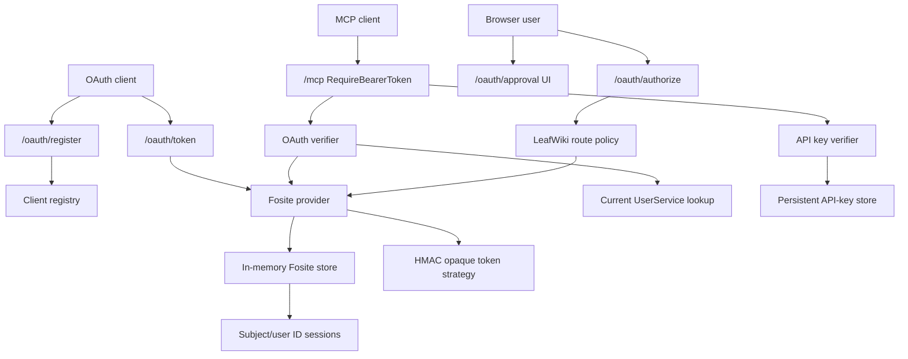
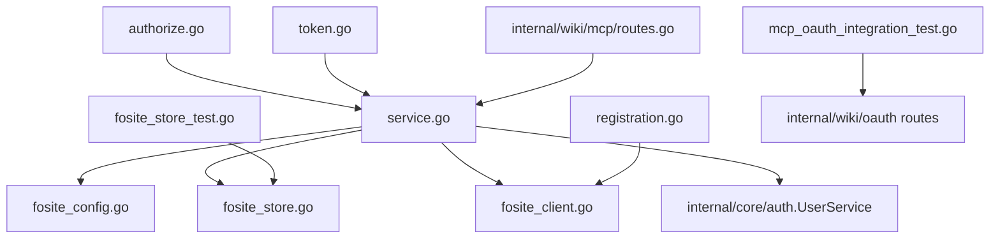
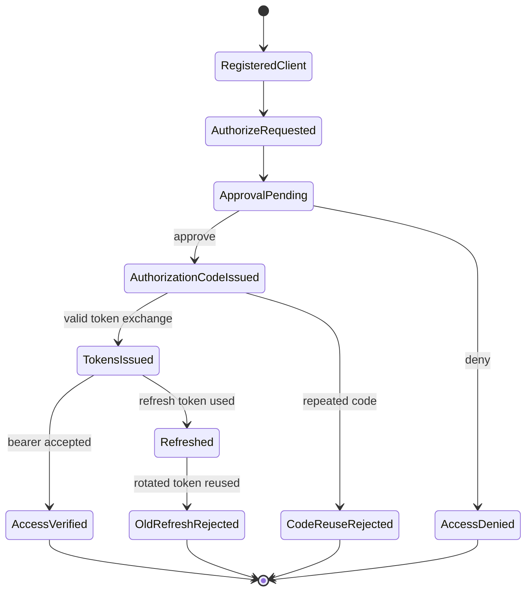

<!-- leafwiki
version: 1
page:
  id: E-aOKD-DR
  title: Fosite OAuth Migration Implementation Plan
  created_at: "2026-06-15T21:30:11.2782701Z"
  updated_at: "2026-06-15T21:30:11.2782701Z"
  creator_id: system
  last_author_id: system
-->

# Fosite OAuth Migration Implementation Plan

> **For agentic workers:** REQUIRED SUB-SKILL: Use `superpowers:subagent-driven-development` or `superpowers:executing-plans` to implement this plan task-by-task. Steps use checkbox (`- [ ]`) syntax for tracking.

**Goal:** Replace LeafWiki's local MCP OAuth engine with ORY Fosite while preserving the existing external OAuth/MCP contract and adding only internal functionality needed for Fosite.

**Architecture:** Keep `internal/wiki/oauth` as the OAuth boundary and swap its internals from `go-oauth2` to a narrowly composed Fosite provider. LeafWiki continues to own metadata, DCR, approval, route registration, response adaptation, API-key coexistence, and MCP bearer verification. Storage remains in memory but becomes LeafWiki-owned Fosite storage with explicit records for later `sessiond` persistence.

**Tech Stack:** Go 1.25.4, Gin, ORY Fosite, Model Context Protocol Go SDK, React/Vite approval UI, Playwright E2E, local `references/fosite` source snapshot.

---

## Goal & Context

### Objective

Migrate the existing local MCP OAuth implementation from `github.com/go-oauth2/oauth2/v4` to `github.com/ory/fosite` without adding new user-facing OAuth features or changing current MCP client behavior.

### Context

- Source workflow: `docs/plans/planning.aibasic.txt`.
- Observation artifact: `docs/plans/fosite-oauth-migration.OBSERVE.md`.
- Context artifact: `docs/plans/fosite-oauth-migration.CONTEXT.md`.
- Decision artifact: `docs/plans/fosite-oauth-migration.DECISION.md`.
- Discovery source: `docs/discovery/fosite-oauth-migration.md`.
- Related discovery: `docs/discovery/federated-workspaces-session-daemon.md`.
- Historical baseline: `docs/plans/oauth.PLAN.md`.
- Related API-key plan: `docs/plans/api_keys.PLAN.md`.
- Current thread ID: not exposed to the agent; plan generated in the active Codex workspace session.
- Notion tickets: none provided.
- Bug reports: none provided.
- Prerequisites: discovery decisions in `docs/discovery/fosite-oauth-migration.md` are accepted.

## Decisions

**Key Decisions:**

1. Switch libraries from `go-oauth2` to Fosite.
   - Reason: Fosite gives a stronger auth foundation for later `sessiond` work.

2. Do not add new user-facing features or capabilities.
   - Reason: this migration should be reviewable as a compatibility-preserving refactor.

3. Add only internal functionality needed for Fosite.
   - Reason: Fosite needs explicit session storage, PKCE storage, revocation state, and an internal verifier to preserve today's behavior.

4. Preserve fixed `leafwiki-local-mcp` redirect behavior.
   - Reason: changing fixed-client loopback redirects would break manual/testing clients.

5. Accept Fosite state strictness.
   - Reason: real OAuth clients should use realistic non-trivial state values, and tests/examples can be updated.

6. Keep API keys separate from OAuth.
   - Reason: API keys are persistent MCP-only bearer credentials with different lifecycle and storage semantics.

**Alternatives Considered:**

- Use `ComposeAllEnabled` - rejected because it would enable unsupported grants and handlers.
- Add durable OAuth storage - rejected because restart behavior should not change in this migration.
- Add public revocation or introspection - rejected because they are new user-facing capabilities.
- Use JWT access tokens - rejected because offline verification is not needed before `workspaced`.
- Lower Fosite state entropy - rejected by accepted discovery decision.

**Open Questions Resolved:**

- Q: Can DCR clients use Fosite registered redirects normally?
  - A: Yes.
- Q: Should the fixed fallback use an adapter if needed?
  - A: Yes.
- Q: Should short/missing state be accepted for compatibility?
  - A: No.

## Summary

This plan replaces the OAuth engine inside `internal/wiki/oauth`, not the public route surface. The route contract remains:

- `GET /.well-known/oauth-protected-resource`
- `GET /.well-known/oauth-protected-resource/mcp`
- `GET /.well-known/oauth-protected-resource/<base-path>/mcp`
- `GET /.well-known/oauth-authorization-server`
- `GET /.well-known/oauth-authorization-server/<base-path>`
- `GET <base-path>/oauth/authorize`
- `POST <base-path>/oauth/authorize`
- `GET <base-path>/oauth/approval`
- `POST <base-path>/oauth/register`
- `POST <base-path>/oauth/token`

The implementation introduces package-local Fosite config, client/session records, an in-memory store, route adapters, and verifier logic. It removes the root module dependency on `go-oauth2` after tests prove compatibility.

## Scope Boundaries

### In Scope

- Add `github.com/ory/fosite` to the root module.
- Remove `github.com/go-oauth2/oauth2/v4` after the migration is green.
- Compose only Authorization Code, Refresh Token, PKCE, HMAC opaque-token strategy, and internal token validation/introspection.
- Keep OAuth token/client storage in memory.
- Add LeafWiki-owned storage interfaces and records shaped for future persistence.
- Preserve metadata, DCR, approval, authorization, token, and MCP bearer behavior.
- Preserve fixed `leafwiki-local-mcp` loopback redirect compatibility.
- Accept Fosite `MinParameterEntropy` state validation and update tests/examples to realistic state.
- Add Fosite-specific unit and integration tests.
- Update existing E2E OAuth smoke tests only where state/example values or response expectations need to track the migration.

### Out Of Scope / Deferred

- `sessiond`, `frontd`, `workspaced`, daemon ownership, or workspace registry changes.
- Durable OAuth client/token/session storage.
- Public `/oauth/revoke`.
- Public `/oauth/introspect`.
- JWT access tokens.
- Additional scopes or workspace grants.
- Client secrets or confidential clients.
- OAuth client management UI.
- API-key migration into OAuth.
- New CLI/YAML flags for Fosite internals unless implementation proves an existing config field cannot safely carry the current behavior.

### Intentional Limitations

- OAuth tokens and dynamic clients remain lost on server restart.
- Revocation state exists only to support Fosite refresh rotation and authorization-code reuse protection.
- Fosite-specific records may contain audience/resource placeholders, but no production multi-workspace grant behavior is enforced.

## Assumptions

- The implementation can rely on `references/fosite` for integration details.
- Existing OAuth/MCP behavior represented by `internal/wiki/mcp/mcp_oauth_integration_test.go` is the compatibility baseline.
- State values used by current real clients are realistic enough for Fosite's default minimum length.
- Test examples can change from short state values to realistic state values without a product migration.
- In-memory store concurrency can be handled with one mutex around maps.
- No public route should be added merely because Fosite has a handler.

## Impact Analysis

### Existing Code Impact

| File | Change | Downstream Impact |
|---|---|---|
| `go.mod` / `go.sum` | Add Fosite, later remove `go-oauth2` | Dependency graph changes; CI and vulnerability checks cover the result |
| `internal/wiki/oauth/service.go` | Replace `go-oauth2` manager/server fields with Fosite provider/config/store/strategy | Main OAuth engine changes behind existing constructor |
| `internal/wiki/oauth/authorize.go` | Adapt authorize request validation and response writing to Fosite | Must preserve login, approval, redirect, state, resource, and error behavior |
| `internal/wiki/oauth/token.go` | Adapt token exchange and refresh handling to Fosite | Must preserve token response and JSON error behavior |
| `internal/wiki/oauth/registration.go` | Map LeafWiki DCR clients to Fosite-compatible clients | DCR response shape stays stable |
| `internal/wiki/oauth/responses.go` | Normalize Fosite errors to existing client-visible status/body/header behavior | Prevents accidental protocol shape changes |
| `internal/wiki/oauth/approval.go` | Keep approval state capture compatible with Fosite authorize requests | Approval UI remains unchanged |
| `internal/wiki/oauth/routes.go` | Route list stays stable | No public route addition |
| `internal/wiki/wiki.go` | Service construction may pass extra internal config | App-level behavior stays unchanged |
| `internal/wiki/mcp/routes.go` | Ideally unchanged; may accept a verifier interface if needed | API-key-first bearer dispatch must remain |
| `docs/mcp.md` / `README.md` | Only update if examples mention short state or go-oauth2 internals | Public docs should not advertise new capabilities |

### New Code Units

| File | Responsibility |
|---|---|
| `internal/wiki/oauth/fosite_config.go` | Build Fosite config and HMAC strategy from existing LeafWiki lifetimes and internal secret material |
| `internal/wiki/oauth/fosite_client.go` | Fosite-compatible client record and conversion from LeafWiki DCR/fixed clients |
| `internal/wiki/oauth/fosite_store.go` | In-memory client, authorization-code, PKCE, access-token, refresh-token, and revocation storage |
| `internal/wiki/oauth/fosite_session.go` | Session helpers for subject/user ID, scopes, client ID, expiry, and resource/audience placeholder |
| `internal/wiki/oauth/service.go` | Service construction and `VerifyBearerToken`; the planned internal verifier was folded into `service.go` |
| `internal/wiki/oauth/fosite_store_test.go` | Unit tests for storage, rotation, revocation, and code reuse behavior |
| `internal/wiki/oauth/fosite_config_test.go` | Unit tests for Fosite config defaults and narrow composition |

### Existing Tests Requiring Updates

| File | Change | Downstream Impact |
|---|---|---|
| `internal/wiki/mcp/mcp_oauth_integration_test.go` | Update/extend OAuth tests for Fosite state strictness, fixed redirect adapter, refresh rotation, code reuse, and response normalization | Main compatibility gate |
| `e2e/tests/mcp-oauth.spec.ts` | Ensure state values are realistic; keep manual and SDK DCR flows | Browser/SDK compatibility gate |
| `e2e/tests/mcpClient.ts` | Update only if SDK flow assumptions require realistic state handling | Official SDK compatibility |
| `e2e/tests/auth.spec.ts` | Update only if OAuth `returnTo` examples contain short state values | Login behavior remains stable |
| `docs/mcp.md` | Update verification/dependency notes if needed | Public docs remain accurate |

### Module & Target Boundaries

- OAuth internals stay in `internal/wiki/oauth`.
- MCP auth dispatch stays in `internal/wiki/mcp`.
- Web login, CSRF, and approval UI stay in existing auth/UI files.
- API-key storage stays in `internal/core/auth`.
- E2E helper changes stay under `e2e/tests`.

### Access Control

| Type/File | Public API | Internal/Private |
|---|---|---|
| `internal/wiki/oauth/routes.go` | Existing OAuth routes only | Fosite provider composition hidden |
| `internal/wiki/oauth/registration.go` | `/oauth/register` response contract | Client records and Fosite conversion |
| `internal/wiki/oauth/fosite_store.go` | None | In-memory Fosite storage |
| `internal/wiki/oauth/service.go` | None | `VerifyBearerToken` validates opaque OAuth bearer tokens for MCP |
| `internal/wiki/mcp/routes.go` | `/mcp` bearer challenge | API-key-first dispatch and OAuth verifier call |
| `internal/core/auth/api_key_service.go` | API-key HTTP/MCP behavior | Persistent API-key storage |

## Architecture & Design

### Architecture Non-Goals

- Do not redesign login, approval UI, web JWT cookies, or CSRF.
- Do not change MCP tool authorization.
- Do not move auth into `sessiond`.
- Do not add user-facing OAuth management or token lifecycle features.

### Required Components

#### Architecture Diagram



#### Module Structure Tree

```markdown
internal/wiki/oauth/
├── approval.go
├── authorize.go
├── fosite_client.go
├── fosite_config.go
├── fosite_config_test.go
├── fosite_session.go
├── fosite_store.go
├── fosite_store_test.go
├── metadata.go
├── registration.go
├── responses.go
├── routes.go
├── service.go
└── token.go

internal/wiki/mcp/
└── mcp_oauth_integration_test.go

e2e/tests/
├── mcp-oauth.spec.ts
└── mcpClient.ts
```

#### Dependency Graph



#### Key Design Decisions

1. `Service` remains the package facade.
2. Fosite is composed narrowly with `compose.OAuth2AuthorizeExplicitFactory`, `compose.OAuth2RefreshTokenGrantFactory`, `compose.OAuth2PKCEFactory`, and `compose.OAuth2TokenIntrospectionFactory`.
3. The Fosite config sets `RefreshTokenScopes` to `[]string{}` so `leafwiki:mcp` can receive refresh tokens.
4. The Fosite config keeps `EnablePKCEPlainChallengeMethod=false` and enforces PKCE.
5. The fixed client keeps an empty or adapter-backed redirect list so today's explicit loopback redirects remain accepted.
6. DCR clients use registered redirect URIs normally.
7. The store records raw Fosite request/session objects plus explicit LeafWiki metadata needed for tests and future persistence.
8. MCP receives only `sdkauth.TokenInfo`, not Fosite types.

#### Pattern References

- `internal/wiki/oauth/service.go` - current service facade and verifier shape.
- `internal/wiki/oauth/authorize.go` - route prevalidation and approval flow.
- `internal/wiki/oauth/registration.go` - DCR validation and response shape.
- `internal/wiki/oauth/metadata.go` - LeafWiki-owned metadata.
- `internal/wiki/mcp/routes.go` - API-key-first bearer dispatch.
- `internal/wiki/mcp/helpers.go` - current-user reload and role enforcement.
- `internal/wiki/mcp/mcp_oauth_integration_test.go` - compatibility test style.
- `e2e/tests/mcp-oauth.spec.ts` - manual and official SDK OAuth flows.
- `references/fosite/integration/helper_endpoints_test.go` - Fosite endpoint usage patterns.
- `references/fosite/handler/oauth2/storage.go` - storage interfaces.

#### Concurrency & Data Isolation

| Component | Isolation | Reason |
|---|---|---|
| `fositeStore` | Single `sync.RWMutex` around all maps | Keeps in-memory grant state consistent during refresh/code invalidation |
| Approval tokens | Existing `approvalMu` | Approval lifecycle is separate from Fosite token storage |
| DCR clients | Store mutex or service client mutex, not both for the same data | Avoids split-brain client records |
| MCP verifier | Stateless except store/user lookups | Preserves current per-request user reload behavior |

#### State Machine Documentation



## Test Specifications

**Key Principle:** Write focused failing tests before replacing route behavior. Existing compatibility tests are the migration backbone.

### Test Non-Goals

- No new UI snapshot tests.
- No public revocation or public introspection endpoint tests, except asserting those routes remain absent.
- No durable storage restart tests, because restart persistence remains out of scope.

### Test Types Required

| Included | Type | Scope |
|---|---|---|
| Yes | Unit tests | Fosite config, client conversion, store interfaces, session helpers |
| Yes | Integration tests | Existing OAuth/MCP route behavior through Gin router and MCP SDK session |
| Yes | E2E tests | Existing browser/SDK OAuth MCP smoke |
| Yes | Documentation validation | Wiki refresh and page validation for plan/docs changes |

### Gherkin Test Scenarios

#### Unit Test Scenarios

##### Happy Path Scenarios

```gherkin
Given a Fosite config built from LeafWiki access and refresh lifetimes
When the config is inspected
Then PKCE is enforced
And plain PKCE is disabled
And refresh token scopes are an empty slice
And token lifetimes match LeafWiki options
```

```gherkin
Given a DCR LeafWiki client with loopback redirect URIs and scope leafwiki:mcp
When it is converted to a Fosite client
Then it is public
And it exposes the same redirect URIs
And it exposes authorization_code and refresh_token grant types
And it exposes code response type
And it exposes only leafwiki:mcp scope
```

```gherkin
Given an authorization code session exists in the in-memory store
When Fosite loads and invalidates the authorization code
Then the first load succeeds
And the second load reports invalidated-code behavior
```

##### Error Scenarios

```gherkin
Given a Fosite config with default state entropy
When an authorize request has missing or short state
Then the request fails with invalid_state before approval
```

```gherkin
Given a refresh token belongs to client A
When client B attempts to refresh it
Then the token request fails with invalid_grant
```

##### Edge Case Scenarios

```gherkin
Given the fixed leafwiki-local-mcp client has no registered redirect URI list
When an explicit localhost, 127.0.0.1, or ::1 redirect URI with a port is requested
Then LeafWiki's compatibility adapter allows it
```

```gherkin
Given a DCR client registered one redirect URI
When authorization uses a different loopback redirect URI
Then the request is rejected
```

##### Corner Case Scenarios

```gherkin
Given a refresh token has been rotated
When the old refresh token is reused
Then the store rejects it
And any derived access token is treated as inactive when Fosite asks for revocation state
```

##### Implementation Notes

- Add package-local tests in `internal/wiki/oauth`.
- Keep integration assertions in `internal/wiki/mcp/mcp_oauth_integration_test.go` for route-visible behavior.
- Use realistic state strings at least 8 characters long except explicit rejection tests.

##### Test Target Locations

- `internal/wiki/oauth/fosite_config_test.go`
- `internal/wiki/oauth/fosite_store_test.go`
- `internal/wiki/mcp/mcp_oauth_integration_test.go`

#### Integration Test Scenarios

##### Happy Path Scenarios

```gherkin
Given OAuth metadata is requested at root and base-path routes
When Fosite backs the OAuth service
Then the metadata JSON is byte-shape compatible with current expectations
And no revocation endpoint is advertised
And no introspection endpoint is advertised
```

```gherkin
Given an OAuth-capable MCP client dynamically registers
When it completes authorization code with PKCE and approval
Then it receives access and refresh tokens
And it can connect to /mcp with a bearer token
And get_current_user returns the current LeafWiki user
```

```gherkin
Given the fixed leafwiki-local-mcp client uses an explicit loopback redirect URI
When it completes authorization code with PKCE and approval
Then it receives a code and token without registering the redirect URI
```

##### Error Scenarios

```gherkin
Given an authorization request uses code_challenge_method plain
When the request reaches Fosite-backed validation
Then it redirects to the client with invalid_request
```

```gherkin
Given an authorization request uses unsupported scope
When the request reaches LeafWiki/Fosite validation
Then it redirects to the client with invalid_scope
And preserves the original state
```

```gherkin
Given an authorization request has short state
When the request is validated
Then it fails with invalid_state or a normalized invalid_request response
And tests document the chosen external status/redirect behavior
```

##### Edge Case Scenarios

```gherkin
Given an issued access token belongs to a user who is later deleted
When the token is used against /mcp
Then /mcp returns 401
```

```gherkin
Given an issued access token belongs to an editor who is later downgraded to viewer
When the user calls a mutation tool
Then the tool is denied by current role
```

##### Corner Case Scenarios

```gherkin
Given an authorization code was already exchanged once
When it is exchanged again
Then the second exchange fails
And related derived token state is invalidated according to Fosite storage requirements
```

##### Implementation Notes

- Extend existing tests rather than duplicating the whole suite.
- Keep expected HTTP status/body differences explicit when Fosite requires a change.
- Do not delete API-key coexistence tests.

##### Test Target Locations

- `internal/wiki/mcp/mcp_oauth_integration_test.go`
- `internal/wiki/mcp/helpers_test.go`
- `internal/http/router_test.go`

#### E2E Test Scenarios

##### Happy Path Scenarios

```gherkin
Given LeafWiki runs locally with normal auth and HTTP MCP enabled
When the Playwright OAuth smoke completes manual Authorization Code + PKCE
Then the MCP client creates and updates a page
And the UI can read it
And MCP can read back UI edits
```

```gherkin
Given the official MCP TypeScript client starts OAuth discovery with DCR
When the user approves the Fosite-backed authorization request
Then the SDK completes auth and connects to /mcp
```

##### Error Scenarios

No new E2E-only error scenarios are required. Error behavior should remain in Go integration tests where it is deterministic.

##### Edge Case Scenarios

```gherkin
Given the E2E manual fixed-client flow uses state
When the authorize URL is built
Then state is a realistic non-trivial value that satisfies Fosite entropy
```

##### Corner Case Scenarios

No corner-case E2E scenarios are required; refresh rotation and code reuse are integration-test concerns.

##### Implementation Notes

- Keep `E2E_RUN_MODE=local E2E_ENABLE_MCP_OAUTH_LOCAL=1`.
- Keep the official SDK DCR path in `e2e/tests/mcpClient.ts`.
- Do not add sleeps for token expiry or refresh timing.

##### Test Target Locations

- `e2e/tests/mcp-oauth.spec.ts`
- `e2e/tests/mcpClient.ts`
- `e2e/tests/auth.spec.ts`

## Implementation

### Implementation Non-Goals

- No public route additions.
- No persistence.
- No JWT access tokens.
- No workspace-grant enforcement.
- No API-key refactor.
- No frontend redesign.

### Implementation Steps

### Task 1: Add Fosite Dependency And Config Tests

**Files:**

- Modify: `go.mod`
- Modify: `go.sum`
- Create: `internal/wiki/oauth/fosite_config.go`
- Create: `internal/wiki/oauth/fosite_config_test.go`
- Modify: `internal/wiki/oauth/service.go`

- [ ] **Step 1: Add failing config tests**

Add tests proving the Fosite config:

- uses existing access and refresh lifetimes
- sets `RefreshTokenScopes` to `[]string{}`
- enforces PKCE
- rejects plain PKCE
- keeps default state entropy at 8
- uses HMAC opaque token strategy
- does not use `ComposeAllEnabled`

Run:

```bash
rtk go test ./internal/wiki/oauth -run 'TestFositeConfig' -count=1
```

Expected: fail because Fosite config helpers do not exist.

- [ ] **Step 2: Add Fosite dependency**

Run:

```bash
rtk go get github.com/ory/fosite
```

Expected: `go.mod` and `go.sum` include Fosite.

- [ ] **Step 3: Implement config helper**

Implement `newFositeConfig(cfg ServiceConfig) *fosite.Config` and `newFositeProvider(...)` helpers. Use existing `AccessTokenTimeout` and `RefreshTokenTimeout`; set authorization-code lifespan to the current effective behavior or a small internal default documented in the test.

Target shape:

```go
func newFositeConfig(cfg ServiceConfig, secret []byte) *fosite.Config
func newFositeProvider(config *fosite.Config, store *fositeStore) fosite.OAuth2Provider
```

- [ ] **Step 4: Verify config tests pass**

Run:

```bash
rtk go test ./internal/wiki/oauth -run 'TestFositeConfig' -count=1
```

Expected: pass.

### Task 2: Add Fosite Client And Session Records

**Files:**

- Create: `internal/wiki/oauth/fosite_client.go`
- Create: `internal/wiki/oauth/fosite_session.go`
- Create: `internal/wiki/oauth/fosite_client_test.go`
- Modify: `internal/wiki/oauth/registration.go`
- Modify: `internal/wiki/oauth/service.go`

- [ ] **Step 1: Add failing client conversion tests**

Cover fixed client, DCR client, public client state, redirect URIs, grants, response types, scope, and audience/resource placeholder.

Run:

```bash
rtk go test ./internal/wiki/oauth -run 'TestFositeClient' -count=1
```

Expected: fail because conversion helpers do not exist.

- [ ] **Step 2: Implement Fosite client record**

Represent LeafWiki clients as Fosite clients while preserving current DCR behavior.

Target shape:

```go
type oauthClient struct {
    id            string
    name          string
    redirectURIs  []string
    grantTypes    []string
    responseTypes []string
    scopes        []string
    audience      []string
    public        bool
    fixedFallback bool
}
```

- [ ] **Step 3: Implement session helpers**

Use `fosite.DefaultSession` or a thin wrapper to store subject/user ID, username if useful, and placeholder metadata. Do not store role snapshots for authorization.

- [ ] **Step 4: Verify client/session tests**

Run:

```bash
rtk go test ./internal/wiki/oauth -run 'TestFositeClient|TestFositeSession' -count=1
```

Expected: pass.

### Task 3: Add In-Memory Fosite Store

**Files:**

- Create: `internal/wiki/oauth/fosite_store.go`
- Create: `internal/wiki/oauth/fosite_store_test.go`
- Modify: `internal/wiki/oauth/service.go`

- [ ] **Step 1: Add failing store interface tests**

Tests must cover:

- client create/get
- authorization-code create/get/invalidate
- PKCE create/get/delete
- access-token create/get/delete
- refresh-token create/get/delete/rotate
- revoke refresh by request ID
- revoke access by request ID
- concurrent access with `t.Parallel` where practical

Run:

```bash
rtk go test ./internal/wiki/oauth -run 'TestFositeStore' -count=1
```

Expected: fail because store does not exist.

- [ ] **Step 2: Implement store records and locking**

Use one `sync.RWMutex` and maps keyed by Fosite signatures. Preserve enough request/session data to hydrate Fosite requests.

Target map groups:

```go
clients
authorizeCodes
pkceRequests
accessTokens
refreshTokens
requestIDsToAccessSignatures
requestIDsToRefreshSignatures
revokedRequestIDs
```

- [ ] **Step 3: Implement required Fosite interfaces**

Ensure compile-time assertions cover:

- `fosite.Storage`
- `oauth2.CoreStorage`
- `oauth2.TokenRevocationStorage`
- `pkce.PKCERequestStorage`

- [ ] **Step 4: Verify store tests**

Run:

```bash
rtk go test ./internal/wiki/oauth -run 'TestFositeStore' -count=1
```

Expected: pass.

### Task 4: Wire Fosite Service Behind Existing Routes

**Files:**

- Modify: `internal/wiki/oauth/service.go`
- Modify: `internal/wiki/oauth/routes.go`
- Modify: `internal/wiki/wiki.go`
- Modify: `internal/wiki/oauth/registration.go`
- Test: `internal/wiki/mcp/mcp_oauth_integration_test.go`

- [ ] **Step 1: Add failing service construction test**

Add a package-local or integration test proving `NewService` constructs a Fosite-backed service with fixed client, DCR store, and verifier without `go-oauth2` fields.

Run:

```bash
rtk go test ./internal/wiki/oauth ./internal/wiki/mcp -run 'TestNewService|TestLocalMCPOAuthMetadata' -count=1
```

Expected: fail until service wiring is complete.

- [ ] **Step 2: Replace service fields**

Remove `go-oauth2` manager/server/client store fields from `Service`. Add Fosite provider/config/store/strategy fields.

- [ ] **Step 3: Keep route registration stable**

Do not add public revoke or introspection routes. Keep current `RegisterRoutes` behavior.

- [ ] **Step 4: Verify construction and metadata**

Run:

```bash
rtk go test ./internal/wiki/oauth ./internal/wiki/mcp -run 'TestNewService|TestLocalMCPOAuthMetadata' -count=1
```

Expected: pass.

### Task 5: Adapt Authorization Flow

**Files:**

- Modify: `internal/wiki/oauth/authorize.go`
- Modify: `internal/wiki/oauth/approval.go`
- Modify: `internal/wiki/oauth/responses.go`
- Test: `internal/wiki/mcp/mcp_oauth_integration_test.go`

- [ ] **Step 1: Add failing authorization compatibility tests**

Extend `TestLocalMCPOAuthAuthorizeValidationAndLoginRedirect` or add focused tests for:

- realistic state succeeds
- missing state fails
- short state fails
- fixed client accepts explicit loopback redirects
- DCR client requires registered redirects
- resource rules stay unchanged
- error redirects preserve state when there is a valid state

Run:

```bash
rtk go test ./internal/wiki/mcp -run 'TestLocalMCPOAuthAuthorizeValidationAndLoginRedirect|TestLocalMCPOAuthDynamicClientRegistration' -count=1
```

Expected: fail while authorization still uses old service or lacks Fosite adapters.

- [ ] **Step 2: Adapt `handleAuthorize`**

Use Fosite to parse/validate the authorize request after LeafWiki prevalidates safe redirect targets. Keep login redirect and approval behavior outside Fosite.

- [ ] **Step 3: Preserve fixed client redirect compatibility**

Implement a small compatibility adapter around fixed-client redirect validation. DCR clients must continue to use registered redirect URIs.

- [ ] **Step 4: Preserve response behavior**

Normalize Fosite authorization errors through existing `redirectAuthorizeError` or equivalent so current status/redirect rules remain stable.

- [ ] **Step 5: Verify authorization tests**

Run:

```bash
rtk go test ./internal/wiki/mcp -run 'TestLocalMCPOAuthAuthorizeValidationAndLoginRedirect|TestLocalMCPOAuthRemoteUserAuthorizeRequiresApproval|TestLocalMCPOAuthDynamicClientRegistration' -count=1
```

Expected: pass.

### Task 6: Adapt Token Endpoint, Refresh Rotation, And Verifier

**Files:**

- Modify: `internal/wiki/oauth/token.go`
- Modify: `internal/wiki/oauth/responses.go`
- Modify: `internal/wiki/oauth/service.go` (`VerifyBearerToken` is folded into `service.go`)
- Test: `internal/wiki/mcp/mcp_oauth_integration_test.go`

- [ ] **Step 1: Add failing token and verifier tests**

Extend token tests for:

- valid code exchange returns access and refresh token
- wrong verifier fails JSON
- refresh returns access token
- refresh-token reuse behavior is explicit
- code reuse fails
- deleted-user refresh fails
- expired bearer fails
- deleted-user bearer fails

Run:

```bash
rtk go test ./internal/wiki/mcp -run 'TestLocalMCPOAuthTokenExchangeAndRefresh|TestLocalMCPOAuthExpiredBearerTokenRejected|TestLocalMCPRegistration_AuthEnabledOAuthBearerProtection' -count=1
```

Expected: fail until token/verifier adapter is complete.

- [ ] **Step 2: Implement token endpoint**

Use `provider.NewAccessRequest`, `provider.NewAccessResponse`, and `provider.WriteAccessResponse` or the Fosite helper pattern from `references/fosite/integration/helper_endpoints_test.go`. Keep JSON errors compatible through `writeTokenError`.

- [ ] **Step 3: Implement internal verifier**

Validate opaque access tokens through Fosite introspection/validation and return:

- `UserID`
- `Scopes`
- `Expiration`

Reload the current user through `UserService` before returning `TokenInfo`.

- [ ] **Step 4: Preserve API-key coexistence**

Keep `internal/wiki/mcp/routes.go` API-key-first dispatch unchanged unless an interface extraction is needed. API-key tests must remain green.

- [ ] **Step 5: Verify token and verifier tests**

Run:

```bash
rtk go test ./internal/wiki/mcp -run 'TestLocalMCPOAuthTokenExchangeAndRefresh|TestLocalMCPOAuthExpiredBearerTokenRejected|TestLocalMCPRegistration_AuthEnabledOAuthBearerProtection|TestLocalMCPRegistration_AuthEnabledAPIKeyBearerProtection' -count=1
```

Expected: pass.

### Task 7: Update Existing Integration And E2E Coverage

**Files:**

- Modify: `internal/wiki/mcp/mcp_oauth_integration_test.go`
- Modify: `e2e/tests/mcp-oauth.spec.ts`
- Modify: `e2e/tests/mcpClient.ts` only if SDK state handling requires it
- Modify: `e2e/tests/auth.spec.ts` only if short state examples exist

- [ ] **Step 1: Run full OAuth/MCP integration suite**

Run:

```bash
rtk go test ./internal/wiki/mcp -run 'OAuth|AuthEnabled' -count=1
```

Expected: pass after targeted fixes.

- [ ] **Step 2: Update state examples**

Ensure all success-path state values are realistic and at least 8 characters. Keep explicit short-state rejection tests in Go integration.

- [ ] **Step 3: Run E2E lint and format checks**

Run:

```bash
rtk npm --prefix e2e run lint
rtk npm --prefix e2e run format:check
```

Expected: pass.

- [ ] **Step 4: Run focused OAuth E2E**

Run:

```bash
rtk env E2E_RUN_MODE=local E2E_ENABLE_MCP_OAUTH_LOCAL=1 ./e2e/run.sh tests/mcp-oauth.spec.ts
```

Expected: manual fixed-client flow and SDK DCR flow pass.

### Task 8: Remove `go-oauth2` And Update Documentation

**Files:**

- Modify: `go.mod`
- Modify: `go.sum`
- Modify: `docs/mcp.md` if dependency/examples need updates
- Modify: `README.md` if dependency/examples need updates
- Test: `internal/wiki/mcp/mcp_oauth_integration_test.go`

- [ ] **Step 1: Remove old dependency**

Run:

```bash
rtk go mod tidy
rtk rg 'go-oauth2|oauth2/v4' --glob '!references/**'
```

Expected: no live root-module references to `go-oauth2` remain, except historical docs if intentionally retained.

- [ ] **Step 2: Update docs only where necessary**

Do not announce new capabilities. If docs mention `go-oauth2` as current implementation, update to say Fosite-backed opaque OAuth while preserving the same public behavior.

- [ ] **Step 3: Run full focused verification**

Run:

```bash
rtk go test ./internal/wiki/oauth ./internal/wiki/mcp ./internal/wiki ./internal/http ./internal/http/middleware/auth
rtk npm --prefix ui/leafwiki-ui run build
rtk npm --prefix ui/leafwiki-ui run lint
rtk npm --prefix e2e run lint
rtk npm --prefix e2e run format:check
rtk env E2E_RUN_MODE=local E2E_ENABLE_MCP_OAUTH_LOCAL=1 ./e2e/run.sh tests/mcp-oauth.spec.ts
```

Expected: all pass.

- [ ] **Step 4: Run broad Go verification**

Run:

```bash
rtk go test ./...
```

Expected: pass.

## Verification

Required final verification:

```bash
rtk go test ./internal/wiki/oauth ./internal/wiki/mcp ./internal/wiki ./internal/http ./internal/http/middleware/auth
rtk go test ./...
rtk npm --prefix ui/leafwiki-ui run build
rtk npm --prefix ui/leafwiki-ui run lint
rtk npm --prefix e2e run lint
rtk npm --prefix e2e run format:check
rtk env E2E_RUN_MODE=local E2E_ENABLE_MCP_OAUTH_LOCAL=1 ./e2e/run.sh tests/mcp-oauth.spec.ts
```

Recommended regression checks:

```bash
rtk env E2E_RUN_MODE=local E2E_ENABLE_MCP_LOCAL=1 ./e2e/run.sh tests/mcp-disable-auth.spec.ts
rtk env E2E_RUN_MODE=local E2E_ENABLE_MCP_API_KEYS_LOCAL=1 ./e2e/run.sh tests/mcp-api-keys.spec.ts
rtk env E2E_RUN_MODE=local E2E_ENABLE_MCP_API_KEYS_LOCAL=1 E2E_MCP_CLIENT_TRANSPORT=stdio ./e2e/run.sh tests/mcp-stdio-api-keys.spec.ts
```

## Definition Of Done

- Root module uses Fosite for live OAuth and no live code imports `github.com/go-oauth2/oauth2/v4`.
- Existing public OAuth/MCP routes, metadata fields, DCR behavior, approval flow, token endpoint path, and MCP bearer challenge remain compatible.
- No public revocation endpoint is registered or advertised.
- No public introspection endpoint is registered or advertised.
- No JWT access tokens are introduced.
- OAuth clients and tokens remain in memory.
- Fixed `leafwiki-local-mcp` accepts current explicit loopback redirect patterns.
- DCR clients use registered redirect URIs normally.
- Fosite state strictness is accepted: realistic state values pass, short or missing state is rejected in tests.
- Fosite-specific tests cover refresh-token scope config, PKCE S256/plain behavior, state entropy, fixed redirect compatibility, DCR mapping, code reuse, refresh rotation, internal verifier output, deleted-user rejection, and role-change behavior.
- API-key bearer tests still pass and API keys remain separate from OAuth.
- Manual fixed-client OAuth MCP E2E and official SDK DCR OAuth MCP E2E pass.
- All required verification commands above pass, or the implementation PR documents an environment-specific blocker with exact failing command output.

## Stop Conditions

Stop and ask before changing scope if implementation reveals any of these:

- Fosite cannot preserve fixed-client loopback redirect compatibility without changing external behavior.
- Fosite requires exposing a public endpoint to support current behavior.
- Fosite requires durable storage to pass existing client compatibility.
- Existing real MCP SDK clients send short or missing state values in the current supported flow.
- API-key behavior requires changes outside the MCP bearer dispatch boundary.
