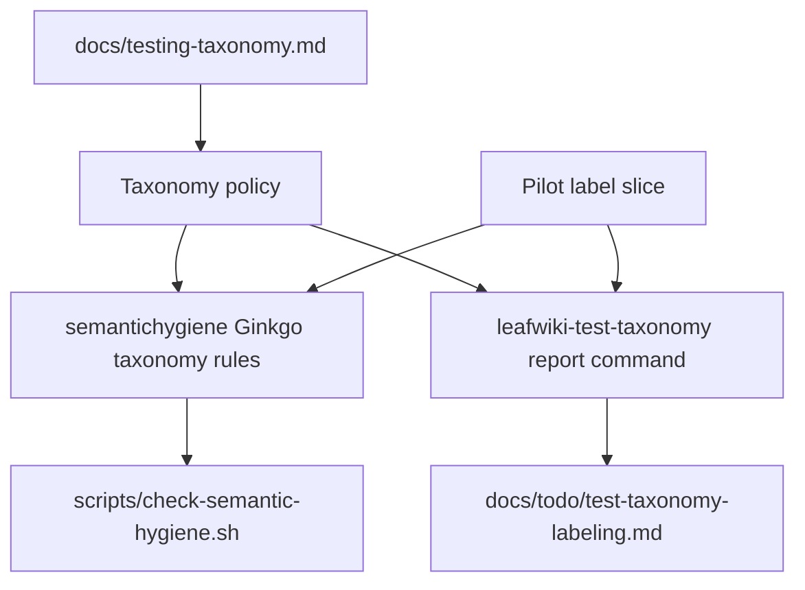
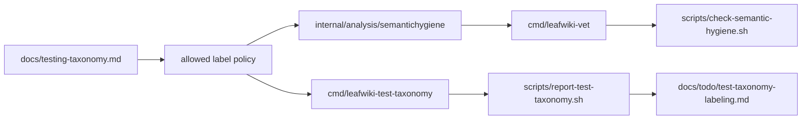

<!-- leafwiki
version: 1
page:
  id: go-ginkgo-test-taxonomy-labels-plan-20260704
  title: Go Ginkgo Test Taxonomy Labels Implementation Plan
  created_at: "2026-07-04T11:30:00Z"
  updated_at: "2026-07-04T11:30:00Z"
  creator_id: system
  last_author_id: system
tags:
  - plans
fields:
  type: refactor
-->

# Go Ginkgo Test Taxonomy Labels Implementation Plan

## Goal & Context

### Objective

Introduce LeafWiki's Go/Ginkgo `unit`, `integration`, and `e2e` test taxonomy labels in a way that can run in parallel with the active Ginkgo/Gomega cleanup without making missing labels a hard gate too early.

### Context

- Workflow: `docs/plans/planning.aibasic.txt`.
- Current thread/session ID: `019f2c2a-d4d8-7c21-9828-e262612ea50c`.
- Current thread link: `codex://threads/019f2c2a-d4d8-7c21-9828-e262612ea50c`.
- Observation artifact: `docs/plans/go-ginkgo-test-taxonomy-labels.OBSERVE.md`.
- Context artifact: `docs/plans/go-ginkgo-test-taxonomy-labels.CONTEXT.md`.
- Decision artifact: `docs/plans/go-ginkgo-test-taxonomy-labels.DECISION.md`.
- Workflow state: `docs/plans/go-ginkgo-test-taxonomy-labels.planning.aibasic.json`.
- Active branch observed during planning: `codex/recover-ginkgo-conversion`.
- Current cleanup is still active; do not mix broad label edits with BDD or matcher cleanup.
- Implementation commands should be prefixed with `rtk`.

Prerequisites:

- The semantic hygiene checker exists under `internal/analysis/semantichygiene`.
- `scripts/check-semantic-hygiene.sh` remains the authoritative hard gate for LeafWiki-specific Ginkgo/Gomega policy.
- A taxonomy worktree or branch should be created from the active cleanup branch before implementation starts.

### Decisions from Discussion

**Key Decisions:**

1. Use exactly one primary taxonomy label for each runnable Go/Ginkgo spec: `unit`, `integration`, or `e2e`.
   - Reason: the main tier should be mutually exclusive and usable for filtering.

2. Define `e2e` as acting on the LeafWiki product binary or command build artifact.
   - Reason: public-looking in-process API tests are integration tests, not true e2e.

3. Exclude Playwright and Docker proxy E2E from this Go/Ginkgo taxonomy.
   - Reason: they are separate test surfaces and should not be folded into the Go `Label` rollout.

4. Introduce enforcement before full adoption.
   - Reason: bad labels should fail immediately, but missing labels must not block active cleanup.

5. Keep missing-label reporting separate from hard diagnostics during the parallel phase.
   - Reason: `go/analysis` diagnostics are failing diagnostics; the suite is intentionally incomplete during rollout.

6. Use the existing `semantichygiene` analyzer for invalid taxonomy states.
   - Reason: it already owns LeafWiki-specific Ginkgo rules and is wired into the review script.

7. Use a separate taxonomy worktree/branch and small commits.
   - Reason: label edits overlap with active cleanup files; small integration units reduce conflict and review risk.

8. Do not add label-filtered CI until every runnable Go/Ginkgo spec has a primary label and completeness is enforced.
   - Reason: filtered runs silently skip unlabeled specs.

**Alternatives Considered:**

- Package-level labeling everywhere.
  - Rejected because Ginkgo labels union down the tree and mixed packages would be mislabeled.

- One repo-wide label pass.
  - Rejected because it conflicts with ongoing BDD cleanup.

- Docs-only rollout.
  - Rejected because it does not prevent bad label debt.

- A new standalone analyzer for labels.
  - Rejected because the existing semantic hygiene analyzer is the right policy surface.

**Open Questions Resolved:**

- Q: Should the first slice make missing labels fail?
  - A: No. It should report missing labels but only fail invalid labels.

- Q: Should the plan include real label changes?
  - A: Yes, but only a small stable pilot slice. Full labeling is follow-up slice work.

## Summary

This plan adds a documented Go/Ginkgo test taxonomy, extends `semantichygiene` to reject invalid taxonomy labels, adds a report-only inventory for unlabeled specs, creates a progress ledger, and labels a small stable pilot set. Full label completeness and label-filtered CI are explicitly deferred until cleanup stabilizes and the report reaches zero.

## Requirements

| ID | Requirement |
|---|---|
| R1 | Document the accepted `unit`, `integration`, and Go/Ginkgo `e2e` definitions. |
| R2 | Make `e2e` mean tests acting on the LeafWiki product binary or command build artifact. |
| R3 | Keep Playwright and Docker proxy tests out of this Go/Ginkgo label taxonomy. |
| R4 | Reject unknown or dynamic Ginkgo `Label` decorators under the current LeafWiki test-label policy. |
| R5 | Reject effective specs that inherit more than one primary taxonomy label. |
| R6 | Allow unlabeled specs during the parallel rollout without failing `scripts/check-semantic-hygiene.sh`. |
| R7 | Provide a report-only inventory of missing taxonomy labels. |
| R8 | Add analyzer fixtures covering direct labels, inherited labels, table labels, entry labels, dynamic labels, and missing labels. |
| R9 | Create a repo-local checklist/progress ledger for taxonomy labeling. |
| R10 | Add a small stable pilot label slice without touching active cleanup hotspots. |
| R11 | Defer completeness enforcement until the missing-label report reaches zero. |
| R12 | Defer label-filtered CI until completeness is enforced. |
| R13 | Keep implementation and verification compatible with `rtk` command usage. |

## Scope Boundaries

**In Scope:**

- `docs/testing-taxonomy.md`.
- `docs/todo/test-taxonomy-labeling.md`.
- `internal/analysis/semantichygiene` rules, diagnostics, policy, and fixtures for invalid labels.
- A report-only taxonomy inventory command and script.
- A small stable pilot set of real Go/Ginkgo labels.
- Documentation of rollout and final enforcement path.

**Out of Scope / Deferred:**

- Labeling every Go/Ginkgo test file in the first implementation slice.
- Making missing labels a hard failure in the first implementation slice.
- Adding label-filtered CI in the first implementation slice.
- Rewriting BDD names, matchers, helpers, or active cleanup files as part of this plan.
- Playwright test tagging.
- Docker proxy E2E retagging.
- Broad non-taxonomy labels such as `slow`, `network`, `oauth`, or `mcp` unless they are explicitly added to policy later.

**Intentional Limitations:**

- V1 accepts only the primary taxonomy labels and any explicitly approved non-taxonomy labels in checker policy.
- V1 report output is a static source inventory, not a runtime Ginkgo report.
- V1 may not perfectly classify dynamic or heavily indirect Ginkgo construction; dynamic labels are rejected rather than inferred.

## Assumptions

- The first implementation runs in a taxonomy worktree or branch based on the active cleanup branch.
- The active cleanup branch may remain dirty during planning; taxonomy implementation should avoid dirty active files where possible.
- All initial taxonomy labels can be static string literals.
- `internal/analysis/semantichygiene` may add more Ginkgo-specific rule IDs without changing runtime code.
- Missing-label inventory can be approximate enough for rollout management as long as invalid labels are enforced by the hard checker.
- Later full adoption may require relabeling mixed packages at `Describe`, `DescribeTable`, `Entry`, or `It` granularity.

## Impact Analysis

### Existing Code Impact

| File | Change | Downstream Impact |
|---|---|---|
| `docs/testing-taxonomy.md` | New taxonomy policy doc | Human and agent source of truth for label meanings |
| `docs/todo/test-taxonomy-labeling.md` | New progress ledger | Tracks missing-label work without relying on chat state |
| `internal/analysis/semantichygiene/policy.go` | Add taxonomy label rule IDs and policy tables | Checker owns allowed label vocabulary and rule metadata |
| `internal/analysis/semantichygiene/diagnostics.go` | Add taxonomy diagnostics | Invalid labels get specific messages |
| `internal/analysis/semantichygiene/rules_ginkgo.go` | Invoke taxonomy checks for Ginkgo DSL calls | Existing Ginkgo policy sees label decorators |
| `internal/analysis/semantichygiene/rules_ginkgo_taxonomy.go` | New helper file for taxonomy label extraction and inherited checks | Keeps label-specific logic out of existing rule clutter |
| `internal/analysis/semantichygiene/analyzer_test.go` | Add fixture package entry if needed | Analyzer fixtures prove invalid and allowed label states |
| `internal/analysis/semantichygiene/testdata/...` | Add taxonomy fixture cases | Prevents regressions in label policy |
| `cmd/leafwiki-test-taxonomy` | New report-only command | Produces missing-label inventory without hard-failing |
| `scripts/report-test-taxonomy.sh` | New read-only wrapper | Gives reviewers a stable command for current inventory |
| Stable pilot test files | Add `Label("unit")` or `Label("integration")` | Demonstrates label style without broad migration |

### Existing Tests Requiring Updates

| File | Change | Downstream Impact |
|---|---|---|
| `internal/analysis/semantichygiene/analyzer_test.go` | Include taxonomy fixture package | Hard checker tests run with existing analyzer suite |
| `internal/analysis/semantichygiene/rule_edges_gomega_test.go` | Add focused helper tests if useful | Fast unit-level coverage for label extraction helpers |
| `internal/analysis/semantichygiene/policy_test.go` | Cover rule metadata and allowed label policy | Prevents undocumented labels and stale rule IDs |
| `cmd/leafwiki-test-taxonomy/main_test.go` | New command tests | Verifies report output and non-failing missing-label behavior |
| Pilot package tests | No behavior change expected | Labels should not change test behavior |

### Module & Target Boundaries

The hard checker stays in the main Go module. The report command scans repository files and must understand the separate `e2e-proxy` module as source input, but it should not import `e2e-proxy`.

Runtime LeafWiki code must not import analyzer or taxonomy-report packages.

### Access Control

| Type/File | Public API | Internal/Private |
|---|---|---|
| `docs/testing-taxonomy.md` | Team-facing policy | No runtime API |
| `scripts/report-test-taxonomy.sh` | Reviewer command | Read-only report wrapper |
| `cmd/leafwiki-test-taxonomy` | Repo-local CLI | Tooling only |
| `internal/analysis/semantichygiene` | No public runtime API | Reviewer-owned checker policy |

## Architecture & Design

### Architecture Non-Goals

- Do not redesign Ginkgo suite layout.
- Do not invent a generic test classification framework.
- Do not make test labels configurable by arbitrary files in v1.
- Do not use dynamic labels.
- Do not use label-filtered CI until missing labels are zero.

### Required Components

#### Architecture Diagram



#### Module Structure Tree

```text
docs/
  testing-taxonomy.md
  todo/
    test-taxonomy-labeling.md

internal/analysis/semantichygiene/
  rules_ginkgo_taxonomy.go
  testdata/src/github.com/perber/wiki/internal/analysis/semantichygiene/testdata/taxonomycases/
    taxonomy_test.go

cmd/leafwiki-test-taxonomy/
  main.go
  main_test.go

scripts/
  report-test-taxonomy.sh
```

The exact reporter package split may change during implementation, but runtime code must remain uninvolved.

#### Dependency Graph



#### Key Design Decisions

1. Treat taxonomy labels as policy, not free-form strings.
   - V1 label policy starts with `unit`, `integration`, and `e2e`.

2. Detect multiple labels by effective inheritance, not only direct node arguments.
   - A container `Label("unit")` plus child `Label("integration")` is invalid.

3. Keep missing labels out of the hard analyzer initially.
   - Missing labels are reported by inventory tooling until the suite reaches zero unlabeled specs.

4. Make report commands read-only by default.
   - The command prints markdown or plain text to stdout. Tracked ledger updates are explicit edits.

5. Pilot labels demonstrate style without claiming full adoption.
   - The pilot is not a substitute for final completeness.

#### Pattern References

- `internal/analysis/semantichygiene/rules_ginkgo.go` - existing Ginkgo AST rule patterns.
- `internal/analysis/semantichygiene/policy.go` - rule IDs, metadata, and helper predicates.
- `internal/analysis/semantichygiene/diagnostics.go` - diagnostic message style.
- `internal/analysis/semantichygiene/analyzer_test.go` - `analysistest` fixture runner.
- `cmd/leafwiki-vet/main_test.go` - repo-local checker command test pattern.
- `scripts/check-semantic-hygiene.sh` - reviewer command wrapper.
- `docs/todo/ginkgo-gomega-second-pass.md` - broad Ginkgo migration checklist precedent.

## Test Specifications

**Key Principle:** Write the checker fixtures before implementing each hard rule. Missing-label reporting is tested as reporting behavior, not a failing analyzer diagnostic.

### Test Types Required

| Included | Type | Scope |
|---|---|---|
| Yes | Unit tests | Label extraction, policy helpers, reporter formatting |
| Yes | Integration tests | Analyzer fixtures through `analysistest`, report command over fixture directories |
| No | E2E tests | This plan does not add product behavior or product-binary tests |

### Gherkin Test Scenarios

#### Unit Test Scenarios

Happy path:

```gherkin
Given a Ginkgo node with Label("unit")
When the taxonomy helper extracts labels
Then it returns exactly one primary taxonomy label named "unit"
```

```gherkin
Given a Ginkgo node with no Label decorator
When the taxonomy helper evaluates hard-check state
Then it returns no hard-check diagnostic
And it marks the node as missing for report-only inventory
```

Error paths:

```gherkin
Given a Ginkgo node with Label("unit", "integration")
When the semantic hygiene analyzer runs
Then it reports a multiple-taxonomy-label diagnostic
```

```gherkin
Given a parent Describe with Label("unit")
And a child It with Label("integration")
When the semantic hygiene analyzer computes effective labels
Then it reports a multiple-taxonomy-label diagnostic on the child spec
```

```gherkin
Given a Ginkgo node with Label(testKind)
When the semantic hygiene analyzer runs
Then it reports a dynamic-taxonomy-label diagnostic
```

Edge cases:

```gherkin
Given a DescribeTable with Label("integration")
And an Entry with Label("unit")
When the semantic hygiene analyzer runs
Then it reports an inherited multiple-label diagnostic for the generated entry spec
```

```gherkin
Given an Entry with Label("e2e")
And no conflicting table or container label
When the semantic hygiene analyzer runs
Then it accepts the label as the entry's primary taxonomy label
```

#### Integration Test Scenarios

Happy path:

```gherkin
Given the taxonomy fixture package contains valid unit, integration, and e2e examples
When analyzer_test runs the semantic hygiene analyzer fixtures
Then the fixture package passes with no diagnostics
```

```gherkin
Given a fixture repository with unlabeled Ginkgo specs
When the taxonomy report command runs
Then it exits successfully
And it reports the missing labels grouped by package and file
```

Error paths:

```gherkin
Given the taxonomy fixture package contains an unknown static label
When analyzer_test runs
Then the expected semh diagnostic is required by the fixture
```

```gherkin
Given the taxonomy fixture package contains dynamic labels
When analyzer_test runs
Then the expected semh diagnostic is required by the fixture
```

Edge cases:

```gherkin
Given the report command scans both the main module and e2e-proxy source roots
When it builds its inventory
Then it includes Go/Ginkgo specs from both roots
And it excludes references, node_modules, and testdata
```

#### E2E Test Scenarios

No product E2E test is required for this plan because the implementation is analyzer/reporting infrastructure, not product behavior.

## Implementation

### Implementation Non-Goals

- Do not label the full repo in the first slice.
- Do not update active MCP cleanup files unless they are deliberately selected as a later stable label slice.
- Do not change test behavior while adding labels.
- Do not add CI jobs using `--label-filter` yet.
- Do not use a helper script that overwrites tracked files without explicit approval.

### U1. Document The Taxonomy Contract

**Goal:** Add the canonical test taxonomy document and connect it to the accepted discussion.

**Requirements:** R1, R2, R3.

**Dependencies:** None.

**Files:**

- Create: `docs/testing-taxonomy.md`.
- Modify: `docs/plans/go-ginkgo-test-taxonomy-labels.PLAN.md` only if implementation discovers a planning correction.

**Approach:**

Document each label with a positive definition, exclusions, and examples. State that Go/Ginkgo `e2e` means acting on a LeafWiki product binary or command build artifact. State that Playwright and Docker proxy tests are separate surfaces.

**Patterns to follow:**

- Existing policy docs such as `docs/typed-ids.md`.
- The concise decision capture style in `docs/plans/semantic-hygiene-waivable-diagnostics.PLAN.md`.

**Test scenarios:**

- Documentation review verifies each accepted label definition appears.
- Documentation review verifies Playwright and Docker proxy tests are explicitly out of scope.
- Documentation review verifies the binary/build artifact boundary is explicit.

**Verification:**

The document is linked or referenced from the implementation PR description and uses repo-relative references only.

### U2. Add Hard Checker Rules For Invalid Labels

**Goal:** Make `scripts/check-semantic-hygiene.sh` fail invalid taxonomy labels while still allowing missing labels during rollout.

**Requirements:** R4, R5, R6, R8.

**Dependencies:** U1.

**Files:**

- Modify: `internal/analysis/semantichygiene/policy.go`.
- Modify: `internal/analysis/semantichygiene/diagnostics.go`.
- Modify: `internal/analysis/semantichygiene/rules_ginkgo.go`.
- Create: `internal/analysis/semantichygiene/rules_ginkgo_taxonomy.go`.
- Modify: `internal/analysis/semantichygiene/analyzer_test.go`.
- Add fixtures under: `internal/analysis/semantichygiene/testdata/src/github.com/perber/wiki/internal/analysis/semantichygiene/testdata/taxonomycases/`.

**Approach:**

Add hard rule IDs for invalid label states:

- `ginkgo.taxonomy-label.unknown`
- `ginkgo.taxonomy-label.dynamic`
- `ginkgo.taxonomy-label.multiple`

Add static label extraction for Ginkgo `Label(...)` decorators on container, subject, `DescribeTable`, and `Entry` nodes. Compute effective primary taxonomy labels by walking enclosing Ginkgo containers and the current runnable node. For table entries, include labels from the enclosing `DescribeTable` and the `Entry`.

Do not add a hard `missing` diagnostic in this unit.

**Execution note:** Start with analyzer fixtures that fail before implementing the rules.

**Patterns to follow:**

- `checkGinkgoSpecQualityCall` in `internal/analysis/semantichygiene/rules_ginkgo.go`.
- Rule ID and metadata registration in `internal/analysis/semantichygiene/policy.go`.
- Diagnostic message style in `internal/analysis/semantichygiene/diagnostics.go`.

**Test scenarios:**

- Fixture accepts `Label("unit")`, `Label("integration")`, and `Label("e2e")`.
- Fixture accepts an unlabeled spec with no hard diagnostic.
- Fixture rejects `Label("unit", "integration")`.
- Fixture rejects a parent `Label("unit")` plus child `Label("integration")`.
- Fixture rejects `DescribeTable` `Label("integration")` plus `Entry` `Label("unit")`.
- Fixture rejects `Label(testKind)` because taxonomy labels must be static.
- Fixture rejects an unknown static label under the current label policy.

**Verification:**

The semantic hygiene analyzer fixture suite passes, and `scripts/check-semantic-hygiene.sh` still does not fail just because the real suite is mostly unlabeled.

### U3. Add Report-Only Missing-Label Inventory

**Goal:** Provide a repeatable way to see current taxonomy adoption without making missing labels fail.

**Requirements:** R6, R7, R9, R13.

**Dependencies:** U1, U2.

**Files:**

- Create: `cmd/leafwiki-test-taxonomy/main.go`.
- Create: `cmd/leafwiki-test-taxonomy/main_test.go`.
- Create: `scripts/report-test-taxonomy.sh`.
- Create or update helper package files if implementation chooses to share scanner logic, for example under `internal/analysis/testtaxonomy/`.

**Approach:**

Add a read-only reporting command that scans Go test source for Ginkgo DSL calls and classifies each runnable spec as:

- `unit`
- `integration`
- `e2e`
- `missing`
- `invalid`
- `dynamic`

The command should print a markdown-friendly report to stdout, grouped by package and file. It should exclude `references/`, `ui/leafwiki-ui/node_modules/`, and `testdata/` by default. It should be able to scan both the main module and `e2e-proxy`.

The wrapper script should only print the report by default. It must not overwrite tracked files without an explicit write mode that is reviewed separately.

**Execution note:** Treat this as reporting infrastructure. Do not wire its missing-label output into `scripts/check-semantic-hygiene.sh` yet.

**Patterns to follow:**

- `cmd/leafwiki-vet/main_test.go` for command seam testing style.
- `scripts/check-semantic-hygiene.sh` for repo-root detection and `rtk` wrapper style.

**Test scenarios:**

- Given fixture files with one spec for each label, the report counts one `unit`, one `integration`, and one `e2e`.
- Given fixture files with unlabeled specs, the command exits zero and reports missing labels.
- Given fixture files with conflicting labels, the report marks them invalid but leaves hard failure to `semantichygiene`.
- Given a fixture path under `testdata`, the default scan excludes it.
- Given a fixture path under `e2e-proxy`, the scan includes it when the repo root contains that module.

**Verification:**

The report command produces a current count without changing files. The script is safe to run repeatedly.

### U4. Create The Labeling Ledger

**Goal:** Add a tracked progress artifact for taxonomy labeling without turning chat history into the source of truth.

**Requirements:** R7, R9.

**Dependencies:** U3.

**Files:**

- Create: `docs/todo/test-taxonomy-labeling.md`.
- Optionally modify: `docs/todo/index.md`.

**Approach:**

Use the report command output as source material, then create a human-reviewable ledger. The first ledger should group work by package/file family and mark active cleanup hotspots separately.

Recommended initial groups:

- Stable unit candidates.
- Stable integration candidates.
- Potential Go/Ginkgo e2e candidates.
- Mixed packages requiring spec-level review.
- Active cleanup hotspots to avoid in the first pass.

The ledger should say that missing labels are not yet a failing condition.

**Patterns to follow:**

- `docs/todo/ginkgo-gomega-second-pass.md`.

**Test scenarios:**

- Documentation review verifies the ledger names the current report command and snapshot date.
- Documentation review verifies mixed packages are not represented as package-only easy wins.
- Documentation review verifies active cleanup files are separated from stable pilot candidates.

**Verification:**

The ledger exists and can be updated from a fresh report without changing checker policy.

### U5. Label A Stable Pilot Slice

**Goal:** Demonstrate real label usage with low-conflict test files while leaving active cleanup packages alone.

**Requirements:** R10.

**Dependencies:** U1, U2, U3, U4.

**Files:**

- Modify stable pilot files selected from current clean areas. Suggested first candidates:
  - `internal/workspaceid/validate_test.go` as `unit`.
  - `internal/core/excerpt/excerpt_test.go` as `unit`.
  - `internal/agenthooks/normalize_test.go` as `unit`.
  - `internal/wiki/health/routes_test.go` split by container: route-handler specs as `integration`, pure health-evaluation specs as `unit`.

Do not touch `internal/wiki/mcp/*` in the pilot slice.

**Approach:**

Add labels at the narrowest container that is true for every descendant spec. For mixed files such as `internal/wiki/health/routes_test.go`, label separate `Describe` containers rather than the file or package.

If a candidate file is dirty or actively owned by another cleanup thread when implementation starts, skip it and choose another stable candidate from the ledger.

**Execution note:** Keep this as a label-only commit after the checker/report commits.

**Patterns to follow:**

- Use `ginkgo.Label("unit")`, `ginkgo.Label("integration")`, or dot-import `Label("unit")` consistently with the file's existing import style.
- Do not restructure specs just to add labels.

**Test scenarios:**

- The pilot package tests still pass.
- The semantic hygiene checker accepts the pilot labels.
- The taxonomy report shows the pilot files moving from missing to labeled.
- No pilot spec has more than one effective primary taxonomy label.

**Verification:**

The pilot is reviewable as label-only changes and does not touch active cleanup hotspots.

### U6. Document Final Adoption Gates

**Goal:** Make the later transition to strict completeness and filtered CI explicit but out of the first implementation slice.

**Requirements:** R11, R12.

**Dependencies:** U3, U4, U5.

**Files:**

- Modify: `docs/testing-taxonomy.md`.
- Modify: `docs/todo/test-taxonomy-labeling.md`.
- Optionally create a follow-up plan if full adoption becomes a separate workstream.

**Approach:**

Document the switch criteria:

- The report command returns zero missing labels.
- Mixed packages have been reviewed at spec/container/table-entry granularity.
- `semantichygiene` has a hard missing-label rule enabled.
- Only after that may CI use `--label-filter` for `unit`, `integration`, or `e2e`.

**Test scenarios:**

- Documentation review verifies CI filtering is deferred until completeness.
- Documentation review verifies missing-label hard enforcement has a concrete precondition.
- Documentation review verifies full repo label adoption is not claimed by the pilot.

**Verification:**

The docs make it difficult for a future implementer to turn on filtered CI prematurely.

## Verification

Run the narrow checks first, then the existing gates:

- Analyzer fixture tests for `internal/analysis/semantichygiene`.
- Command tests for `cmd/leafwiki-test-taxonomy`.
- Focused tests for each pilot package.
- `scripts/report-test-taxonomy.sh` to confirm it reports current inventory and exits zero.
- `scripts/check-semantic-hygiene.sh` to confirm invalid-label enforcement integrates with the existing gate.
- `git diff --check`.

Do not require `go test ./...` to be green for the first taxonomy infrastructure slice if unrelated active cleanup is still red. If broad tests are red, the implementation closeout must state the unrelated failing package and the narrower checks that did pass.

## Definition Of Done

This plan is complete for the parallel-safe implementation phase when:

- `docs/testing-taxonomy.md` defines the accepted Go/Ginkgo taxonomy and the binary/build artifact boundary for `e2e`.
- The semantic hygiene analyzer fails invalid taxonomy labels and inherited multi-label conflicts.
- Missing taxonomy labels remain report-only, not hard failures.
- `scripts/report-test-taxonomy.sh` prints a current missing-label inventory without modifying files.
- `docs/todo/test-taxonomy-labeling.md` exists as the progress ledger.
- A small stable pilot label slice is committed separately from checker/report infrastructure.
- Active cleanup hotspots, especially `internal/wiki/mcp`, are not touched by the pilot unless explicitly handed over.
- Label-filtered CI is not added yet.
- The implementation has fresh passing evidence for analyzer fixtures, report command tests, focused pilot packages, the taxonomy report command, semantic hygiene, and `git diff --check`, or it documents unrelated active-cleanup failures honestly.

Full repo adoption is complete only later, when every runnable Go/Ginkgo spec has exactly one primary taxonomy label, the missing-label rule is hard-failing, and any label-filtered CI jobs run without silently skipping unlabeled specs.
