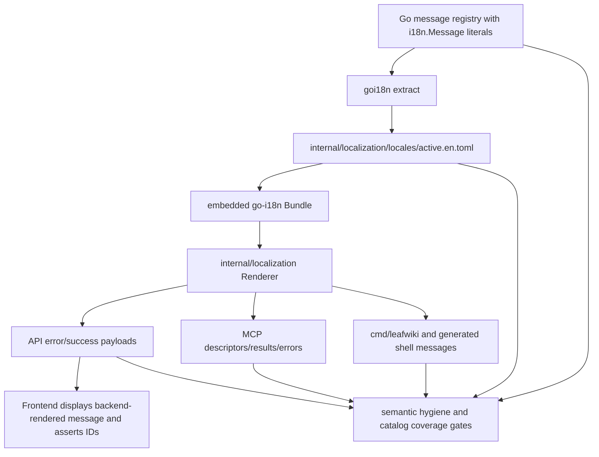

<!-- leafwiki
version: 1
page:
  id: go-i18n-rollout-context-20260623
  title: Go i18n Rollout Context
  created_at: "2026-06-23T21:20:00Z"
  updated_at: "2026-06-23T21:20:00Z"
  creator_id: system
  last_author_id: system
tags:
  - plans
fields:
  type: context
-->

# Go i18n Rollout Context

## Problem Frame

LeafWiki now has stable typed IDs for high-value user/agent-facing contracts. That solves the biggest prerequisite for localization: behavior, protocol, and E2E tests can assert stable semantics instead of English prose.

The next migration should make CLI/API/MCP user-facing text render through `nicksnyder/go-i18n`, while keeping the existing English output and compatibility fields. The goal is not multi-language UX yet. The goal is to make English a catalog-backed rendering layer so later languages do not require another contract refactor.

## Planning Constraints

- English is the only runtime language in this phase.
- No locale negotiation, user locale preference, or `Accept-Language` behavior is added yet.
- Backend-originated messages render on the backend.
- Existing clients must keep receiving `message`, `template`, `args`, `code`, and `messageId` where those fields already exist.
- API and MCP behavior tests must assert `code` and `messageId` before asserting any rendered text.
- CLI stdout/stderr placement is a compatibility contract.
- MCP STDIO stdout must remain protocol-only.
- OAuth RFC response fields must stay compatible.
- User-authored page content is not localization copy.
- Shell wrappers are part of the CLI surface, but cannot call `go-i18n` directly without a generated or mediated catalog bridge.

## Key Design Pressure

### Code-Owned IDs vs Catalog Files

The user explicitly wants code to remain the source of emitted IDs, with catalog coverage enforced. `goi18n extract` can support this if the implementation uses real `i18n.Message` literals in Go source.

The implementation should avoid a catalog-only source of truth where developers add IDs only to TOML. That would drift from the typed-ID work and make missing IDs harder to catch at compile/review time.

### Existing Templates

Existing localized errors use:

- `MessageID`
- rendered `Message`
- compatibility `Template`
- positional `Args []string`
- `%s` formatting conventions

`go-i18n` uses Go templates and named variables. A full migration to named domain arguments would touch many constructors. The first rollout should bridge positional args into template data named `Arg0`, `Arg1`, etc. Existing `template` and `args` fields remain unchanged on the wire.

### Frontend Rendering

Today `ui/leafwiki-ui/src/lib/api/errors.ts` uses frontend `i18next` with `template` as the key. That conflicts with the new boundary decision: backend-originated messages are rendered by the backend.

The frontend should display `error.message` for API-originated messages and carry `code/messageId` for semantic attributes/tests. The existing frontend `errors.json` may remain only as temporary fallback if needed, but it must stop being the primary source for backend API messages.

### CLI and Shell Wrappers

The compiled CLI can call a Go localization renderer. Shell scripts cannot. There are three possible approaches:

1. Exclude shell scripts from `go-i18n`.
2. Call the binary at runtime from shell scripts to render messages.
3. Generate English shell message variables from the Go catalog.

Option 1 violates the user's "all CLI" scope. Option 2 risks breaking stdout hygiene and help/error behavior when the binary is missing. Option 3 is the safest planning default for English-only rollout: messages still originate in the Go catalog, and shell runtime remains simple.

## Current Architecture Fit

The least disruptive architecture is:

- Add an internal localization package that wraps `go-i18n`.
- Add message registry files containing `i18n.Message` literals with IDs matching existing typed `MessageID`, `ToolDescriptionID`, and tool success IDs.
- Generate and embed `internal/localization/locales/active.en.toml`.
- Render API, MCP, and CLI messages through the localization package.
- Preserve existing `messageId`, `message`, `template`, and `args` fields.
- Update frontend API error mapping to trust backend-rendered messages.
- Extend semantic hygiene and catalog tests so new user-facing protocol/status/error prose cannot bypass IDs and catalogs.

## Alternatives Considered

### Use Frontend i18next for API Errors

Rejected for this phase.

Reason: the user agreed that backend-originated messages should be rendered by the backend. Keeping frontend catalogs as the primary API error renderer would duplicate source of truth and leave CLI/MCP unsolved.

### Translate at HTTP Middleware Only

Rejected.

Reason: MCP and CLI do not pass through HTTP JSON middleware, and tool descriptors/results must be localized too. Localization needs a shared renderer, not only a response filter.

### Migrate Every Template to Named Domain Arguments Immediately

Rejected for the first rollout.

Reason: it would create a broad constructor migration before the catalog and test policy are proven. The `Arg0` bridge allows one vertical slice to work first.

### Catalog Source of Truth Only

Rejected.

Reason: code should remain the source of emitted IDs. Catalogs are rendered resources and must be checked against code, not the other way around.

### Runtime Locale Negotiation

Rejected for this phase.

Reason: the user explicitly chose English only for now. Adding locale resolution now would increase test and product surface without helping the foundational migration.

## Proposed Implementation Shape

## Risk Areas

- Catalog drift: IDs emitted by code but missing from `active.en.toml`.
- Duplicate IDs: two registry messages with same ID but different English.
- Template bridge errors: `%s` positional templates rendered with wrong `ArgN` values.
- Overzealous test enforcement: user-authored content or renderer tests incorrectly flagged.
- Shell wrapper drift: generated shell messages not refreshed after catalog changes.
- MCP compatibility: changing text content or `_meta.error` shape could break agent clients.
- OAuth compatibility: adding message IDs must not replace RFC `error_description`.
- CLI stdout/stderr regressions: localization must not change stream discipline.

## Planning-Level Conclusions

- The implementation should be vertical and test-first.
- Start with the localization package and one API/MCP/CLI vertical path before widening.
- Keep compatibility fields and existing English by default.
- Add enforcement early enough that later migration tasks cannot accidentally add raw prose.
- Use plantrace-style evidence so the large Gherkin suite is not just documentation.
