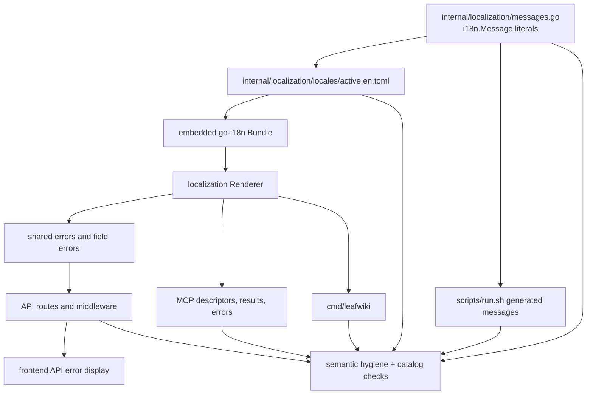
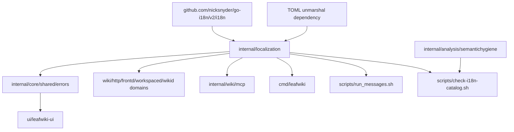

<!-- leafwiki
version: 1
page:
  id: go-i18n-rollout-plan-20260623
  title: Go i18n Rollout Implementation Plan
  created_at: "2026-06-23T21:20:00Z"
  updated_at: "2026-06-23T21:20:00Z"
  creator_id: system
  last_author_id: system
tags:
  - plans
fields:
  type: feat
-->

# Go i18n Rollout Implementation Plan

> For agentic workers: REQUIRED SUB-SKILLS: use `superpowers:subagent-driven-development` or `superpowers:executing-plans` to implement this plan task by task. Use `superpowers:test-driven-development` for feature-bearing units and `superpowers:verification-before-completion` before claiming completion.

## Goal & Context

### Objective

Make every LeafWiki user/agent-facing CLI, API, and MCP message in scope render from an English-only `nicksnyder/go-i18n` catalog keyed by stable message IDs, while preserving existing compatibility fields and moving behavior tests away from prose assertions.

### Context

- Workflow: `docs/plans/planning.aibasic.txt`.
- Original conversation reference: `codex://threads/019ea755-a3e3-7571-a8cf-c70a33fea656`.
- Observation artifact: `docs/plans/go-i18n-rollout.OBSERVE.md`.
- Context artifact: `docs/plans/go-i18n-rollout.CONTEXT.md`.
- Decision artifact: `docs/plans/go-i18n-rollout.DECISION.md`.
- Workflow state: `docs/plans/go-i18n-rollout.planning.aibasic.json`.
- Foundation plan: `docs/plans/semantic-types-and-ids.PLAN.md`.
- Contract docs:
  - `docs/typed-ids.md`
  - `docs/mcp.md`
- Local dependency reference:
  - `references/go-i18n/README.md`
  - `references/go-i18n/i18n/localizer.go`
  - `references/go-i18n/i18n/bundlefs.go`
  - `references/go-i18n/goi18n/extract_command.go`
- Implementation commands should follow `@/Users/jakubtomanik/.codex/RTK.md` and run through `rtk`.

### Prerequisites

- The typed-ID and semantic-types work is shipped.
- `messageId` exists on structured API and MCP errors.
- The semantic hygiene analyzer is the current repo-level semantic gate.
- The local `references/go-i18n` copy is available for dependency behavior checks.

### Decisions from Discussion

**Key Decisions**

1. Backend-originated messages are localized by backend code.
   - Reason: API, MCP, and CLI originate in backend/Go surfaces; frontend catalogs would duplicate source of truth.

2. The first i18n implementation scope is CLI, API, and MCP user/agent-facing messages.
   - Reason: these are the surfaces consumed by users, automation, agents, and protocol tests.

3. English is the only locale in this phase.
   - Reason: locale negotiation is product behavior and is explicitly deferred.

4. Code remains the source of emitted IDs.
   - Reason: this preserves the semantic-ID contract and allows static enforcement.

5. Catalog coverage is mandatory and enforced.
   - Reason: missing IDs should fail tests/checks, not appear as runtime surprises.

6. Existing positional template args are bridged.
   - Reason: `go-i18n` uses named template data; current LeafWiki payloads use `%s` plus `args`. The first rollout maps current args to `Arg0`, `Arg1`, etc.

7. Behavior tests assert stable semantics, not prose.
   - Reason: changing user-facing copy should not break behavior tests.

8. Renderer/catalog and compatibility tests may still assert English.
   - Reason: those tests intentionally validate rendered output and backward-compatible fields.

9. User-authored content remains prose-testable.
   - Reason: page titles, Markdown content, slugs, tags, and property keys are user content, not localization messages.

10. Shell wrapper messages are included as CLI surface.
    - Reason: `scripts/run.sh` is a user/agent-facing command. Because shell cannot use `go-i18n` directly, the implementation should generate English shell message variables from the Go-owned catalog.

**Alternatives Considered**

- Keep shell scripts unmanaged.
  - Rejected because CLI scope includes user-facing wrappers.

- Runtime-call the binary from shell scripts for every localized message.
  - Rejected because it risks stdout hygiene, recursion, and failure when the binary path is invalid.

- Let frontend i18next remain the primary API error renderer.
  - Rejected because backend-originated messages should render on the backend.

- Make the TOML catalog the source of truth.
  - Rejected because emitted IDs must remain code-owned.

- Add locale negotiation now.
  - Rejected because English-only was selected.

**Open Questions Resolved**

- Q: Should this revisit semantic IDs?
  - A: No. The foundation is sufficient.

- Q: Should `message`, `template`, or `args` be removed?
  - A: No. They are compatibility fields.

- Q: Should all English test assertions be removed?
  - A: No. Only behavior assertions on user/agent-facing messages should migrate; renderer compatibility and user-authored content remain allowed.

## Summary

This plan adds a small localization subsystem around `nicksnyder/go-i18n`, then migrates CLI, API, and MCP message rendering through it while preserving current English behavior.

The rollout is deliberately vertical:

1. Create the localization runtime and extractable message registry.
2. Prove rendering and compatibility with focused tests.
3. Migrate API/MCP/CLI surfaces by domain.
4. Update frontend API error display and semantic attributes where E2E tests need stable IDs.
5. Add analyzer/catalog/test gates so new prose cannot bypass IDs.
6. Update docs and plantrace evidence.

## Scope Boundaries

### In Scope

- Add `github.com/nicksnyder/go-i18n/v2` and TOML support required for `active.en.toml`.
- Create a shared internal localization package.
- Create real `i18n.Message` literals for all emitted CLI/API/MCP message IDs.
- Generate and embed `internal/localization/locales/active.en.toml`.
- Render structured API error `message` fields from `messageId`.
- Render field validation `message` fields from `messageId`.
- Render API success `message` fields from stable success IDs.
- Render MCP tool descriptions, message-only outputs, and structured error messages from the catalog.
- Render Go CLI help/errors/status messages from the catalog.
- Keep shell wrapper messages catalog-backed through generated English shell variables.
- Update frontend API error handling so backend-rendered `message` is displayed directly and `code/messageId` are used for semantic attributes.
- Add or update tests so behavior checks assert `code`, `messageId`, semantic data attributes, or typed IDs.
- Extend semantic hygiene/catalog gates for missing catalog entries and raw user-facing prose.
- Update documentation for catalog workflow and test policy.
- Add plantrace evidence that this plan's Gherkin scenarios map to automated tests.

### Out of Scope / Deferred

- Non-English translations.
- Runtime locale negotiation from `Accept-Language`, user preferences, CLI flags, env vars, or MCP client metadata.
- Removing compatibility fields.
- Redesigning API payload shapes beyond adding non-breaking `messageId` or message metadata where needed.
- Changing OAuth RFC response fields incompatibly.
- Localizing user-authored wiki content, slugs, tags, property keys, file names, Markdown body text, or search result snippets.
- Replacing all frontend UI copy with frontend i18n.
- Translating logs that are internal-only and not user/agent-facing.
- Localizing third-party/library error text directly. Map external errors to LeafWiki IDs at boundaries instead.

### Intentional Limitations

- English-only runtime still exercises the localization path.
- Positional args use `Arg0`, `Arg1`, etc. Named domain args can be a later cleanup.
- Some existing compatibility tests may still assert English, but only after asserting stable IDs or in renderer-specific tests.
- Shell wrapper localization is generated English data, not runtime multi-locale shell logic.

## Assumptions

- The implementer will run commands with `rtk`.
- `references/go-i18n` remains available as a local dependency reference, but the production dependency comes from `go.mod`.
- `active.en.toml` is committed.
- `goi18n extract` can run in implementation/CI via `go run github.com/nicksnyder/go-i18n/v2/goi18n`.
- Adding generated `scripts/run_messages.sh` or equivalent is acceptable if it is deterministic and tested.
- Existing frontend `ui/leafwiki-ui/src/locales/en/errors.json` may remain temporarily, but backend-originated API messages must no longer depend on it.

## Impact Analysis

### Existing Code Impact

| Area | Files | Change | Downstream Impact |
|---|---|---|---|
| Localization runtime | `internal/localization/*` | New package wrapping `go-i18n` | Shared API/MCP/CLI renderer |
| Shared errors | `internal/core/shared/errors/*` | Add render-aware helpers without removing fields | API/MCP/frontend compatibility preserved |
| API domains | `internal/wiki/**`, `internal/core/**`, `internal/http/middleware/**`, `internal/projectdaemon/**`, `internal/frontd/**`, `internal/workspaced/**`, `internal/wikid/**` | Replace direct rendered prose with catalog-backed render calls | Existing JSON shapes should remain compatible |
| MCP | `internal/wiki/mcp/*` | Render tool descriptions/results/errors from catalog | Agent-facing protocol stays stable |
| CLI | `cmd/leafwiki/*`, `scripts/run.sh`, install scripts if applicable | Render/catalog Go CLI text and source generated shell messages | stdout/stderr compatibility must remain |
| Frontend API errors | `ui/leafwiki-ui/src/lib/api/errors.ts`, field error handlers/components | Display server-rendered message and expose semantic attrs | E2E should stop asserting prose |
| Analyzer/gates | `internal/analysis/semantichygiene/*`, `scripts/*` | Enforce catalog-backed messages and test policy | New raw prose additions fail checks |
| Docs | `docs/typed-ids.md`, `docs/mcp.md`, new i18n docs | Document catalog workflow and test policy | Future contributors have a contract |

### Existing Tests Requiring Updates

| Test Area | Files | Expected Change |
|---|---|---|
| Shared errors | `internal/core/shared/errors/*_test.go` | Add rendering and fallback cases; keep serialization compatibility |
| Domain API tests | `internal/wiki/**/*_test.go`, `internal/http/**/*_test.go` | Assert `code/messageId`; English only in compatibility checks |
| MCP tests | `internal/wiki/mcp/*_test.go` | Assert IDs first; descriptor/result/error message still non-empty/rendered |
| CLI tests | `cmd/leafwiki/main_test.go`, `scripts/test-run.sh`, install script tests | Assert message IDs through helpers where possible; preserve stream behavior |
| Frontend unit tests | `ui/leafwiki-ui/src/lib/api/errors.test.ts`, component tests if added | Assert server message display and semantic attrs |
| E2E | `e2e/pages/*.ts`, `e2e/tests/*.spec.ts` | Replace toast/error/status prose assertions with semantic attrs or IDs |
| Analyzer tests | `internal/analysis/semantichygiene/analyzer_test.go` and fixtures | Add positive/negative i18n enforcement fixtures |
| Plantrace | `internal/plantrace/*_test.go` | Add scenario-to-evidence mapping for this plan |

### Module & Target Boundaries

- `internal/localization` owns runtime localization and catalog loading.
- `internal/core/shared/errors` owns structured error compatibility and shared error detail construction.
- Domain packages own which IDs they emit.
- `internal/wiki/mcp` owns MCP tool IDs, description IDs, and tool result IDs.
- `cmd/leafwiki` owns compiled CLI rendering.
- `scripts/run.sh` and related scripts own shell wrapper behavior, but message text should come from generated catalog data.
- `ui/leafwiki-ui` should not be the source of backend-originated API message text.
- `internal/analysis/semantichygiene` owns static Go policy.
- Scripts own cross-language/test heuristic checks.

### Access Control

| Type/File | Public Contract | Internal/Private |
|---|---|---|
| API `messageId`/`message` fields | Public API compatibility | Rendering implementation private |
| MCP tool names and `_meta.error` | Public agent contract | Helper functions private |
| CLI stdout/stderr text | User-visible CLI contract | Message registry private |
| OAuth `error_description` | RFC compatibility | Internal mapping private |
| Catalog files | Repo-visible source artifact | Runtime loader private |

## Architecture & Design

### Architecture Non-Goals

- Do not add locale negotiation.
- Do not make frontend i18next the source of backend API messages.
- Do not make generated catalogs the only source of message IDs.
- Do not rewrite the entire frontend UI copy system.
- Do not translate user-authored content.

### Required Components

#### Architecture Diagram



#### Module Structure Tree

```markdown
internal/
  localization/
    bundle.go                 # embed/load active.en.toml and build renderer
    messages.go               # extractable i18n.Message registry
    render.go                 # MessageID rendering, positional ArgN bridge
    render_test.go
    catalog_test.go           # code registry/catalog coverage
    locales/
      active.en.toml
    shell/
      export.go               # deterministic shell message export helper
      export_test.go
cmd/
  leafwiki/
    main.go                   # compiled CLI uses localization renderer
    main_test.go
scripts/
  check-i18n-catalog.sh       # catalog/extraction and test-prose policy gate
  check-semantic-hygiene.sh    # invokes semantic analyzer and i18n checks
  run.sh                      # sources generated shell message variables
  run_messages.sh             # generated English shell message variables
internal/analysis/semantichygiene/
  rules_literal.go            # raw user-facing prose diagnostics
  policy.go
  diagnostics.go
  analyzer_test.go
internal/plantrace/
  go_i18n_rollout_test.go     # Gherkin scenario evidence map
ui/leafwiki-ui/src/
  lib/api/errors.ts
  lib/api/errors.test.ts
  lib/handleFieldErrors.ts
docs/
  i18n.md
  typed-ids.md
  mcp.md
```

#### Dependency Graph



#### Key Design Decisions

1. `internal/localization` is the only package that imports and wraps `go-i18n` for application rendering.
2. Registry entries use real `i18n.Message` literals so `goi18n extract` sees them.
3. Registry IDs use existing typed message ID strings:
   - `errors.*`
   - `validation.*`
   - `api.*`
   - `mcp.tools.*`
   - `cli.*`
4. `message` means rendered localized text.
5. `template` remains compatibility data and should not become the localization key.
6. `args` remain positional compatibility values.
7. `Arg0`, `Arg1`, etc. bridge existing positional args into `go-i18n` template data.
8. Runtime missing-message fallback returns existing English default text, but catalog coverage tests fail missing IDs.
9. Shell wrapper message data is generated from the same registry/catalog so shell text is not a separate source of truth.
10. Tests assert rendered English only when rendered English is the behavior under test.

#### Pattern References

- `internal/core/shared/errors/localized_error.go` - existing structured error compatibility.
- `internal/core/shared/errors/field_error.go` - existing field validation payload shape.
- `internal/wiki/pages/errors.go` - API error detail pattern and existing success message IDs.
- `internal/wiki/mcp/helpers.go` - MCP structured `_meta.error` pattern.
- `internal/wiki/mcp/tool_descriptors.go` - MCP tool ID and description ID pattern.
- `internal/wiki/mcp/types.go` - MCP message output pattern.
- `ui/leafwiki-ui/src/lib/api/errors.ts` - current frontend API error mapper to change.
- `e2e/tests/editor.spec.ts` - model semantic-attribute assertions for version conflict.
- `internal/analysis/semantichygiene/testdata/.../semanticcases.go` - analyzer fixture pattern.
- `references/go-i18n/goi18n/extract_command.go` - extractor behavior to respect.

#### Concurrency & Data Isolation

| Component | Isolation | Reason |
|---|---|---|
| Localization bundle | initialized once, immutable after load | Safe shared renderer for HTTP/MCP/CLI |
| Renderer | stateless or read-only bundle reference | Request handlers can use it concurrently |
| Catalog generation | deterministic command/test only | Avoid runtime mutation |
| Shell message export | generated before runtime | Shell runtime stays simple and predictable |

## Test Specifications

**Key Principle:** write tests for IDs, catalog rendering, compatibility fields, and non-happy paths before changing implementation. Gherkin scenarios below are requirements. Every scenario must map to at least one automated test or plantrace evidence entry.

### Test Non-Goals

- No non-English translation verification.
- No locale negotiation tests.
- No screenshot or visual snapshot tests for localized copy.
- No attempt to assert every user-authored text path through localization.
- No broad ban on English literals in tests.

### Test Types Required

| Included | Type | Scope |
|---|---|---|
| Yes | Unit tests | Localization renderer, arg bridge, shared errors, frontend API error mapper, analyzer fixtures |
| Yes | Integration tests | API responders, MCP tool descriptors/results/errors, CLI stdout/stderr, shell wrapper messages |
| Yes | E2E tests | Representative browser-visible auth/status/toast/error flows and MCP STDIO/API-key flows |
| Yes | Static/checker tests | Catalog coverage, goi18n extract diff, semantic hygiene, prose assertion heuristics |
| Yes | Plantrace tests | Scenario-to-automated-evidence mapping |

### Unit Test Scenarios

#### Happy Path Scenarios

```gherkin
Scenario: Renderer resolves an English catalog message by message ID
  Given the English catalog contains "errors.page.version_conflict"
  When the localization renderer renders that message ID
  Then the returned message is the English catalog text
  And no missing-message error is reported
```

```gherkin
Scenario: Renderer bridges positional args into go-i18n template data
  Given the English catalog message contains "{{.Arg0}}" and "{{.Arg1}}"
  When the renderer receives args ["docs.md", "README.md"]
  Then the rendered message includes "docs.md"
  And the rendered message includes "README.md"
```

```gherkin
Scenario: Shared localized error detail keeps compatibility fields
  Given a LocalizedError has code, messageId, template, and args
  When it is converted to JSON detail after localization
  Then the JSON contains code
  And the JSON contains messageId
  And the JSON contains localized message
  And the JSON still contains template
  And the JSON still contains args
```

```gherkin
Scenario: Field validation error renders from field message ID
  Given a field validation error has code "auth_email_invalid"
  And messageId "validation.auth.email_invalid"
  When the API renders field errors
  Then the field error message comes from the English catalog
  And the field error code and messageId remain unchanged
```

```gherkin
Scenario: Frontend API error mapper displays backend-rendered message
  Given an API localized error contains messageId and message
  When mapApiError maps the error for UI display
  Then the UI message equals the backend-rendered message
  And the UI error keeps code and messageId
  And the mapper does not use template as the primary translation key
```

#### Error Scenarios

```gherkin
Scenario: Missing catalog entry falls back at runtime but fails coverage
  Given code emits a message ID missing from active.en.toml
  When runtime rendering is invoked with a default English message
  Then runtime returns the default English message
  But the catalog coverage test fails for the missing ID
```

```gherkin
Scenario: Duplicate message ID with different English is rejected
  Given two registry entries use the same message ID
  And their English text differs
  When the extraction or catalog coverage check runs
  Then the check fails with the duplicate message ID
```

```gherkin
Scenario: Template data mismatch preserves fallback behavior
  Given a catalog message references an arg not provided by the renderer
  When the renderer attempts to render it
  Then the renderer does not panic on a request path
  And the caller receives a safe fallback message
  And the rendering error is visible to tests or logs
```

#### Edge Case Scenarios

```gherkin
Scenario: Empty message ID is not localized
  Given a LocalizedError has an empty messageId
  When it is rendered
  Then the renderer returns the existing default message
  And catalog coverage reports the emitting code as invalid unless it is an explicit compatibility exception
```

```gherkin
Scenario: Extra positional args are preserved
  Given a message template uses only Arg0
  And the error carries two args
  When the error detail is serialized
  Then the rendered message uses Arg0
  And the serialized args still contain both values
```

#### Corner Case Scenarios

```gherkin
Scenario: Percent templates remain compatibility data
  Given an existing error has template "asset %s not found"
  And args ["logo.png"]
  When the response is localized
  Then message is rendered from the catalog
  And template still equals "asset %s not found"
  And args still equals ["logo.png"]
```

```gherkin
Scenario: Renderer is safe for concurrent HTTP requests
  Given many goroutines render different message IDs
  When they render through the shared localization bundle
  Then every goroutine receives the expected English message
  And there are no data races in the targeted race-enabled test when run locally
```

#### Unit Test Target Locations

- `internal/localization/render_test.go`
- `internal/localization/catalog_test.go`
- `internal/localization/shell/export_test.go`
- `internal/core/shared/errors/localized_error_test.go`
- `internal/core/shared/errors/field_error_test.go`
- `ui/leafwiki-ui/src/lib/api/errors.test.ts`
- `internal/analysis/semantichygiene/analyzer_test.go`

### Integration Test Scenarios

#### Happy Path Scenarios

```gherkin
Scenario: API error response uses catalog-backed message
  Given a request triggers page_version_conflict
  When the API returns the error response
  Then error.code is "page_version_conflict"
  And error.messageId is "errors.page.version_conflict"
  And error.message is the English catalog rendering
  And error.template and error.args are still present when applicable
```

```gherkin
Scenario: API success response includes messageId and catalog-backed message
  Given an API route completes with a user-facing success message
  When the route returns JSON
  Then the JSON contains messageId
  And messageId is stable and API-scoped
  And message is the English catalog rendering
```

```gherkin
Scenario: MCP tool descriptor description renders from catalog
  Given an MCP tool descriptor has ToolDescriptionID
  When the MCP server registers the tool
  Then the tool name remains the stable ToolID protocol name
  And the descriptor description is the English catalog rendering for the description ID
```

```gherkin
Scenario: MCP message-only output uses catalog-backed message
  Given a message-only MCP tool succeeds
  When the tool returns structured content
  Then structuredContent.messageId is the stable MCP success ID
  And structuredContent.message is the English catalog rendering
```

```gherkin
Scenario: CLI help renders catalog-backed text to stdout
  Given the user runs leafwiki --help
  When help is printed
  Then stdout contains the English catalog rendering for CLI usage
  And stderr is empty
  And the process exits successfully
```

```gherkin
Scenario: run.sh help uses generated catalog text
  Given scripts/run.sh sources generated message variables
  When scripts/run.sh --help is run
  Then help text is printed to stdout
  And the help text matches the generated English catalog text
```

#### Error Scenarios

```gherkin
Scenario: API validation error exposes field codes not prose-only assertions
  Given a request submits invalid auth API key name
  When the API returns validation_error
  Then fields[0].code identifies the validation failure
  And fields[0].messageId identifies the catalog message
  And fields[0].message is rendered from the English catalog
```

```gherkin
Scenario: MCP structured error keeps _meta.error compatibility
  Given an MCP tool fails with a localized domain error
  When the tool result is returned
  Then result.isError is true
  And _meta.error.code is stable
  And _meta.error.messageId is stable
  And _meta.error.message is rendered from the English catalog
  And _meta.error.template remains available when applicable
```

```gherkin
Scenario: CLI startup error renders catalog-backed text to stderr
  Given the user invokes leafwiki with an invalid config flag combination
  When startup fails
  Then stderr contains a catalog-backed English error
  And stdout is empty
  And the test asserts the CLI error ID or typed error code rather than only prose
```

```gherkin
Scenario: OAuth RFC error fields remain compatible
  Given an OAuth request fails validation
  When the OAuth endpoint returns an error
  Then the response still contains RFC-compatible error fields
  And any LeafWiki messageId added is non-breaking
  And no existing client-visible field is removed
```

#### Edge Case Scenarios

```gherkin
Scenario: MCP STDIO keeps stdout protocol-only
  Given leafwiki is run with MCP STDIO
  When a startup diagnostic is rendered
  Then the diagnostic is written to stderr
  And stdout contains only MCP JSON-RPC frames or approved fail-open JSON
```

```gherkin
Scenario: Shell wrapper redacts secrets after message generation
  Given scripts/run.sh prints a dry-run or error message
  And the command contains secrets
  When the output is rendered from generated messages
  Then secrets are redacted
  And catalog-backed text does not reintroduce the secret
```

#### Corner Case Scenarios

```gherkin
Scenario: API fallback preserves old clients when catalog rendering fails
  Given catalog rendering fails for an error path
  When the API serializes the error
  Then the response still includes the existing default English message
  And code and messageId remain present
  And the failure is caught by catalog tests before release
```

```gherkin
Scenario: MCP unknown tool protocol errors are not over-wrapped
  Given the MCP SDK emits a protocol-level unknown tool error
  When the client receives the protocol error
  Then LeafWiki does not break the SDK protocol shape
  And LeafWiki-owned tool-handler errors still use _meta.error
```

#### Integration Test Target Locations

- `internal/wiki/pages/*_test.go`
- `internal/wiki/auth/*_test.go`
- `internal/wiki/assets/*_test.go`
- `internal/wiki/branding/*_test.go`
- `internal/wiki/links/*_test.go`
- `internal/wiki/search/*_test.go`
- `internal/wiki/revisions/*_test.go`
- `internal/wiki/presence/*_test.go`
- `internal/http/middleware/**/*_test.go`
- `internal/projectdaemon/*_test.go`
- `internal/frontd/*_test.go`
- `internal/workspaced/*_test.go`
- `internal/wikid/*_test.go`
- `internal/wiki/mcp/*_test.go`
- `cmd/leafwiki/main_test.go`
- `scripts/test-run.sh`

### E2E Test Scenarios

#### Happy Path Scenarios

```gherkin
Scenario: Browser save success test does not assert toast prose
  Given the editor saves a page successfully
  When the success toast appears
  Then E2E locates the toast by stable test ID or semantic status attribute
  And E2E asserts the success messageId or semantic status
  And E2E does not assert "Page saved successfully"
```

```gherkin
Scenario: Importer success test does not assert toast prose
  Given an import plan is created
  When the importer reports success
  Then E2E asserts the semantic import status or messageId
  And E2E does not assert the English success sentence
```

#### Error Scenarios

```gherkin
Scenario: Login invalid credentials test asserts semantic error identity
  Given a user submits invalid credentials
  When the login error is displayed
  Then E2E asserts data-error-code or API error code for invalid credentials
  And E2E asserts data-l10n-id or messageId
  And E2E does not assert "Invalid credentials"
```

```gherkin
Scenario: MCP API key validation test asserts field IDs
  Given a user enters an API key name that is too long
  When validation is displayed
  Then E2E asserts the field validation code
  And E2E asserts the validation messageId
  And E2E does not assert the English field error sentence
```

```gherkin
Scenario: Workspace sync banner test asserts semantic status
  Given workspace sync reports path conflicts
  When the browser shows the sync status banner
  Then E2E asserts validation issue code or status attribute
  And E2E does not assert the English banner sentence
```

#### Edge Case Scenarios

```gherkin
Scenario: User-authored Markdown text remains assertable
  Given a page contains authored Markdown text
  When the page is rendered
  Then E2E may assert the authored text appears
  And the i18n prose assertion checker does not flag the assertion
```

```gherkin
Scenario: Accessibility name assertions remain allowed when text is the feature
  Given a control has an accessible name required for usability
  When E2E verifies accessibility-visible behavior
  Then the assertion may use visible text when no stable semantic state is being checked
  And the exception is documented in the test or checker allowlist
```

#### Corner Case Scenarios

```gherkin
Scenario: Version conflict toast keeps existing semantic assertion pattern
  Given another writer changes a page before save
  When the editor shows the conflict action
  Then E2E asserts data-error-code "page_version_conflict"
  And E2E asserts data-l10n-id "errors.page.version_conflict"
  And rendered English is not the primary oracle
```

#### E2E Test Target Locations

- `e2e/pages/LoginPage.ts`
- `e2e/pages/EditPage.ts`
- `e2e/pages/ImporterPage.ts`
- `e2e/tests/editor.spec.ts`
- `e2e/tests/page.spec.ts`
- `e2e/tests/mcp-api-keys.spec.ts`
- `e2e/tests/workspace-sync.spec.ts`
- `e2e/tests/importer.spec.ts`
- `e2e/tests/federated-workspaces.spec.ts`
- `e2e/tests/mcp-stdio-disable-auth.spec.ts`
- `e2e/tests/mcp-stdio-api-keys.spec.ts`

### Static and Plantrace Scenarios

```gherkin
Scenario: Catalog extraction is reproducible
  Given the message registry is committed
  When goi18n extract runs into a temporary directory
  Then the generated active.en.toml matches the committed catalog
```

```gherkin
Scenario: Every emitted message ID has English catalog coverage
  Given code emits CLI, API, and MCP message IDs
  When the catalog coverage check runs
  Then every emitted ID exists in active.en.toml
  And no catalog entry is orphaned without an approved reason
```

```gherkin
Scenario: Semantic analyzer rejects raw user-facing prose in Go contracts
  Given new Go code adds a user-facing API/MCP/CLI message literal outside the registry
  When semantic hygiene runs
  Then the analyzer reports a diagnostic
  And the diagnostic points to the raw prose literal
```

```gherkin
Scenario: Test prose checker rejects behavior tests that assert localized copy
  Given a behavior test asserts a known user-facing English message
  When the i18n oracle check runs
  Then the check fails
  And it suggests asserting code, messageId, semantic attr, or typed ID
```

```gherkin
Scenario: Plantrace maps every Gherkin scenario to evidence
  Given this plan contains Gherkin scenarios
  When plantrace tests run
  Then each scenario title maps to at least one automated test or documented check
```

#### Static and Plantrace Target Locations

- `scripts/check-i18n-catalog.sh`
- `scripts/check-semantic-hygiene.sh`
- `internal/analysis/semantichygiene/analyzer_test.go`
- `internal/analysis/semantichygiene/testdata/src/github.com/perber/wiki/internal/analysis/semantichygiene/testdata/semanticcases/semanticcases.go`
- `internal/plantrace/go_i18n_rollout_test.go`

## Implementation

### Implementation Non-Goals

- Do not remove compatibility fields.
- Do not add non-English locale files.
- Do not add runtime locale negotiation.
- Do not rewrite unrelated UI copy.
- Do not weaken existing semantic hygiene policy to make this migration pass.

### Implementation Units

#### U1. Add Shared Localization Runtime and Extractable Registry

**Goal:** introduce the `go-i18n` runtime wrapper, English catalog, extractable registry, and positional-arg bridge.

**Requirements:** code-owned IDs, English-only runtime, fallback behavior, catalog extraction.

**Dependencies:** none.

**Files:**

- Create `internal/localization/bundle.go`
- Create `internal/localization/messages.go`
- Create `internal/localization/render.go`
- Create `internal/localization/render_test.go`
- Create `internal/localization/catalog_test.go`
- Create `internal/localization/locales/active.en.toml`
- Modify `go.mod`
- Modify `go.sum`

**Approach:**

- Add `github.com/nicksnyder/go-i18n/v2`.
- Add TOML unmarshal support using a dependency compatible with `go-i18n` examples.
- Embed `locales/active.en.toml`.
- Create a package-level English renderer initialized from an immutable bundle.
- Registry entries must be real `i18n.Message` literals so `goi18n extract` can see them.
- Use stable string IDs matching existing `sharederrors.MessageID`, MCP `ToolDescriptionID`, and MCP `ToolMessageID` values.
- Add render helpers for:
  - message ID plus default English
  - message ID plus positional args
  - message ID plus explicit template data for future named-arg callers
- Convert existing `%s` positional compatibility args into `Arg0`, `Arg1`, etc. for catalog templates.
- Runtime missing-message behavior should use default English and not panic.
- Tests should fail if the committed catalog differs from extraction output.

**Execution note:** Start test-first with renderer, missing-message, duplicate-ID, and extraction reproducibility tests.

**Patterns to Follow:**

- `references/go-i18n/i18n/localizer.go`
- `references/go-i18n/i18n/bundlefs.go`
- `references/go-i18n/goi18n/extract_command.go`
- `internal/core/shared/errors/localized_error.go`

**Test Scenarios:**

- Renderer resolves an English catalog message by message ID.
- Renderer bridges positional args into `ArgN` template data.
- Missing catalog entry falls back at runtime but fails catalog coverage.
- Duplicate message ID with different English is rejected.
- Percent templates remain compatibility data.
- Renderer is safe for concurrent request use.

**Verification:**

- Localization unit tests pass.
- `goi18n extract` output matches `internal/localization/locales/active.en.toml`.
- No request path uses `MustLocalize`.

#### U2. Render Shared API Error and Field Validation Payloads Through Localization

**Goal:** make structured API errors and validation field errors render `message` through the English catalog while keeping existing payload shape.

**Requirements:** API errors, field errors, compatibility fields, fallback behavior.

**Dependencies:** U1.

**Files:**

- Modify `internal/core/shared/errors/localized_error.go`
- Modify `internal/core/shared/errors/field_error.go`
- Modify `internal/core/shared/errors/localized_error_test.go`
- Modify `internal/core/shared/errors/field_error_test.go`
- Modify API responder files under:
  - `internal/wiki/pages/`
  - `internal/wiki/auth/`
  - `internal/wiki/assets/`
  - `internal/wiki/branding/`
  - `internal/wiki/links/`
  - `internal/wiki/search/`
  - `internal/wiki/revisions/`
  - `internal/wiki/presence/`
  - `internal/wiki/importer/`
  - `internal/wiki/tags/`
  - `internal/wiki/properties/`
  - `internal/http/middleware/`
  - `internal/projectdaemon/`
  - `internal/frontd/`
  - `internal/workspaced/`
  - `internal/wikid/`

**Approach:**

- Add render-aware detail helpers that accept a localization renderer or use the default English renderer.
- Preserve constructors that currently accept English defaults.
- Convert `LocalizedErrorDetailFromError` and `NewLocalizedErrorDetail` call paths so `message` is rendered from `messageId` when possible.
- Keep `template` as the current compatibility string.
- Keep `args` unchanged.
- Convert validation field responses to render from `FieldError.MessageID`.
- Ensure domain sentinel mappings have catalog entries for derived `MessageIDForCode` values.
- Do not change HTTP status mapping.
- Do not replace OAuth RFC fields incompatibly.

**Execution note:** Add or update tests for one domain first, then expand domain-by-domain.

**Patterns to Follow:**

- `internal/wiki/pages/errors.go`
- `internal/wiki/auth/errors.go`
- `internal/wiki/branding/errors_test.go`
- `internal/http/middleware/auth/auth_test.go`

**Test Scenarios:**

- Shared localized error detail keeps compatibility fields.
- Field validation error renders from field message ID.
- API error response uses catalog-backed message.
- API validation error exposes field codes not prose-only assertions.
- OAuth RFC error fields remain compatible.
- API fallback preserves old clients when catalog rendering fails.

**Verification:**

- Existing API JSON compatibility tests still pass after expected message catalog changes.
- Every structured API error has `code`, `messageId`, and catalog-backed `message`.
- Tests assert `messageId` before any English compatibility assertion.

#### U3. Add Catalog-Backed API Success Messages

**Goal:** give user-facing API success/status messages stable message IDs and catalog-backed rendered messages.

**Requirements:** API success messages, code-owned IDs, compatibility.

**Dependencies:** U1.

**Files:**

- Modify `internal/wiki/pages/errors.go`
- Modify `internal/wiki/pages/routes.go`
- Modify `internal/wiki/assets/errors.go`
- Modify `internal/wiki/assets/routes.go`
- Modify `internal/wiki/auth/routes.go`
- Modify importer, workspace-sync, presence, and other route files that emit user-facing success/status messages.
- Modify related route tests under `internal/http/` and `internal/wiki/`.

**Approach:**

- Use API-scoped message IDs such as `api.pages.sort.success`.
- Preserve existing response shapes where possible by adding `messageId` next to `message`.
- For routes that return objects, add `messageId/message` only when the response currently contains or semantically needs a user-facing success/status message.
- Do not add decorative success messages to data-only responses.
- For `204 No Content`, do not force a body unless the route already needs a user-visible message contract.
- Keep API and MCP success ID namespaces separate.

**Execution note:** Characterize current response shapes before changing them.

**Patterns to Follow:**

- `internal/wiki/pages/routes.go` delete/move/sort success payloads.
- `internal/wiki/assets/routes.go` delete success payload.
- `internal/wiki/mcp/mcp_integration_test.go` scoped API/MCP success comparison helpers.

**Test Scenarios:**

- API success response includes messageId and catalog-backed message.
- Existing data-only success response does not gain unnecessary copy.
- `NoContent` response remains no-content unless explicitly changed for compatibility-safe reason.

**Verification:**

- User-facing API success/status copy has stable IDs.
- API response shape changes are non-breaking and documented.

#### U4. Render MCP Descriptors, Results, and Errors Through Localization

**Goal:** make MCP agent-facing descriptions, message-only outputs, and tool-handler errors catalog-backed while preserving protocol shape.

**Requirements:** MCP descriptors, MCP success messages, `_meta.error`, protocol compatibility.

**Dependencies:** U1, U2.

**Files:**

- Modify `internal/wiki/mcp/tool_descriptors.go`
- Modify `internal/wiki/mcp/types.go`
- Modify `internal/wiki/mcp/helpers.go`
- Modify `internal/wiki/mcp/schema.go` if success metadata expands
- Modify `internal/wiki/mcp/tools_*.go`
- Modify `internal/wiki/mcp/tool_contracts_test.go`
- Modify `internal/wiki/mcp/helpers_test.go`
- Modify `internal/wiki/mcp/mcp_integration_test.go`
- Modify `docs/mcp.md`

**Approach:**

- Keep tool names as protocol `ToolID` strings.
- Render `ToolDescriptor.Description` from `ToolDescriptionID`.
- Keep `DescriptionID` internal unless a non-breaking client-visible field is explicitly added later.
- Render `messageOutput.Message` from `ToolMessageID`.
- Ensure every message-only tool output has `messageId`.
- For object-returning tool outputs, add success IDs only when the tool returns a user/agent-facing message or status phrase.
- Render `_meta.error.message` through the shared error renderer.
- Keep `_meta.error.code`, `_meta.error.messageId`, `_meta.error.message`, `_meta.error.template`, and `_meta.error.args`.
- Do not wrap SDK protocol-level errors that the SDK owns.

**Execution note:** Start with `wiki_move_page` as the known success-message path, then expand.

**Patterns to Follow:**

- `internal/wiki/mcp/tool_descriptors.go`
- `internal/wiki/mcp/types.go`
- `internal/wiki/mcp/helpers.go`
- `docs/mcp.md`

**Test Scenarios:**

- MCP tool descriptor description renders from catalog.
- MCP message-only output uses catalog-backed message.
- MCP structured error keeps `_meta.error` compatibility.
- MCP unknown tool protocol errors are not over-wrapped.
- MCP STDIO keeps stdout protocol-only.

**Verification:**

- MCP contract tests pass.
- MCP docs examples use `messageId` as semantic assertion target.
- Agent-facing text remains non-empty and catalog-backed.

#### U5. Localize Go CLI and Catalog-Back Shell Wrapper Messages

**Goal:** migrate compiled CLI messages and shell wrapper user-facing text into the catalog-backed message system without breaking stream behavior.

**Requirements:** CLI help/errors/status, shell wrapper help/errors/dry-run, stdout/stderr compatibility.

**Dependencies:** U1.

**Files:**

- Modify `cmd/leafwiki/main.go`
- Modify `cmd/leafwiki/main_test.go`
- Modify `scripts/run.sh`
- Modify `scripts/test-run.sh`
- Create `scripts/run_messages.sh`
- Create `internal/localization/shell/export.go`
- Create `internal/localization/shell/export_test.go`
- Modify install script tests if install helper text is catalog-backed in this phase.

**Approach:**

- Add CLI message IDs under `cli.*`.
- Render Go CLI help, startup errors, config errors, daemon messages, reset-admin-password messages, and unknown command messages through `internal/localization`.
- Preserve stdout/stderr placement exactly.
- Preserve MCP STDIO stdout protocol-only behavior.
- Preserve fail-open agent-hook stdout JSON behavior.
- Generate shell message variables from the Go-owned registry/catalog for `scripts/run.sh`.
- Source generated shell messages from `scripts/run.sh`.
- Keep secret redaction and dry-run behavior unchanged.
- If install/changelog scripts are included in this implementation slice, give their user-facing strings catalog IDs and generated shell variables too. If not, document them as follow-up with an explicit reason and do not claim all install helper text is done.

**Execution note:** Characterize existing CLI and shell behavior before replacing strings.

**Patterns to Follow:**

- `cmd/leafwiki/main.go` `writeUsage`, `fail`, `failureMessage`
- `cmd/leafwiki/main_test.go`
- `scripts/run.sh`
- `scripts/test-run.sh`

**Test Scenarios:**

- CLI help renders catalog-backed text to stdout.
- CLI startup error renders catalog-backed text to stderr.
- run.sh help uses generated catalog text.
- Shell wrapper redacts secrets after message generation.
- MCP STDIO keeps stdout protocol-only.

**Verification:**

- CLI tests pass.
- `scripts/test-run.sh` passes.
- Generated shell message file is deterministic and checked in.
- No shell wrapper user-facing string changed without a message ID.

#### U6. Update Frontend API Error Rendering and Semantic Test Attributes

**Goal:** make frontend display backend-rendered API messages and expose stable semantic attributes for E2E behavior assertions.

**Requirements:** frontend API error mapper, field error handling, semantic attrs, E2E test policy.

**Dependencies:** U2, U3.

**Files:**

- Modify `ui/leafwiki-ui/src/lib/api/errors.ts`
- Modify `ui/leafwiki-ui/src/lib/api/errors.test.ts`
- Modify `ui/leafwiki-ui/src/lib/handleFieldErrors.ts`
- Modify UI components that render API/field errors where E2E needs semantic attrs:
  - `ui/leafwiki-ui/src/features/users/MCPAPIKeysDialog.tsx`
  - `ui/leafwiki-ui/src/features/editor/PageFrontmatterPanel.tsx`
  - `ui/leafwiki-ui/src/features/editor/PageEditor.tsx`
  - relevant page/importer/workspace-sync components
- Modify affected E2E page objects and tests.

**Approach:**

- Change `mapApiError` to prefer backend-rendered `localized.message`.
- Keep `code` and `messageId` on `ApiUiError`.
- Stop using `template` as the primary i18next key for backend-originated messages.
- For field errors, preserve field-level `code/messageId` through component state where tests need semantic attributes.
- Add `data-error-code`, `data-l10n-id`, `data-validation-code`, or domain-specific semantic attrs to status/toast/error components that currently require prose assertions.
- Keep visible text for users.
- Do not localize full static React UI copy in this phase.

**Execution note:** Convert one failing E2E assertion category at a time.

**Patterns to Follow:**

- `ui/leafwiki-ui/src/lib/api/errors.ts`
- `ui/leafwiki-ui/src/features/editor/PageEditor.tsx`
- `ui/leafwiki-ui/src/features/editor/PageFrontmatterPanel.tsx`
- `e2e/tests/editor.spec.ts` version-conflict assertions.
- `e2e/tests/mcp-api-keys.spec.ts` load-error assertions.

**Test Scenarios:**

- Frontend API error mapper displays backend-rendered message.
- Login invalid credentials test asserts semantic error identity.
- MCP API key validation test asserts field IDs.
- Workspace sync banner test asserts semantic status.
- Browser save success test does not assert toast prose.
- Importer success test does not assert toast prose.
- User-authored Markdown text remains assertable.
- Accessibility name assertions remain allowed when text is the feature.

**Verification:**

- Frontend unit tests pass.
- Targeted E2E tests no longer assert localized prose for behavior.
- Visible UI copy remains present for users.

#### U7. Enforce Catalog Coverage and Prose-Assertion Policy

**Goal:** prevent future CLI/API/MCP user-facing messages from bypassing IDs/catalogs and prevent behavior tests from asserting localized English.

**Requirements:** semantic analyzer, catalog coverage, test-policy checks.

**Dependencies:** U1 through U6.

**Files:**

- Modify `internal/analysis/semantichygiene/analyzer.go`
- Modify `internal/analysis/semantichygiene/rules_literal.go`
- Modify `internal/analysis/semantichygiene/policy.go`
- Modify `internal/analysis/semantichygiene/diagnostics.go`
- Modify `internal/analysis/semantichygiene/analyzer_test.go`
- Modify analyzer fixtures under `internal/analysis/semantichygiene/testdata/.../semanticcases/`
- Create `scripts/check-i18n-catalog.sh`
- Modify `scripts/check-semantic-hygiene.sh`
- Modify `scripts/check-typed-id-oracles.sh` if needed.

**Approach:**

- Analyzer catches raw user-facing prose in known Go contract call sites:
  - localized error constructors
  - field validation construction
  - MCP tool descriptors
  - MCP message outputs
  - direct API `message` JSON literals
  - CLI message helpers
- Analyzer allows explicit boundaries:
  - user-authored content fixtures
  - test failure messages
  - internal logs
  - OAuth RFC fields where compatible wrappers are not used
  - generated shell message file
- Catalog check verifies:
  - `goi18n extract` output matches committed catalog
  - every emitted ID appears in the catalog
  - generated shell message file matches the registry/catalog
  - no `translate.*` files remain from accidental merge workflow
- Test-prose heuristic check flags obvious behavior assertions on localized copy:
  - E2E `getByText` / `toContainText` on known product messages
  - Go tests asserting `error.message` exact English without first asserting ID
  - MCP tests that use English as the primary oracle
- Keep allowlists narrow and documented.

**Execution note:** Add fixtures before adding analyzer logic. Do not weaken existing semantic diagnostics.

**Patterns to Follow:**

- `internal/analysis/semantichygiene/rules_literal.go`
- `internal/analysis/semantichygiene/policy.go`
- `internal/analysis/semantichygiene/testdata/.../semanticcases/semanticcases.go`
- `scripts/check-semantic-hygiene.sh`

**Test Scenarios:**

- Catalog extraction is reproducible.
- Every emitted message ID has English catalog coverage.
- Semantic analyzer rejects raw user-facing prose in Go contracts.
- Test prose checker rejects behavior tests that assert localized copy.
- User-authored Markdown text remains assertable.
- Renderer/catalog compatibility tests remain allowed.

**Verification:**

- Semantic hygiene checker passes with new i18n rules.
- Analyzer tests prove both positive and negative cases.
- Catalog check fails when a registry/catalog mismatch is introduced locally.

#### U8. Documentation, Plantrace, and Rollout Verification

**Goal:** document the i18n contract, update MCP/typed-ID docs, and add plantrace evidence for this plan.

**Requirements:** docs, scenario evidence, Definition of Done support.

**Dependencies:** U1 through U7.

**Files:**

- Create `docs/i18n.md`
- Modify `docs/typed-ids.md`
- Modify `docs/mcp.md`
- Modify `docs/skills/llmwiki/SKILL.md` if agent-facing assertion guidance changes.
- Create `internal/plantrace/go_i18n_rollout_test.go`
- Modify `docs/plans/index.md` if plan index is manually maintained.

**Approach:**

- Document:
  - message ID namespaces
  - catalog generation workflow
  - `goi18n extract` / coverage check workflow
  - English-only limitation
  - compatibility fields
  - positional `ArgN` bridge
  - test policy
  - shell wrapper generated catalog policy
- Update MCP docs with catalog-backed descriptor/result/error guidance.
- Update typed-ID docs to describe the next i18n layer without changing the typed-ID contract.
- Add plantrace tests mapping every Gherkin scenario in this plan to automated test evidence or explicit verification command.

**Execution note:** Keep docs normative and concise; do not document future non-English behavior as if it exists.

**Patterns to Follow:**

- `docs/typed-ids.md`
- `docs/mcp.md`
- `internal/plantrace/canonical_markdown_links_test.go`
- `internal/plantrace/markdown_link_root_prefix_test.go`

**Test Scenarios:**

- Plantrace maps every Gherkin scenario to evidence.
- Docs describe test policy exceptions.
- Docs preserve MCP `messageId` guidance.

**Verification:**

- Plantrace tests pass.
- Docs contain the original conversation link and this plan path.
- No doc claims non-English locale support exists.

## Verification

### Focused Gates

Run these during implementation as the relevant units land:

- `rtk go test ./internal/localization`
- `rtk go test ./internal/core/shared/errors`
- `rtk go test ./internal/analysis/semantichygiene`
- `rtk go test ./internal/wiki/mcp`
- `rtk go test ./cmd/leafwiki`
- `rtk bash scripts/test-run.sh`
- `rtk npm --prefix ui/leafwiki-ui test -- --run`

### Contract Gates

- `rtk bash scripts/check-i18n-catalog.sh`
- `rtk bash scripts/check-semantic-hygiene.sh`
- `rtk go test ./internal/plantrace`

### API/MCP Regression Gates

- `rtk go test ./internal/http ./internal/http/middleware/...`
- `rtk go test ./internal/wiki/...`
- `rtk go test ./internal/projectdaemon ./internal/frontd ./internal/workspaced ./internal/wikid`

### Frontend Gates

- `rtk npm --prefix ui/leafwiki-ui run lint`
- `rtk npm --prefix ui/leafwiki-ui run build`
- `rtk npm --prefix ui/leafwiki-ui test -- --run`

### E2E Gates

Targeted E2E should include at least:

- `rtk env E2E_RUN_MODE=local ./e2e/run.sh tests/page.spec.ts --grep "version conflict|Page saved"`
- `rtk env E2E_RUN_MODE=local ./e2e/run.sh tests/editor.spec.ts --grep "version conflict|frontmatter"`
- `rtk env E2E_RUN_MODE=local ./e2e/run.sh tests/mcp-api-keys.spec.ts`
- `rtk env E2E_RUN_MODE=local ./e2e/run.sh tests/workspace-sync.spec.ts --grep "Workspace Sync"`
- `rtk env E2E_RUN_MODE=local ./e2e/run.sh tests/importer.spec.ts`
- `rtk env E2E_RUN_MODE=local E2E_ENABLE_MCP_LOCAL=1 E2E_MCP_CLIENT_TRANSPORT=stdio ./e2e/run.sh tests/mcp-stdio-disable-auth.spec.ts`
- `rtk env E2E_RUN_MODE=local E2E_ENABLE_MCP_API_KEYS_LOCAL=1 E2E_MCP_CLIENT_TRANSPORT=stdio ./e2e/run.sh tests/mcp-stdio-api-keys.spec.ts`

### Broad Gates

Before completion:

- `rtk go test ./...`
- `rtk npm --prefix e2e run lint`
- `rtk npm --prefix e2e run format:check`
- `rtk git diff --check`

## Definition Of Done

This goal is complete only when all of the following are true:

1. `internal/localization` exists and wraps `nicksnyder/go-i18n` with an embedded English catalog.
2. `internal/localization/messages.go` or equivalent contains extractable `i18n.Message` literals for every in-scope emitted CLI/API/MCP message ID.
3. `internal/localization/locales/active.en.toml` is committed and reproducibly generated from code.
4. Runtime localization is English-only; no locale negotiation is added.
5. API localized errors render `message` from `messageId` while preserving `code`, `messageId`, `message`, `template`, and `args`.
6. Field validation errors render `message` from field `messageId` while preserving field `code` and `messageId`.
7. User-facing API success/status messages in scope include stable `messageId` and catalog-backed `message`, unless the response is intentionally data-only or no-content and documented as such.
8. MCP tool descriptions, message-only outputs, and LeafWiki-owned structured tool errors render from catalog-backed IDs.
9. MCP tool protocol names and `_meta.error` compatibility shape remain stable.
10. `cmd/leafwiki` user-facing help/errors/status messages render from the catalog and keep existing stdout/stderr behavior.
11. `scripts/run.sh` user/agent-facing messages are catalog-backed through generated English shell message data, or any remaining shell helper exception is explicit, justified, and tracked.
12. Frontend API error mapping displays backend-rendered `message` and keeps `code/messageId` for semantic attributes.
13. Behavior tests for localized CLI/API/MCP messages assert `code`, `messageId`, semantic data attributes, or typed IDs instead of prose.
14. English prose assertions remain only for renderer/catalog tests, backward compatibility tests, user-authored content, accessibility text when text is the behavior, and documented internal/log/redaction cases.
15. Semantic hygiene and i18n catalog checks fail when a new user-facing CLI/API/MCP message bypasses the registry/catalog.
16. Catalog coverage check fails when an emitted message ID is missing from `active.en.toml`.
17. Plantrace evidence maps every Gherkin scenario in this plan to automated tests or explicit verification checks.
18. `docs/i18n.md`, `docs/typed-ids.md`, and `docs/mcp.md` document the catalog workflow and test policy.
19. Focused and broad verification gates listed in this plan pass, or the implementation PR explicitly documents any skipped E2E gate with reason and risk.
20. No compatibility fields are removed and no non-English runtime behavior is claimed.

## Stop Conditions

Stop and ask the user before continuing if:

- Implementing all shell wrapper messages through generated catalog data would require redesigning `scripts/run.sh` command semantics.
- OAuth compatibility would require removing or renaming RFC fields.
- A domain has no stable message ID and adding one would change public API shape beyond adding non-breaking fields.
- A broad test-prose checker cannot avoid false positives on user-authored content without a large allowlist.
- Full verification requires long-running E2E suites unavailable in the current environment.
