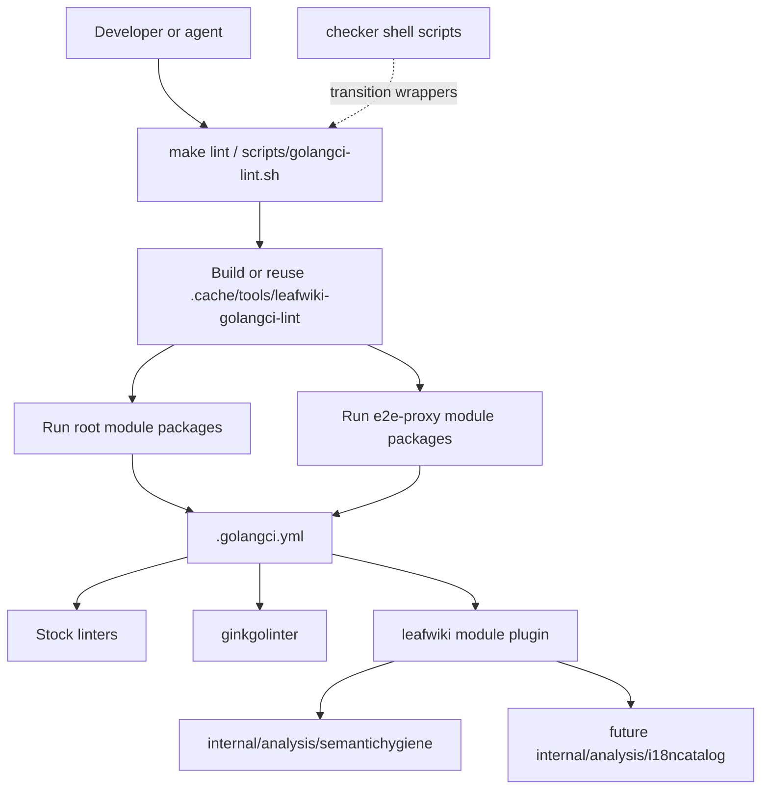
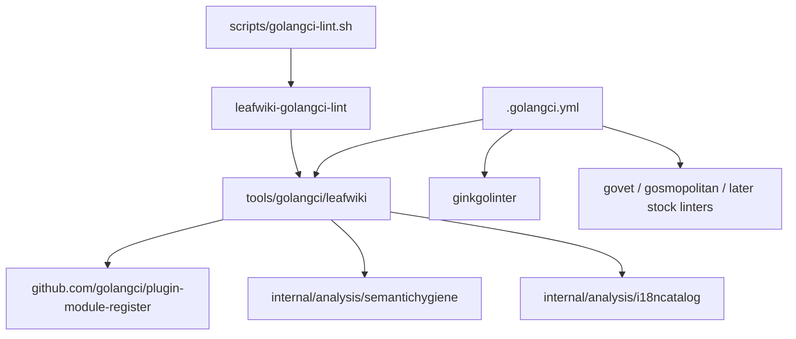

<!-- leafwiki
version: 1
page:
  id: golangci-lint-local-gate-plan-20260704
  title: Golangci Lint Local Gate Implementation Plan
  created_at: "2026-07-04T00:00:00Z"
  updated_at: "2026-07-04T00:00:00Z"
  creator_id: system
  last_author_id: system
tags:
  - plans
  - implementation
fields:
  type: refactor
-->

# Golangci Lint Local Gate Implementation Plan

## Goal & Context

### Objective

Make `golangci-lint` the local static source-policy gate for LeafWiki by introducing a pinned custom golangci-lint binary, adapting LeafWiki's semantic analyzer as a module plugin, and migrating policy-bearing checker scripts into that gate without baselines or CI changes.

### Context

- Thread ID: `019f2d28-549f-7343-a07c-02d87e169ee5`.
- Conversation: `codex://threads/019f2d28-549f-7343-a07c-02d87e169ee5`.
- Workflow source: `docs/plans/planning.aibasic.txt`.
- Dependent plans:
  - `docs/plans/semantic-hygiene-checker.PLAN.md`
  - `docs/plans/semantic-hygiene-waivable-diagnostics.PLAN.md`
  - `docs/plans/go-i18n-rollout.PLAN.md`
- Prerequisite: implementation must start in a separate worktree because the current local checkout is still undergoing Ginkgo cleanup.

### Decisions from Discussion

**Key Decisions:**

1. Use `golangci-lint` as a local tool only. Reason: CI use was explicitly excluded.
2. Make the final source-policy acceptance phrase "the LeafWiki golangci-lint gate reports no issues". Reason: new work should eventually have one clear static quality gate. This phrase is the end-state contract, not the Definition of Done for the first tooling-only branch.
3. Use a custom golangci-lint module plugin for LeafWiki analyzers. Reason: `semantichygiene` is already a `go/analysis` analyzer.
4. Keep runtime tests outside golangci-lint. Reason: `go test`, frontend lint/build, E2E, and install smoke tests prove behavior, not static source policy.
5. Do not use a baseline file. Reason: existing findings should be reported truthfully and fixed in later cleanup slices, not grandfathered or hidden.
6. Remove shell checker policy only after parity. Reason: current scripts encode real semantic and i18n checks that must not silently disappear.
7. Implement from a separate worktree. Reason: the current checkout has unrelated Ginkgo cleanup changes.

**Alternatives Considered:**

- Enable golangci-lint defaults immediately. Rejected because the current default run is noisy and would create a broad cleanup collision.
- Keep `cmd/leafwiki-vet` as a permanent sibling gate. Rejected because the end state should have one static-policy gate.
- Treat `gosmopolitan` as a go-i18n catalog checker. Rejected because it catches broad i18n smells, not LeafWiki catalog parity.
- Force every non-Go source scan into golangci-lint in the first slice. Rejected because the first slice should prove the Go analyzer integration before adding cross-language file policy.

**Open Questions Resolved:**

- Q: Is CI in scope?
  - A: No.
- Q: Should shell checker scripts eventually disappear?
  - A: Yes, for static source-policy checks after parity.
- Q: Should existing findings be baselined?
  - A: No.
- Q: Does existing golangci-lint i18n support cover LeafWiki's catalog gate?
  - A: No.

## Summary

The migration introduces `leafwiki-golangci-lint`, a pinned custom golangci-lint binary built from `.custom-gcl.yml`.

The first implementation slice adds a module-plugin adapter that registers LeafWiki analyzer code with golangci-lint and a local wrapper that runs both Go modules.

Later slices move current shell-checker policy into analyzers, update docs and Makefile entrypoints, and then enable noisy stock linters only after each category is clean.

## Scope Boundaries

### In Scope

- Add local golangci-lint config and custom-binary build configuration.
- Add a LeafWiki golangci-lint module plugin adapter.
- Run `semantichygiene` through golangci-lint with type information.
- Add a local entrypoint that runs root and `e2e-proxy` module lint.
- Migrate policy-bearing shell checker logic into analyzers or compatibility wrappers.
- Update local docs to point at the new static source-policy gate.
- Preserve current semantic and i18n policy while changing execution shape.
- Plan no-baseline stock-linter enablement slices.

### Out of Scope / Deferred

- GitHub Actions or any CI integration.
- Runtime test replacement.
- Frontend ESLint replacement.
- E2E test replacement.
- Installer/runtime smoke-test replacement.
- Fixing all current `errcheck`, `unused`, `staticcheck`, `gocritic`, and `ineffassign` findings in the first slice.
- Fixing current `leafwiki` semantic hygiene findings reported by the new gate.
- Making "the LeafWiki golangci-lint gate reports no issues" true in this tooling-only branch.
- Removing `cmd/leafwiki-vet` before golangci-lint parity is proven.

### Intentional Limitations

- The first golangci-lint gate may report existing `leafwiki` semantic findings. That is acceptable for this tooling-only branch as long as the wrapper reports them truthfully across the intended package surface.
- Shell checkers may remain temporarily as compatibility wrappers.
- Cross-language policy checks move into golangci-lint only when the analyzer design is less fragile than the existing script.

## Assumptions

- The implementation worktree can be created from a base that does not include unrelated Ginkgo cleanup dirtiness.
- `golangci-lint v2.12.2` remains an acceptable initial pin.
- The `github.com/golangci/plugin-module-register` module remains compatible with golangci-lint v2 custom builds.
- LeafWiki's current `.cache` ignore rule is acceptable for storing generated local tool binaries.
- The initial custom plugin can be built locally with Go and git available.
- Keeping `cmd/leafwiki-vet` during transition is acceptable even though the end state demotes or removes it.

## Impact Analysis

### Existing Code Impact

| File | Change | Downstream Impact |
|---|---|---|
| `.custom-gcl.yml` | New custom golangci-lint build definition | Defines the pinned local binary build |
| `.golangci.yml` | New v2 lint config | Becomes the static source-policy contract |
| `.golangci-lint` | Remove or replace invalid config | Prevents accidental default/config drift |
| `.golangci.ginkgolinter.yml` | Merge or retire after parity | Avoids duplicate lint config surfaces |
| `tools/golangci/leafwiki/plugin.go` | New module-plugin adapter | Lets golangci-lint run LeafWiki analyzers |
| `scripts/golangci-lint.sh` | New local wrapper | Runs custom binary for both Go modules |
| `Makefile` | Add `lint` and possibly `lint-go` targets | Gives contributors a standard local command |
| `go.mod` / `go.sum` | Add plugin registration dependency | Needed by adapter package |
| `scripts/check-semantic-hygiene.sh` | Later compatibility-wrapper change or deletion | Moves policy execution to golangci-lint |
| `scripts/check-typed-id-oracles.sh` | Later compatibility-wrapper change or deletion | Avoids duplicated policy entrypoints |
| `scripts/check-i18n-catalog.sh` | Later split/migration | Moves static policy into analyzers where practical |
| `docs/typed-ids.md` | Update reviewer command | Points semantic policy at local golangci-lint gate |
| `docs/i18n.md` | Update catalog workflow | Separates static lint from runtime/catalog regeneration steps |
| `docs/plans/*` | Preserve this plan and OODA artifacts | Provides migration contract for implementation agents |

### Existing Tests Requiring Updates

| File | Change | Downstream Impact |
|---|---|---|
| `tools/golangci/leafwiki/plugin_test.go` | New tests for adapter construction and analyzer list | Proves the plugin exposes `semantichygiene` with type-info load mode |
| `cmd/leafwiki-vet/main_test.go` | Usually unchanged in first slice | Only update if `cmd/leafwiki-vet` is demoted after parity |
| `internal/analysis/semantichygiene/analyzer_test.go` | Existing fixture suite remains authoritative | Verifies analyzer behavior independent of golangci-lint packaging |
| `internal/analysis/i18ncatalog/*_test.go` | New tests if catalog analyzer is added | Proves catalog drift and message-policy diagnostics without shell scripts |
| `scripts/test-*.sh` or new script smoke tests | Add shell syntax/smoke coverage for wrapper | Verifies local wrapper behavior without network-dependent lint runs |

### Module & Target Boundaries

The root module and `e2e-proxy` module are separate lint targets.

The local entrypoint must run the root module from repo root and `e2e-proxy` from `e2e-proxy/`.

Do not scan `ui/leafwiki-ui/node_modules` as Go source.

### Access Control

| Type/File | Public API | Internal/Private |
|---|---|---|
| `scripts/golangci-lint.sh` | Local contributor command | Owns orchestration only |
| `Makefile` `lint` target | Local contributor command | Delegates to wrapper |
| `tools/golangci/leafwiki` | Importable plugin adapter | No runtime product API |
| `internal/analysis/semantichygiene` | No public API | Reviewer-owned analyzer policy |
| `internal/analysis/i18ncatalog` | No public API | Reviewer-owned catalog policy if added |
| `.golangci.yml` | Local lint contract | Source-policy config |

## Architecture & Design

### Architecture Non-Goals

- Do not turn golangci-lint into a runtime test runner.
- Do not make checker policy configurable by ordinary contributors through YAML budgets or baselines.
- Do not move semantic hygiene policy out of `internal/analysis`.
- Do not add CI workflow changes in this plan.

### Required Components

#### Architecture Diagram



#### Module Structure Tree

```markdown
.
├── .custom-gcl.yml
├── .golangci.yml
├── Makefile
├── scripts/
│   ├── golangci-lint.sh
│   ├── check-semantic-hygiene.sh
│   ├── check-typed-id-oracles.sh
│   └── check-i18n-catalog.sh
├── tools/
│   └── golangci/
│       └── leafwiki/
│           ├── plugin.go
│           └── plugin_test.go
├── internal/
│   └── analysis/
│       ├── semantichygiene/
│       └── i18ncatalog/
└── e2e-proxy/
    └── go.mod
```

`internal/analysis/i18ncatalog` is introduced only when the i18n migration slice starts.

#### Dependency Graph



#### Key Design Decisions

1. The plugin adapter is importable, but analyzer policy remains internal.
2. The local wrapper owns module iteration and custom-binary bootstrapping.
3. `.golangci.yml` owns enabled checks and their settings.
4. Existing checker shell scripts become transition wrappers only after parity.
5. No stock linter enters the default gate until clean.

#### Pattern References

- `internal/analysis/semantichygiene/analyzer.go` - existing analyzer export and type-info usage.
- `cmd/leafwiki-vet/main.go` - current singlechecker adapter.
- `cmd/leafwiki-vet/main_test.go` - delegation test pattern.
- `internal/analysis/semantichygiene/analyzer_test.go` - `analysistest` fixture pattern.
- `.golangci.ginkgolinter.yml` - existing clean v2 golangci-lint config style.
- `scripts/check-semantic-hygiene.sh` - current multi-module semantic gate behavior.
- `scripts/check-i18n-catalog.sh` - current catalog and non-Go policy checks to migrate carefully.
- `docs/i18n.md` - current contributor-facing i18n workflow.
- `docs/typed-ids.md` - current semantic checker documentation.

## Test Specifications

**Key Principle:** Prove parity before deleting existing checker surfaces.

### Test Non-Goals

- Do not add CI tests.
- Do not use broad end-to-end runs to prove the plugin adapter.
- Do not use tests to bless existing stock-linter violations.

### Test Types Required

| Included | Type | Scope |
|---|---|---|
| Yes | Unit tests | Plugin adapter construction, analyzer list, load mode, future catalog extraction helpers |
| Yes | Integration tests | Custom golangci-lint binary runs against focused fixture or package targets |
| No | E2E tests | No user-facing runtime behavior changes |

### Gherkin Test Scenarios

#### Unit Test Scenarios

##### Happy Path Scenarios

```gherkin
Given the LeafWiki golangci-lint plugin is constructed with empty settings
When BuildAnalyzers is called
Then the returned analyzer list includes semantichygiene.Analyzer
And the plugin load mode is typesinfo
```

```gherkin
Given a future i18n catalog analyzer fixture with matching i18n.Message literals and active.en.toml entries
When the analyzer runs
Then it reports no catalog drift diagnostics
```

##### Error Scenarios

```gherkin
Given a future i18n catalog analyzer fixture where active.en.toml is missing a message literal
When the analyzer runs
Then it reports a stable catalog drift diagnostic at the source message or catalog boundary
```

```gherkin
Given a future i18n catalog analyzer fixture with a committed translate.* file during the English-only phase
When the analyzer runs
Then it reports a hard policy diagnostic
```

##### Edge Case Scenarios

```gherkin
Given the LeafWiki plugin receives unknown custom settings
When the plugin constructor validates settings
Then it fails rather than silently accepting unused configuration
```

```gherkin
Given the local lint wrapper runs from a nested working directory
When it resolves the repository root
Then it still runs the root module and e2e-proxy module with the same config
```

##### Corner Case Scenarios

```gherkin
Given the custom binary already exists in the local cache
When the wrapper runs
Then it reuses the binary unless the pinned build inputs changed
```

##### Implementation Notes

- Keep plugin tests small and independent of golangci-lint process execution.
- Use analyzer fixture tests for policy behavior.
- Use wrapper smoke tests only for script behavior and argument routing.

##### Test Target Locations

- `tools/golangci/leafwiki/plugin_test.go`
- `internal/analysis/i18ncatalog/*_test.go`
- `internal/analysis/i18ncatalog/testdata/...`
- `scripts/test-golangci-lint.sh` if wrapper smoke coverage is added.

#### Integration Tests Scenarios

##### Happy Path Scenarios

```gherkin
Given .custom-gcl.yml defines the LeafWiki module plugin
When the local wrapper builds the custom binary
Then the binary lists or runs the leafwiki custom linter successfully
```

```gherkin
Given the custom binary runs on a package currently clean for semantichygiene
When golangci-lint runs with .golangci.yml
Then it exits successfully with no semantichygiene diagnostics
```

##### Error Scenarios

```gherkin
Given a semantic hygiene fixture contains a known bad pattern
When the custom golangci-lint binary runs the LeafWiki plugin
Then it reports the same rule class that cmd/leafwiki-vet reports
```

##### Edge Case Scenarios

```gherkin
Given e2e-proxy is a nested Go module
When the local lint entrypoint runs
Then it invokes golangci-lint from e2e-proxy as a separate module run
```

##### Corner Case Scenarios

```gherkin
Given frontend node_modules contains Go source unrelated to LeafWiki
When the root module lint target runs
Then it does not scan that node_modules Go source
```

##### Implementation Notes

- Prefer focused packages and fixtures for parity proof.
- Do not require the full default stock-linter set to pass in the first slice.

##### Test Target Locations

- `tools/golangci/leafwiki/plugin_test.go`
- `internal/analysis/semantichygiene/analyzer_test.go`
- `internal/analysis/i18ncatalog/analyzer_test.go`
- `scripts/test-golangci-lint.sh`

#### E2E Tests Scenarios

##### Happy Path Scenarios

No E2E scenarios are required. This plan changes local static tooling, not user-visible application behavior.

##### Error Scenarios

No E2E error scenarios are required.

##### Edge Case Scenarios

No E2E edge scenarios are required.

##### Corner Case Scenarios

No E2E corner-case scenarios are required.

##### Implementation Notes

Do not add Playwright or browser coverage for this plan.

##### Test Target Locations

No E2E test files.

## Implementation

### Implementation Non-Goals

- Do not touch `.github/workflows/`.
- Do not clean all stock linter findings in the first implementation slice.
- Do not remove `scripts/check-i18n-catalog.sh` until catalog and non-Go policy parity is proven.
- Do not change application runtime behavior.

### Implementation Steps

#### U1. Isolate the Implementation Worktree

**Goal:** Start implementation away from the dirty Ginkgo cleanup checkout.

**Requirements:** R1, R2, R9.

**Dependencies:** None.

**Files:**

- No planned repo file changes in this unit.

**Approach:** Create a separate worktree or equivalent isolated checkout from the intended base branch. Confirm that unrelated dirty Ginkgo files from the current checkout are absent. Keep the branch focused on local golangci-lint tooling.

**Patterns to follow:** Existing LeafWiki cleanup guidance keeps unrelated dirtiness out of accepted slices.

**Test scenarios:** Test expectation: none -- this unit is workspace setup, not code behavior.

**Verification:** The implementation checkout has no unrelated Ginkgo cleanup changes, and later diffs contain only golangci-lint migration files.

#### U2. Add the Custom Golangci-Lint Build Skeleton

**Goal:** Define the pinned local custom golangci-lint binary and the v2 lint config surface.

**Requirements:** R1, R2, R3, R4.

**Dependencies:** U1.

**Files:**

- Create: `.custom-gcl.yml`
- Create: `.golangci.yml`
- Modify or remove: `.golangci-lint`
- Review: `.golangci.ginkgolinter.yml`
- Modify: `.gitignore` only if `.cache/tools` needs a more specific ignore rule

**Approach:** Add `.custom-gcl.yml` with a pinned golangci-lint version and a local module plugin path. Add `.golangci.yml` using `version: "2"`, `linters.default: none`, and only clean initial checks. Do not enable noisy stock linters yet.

**Execution note:** This is mostly packaging/config; prove it with config validation and a focused custom binary smoke run.

**Patterns to follow:** `.golangci.ginkgolinter.yml` for v2 config style.

**Test scenarios:**

- Happy path: `.golangci.yml` verifies as valid v2 config.
- Happy path: `.custom-gcl.yml` builds a local custom binary.
- Edge case: the invalid `.golangci-lint` file no longer affects local lint execution.
- Edge case: generated tool binaries remain ignored by git.

**Verification:** The pinned custom binary builds locally, `.golangci.yml` verifies, and no CI workflow files are modified.

#### U3. Add the LeafWiki Module Plugin Adapter

**Goal:** Expose LeafWiki analyzer policy to golangci-lint through a module plugin.

**Requirements:** R3, R5, R6.

**Dependencies:** U2.

**Files:**

- Create: `tools/golangci/leafwiki/plugin.go`
- Create: `tools/golangci/leafwiki/plugin_test.go`
- Modify: `go.mod`
- Modify: `go.sum`

**Approach:** Register a `leafwiki` module plugin with `github.com/golangci/plugin-module-register/register`. Return `semantichygiene.Analyzer` from `BuildAnalyzers()` and `register.LoadModeTypesInfo` from `GetLoadMode()`. Reject unknown plugin settings if settings are introduced.

**Execution note:** Start with tests proving analyzer registration before running the custom binary against real packages.

**Patterns to follow:**

- `cmd/leafwiki-vet/main.go` for existing analyzer wiring.
- `cmd/leafwiki-vet/main_test.go` for small delegation assertions.

**Test scenarios:**

- Happy path: constructing the plugin with empty settings succeeds.
- Happy path: `BuildAnalyzers()` returns `semantichygiene.Analyzer`.
- Happy path: `GetLoadMode()` returns type-info load mode.
- Error path: unknown settings fail if settings decoding is used.

**Verification:** Plugin unit tests pass and the custom binary can load the `leafwiki` linter.

#### U4. Add the Local Lint Entrypoint

**Goal:** Give contributors and agents one local command that runs the LeafWiki golangci-lint gate across both Go modules.

**Requirements:** R1, R2, R4, R7.

**Dependencies:** U2, U3.

**Files:**

- Create: `scripts/golangci-lint.sh`
- Create: `scripts/test-golangci-lint.sh` if script smoke tests are added
- Modify: `Makefile`
- Modify: `scripts/README.md`

**Approach:** Add a wrapper that resolves repo root, ensures the custom binary exists, runs root package patterns explicitly, then runs `e2e-proxy` from `e2e-proxy/`. Add `make lint` to delegate to the wrapper. Keep linter selection in `.golangci.yml`, not in shell logic.

**Execution note:** Prefer script smoke verification over broad lint cleanup in this unit.

**Patterns to follow:**

- `scripts/check-semantic-hygiene.sh` for repo-root resolution.
- `scripts/test-run.sh` for lightweight script smoke style.
- `Makefile` existing command surface.

**Test scenarios:**

- Happy path: wrapper resolves repo root from repo root.
- Happy path: wrapper resolves repo root from a nested directory.
- Happy path: wrapper runs root module and `e2e-proxy` module.
- Error path: wrapper fails clearly when the custom binary cannot be built.
- Edge case: wrapper does not scan `ui/leafwiki-ui/node_modules`.

**Verification:** `make lint` or the wrapper runs both modules over the fixed package surface and reports the current enabled-check results without parser/build failures, baselines, suppressions, or scope narrowing. Clean `ginkgolinter` remains a required acceptance check; existing `leafwiki` diagnostics are reported but fixed in later cleanup work.

#### U5. Prove Semantic Hygiene Parity

**Goal:** Make golangci-lint the primary runner for `semantichygiene` without losing diagnostics.

**Requirements:** R3, R5, R8.

**Dependencies:** U3, U4.

**Files:**

- Modify: `.golangci.yml`
- Modify: `scripts/check-semantic-hygiene.sh`
- Modify: `scripts/check-typed-id-oracles.sh`
- Modify: `docs/typed-ids.md`
- Existing tests: `internal/analysis/semantichygiene/analyzer_test.go`
- Existing tests: `cmd/leafwiki-vet/main_test.go`

**Approach:** Run `semantichygiene` through the custom golangci-lint binary over the same package surfaces currently covered by `scripts/check-semantic-hygiene.sh`. Keep `cmd/leafwiki-vet` and the shell script during parity. Once parity is proven, change the script into a compatibility wrapper or document the new command as authoritative.

**Execution note:** Do not weaken analyzer rules to make plugin execution pass.

**Patterns to follow:**

- `internal/analysis/semantichygiene/analyzer_test.go` for existing fixture truth.
- `scripts/check-semantic-hygiene.sh` for current package surface.

**Test scenarios:**

- Happy path: a package clean under `cmd/leafwiki-vet` is clean under custom golangci-lint.
- Error path: a known semantic fixture violation reports through custom golangci-lint.
- Edge case: `e2e-proxy` dependency-direction checks remain covered.
- Edge case: `scripts/check-typed-id-oracles.sh` does not diverge from the new gate.

**Verification:** The custom golangci-lint gate covers the same semantic analyzer package set as the previous shell gate.

#### U6. Migrate Go-Side I18n and Catalog Policy

**Goal:** Move LeafWiki-specific i18n/catalog policy out of shell/Python checks and into analyzer-backed golangci-lint checks where practical.

**Requirements:** R5, R6, R8.

**Dependencies:** U5.

**Files:**

- Create: `internal/analysis/i18ncatalog/analyzer.go`
- Create: `internal/analysis/i18ncatalog/analyzer_test.go`
- Create: `internal/analysis/i18ncatalog/testdata/...`
- Modify: `tools/golangci/leafwiki/plugin.go`
- Modify: `scripts/check-i18n-catalog.sh`
- Modify: `docs/i18n.md`

**Approach:** Add a dedicated analyzer for catalog parity and repo-specific i18n source policy. Start with checks that naturally fit Go analysis: extractable `i18n.Message` registry coverage, `active.en.toml` parity, English-only `translate.*` prohibition, and Go payload policy. Keep non-Go E2E TypeScript and shell scans in the script until a robust analyzer design exists.

**Execution note:** Characterize current script diagnostics with fixtures before replacing them.

**Patterns to follow:**

- `scripts/check-i18n-catalog.sh` for existing policy.
- `docs/i18n.md` for public contract.
- `docs/plans/go-i18n-rollout.OBSERVE.md` for extractor behavior and allowed prose assertions.

**Test scenarios:**

- Happy path: matching registry literals and `active.en.toml` pass.
- Error path: missing catalog entry fails.
- Error path: stale catalog entry fails if the chosen parity model treats it as drift.
- Error path: committed `translate.*` file fails during English-only phase.
- Error path: Go API payload emits `message` without `messageId` where the policy requires both.
- Edge case: OAuth RFC `error` payload compatibility remains allowed.

**Verification:** The analyzer reproduces the Go-side and catalog-file portions of `scripts/check-i18n-catalog.sh`.

#### U7. Retire Policy-Bearing Shell Checkers

**Goal:** Make shell checker scripts either thin compatibility wrappers or remove them after golangci-lint parity.

**Requirements:** R1, R5, R8.

**Dependencies:** U5, U6.

**Files:**

- Modify or remove: `scripts/check-semantic-hygiene.sh`
- Modify or remove: `scripts/check-typed-id-oracles.sh`
- Modify: `scripts/check-i18n-catalog.sh`
- Modify: `scripts/README.md`
- Modify: `docs/typed-ids.md`
- Modify: `docs/i18n.md`

**Approach:** Move authoritative documentation to `make lint` or `scripts/golangci-lint.sh`. Keep compatibility wrappers only if existing docs, plans, or agents still invoke them. Wrapper scripts must delegate to the golangci-lint gate and must not carry independent policy logic.

**Execution note:** Delete only after a fresh parity run proves no lost diagnostic class.

**Patterns to follow:** `scripts/README.md` for documenting local helper scripts.

**Test scenarios:**

- Happy path: documented local source-policy command is `make lint`.
- Happy path: any retained compatibility wrapper delegates to the local lint entrypoint.
- Error path: compatibility wrapper exits non-zero when golangci-lint reports issues.
- Edge case: no duplicate policy implementation remains in shell/Python once analyzer parity is complete.

**Verification:** Documentation points to the golangci-lint gate, and policy-bearing shell logic has been removed or converted to delegation.

#### U8. Add No-Baseline Stock Linter Rollout Tracking

**Goal:** Establish the process for enabling currently noisy stock linters without weakening the gate.

**Requirements:** R2, R9.

**Dependencies:** U4.

**Files:**

- Modify: `.golangci.yml`
- Create or modify: `docs/todo/golangci-lint-rollout.md`
- Modify: `docs/typed-ids.md` or `scripts/README.md` if contributor guidance needs the rollout policy

**Approach:** Document current noisy categories and the order for cleanup. Enable each linter only after its current findings are fixed in root and `e2e-proxy`, or after a narrowly documented package exclusion is accepted.

**Execution note:** Treat each noisy linter as a separate cleanup slice with focused verification.

**Patterns to follow:**

- `docs/todo/ginkgo-gomega-second-pass.md` for a repo-local cleanup ledger.
- Existing package-slice acceptance practice from Ginkgo cleanup.

**Test scenarios:**

- Happy path: the rollout ledger records current disabled linter categories and their cleanup state.
- Happy path: enabling a newly clean linter makes `make lint` remain green.
- Error path: trying to enable a linter with remaining findings fails the gate rather than requiring a baseline.
- Edge case: `e2e-proxy` linter findings are tracked separately from root-module findings.

**Verification:** `.golangci.yml` contains only clean enabled stock linters, and the ledger explains remaining disabled categories.

## Requirements

- R1. The local static source-policy gate is run through a LeafWiki golangci-lint entrypoint.
- R2. The tooling-only branch reports current findings for every enabled check without relying on a baseline, suppressions, or narrowed scope. Making the gate report no issues is deferred to later cleanup slices.
- R3. LeafWiki semantic hygiene runs inside golangci-lint through a module plugin.
- R4. The gate covers both the root Go module and `e2e-proxy`.
- R5. Current shell checker policy is preserved until golangci-lint parity is proven.
- R6. Go-side i18n/catalog policy migrates to analyzer-backed golangci-lint checks where practical.
- R7. Local contributor docs point to the new source-policy gate.
- R8. Runtime tests and frontend/E2E gates remain separate from golangci-lint.
- R9. Implementation happens in a separate worktree isolated from current Ginkgo cleanup.

## Verification

Run verification from the implementation worktree.

Expected checks:

- Custom golangci-lint binary builds from `.custom-gcl.yml`.
- `.golangci.yml` validates as golangci-lint v2 config.
- Plugin adapter unit tests pass.
- Existing `semantichygiene` analyzer tests pass.
- Local lint entrypoint runs root module and `e2e-proxy`.
- Local lint entrypoint reports current findings for enabled checks and exits non-zero when findings remain.
- Standalone `ginkgolinter` verification reports no issues in the root module and `e2e-proxy`.
- Compatibility wrappers, if retained, delegate to the local lint entrypoint.
- Documentation no longer names policy-bearing shell scripts as the authoritative source-policy gate after parity.
- `git diff --check` passes for the migration diff.

Do not require the noisy stock linter categories to be clean until their rollout units explicitly enable them.

## Definition Of Done

The tooling-only branch is complete when a fresh implementation worktree has a local `make lint` or `scripts/golangci-lint.sh` gate that builds or reuses `leafwiki-golangci-lint`, runs both Go modules, and truthfully reports current findings for all enabled LeafWiki static source-policy checks. The later cleanup effort owns making the gate report no issues.

Completion requires:

- `.custom-gcl.yml` builds the custom binary.
- `.golangci.yml` is the authoritative v2 config.
- The LeafWiki module plugin runs `semantichygiene` with type information and surfaces existing diagnostics without a baseline.
- `ginkgolinter` and initially green stock linters run through the same gate, with standalone `ginkgolinter` remaining clean in both modules.
- Current semantic checker shell policy is represented in golangci-lint or retained only as a delegating wrapper.
- Go-side i18n/catalog policy has migrated into analyzer-backed checks, or any remaining non-Go policy check is explicitly documented as outside the golangci-lint static-policy gate.
- No lint baseline exists.
- No CI workflow changes are included.
- The current dirty Ginkgo cleanup checkout is not used as the implementation workspace.
- Runtime gates remain documented separately from the static source-policy gate.
