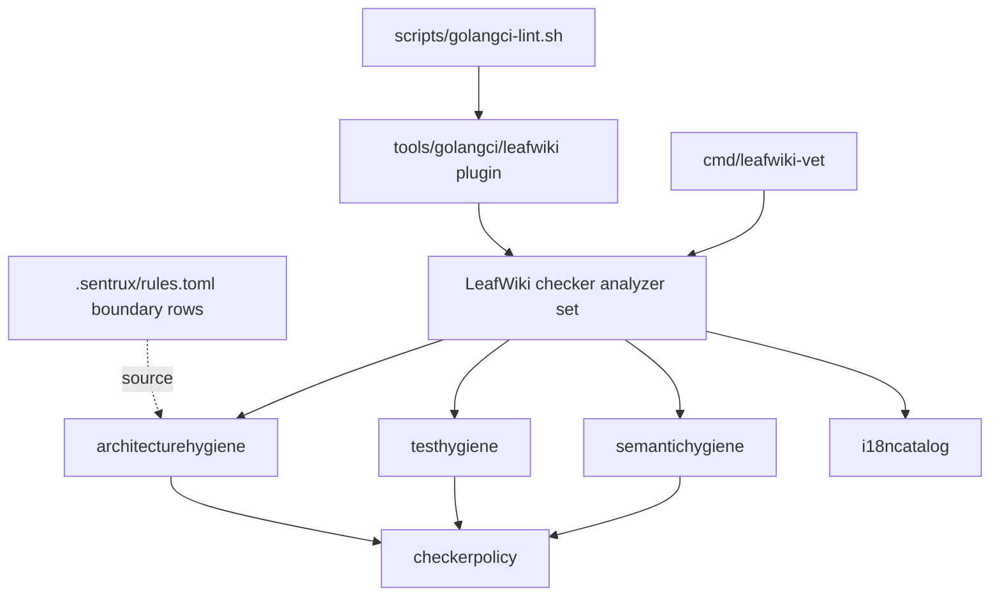
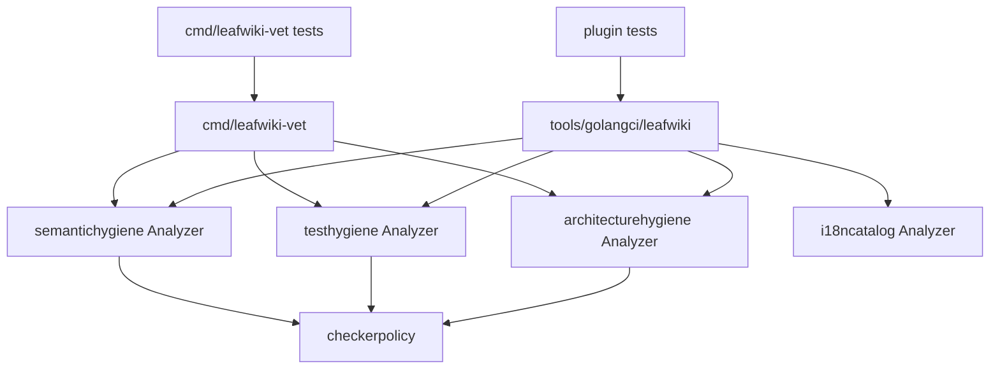

<!-- leafwiki
version: 1
page:
  id: leafwiki-vet-architecture-hygiene-plan-20260705
  title: LeafWiki Vet Architecture Hygiene Implementation Plan
  created_at: "2026-07-05T00:00:00Z"
  updated_at: "2026-07-05T00:00:00Z"
  creator_id: codex
  last_author_id: codex
tags:
  - plans
fields:
  type: refactor
  artifact_contract: ce-unified-plan/v1
  artifact_readiness: implementation-ready
  product_contract_source: ce-plan-bootstrap
  execution: code
-->

# LeafWiki Vet Architecture Hygiene Implementation Plan

## Goal & Context

### Objective

Split LeafWiki's current semantic checker into policy-family modules and add a tested `architecturehygiene` family that can enforce project-specific dependency direction rules before Sentrux is removed.

### Context

- Workflow: `docs/plans/planning.aibasic.txt`.
- Thread ID: `019f2f0a-0ccf-76e0-b8e4-4d93bf45dd53`.
- Thread link: `codex://threads/019f2f0a-0ccf-76e0-b8e4-4d93bf45dd53`.
- Observation artifact: `docs/plans/leafwiki-vet-architecture-hygiene.OBSERVE.md`.
- Context artifact: `docs/plans/leafwiki-vet-architecture-hygiene.CONTEXT.md`.
- Decision artifact: `docs/plans/leafwiki-vet-architecture-hygiene.DECISION.md`.
- Workflow state: `docs/plans/leafwiki-vet-architecture-hygiene.planning.aibasic.json`.
- Parent checker plan: `docs/plans/semantic-hygiene-checker.PLAN.md`.
- Waiver policy plan: `docs/plans/semantic-hygiene-waivable-diagnostics.PLAN.md`.
- Current Sentrux policy source: `.sentrux/rules.toml`.
- Current repo-facing static gate: `scripts/golangci-lint.sh`.
- Repo-facing checker wrapper: `scripts/golangci-lint.sh`.
- Implementation commands should be prefixed with `rtk`.

Prerequisites:

- The current checker exists under `internal/analysis/semantichygiene`.
- The current custom golangci plugin exists under `tools/golangci/leafwiki`.
- Existing unrelated working-tree changes must not be reverted or folded into this implementation.

### Decisions from Discussion

**Key Decisions:**

1. `leafwiki-vet` becomes the project policy checker surface.
   - Reason: the current checker already extends beyond semantic-value policy.

2. Split policy ownership into `semantichygiene`, `testhygiene`, and `architecturehygiene`.
   - Reason: each family has different review semantics and future growth pressure.

3. Move the existing e2e-proxy dependency rule into `architecturehygiene` before adding new dependency rules.
   - Reason: this is the smallest existing architecture rule and already has fixture coverage.

4. Keep rule IDs stable while moving rule ownership.
   - Reason: rule IDs are part of diagnostics, tests, docs, and waivers.

5. Preserve current waiver syntax in this phase.
   - Reason: a syntax rename is separate from the package split.

6. Port Sentrux import-boundary rules after `architecturehygiene` is real.
   - Reason: the long-term goal is project-owned architecture policy, not a generic Sentrux clone.

7. Defer Sentrux metric parity and Sentrux removal.
   - Reason: cycles, coupling grades, CC thresholds, and god-file heuristics are health ratchets, not the first architecture contract.

8. Keep generic Ginkgo/Gomega mechanics in `ginkgolinter`.
   - Reason: LeafWiki should own repo-specific test semantics; generic mechanics belong in the established linter lane.

**Alternatives Considered:**

- Add architecture rules directly to `semantichygiene`.
  - Rejected because the package role is already overloaded.

- Rename the whole checker first.
  - Rejected because it creates churn before rule-family boundaries exist.

- Remove Sentrux immediately.
  - Rejected because this plan ports only the high-value import-boundary subset.

- Port all Sentrux metrics.
  - Rejected because those checks do not map cleanly to the same `go/analysis` rule family.

**Open Questions Resolved:**

- Q: Should the checker split happen before `architecturehygiene` grows?
  - A: Yes. The existing e2e-proxy rule is the extraction proof.

- Q: Should dependency inversion be enforced as a generic SOLID rule?
  - A: No. Architecture checks should encode LeafWiki-specific package roles and composition boundaries.

## Summary

This plan refactors LeafWiki's static policy checker from one overloaded `semantichygiene` analyzer into a clearer project-checker structure. The first architecture family is created by moving `dependency.e2e-proxy-internal-import` out of `semantichygiene`. The command runner and golangci plugin are updated so direct and repo-facing gates agree. Ginkgo/Gomega/taxonomy policy is moved into `testhygiene`, while semantic-value and i18n policy remains in `semantichygiene`. After the split is stable, `architecturehygiene` ports the Sentrux import-boundary table as hard, fixture-covered rules.

## Requirements

| ID | Requirement |
|---|---|
| R1 | Keep `leafwiki-vet` as the stable project checker command. |
| R2 | Introduce a shared checker policy layer for rule IDs, metadata, structured diagnostics, and waiver handling. |
| R3 | Move the existing `dependency.e2e-proxy-internal-import` rule into `architecturehygiene` without changing its rule ID or behavior. |
| R4 | Update `cmd/leafwiki-vet` so it runs the expanded project-checker set. |
| R5 | Update `tools/golangci/leafwiki` so the custom golangci-lint gate exposes the same policy families. |
| R6 | Move Ginkgo/Gomega/taxonomy policy into `testhygiene` while preserving diagnostics and waiver behavior. |
| R7 | Narrow `semantichygiene` to semantic-value, i18n/message, contract literal, and typed-boundary policy. |
| R8 | Port the Sentrux import-boundary table into `architecturehygiene` as hard dependency rules. |
| R9 | Keep Sentrux metric constraints and Sentrux removal out of this implementation. |
| R10 | Add analyzer fixture coverage for every moved and newly introduced architecture rule. |
| R11 | Remove deprecated checker-specific compatibility wrappers and keep the canonical repo-facing gate on `scripts/golangci-lint.sh`. |
| R12 | Update docs so reviewers understand the checker family split and the boundary between Sentrux migration and deferred metric work. |

## Scope Boundaries

### In Scope

- New or refactored Go analyzer packages under `internal/analysis`.
- Shared checker policy infrastructure used by multiple rule families.
- Runner changes in `cmd/leafwiki-vet`.
- Custom golangci plugin updates under `tools/golangci/leafwiki`.
- Analyzer fixture moves and new architecture fixtures.
- Documentation updates for checker ownership and architecture hygiene.
- Porting the six Sentrux import-boundary rules from `.sentrux/rules.toml`.

### Out of Scope / Deferred

- Removing Sentrux.
- Porting `max_cycles`, `max_coupling`, `max_cc`, or `no_god_files`.
- Adding dependency-inversion concrete-type rules beyond import-boundary checks.
- Changing `semh:allow` syntax.
- Renaming every diagnostic prefix.
- Frontend ESLint rule migration.
- Runtime product behavior changes.
- Broad package cleanup exposed by the new rules.

### Intentional Limitations

- The first architecture rules operate on import declarations and package paths.
- New boundary rules are hard failures with no waiver support in v1 unless a reviewer explicitly broadens policy.
- Existing current diagnostics outside this scope must not be hidden behind baselines or broad suppressions.

## Assumptions

- `golang.org/x/tools v0.45.0` remains the analyzer foundation.
- The custom golangci plugin remains the repo-facing gate for Go source policy.
- Existing analyzer fixture patterns under `internal/analysis/semantichygiene/testdata` can be mirrored or moved for new rule-family packages.
- `i18ncatalog` remains a separate analyzer and does not need to move.
- Package-level import-boundary checks are enough for the Sentrux boundary subset.
- Any inherited red state in unrelated packages is reported honestly rather than treated as a reason to weaken new rules.

## Impact Analysis

### Existing Code Impact

| File or Area | Change | Downstream Impact |
|---|---|---|
| `internal/analysis/checkerpolicy` | New shared policy package | Centralizes rule IDs, diagnostic reporting, waiver metadata, and helper infrastructure |
| `internal/analysis/architecturehygiene` | New architecture policy family | Owns dependency direction and Sentrux import-boundary rules |
| `internal/analysis/testhygiene` | New test policy family | Owns Ginkgo, Gomega, taxonomy, and BDD readability rules |
| `internal/analysis/semantichygiene` | Narrowed package | Keeps semantic-value, i18n/message, stable literal, and typed-boundary rules |
| `cmd/leafwiki-vet/main.go` | Switch from one analyzer to project-checker set | Direct vet invocation matches split policy families |
| `cmd/leafwiki-vet/main_test.go` | Update expected analyzer delegation | Proves command-level analyzer list |
| `tools/golangci/leafwiki/plugin.go` | Include split analyzers | Repo-facing golangci gate sees new policy families |
| `tools/golangci/leafwiki/plugin_test.go` | Update analyzer expectations | Prevents plugin drift from direct vet runner |
| `scripts/golangci-lint.sh` | Usually unchanged | Rebuild stale binary when `internal/analysis` changes |
| `scripts/test-golangci-lint.sh` | Update stale-binary fixture paths if needed | Ensures new analysis packages trigger custom binary rebuild |
| `.sentrux/rules.toml` | Read-only source in this phase | Boundary rows are copied into architecture policy, not removed |
| `docs/typed-ids.md` or checker docs | Update | Explains policy family ownership and reviewer expectations |

### Existing Tests Requiring Updates

| File | Change | Downstream Impact |
|---|---|---|
| `internal/analysis/semantichygiene/analyzer_test.go` | Remove dependency and test-rule fixture ownership as families move | Keeps semantic fixture suite focused |
| `internal/analysis/architecturehygiene/analyzer_test.go` | New fixture runner | Proves dependency and boundary rules |
| `internal/analysis/testhygiene/analyzer_test.go` | New fixture runner | Proves Ginkgo/Gomega/taxonomy rules after move |
| `internal/analysis/semantichygiene/rule_edges_*_test.go` | Move or split test-specific edge tests | Prevents test-hygiene behavior from staying hidden in semantic package |
| `internal/analysis/semantichygiene/policy_test.go` | Move metadata coverage into shared policy tests where appropriate | Keeps rule metadata registration global |
| `internal/analysis/checkerpolicy/*_test.go` | New tests | Proves waiver parsing, formatting, metadata, and finalization remain stable |
| `cmd/leafwiki-vet/main_test.go` | Switch from single analyzer expectation to analyzer set expectation | Proves command wiring |
| `tools/golangci/leafwiki/plugin_test.go` | Include new analyzers | Proves golangci plugin parity |
| `scripts/test-golangci-lint.sh` | Adjust stale analyzer paths if needed | Ensures wrapper rebuild behavior stays correct |

### Module & Target Boundaries

| Area | Public API | Internal / Private |
|---|---|---|
| `cmd/leafwiki-vet` | Command invoked by reviewers and agents | Analyzer ordering and wiring details |
| `tools/golangci/leafwiki` | Custom golangci-lint plugin | Analyzer construction internals |
| `internal/analysis/checkerpolicy` | Shared internal package for analysis modules | Not runtime application API |
| `internal/analysis/architecturehygiene` | Internal analyzer package | Not runtime application API |
| `internal/analysis/testhygiene` | Internal analyzer package | Not runtime application API |
| `internal/analysis/semantichygiene` | Internal analyzer package | Not runtime application API |

### Access Control

No runtime access-control behavior changes. This plan changes static analysis and reviewer gates only.

## Architecture & Design

### Architecture Non-Goals

- Do not build a generic architecture-analysis framework.
- Do not recreate Sentrux graph metrics.
- Do not introduce external configuration for v1 architecture rules.
- Do not use baselines to preserve current violations.
- Do not change runtime package dependencies except where analyzer package imports require it.

### Required Components

#### Architecture Diagram



#### Module Structure Tree

```text
internal/analysis/
  checkerpolicy/
    context.go
    diagnostics.go
    metadata.go
    waivers.go
    *_test.go
  semantichygiene/
    analyzer.go or rules.go
    rules_string.go
    rules_cast.go
    rules_signature.go
    rules_literal.go
    rules_message.go
    testdata/...
  testhygiene/
    analyzer.go or rules.go
    rules_ginkgo*.go
    rules_gomega*.go
    rules_taxonomy.go
    testdata/...
  architecturehygiene/
    analyzer.go
    rules_dependency.go
    policy.go
    testdata/...
  i18ncatalog/
    existing files

cmd/leafwiki-vet/
  main.go
  main_test.go

tools/golangci/leafwiki/
  plugin.go
  plugin_test.go
```

The exact file names may be adjusted during implementation if the current helper boundaries make a different split cleaner. The package responsibilities should not change.

#### Dependency Graph



#### Key Design Decisions

1. Architecture boundary rules live in Go tables, not TOML.
   - Reason: the policy becomes compiled, reviewed, and fixture-tested with the analyzer.

2. Sentrux `.toml` is an input to the plan, not a runtime dependency.
   - Reason: the future direction is removing Sentrux.

3. Runner parity is required.
   - Reason: direct `leafwiki-vet` and custom golangci-lint must enforce the same policy families.

4. Current waiver syntax is preserved.
   - Reason: moving packages should not force waiver syntax churn.

5. Dependency rules start as hard rules.
   - Reason: architecture direction should not become an exception-budget exercise before the rule family proves itself.

6. Sentrux metrics are deferred.
   - Reason: they require separate graph or complexity logic and are lower value than boundary contracts.

#### Pattern References

- `internal/analysis/semantichygiene/analyzer.go` - current analyzer traversal and rule dispatch.
- `internal/analysis/semantichygiene/policy.go` - current rule metadata table.
- `internal/analysis/semantichygiene/policy_waivers.go` - current structured diagnostics and waiver finalization.
- `internal/analysis/semantichygiene/rules_dependency.go` - current dependency direction rule.
- `internal/analysis/semantichygiene/analyzer_test.go` - fixture runner pattern.
- `internal/analysis/semantichygiene/testdata/src/github.com/perber/wiki/e2e-proxy/proxy_auth_test.go` - existing dependency rule fixture.
- `cmd/leafwiki-vet/main.go` - direct runner.
- `cmd/leafwiki-vet/main_test.go` - runner wiring test.
- `tools/golangci/leafwiki/plugin.go` - custom golangci-lint plugin analyzer list.
- `tools/golangci/leafwiki/plugin_test.go` - plugin analyzer-list expectations.
- `scripts/test-golangci-lint.sh` - wrapper contract tests.
- `.sentrux/rules.toml` - import-boundary source.

#### Concurrency & Data Isolation

This plan does not add runtime concurrency. Analyzer state remains package-local per `analysis.Pass`. Shared checker policy must not use mutable package-global state for per-run diagnostics or waiver usage.

## Test Specifications

### Key Principle

Write analyzer fixtures before moving or hardening rules. Every moved rule should have a failing fixture under its new owner before the old owner stops reporting it.

### Test Non-Goals

- No browser or frontend tests.
- No Playwright E2E tests.
- No Sentrux gate tests.
- No runtime product behavior tests unless implementation unexpectedly changes runtime packages, which should be treated as scope drift.

### Test Types Required

| Included | Type | Scope |
|---|---|---|
| Yes | Unit tests | Analyzer helpers, rule metadata, waiver parsing, runner wiring, plugin wiring |
| Yes | Analyzer fixture tests | Positive and negative source fixtures for each policy family |
| Yes | Shell wrapper tests | Existing golangci wrapper contract where analyzer paths or plugin behavior changes |
| No | E2E tests | No user-facing runtime behavior changes |

### Gherkin Test Scenarios

#### Unit Test Scenarios

##### Happy Path Scenarios

```gherkin
Given the shared checker policy registers an existing semantic rule ID
When the semantic analyzer reports that rule through the shared reporter
Then the diagnostic message keeps the same stable rule ID prefix
```

```gherkin
Given leafwiki-vet is invoked through the command runner
When the runner builds the project checker set
Then semantichygiene, testhygiene, and architecturehygiene are all included
```

```gherkin
Given the golangci plugin builds its analyzer list
When the plugin is constructed with empty settings
Then it exposes semantichygiene, testhygiene, architecturehygiene, and i18ncatalog with type information
```

##### Error Scenarios

```gherkin
Given a waiver comment references an unknown rule ID
When the shared checker policy finalizes diagnostics
Then it reports an unknown-waiver diagnostic exactly as the current checker does
```

```gherkin
Given the golangci plugin receives unknown settings
When it is constructed
Then it rejects the settings instead of silently ignoring them
```

##### Edge Case Scenarios

```gherkin
Given a moved testhygiene diagnostic is waivable
And a valid semh:allow comment is placed at the accepted scope
When diagnostics are finalized
Then the waiver suppresses exactly one matching diagnostic
And stale-waiver accounting remains unchanged from the pre-split checker
```

##### Corner Case Scenarios

```gherkin
Given two analyzer families use the shared checker policy in the same package
When both report diagnostics
Then diagnostics keep their stable rule IDs
And no family reports duplicate waiver infrastructure diagnostics for another family's rule
```

##### Implementation Notes

- Prefer existing Ginkgo/Gomega test style.
- Do not use generic `coverage`, `edge case`, or `exercise` descriptions in new Ginkgo specs.
- Keep fixtures small and focused on one policy family.

##### Test Target Locations

- `internal/analysis/checkerpolicy/*_test.go`
- `internal/analysis/architecturehygiene/analyzer_test.go`
- `internal/analysis/testhygiene/analyzer_test.go`
- `internal/analysis/semantichygiene/analyzer_test.go`
- `cmd/leafwiki-vet/main_test.go`
- `tools/golangci/leafwiki/plugin_test.go`

#### Integration Test Scenarios

##### Happy Path Scenarios

```gherkin
Given the e2e-proxy fixture imports a LeafWiki internal package
When architecturehygiene runs over the fixture package
Then it reports dependency.e2e-proxy-internal-import
And semantichygiene no longer owns that report
```

```gherkin
Given a fixture package under internal/core imports internal/wiki
When architecturehygiene runs over the fixture package
Then it reports the matching architecture import-boundary diagnostic
```

```gherkin
Given the custom golangci wrapper runs over the root module and e2e-proxy
When the split analyzer plugin is used
Then the architecture rule sees e2e-proxy packages as before
```

##### Error Scenarios

```gherkin
Given an internal/projectdaemon fixture imports cmd/leafwiki
When architecturehygiene runs
Then it reports the executable dependency boundary violation
```

##### Edge Case Scenarios

```gherkin
Given a package path shares a textual prefix with a forbidden path but is not inside that package tree
When architecturehygiene matches import boundaries
Then it does not report a false positive
```

##### Corner Case Scenarios

```gherkin
Given an allowed package imports another allowed package
When architecturehygiene runs
Then it emits no dependency diagnostic
```

##### Implementation Notes

- Use `analysistest` fixtures for import-boundary examples.
- Include both violating and allowed package paths for every new boundary matcher.
- Keep Sentrux metric constraints out of fixture expectations.

##### Test Target Locations

- `internal/analysis/architecturehygiene/testdata/src/github.com/perber/wiki/...`
- `internal/analysis/architecturehygiene/analyzer_test.go`
- `scripts/test-golangci-lint.sh`

#### E2E Test Scenarios

No E2E runtime tests are required because this plan changes static analysis and repository gates only.

## Implementation Units

### U1. Shared Checker Policy Foundation

**Goal:** Extract shared diagnostic, rule metadata, and waiver infrastructure into a reusable internal package without changing current checker behavior.

**Requirements:** R2, R6, R7.

**Dependencies:** None.

**Files:**

- Create or modify: `internal/analysis/checkerpolicy/*`
- Modify: `internal/analysis/semantichygiene/policy.go`
- Modify: `internal/analysis/semantichygiene/policy_waivers.go`
- Modify: `internal/analysis/semantichygiene/diagnostics.go`
- Modify: `internal/analysis/semantichygiene/analyzer.go`
- Test: `internal/analysis/checkerpolicy/*_test.go`
- Test: `internal/analysis/semantichygiene/*_test.go`

**Approach:**

- Introduce exported shared policy types for rule IDs, metadata, waiver scopes, and structured diagnostic reporting.
- Keep all existing rule IDs and waiver behavior intact.
- Preserve the current `semh:allow` syntax.
- Avoid moving rule logic in this unit unless it is necessary to compile shared policy extraction.
- Keep per-run analyzer state tied to `analysis.Pass`, not package globals.

**Execution note:** Start with tests that prove current diagnostic formatting and waiver behavior before moving implementation.

**Patterns to follow:**

- `internal/analysis/semantichygiene/policy.go`
- `internal/analysis/semantichygiene/policy_waivers.go`
- `internal/analysis/semantichygiene/rule_edges_structured_diagnostics_01_test.go`

**Test scenarios:**

- Reporting an existing semantic rule through the shared reporter keeps the same diagnostic message.
- A valid existing waiver still suppresses exactly one matching diagnostic.
- Unknown, stale, duplicate, non-waivable, malformed, and missing-explanation waiver cases still fail.
- Budget diagnostics remain package-local and unchanged unless the implementation explicitly documents a safe improvement.

**Verification:**

- Existing semantichygiene analyzer fixture tests still pass.
- New shared policy tests cover exported policy behavior.
- No runtime packages import `internal/analysis/checkerpolicy`.

### U2. Architecture Hygiene Extraction Proof

**Goal:** Create `architecturehygiene` and move `dependency.e2e-proxy-internal-import` out of `semantichygiene`.

**Requirements:** R1, R3, R4, R5, R10.

**Dependencies:** U1.

**Files:**

- Create: `internal/analysis/architecturehygiene/analyzer.go`
- Create: `internal/analysis/architecturehygiene/rules_dependency.go`
- Create: `internal/analysis/architecturehygiene/policy.go`
- Create: `internal/analysis/architecturehygiene/analyzer_test.go`
- Move or copy fixture intent from: `internal/analysis/semantichygiene/testdata/src/github.com/perber/wiki/e2e-proxy/proxy_auth_test.go`
- Modify: `internal/analysis/semantichygiene/analyzer.go`
- Modify: `internal/analysis/semantichygiene/rules_dependency.go`
- Modify: `internal/analysis/semantichygiene/analyzer_test.go`
- Modify: `cmd/leafwiki-vet/main.go`
- Modify: `cmd/leafwiki-vet/main_test.go`
- Modify: `tools/golangci/leafwiki/plugin.go`
- Modify: `tools/golangci/leafwiki/plugin_test.go`

**Approach:**

- Add a new architecture analyzer that uses the same shared policy reporting path.
- Move the e2e-proxy dependency rule and its fixture ownership to the architecture package.
- Remove dependency-rule dispatch from semantichygiene.
- Update direct runner and plugin wiring so both include architecturehygiene.
- Keep `dependency.e2e-proxy-internal-import` as the rule ID.

**Execution note:** Add or move the architecture fixture first, verify it fails when architecturehygiene is not wired, then wire the analyzer.

**Patterns to follow:**

- `internal/analysis/semantichygiene/rules_dependency.go`
- `internal/analysis/semantichygiene/analyzer_test.go`
- `cmd/leafwiki-vet/main_test.go`
- `tools/golangci/leafwiki/plugin_test.go`

**Test scenarios:**

- e2e-proxy importing `github.com/perber/wiki/internal/...` reports the existing rule ID.
- e2e-proxy importing public or external packages does not report.
- semantichygiene fixture suite no longer needs the e2e-proxy dependency fixture.
- `cmd/leafwiki-vet` includes architecturehygiene.
- The golangci plugin includes architecturehygiene and i18ncatalog.

**Verification:**

- Architecture analyzer tests pass.
- Existing semantichygiene tests pass after dependency rule removal.
- Runner and plugin tests prove analyzer-list parity.

### U3. Test Hygiene Extraction

**Goal:** Move Ginkgo, Gomega, taxonomy, and BDD readability rules into `testhygiene`.

**Requirements:** R2, R6, R7, R10.

**Dependencies:** U1, U2.

**Files:**

- Create: `internal/analysis/testhygiene/analyzer.go`
- Move or copy ownership from: `internal/analysis/semantichygiene/rules_ginkgo*.go`
- Move or copy ownership from: `internal/analysis/semantichygiene/rules_gomega*.go`
- Move or copy ownership from: `internal/analysis/semantichygiene/rules_ginkgo_taxonomy.go`
- Create: `internal/analysis/testhygiene/analyzer_test.go`
- Move relevant fixtures from: `internal/analysis/semantichygiene/testdata/src/github.com/perber/wiki/internal/analysis/semantichygiene/testdata/repotests`
- Move relevant fixtures from: `internal/analysis/semantichygiene/testdata/src/github.com/perber/wiki/internal/analysis/semantichygiene/testdata/taxonomycases`
- Move relevant fixtures from: `internal/analysis/semantichygiene/testdata/src/github.com/perber/wiki/internal/analysis/semantichygiene/testdata/waivercases`
- Move relevant edge tests from: `internal/analysis/semantichygiene/rule_edges_*_test.go`
- Modify: `cmd/leafwiki-vet/main.go`
- Modify: `cmd/leafwiki-vet/main_test.go`
- Modify: `tools/golangci/leafwiki/plugin.go`
- Modify: `tools/golangci/leafwiki/plugin_test.go`

**Approach:**

- Move test-specific rule dispatch and fixtures into `testhygiene`.
- Keep stable rule IDs such as `ginkgo.*`, `ginkgo-linter.*`, and `gomega.*`.
- Keep waivable test diagnostics using the shared policy infrastructure.
- Leave generic Ginkgo/Gomega mechanics to `ginkgolinter`; do not duplicate upstream lint rules during the move.
- Avoid changing rule behavior while moving ownership.

**Execution note:** Move one coherent family at a time, keeping tests green between Ginkgo, taxonomy, and Gomega groups.

**Patterns to follow:**

- `internal/analysis/semantichygiene/rules_ginkgo.go`
- `internal/analysis/semantichygiene/rules_gomega.go`
- `internal/analysis/semantichygiene/rules_ginkgo_taxonomy.go`
- `internal/analysis/semantichygiene/rule_edges_structured_diagnostics_01_test.go`

**Test scenarios:**

- Existing Ginkgo focus/pending/restricted decorator fixtures still report the same rule IDs.
- Existing taxonomy label fixtures still report the same rule IDs.
- Existing Gomega semantic assertion fixtures still report the same rule IDs.
- Existing waivable test diagnostics still accept valid `semh:allow` comments.
- Stale waivers for moved test rules still fail.

**Verification:**

- Testhygiene fixture tests pass.
- Semantichygiene fixture suite no longer owns test-hygiene packages.
- Direct runner and golangci plugin include testhygiene.

### U4. Semantichygiene Narrowing

**Goal:** Leave `semantichygiene` responsible for semantic-value, typed-boundary, i18n/message, and stable contract literal policy only.

**Requirements:** R2, R7, R10.

**Dependencies:** U1, U2, U3.

**Files:**

- Modify: `internal/analysis/semantichygiene/analyzer.go`
- Modify: `internal/analysis/semantichygiene/analyzer_test.go`
- Modify: `internal/analysis/semantichygiene/rules_string.go`
- Modify: `internal/analysis/semantichygiene/rules_cast.go`
- Modify: `internal/analysis/semantichygiene/rules_signature.go`
- Modify: `internal/analysis/semantichygiene/rules_literal.go`
- Modify: `internal/analysis/semantichygiene/rules_message.go`
- Modify: `internal/analysis/semantichygiene/testdata/...`

**Approach:**

- Remove leftover dependency, Ginkgo, Gomega, and taxonomy dispatch from semantichygiene.
- Keep semantic, i18n, contract, raw primitive, and typed-boundary fixtures.
- Update package documentation or analyzer doc string so the package role is accurate again.
- Keep exported surface minimal.

**Execution note:** Treat this as cleanup after extraction, not as an opportunity to change rule semantics.

**Patterns to follow:**

- `docs/plans/semantic-hygiene-checker.PLAN.md`
- `docs/plans/semantic-types-and-ids.PLAN.md`
- `docs/typed-ids.md`

**Test scenarios:**

- Semantic `.String()` leak fixtures still report.
- Direct cast fixtures still report.
- Raw i18n prose fixtures still report.
- Contract literal fixtures still report.
- No testhygiene or architecturehygiene fixture remains in semantichygiene only because of historical location.

**Verification:**

- Semantichygiene analyzer tests pass.
- Rule metadata coverage shows semantic-owned IDs remain registered.
- No `dependency.*`, `ginkgo.*`, `ginkgo-linter.*`, or `gomega.*` rule dispatch remains in semantichygiene except shared metadata references required by policy infrastructure.

### U5. Sentrux Boundary Rules In Architecture Hygiene

**Goal:** Port the Sentrux import-boundary table into `architecturehygiene` as hard project-specific dependency rules.

**Requirements:** R8, R9, R10.

**Dependencies:** U2, U4.

**Files:**

- Modify: `internal/analysis/architecturehygiene/policy.go`
- Modify: `internal/analysis/architecturehygiene/rules_dependency.go`
- Modify: `internal/analysis/architecturehygiene/analyzer_test.go`
- Add fixtures under: `internal/analysis/architecturehygiene/testdata/src/github.com/perber/wiki/...`
- Read-only reference: `.sentrux/rules.toml`

**Approach:**

- Represent each boundary as a Go policy entry with importer pattern, forbidden import pattern, reason, and rule ID.
- Match package paths by segment-aware prefixes, not raw substring matching.
- Add fixtures for each forbidden boundary and at least one allowed import path per matcher category.
- Keep Sentrux metrics out of this analyzer.
- Prefer one generic `architecture.import-boundary` rule ID only if diagnostics include the named boundary. Prefer stable specific IDs if reviewers need precise waiver or routing in the future.

**Execution note:** Add fixture cases before enabling each new boundary in the policy table.

**Patterns to follow:**

- `internal/analysis/architecturehygiene/rules_dependency.go`
- `.sentrux/rules.toml`
- existing e2e-proxy dependency fixture pattern

**Test scenarios:**

- `internal/core/*` importing `internal/wiki/*` reports the core-to-wiki boundary reason.
- `internal/core/*` importing `internal/http/*` reports the transport-agnostic boundary reason.
- `internal/core/*` importing `internal/projectdaemon/*` reports the runtime-orchestration boundary reason.
- `internal/wiki/*` importing `cmd/leafwiki/*` reports the executable dependency reason.
- `internal/projectdaemon/*` importing `cmd/leafwiki/*` reports the executable dependency reason.
- `internal/workspaced/*` importing `internal/frontd/*` reports the frontend-proxy boundary reason.
- Allowed imports inside the same layer do not report.
- Import paths that only share a textual prefix do not report.

**Verification:**

- Architecturehygiene fixture tests cover every Sentrux boundary row.
- The plan does not modify `.sentrux/rules.toml`.
- No metric-style Sentrux check appears in architecturehygiene.

### U6. Documentation And Gate Contract Update

**Goal:** Document the checker-family split, architecture hygiene scope, and deferred Sentrux removal.

**Requirements:** R11, R12.

**Dependencies:** U2, U3, U5.

**Files:**

- Modify: `docs/typed-ids.md`
- Modify: `scripts/README.md`
- Modify or add: `docs/todo/*.md` if the repo has an existing suitable Sentrux-removal todo document
- Modify: `.golangci.leafwiki.yml` description if needed
- Modify: `scripts/test-golangci-lint.sh`
- Delete: deprecated checker-specific compatibility wrappers

**Approach:**

- Explain `leafwiki-vet` as the project static policy gate.
- Document policy family ownership:
  - `semantichygiene`
  - `testhygiene`
  - `architecturehygiene`
  - `i18ncatalog`
- State that `scripts/golangci-lint.sh` is the maintained static policy command.
- State that deprecated checker-specific compatibility wrappers have been removed.
- State that Sentrux boundary rules have moved into architecture hygiene.
- State that Sentrux metrics and Sentrux removal are deferred.
- Avoid promising that all architecture quality is now enforced.

**Execution note:** Keep docs truthful to the implemented state. Do not document Sentrux removal as complete.

**Patterns to follow:**

- `docs/typed-ids.md`
- `scripts/README.md`
- `docs/plans/golangci-lint-local-gate.PLAN.md`

**Test scenarios:**

- Documentation review verifies that all analyzer family names match actual package names.
- Documentation review verifies that deferred Sentrux metrics are not described as ported.
- Documentation review verifies that active docs point reviewers to `scripts/golangci-lint.sh` or `make lint`.

**Verification:**

- Docs mention the new architecture family and its first migrated boundary rules.
- Docs do not claim Sentrux can be removed yet.

### U7. Verification And Rollout Boundaries

**Goal:** Verify the split and architecture rules through focused tests, wrapper tests, and repo-facing static-policy gates.

**Requirements:** R1 through R12.

**Dependencies:** U1, U2, U3, U4, U5, U6.

**Files:**

- Test: `internal/analysis/...`
- Test: `cmd/leafwiki-vet`
- Test: `tools/golangci/leafwiki`
- Test: `scripts/test-golangci-lint.sh`
- Gate: `scripts/golangci-lint.sh`

**Approach:**

- Run focused analyzer package tests first.
- Run command and plugin tests.
- Run the golangci wrapper contract tests.
- Run the repo-facing static-policy gate.
- If unrelated inherited diagnostics remain, document them with exact rule families and prove that new architecture fixtures and package-local tests are clean.
- Keep unrelated dirty files out of the accepted diff.

**Execution note:** Do not weaken the checker, add baselines, or narrow the gate to make verification pass.

**Patterns to follow:**

- `scripts/test-golangci-lint.sh`
- `scripts/golangci-lint.sh`
- existing semantic checker acceptance bundles

**Test scenarios:**

- Focused analyzer tests pass for all four analysis families.
- Wrapper test still proves root and e2e-proxy module invocation.
- Repo-facing gate includes architecturehygiene diagnostics.
- Deprecated checker-specific compatibility wrappers are absent.
- Diff hygiene check passes for the touched files.

**Verification:**

- Fresh test output proves analyzer packages, command wiring, plugin wiring, wrapper behavior, and docs diff hygiene.
- Any inherited unrelated red state is explicitly separated from this plan's acceptance criteria.

## Implementation Non-Goals

- Do not change application runtime behavior.
- Do not remove Sentrux.
- Do not rewrite the full checker into a custom framework.
- Do not add configuration files for architecture rules in this phase.
- Do not move i18n catalog analyzer behavior into the hygiene packages.

## Verification

The implementation should produce fresh evidence for:

- `rtk go test ./internal/analysis/... ./cmd/leafwiki-vet ./tools/golangci/leafwiki -count=1`
- `rtk bash scripts/test-golangci-lint.sh`
- `rtk bash scripts/golangci-lint.sh`
- `rtk git diff --check -- internal/analysis cmd/leafwiki-vet tools/golangci/leafwiki scripts docs/plans docs/typed-ids.md scripts/README.md .golangci.leafwiki.yml`

If the full static-policy gate is red because of inherited diagnostics outside this implementation, the implementer must capture the exact diagnostics and still prove:

- the new analyzer fixture suites pass
- command and plugin wiring tests pass
- wrapper tests pass
- new architecture boundary fixtures report exactly the intended rules
- no broad suppressions, baselines, or policy weakening were introduced

## Definition Of Done

- `internal/analysis/architecturehygiene` exists and owns `dependency.e2e-proxy-internal-import`.
- `internal/analysis/testhygiene` exists and owns Ginkgo/Gomega/taxonomy policy.
- `internal/analysis/semantichygiene` no longer owns dependency or test-hygiene rule dispatch.
- Shared checker policy preserves current rule IDs, diagnostic formatting, waiver parsing, stale-waiver behavior, duplicate-waiver behavior, non-waivable checks, and budget checks.
- `cmd/leafwiki-vet` runs the project checker family set.
- `tools/golangci/leafwiki` exposes the same checker family set plus `i18ncatalog`.
- `architecturehygiene` hard-fails all six Sentrux import-boundary rules with fixtures.
- Sentrux metrics and Sentrux removal are explicitly deferred.
- Documentation states the new checker ownership model and does not overclaim Sentrux replacement.
- Fresh verification covers analyzer tests, command/plugin tests, wrapper tests, repo-facing static-policy gate, and diff hygiene, or explicitly documents inherited unrelated gate failures without weakening the checker.
