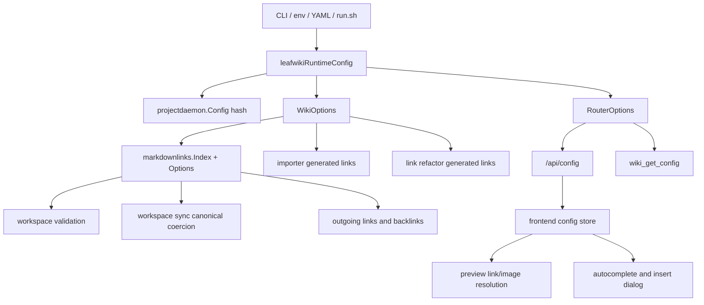
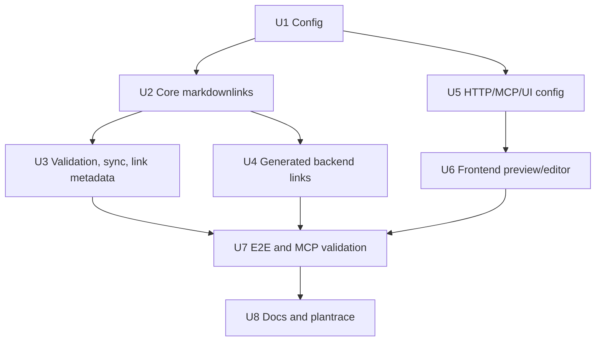

<!-- leafwiki
version: 1
page:
  id: plan-markdown-link-root-prefix
  title: Markdown Link Root Prefix Implementation Plan
  created_at: "2026-06-15T14:30:00Z"
  updated_at: "2026-06-15T14:30:00Z"
  creator_id: codex
  last_author_id: codex
tags:
  - plans
  - implementation
  - links
  - markdown
  - workspace-sync
  - mcp
fields:
  plan: markdown-link-root-prefix
  workflow: planning.aibasic
-->

# Markdown Link Root Prefix Implementation Plan

> **For agentic workers:** REQUIRED SUB-SKILL: Use `superpowers:subagent-driven-development` or `superpowers:executing-plans` to implement this plan task-by-task. Steps use explicit test-first units and must preserve user changes in the working tree.

**Goal:** Add `markdown-link-root-prefix` so LeafWiki can run with `--root-dir .../docs` while resolving and generating GitHub-compatible `/docs/...` Markdown links.

**Architecture:** Thread one normalized prefix from startup config into the shared Markdown link resolver, validation, workspace sync, link indexing, generated-link surfaces, and frontend preview helpers. The resolver strips the prefix before internal route lookup and the formatter adds it when emitting canonical absolute Markdown hrefs; LeafWiki route identity stays unchanged.

**Tech Stack:** Go 1.25.x, LeafWiki workspace sync, LeafWiki markdown validation, LeafWiki markdown link index, native STDIO MCP, project daemon config hashing, React/Vite preview/editor UI, Playwright E2E, shell wrapper tests.

---

## Goal & Context

### Objective

Implement an explicit Markdown link root prefix setting that keeps repository-root
`/docs/...` links valid on GitHub and inside LeafWiki when the wiki root is the
repository's `docs` directory.

### Context

- Source workflow: `docs/plans/planning.aibasic.txt`.
- Discovery artifact: `docs/discovery/markdown-link-root-prefix.md`.
- Observation artifact: `docs/plans/markdown-link-root-prefix.OBSERVE.md`.
- Context artifact: `docs/plans/markdown-link-root-prefix.CONTEXT.md`.
- Decision artifact: `docs/plans/markdown-link-root-prefix.DECISION.md`.
- Dependent plans:
  - `docs/plans/canonical_markdown_links.PLAN.md`
  - `docs/plans/workspace-markdown-route-normalization.PLAN.md`
  - `docs/plans/yaml-config.PLAN.md`
  - `docs/plans/project_daemon.PLAN.md`
- Conversation ID: current Codex desktop thread; no stable `codex://threads/...`
  identifier is available in this prompt.
- Prerequisite: use `rtk` for shell commands in this repository.

### Decisions from Discussion

**Key Decisions:**

1. Add the option `markdown-link-root-prefix`.
   - Reason: it names authored Markdown href behavior and avoids confusing the
     feature with HTTP `base-path`.

2. Configure it through CLI, environment, and YAML.
   - Reason: it must work in native MCP, local app, wrapper, and config-file
     startup flows.

3. Strip the configured prefix before resolving absolute internal Markdown
   hrefs.
   - Reason: `/docs/sync/glossary.md` should resolve to the file
     `sync/glossary.md` under the configured wiki root.

4. Emit the configured prefix for generated absolute Markdown hrefs.
   - Reason: LeafWiki should not slowly rewrite docs away from
     GitHub-compatible repo-root links.

5. Keep HTTP and MCP page path inputs route-oriented.
   - Reason: route APIs should remain clear LeafWiki route APIs; Markdown href
     interpretation belongs to Markdown processors and preview navigation.

6. Include the prefix in daemon identity.
   - Reason: the value changes validation, preview navigation, workspace sync
     coercion, link indexing, and generated-link behavior.

7. Keep this to one explicit prefix, with no auto-detect.
   - Reason: the observed problem is one repo-root path prefix, not a general
     alias system.

**Alternatives Considered:**

- Change `--root-dir` to the repository root: rejected because it changes the
  wiki boundary and scans unrelated Markdown.
- Rewrite authored docs to `/sync/...`: rejected because GitHub repo-root links
  stop working.
- Add broad aliases: rejected for v1 because it expands the routing model.
- Make `/docs/...` a public browser route alias: rejected because route identity
  stays unchanged in this plan.

**Open Questions Resolved:**

- Q: Should `/docs` resolve to wiki root `/`?
  - A: Yes.
- Q: Should `/docs/sync` resolve as a section and `/docs/sync.md` as a page?
  - A: Yes.
- Q: Should relative links be affected?
  - A: No.
- Q: Should external links be affected?
  - A: No.
- Q: Should assets support the prefix?
  - A: Yes.
- Q: Should multiple prefixes or auto-detection be included?
  - A: No.

---

## Summary

This plan adds a startup setting that makes authored Markdown links with a
repository-root prefix resolve inside a wiki rooted at a subdirectory. With:

```yaml
markdown-link-root-prefix: /docs
```

LeafWiki resolves:

```markdown
[Glossary](/docs/sync/glossary.md)
```

as if the internal target were:

```markdown
[Glossary](/sync/glossary.md)
```

The authored and generated canonical form remains `/docs/sync/glossary.md`.

The implementation is intentionally shared rather than patching only validation.
Backend validation, workspace sync, link indexing, importer output, refactor
output, MCP config, HTTP config, and frontend preview/editor helpers must all
use the same normalized prefix value.

---

## Scope Boundaries

### In Scope

- Add `markdown-link-root-prefix` config in CLI, env, YAML, wrapper, usage, and
  docs.
- Normalize and validate the prefix once during startup.
- Store the normalized prefix in runtime config, project daemon config, wiki
  options, router options, MCP config output, and frontend config.
- Add a shared Go Markdown-link option for prefix-aware resolution and canonical
  absolute href formatting.
- Resolve prefixed absolute internal Markdown page, section, and asset links.
- Keep unprefixed absolute internal links resolvable, while canonical output
  uses the configured prefix.
- Keep relative links, external URLs, protocol-relative URLs, `mailto:` links,
  and pure hash links unaffected.
- Update workspace sync canonical coercion to normalize absolute internal links
  to the prefixed form.
- Update link indexing and validation to use the same prefix-aware index.
- Update importer and refactor generated absolute Markdown link output.
- Update frontend preview navigation, asset handling, autocomplete, and insert
  dialog generated links.
- Add plantrace coverage tying plan scenarios to automated test evidence.
- Add focused Go, wrapper, and Playwright coverage.

### Out of Scope / Deferred

- Multiple prefixes.
- Auto-detection from `--root-dir`.
- A general path alias system.
- Changing HTTP `base-path`.
- Changing internal route identity to include the prefix.
- Making every HTTP/MCP page-path input accept repository-root Markdown hrefs.
- Direct browser aliases for `/docs/...` routes.
- Broader static-file support outside existing asset semantics.
- Renaming existing documentation files.

### Intentional Limitations

- The prefix applies only to absolute internal Markdown hrefs and generated
  absolute Markdown hrefs.
- Existing route APIs remain route-path APIs.
- The first version supports one normalized prefix string.
- Unprefixed absolute links continue resolving for compatibility, but when the
  prefix is set they are not the preferred generated form.

---

## Assumptions

- A prefix value of `/docs` is the primary target case.
- A configured empty prefix preserves current behavior.
- Config validation should accept `docs` and normalize it to `/docs`.
- Prefix matching is segment-aware: `/docs/foo.md` matches `/docs`, while
  `/docset/foo.md` does not.
- Prefix stripping happens before asset detection for preview and validation.
- Existing source-file relative link semantics from the canonical Markdown links
  plan remain unchanged.
- Frontend behavior is verified through Playwright because `ui/leafwiki-ui` has
  no test script.

---

## Impact Analysis

### Existing Code Impact

| File | Change | Downstream Impact |
|---|---|---|
| `cmd/leafwiki/main.go` | Add flag, env resolution, YAML key, usage text, runtime field, normalization, daemon config threading | Startup surfaces become consistent |
| `cmd/leafwiki/main_test.go` | Add config, validation, help, YAML, and daemon identity tests | Prevents config drift |
| `scripts/run.sh` | Pass `--markdown-link-root-prefix` through wrapper parsing and dry-run output | MCP wrapper supports the option |
| `scripts/test-run.sh` | Add wrapper assertions | Prevents wrapper regression |
| `.env.example` | Document env var | User-facing config discoverability |
| `internal/projectdaemon/config.go` | Add `MarkdownLinkRootPrefix` | Config hash and mismatch include the setting |
| `internal/wiki/wiki.go` | Add `WikiOptions.MarkdownLinkRootPrefix` and pass it into services | Shared runtime ownership |
| `internal/http/router.go` | Add router option and config output path | Frontend receives the value |
| `internal/wiki/auth/routes.go` | Return `markdownLinkRootPrefix` in `/api/config` | UI can resolve/generate correctly |
| `internal/wiki/mcp/tools_config.go` | Return `markdownLinkRootPrefix` in `wiki_get_config` | Agents can reason about links |
| `internal/wiki/mcp/schema.go` | Update MCP config schema | Tool output remains typed |
| `internal/core/markdownlinks/markdownlinks.go` | Add option-aware index, prefix stripping, and prefixed canonical formatting | Backend link behavior becomes shared |
| `internal/core/markdownvalidation/use_cases.go` | Add options and pass prefix to link index | Validation stops false broken-link reports |
| `internal/workspacesync/service.go` | Add service option and use prefix-aware index during migration | Sync coercion emits `/docs/...` |
| `internal/links/helpers.go` | Build prefix-aware indexes for outgoing/backlink resolution | Link metadata agrees with validation |
| `internal/importer/content_transformer.go` | Prefix generated absolute Markdown output | Imported content follows configured style |
| `internal/links/link_refactor.go` | Prefix absolute generated/refactored Markdown destinations | Refactor output follows configured style |
| `ui/leafwiki-ui/src/lib/api/config.ts` | Add typed config field | UI compile-time config coverage |
| `ui/leafwiki-ui/src/stores/config.ts` | Store config field | Preview/editor helpers can read it |
| `ui/leafwiki-ui/src/lib/wikiPath.ts` | Add prefix-aware helper logic | Frontend route conversion and generation agree |
| `ui/leafwiki-ui/src/features/preview/MarkdownLink.tsx` | Strip prefix before asset detection and route lookup | Preview links work |
| `ui/leafwiki-ui/src/features/preview/MarkdownImage.tsx` | Strip prefix before asset URL resolution | Prefixed images work |
| `ui/leafwiki-ui/src/features/editor/internalLinkCompletion.ts` | Generate prefixed absolute links | Autocomplete output is canonical |
| `ui/leafwiki-ui/src/features/editor/LinkInsertDialog.tsx` | Generate prefixed absolute links | Insert dialog output is canonical |
| `e2e/run.sh` | Add `E2E_MARKDOWN_LINK_ROOT_PREFIX` plumbing that appends `--markdown-link-root-prefix` to local test startup | E2E can start app with the option |
| `internal/plantrace/markdown_link_root_prefix_test.go` | Add scenario-to-test evidence audit | Plan completion stays measurable |
| `docs/README.md`, `docs/mcp.md`, `docs/workspace-sync.md`, `scripts/README.md` | Document config and path semantics | Users and agents understand the boundary |

### Existing Tests Requiring Updates

| File | Change | Downstream Impact |
|---|---|---|
| `cmd/leafwiki/main_test.go` | Config surfaces, validation, help, YAML, daemon identity | Pins startup contract |
| `scripts/test-run.sh` | Wrapper flag parsing and dry-run cases | Pins MCP wrapper contract |
| `internal/core/markdownlinks/markdownlinks_test.go` | Prefix resolution and canonical formatting cases | Pins core semantics |
| `internal/core/markdownvalidation/use_cases_test.go` | Workspace validation with prefixed links and assets | Prevents false broken-link reports |
| `internal/workspacesync/service_test.go` | Canonical migration to `/docs/...`, idempotence, rollback | Pins sync coercion |
| `internal/links/link_service_test.go` | Outgoing/backlink resolution for prefixed links | Pins link metadata |
| `internal/links/link_refactor_test.go` | Refactor output for absolute links under prefix config | Pins refactor formatting |
| `internal/importer/content_transformer_test.go` | Importer output under prefix config | Pins generated import links |
| `internal/http/router_test.go` | `/api/config` output | Pins frontend config |
| `internal/wiki/mcp/mcp_integration_test.go` | `wiki_get_config`, validation, context examples | Pins MCP contract |
| `e2e/tests/page.spec.ts` | Preview click, autocomplete, insert dialog, base-path separation | Pins user-facing behavior |
| `e2e/tests/workspace-sync.spec.ts` | Sync coercion under prefix config | Pins file-change workflow |
| `e2e/tests/root-dir.spec.ts` | Separate root-dir plus prefix scenario | Pins original root mismatch |
| `e2e/tests/mcp-agent-context.spec.ts` | MCP validation/config scenario | Pins MCP use case |
| `internal/plantrace/markdown_link_root_prefix_test.go` | Scenario coverage audit | Pins implementation evidence |

### Module & Target Boundaries

- Startup/config: `cmd/leafwiki`, `scripts`, `.env.example`.
- Runtime ownership: `internal/wiki`, `internal/http`, `internal/projectdaemon`.
- Core behavior: `internal/core/markdownlinks`,
  `internal/core/markdownvalidation`, `internal/workspacesync`,
  `internal/links`, `internal/importer`.
- Agent/API surfaces: `internal/wiki/mcp`, `internal/wiki/auth`.
- Frontend behavior: `ui/leafwiki-ui/src/lib`, `ui/leafwiki-ui/src/features`.
- Verification: Go tests, wrapper shell tests, Playwright E2E, plantrace.

### Access Control

| Type/File | Public API | Internal/Private |
|---|---|---|
| CLI flag | Public startup contract | Parsed in `cmd/leafwiki/main.go` |
| Environment variable | Public startup contract | Resolved into runtime config |
| YAML key | Public startup contract | Strict config-file parser |
| `/api/config` field | Public local HTTP config | Used by UI only |
| `wiki_get_config` field | Public MCP tool output | Used by agents |
| `markdownlinks.Options` | Internal Go contract | Shared resolver behavior |
| Frontend prefix helpers | Internal UI contract | Preview/editor path behavior |

---

## Architecture & Design

### Architecture Non-Goals

- Do not refactor the entire route model.
- Do not introduce persistent aliases.
- Do not alter page slug validation.
- Do not reinterpret existing page lookup API inputs as repository-root paths.

### Required Components

#### Architecture Diagram



#### Module Structure Tree

```markdown
cmd/leafwiki/
  main.go
  main_test.go
internal/core/markdownlinks/
  options.go
  markdownlinks.go
  markdownlinks_test.go
internal/core/markdownvalidation/
  use_cases.go
  use_cases_test.go
internal/workspacesync/
  service.go
  service_test.go
internal/links/
  helpers.go
  link_refactor.go
  link_service_test.go
  link_refactor_test.go
internal/importer/
  content_transformer.go
  content_transformer_test.go
internal/wiki/
  wiki.go
  auth/routes.go
  mcp/tools_config.go
  mcp/schema.go
  mcp/mcp_integration_test.go
internal/http/
  router.go
  router_test.go
ui/leafwiki-ui/src/
  lib/api/config.ts
  stores/config.ts
  lib/wikiPath.ts
  features/preview/MarkdownLink.tsx
  features/preview/MarkdownImage.tsx
  features/editor/internalLinkCompletion.ts
  features/editor/LinkInsertDialog.tsx
e2e/
  run.sh
  tests/page.spec.ts
  tests/workspace-sync.spec.ts
  tests/root-dir.spec.ts
  tests/mcp-agent-context.spec.ts
internal/plantrace/
  markdown_link_root_prefix_test.go
```

#### Dependency Graph



#### Key Design Decisions

1. Normalize the prefix once and pass the normalized value everywhere.
2. Store empty string for disabled behavior.
3. Match the prefix on complete path segments only.
4. Strip prefix before workspace-root escape checks and route lookup.
5. Add prefix only when formatting absolute internal Markdown hrefs.
6. Preserve relative link output style.
7. Preserve external/hash/protocol behavior exactly.
8. Keep browser route paths unprefixed.
9. Treat prefixed assets as existing `/assets/...` destinations after stripping.
10. Report the normalized value through config APIs.

#### Pattern References

- `cmd/leafwiki/main.go`: existing CLI/env/YAML startup pattern.
- `docs/plans/yaml-config.PLAN.md`: strict YAML config behavior.
- `internal/projectdaemon/config.go`: behavior-changing daemon config identity.
- `internal/core/markdownlinks/markdownlinks.go`: shared canonical Markdown link
  resolver and migration formatter.
- `docs/plans/canonical_markdown_links.PLAN.md`: filesystem-shaped `.md` page
  links and section link rules.
- `docs/plans/workspace-markdown-route-normalization.PLAN.md`: route path
  normalization and distinction between filesystem input and route identity.
- `ui/leafwiki-ui/src/lib/wikiPath.ts`: frontend wiki-domain path helpers.

#### Concurrency & Data Isolation

| Component | Isolation | Reason |
|---|---|---|
| Startup config | Process startup only | Normalize once before services are built |
| Markdown link index | Immutable per index build | Safe to share within validation/sync pass |
| Workspace sync migration | Existing sync lock | Must preserve rollback and raw history semantics |
| Frontend config store | Existing client store | Prefix is read-only runtime config |
| Project daemon config | Existing hash/compare flow | Distinguishes daemon owners |

---

## Test Specifications

```gherkin
Feature: Markdown link root prefix

  Scenario: Prefixed absolute page link resolves inside wiki root
    Given the wiki root contains "sync/glossary.md"
    And markdown-link-root-prefix is "/docs"
    When a page links to "/docs/sync/glossary.md"
    Then validation resolves the link as page route "sync/glossary"
    And it is not reported as broken_link

  Scenario: Unprefixed absolute page link still resolves but canonicalizes to the configured prefix
    Given the wiki root contains "sync/glossary.md"
    And markdown-link-root-prefix is "/docs"
    When workspace sync sees "/sync/glossary.md"
    Then it rewrites the destination to "/docs/sync/glossary.md"

  Scenario: Configured prefix root resolves to the wiki root section
    Given markdown-link-root-prefix is "/docs"
    When a page links to "/docs"
    Then the link resolves to the root section route ""
    And the canonical absolute href is "/docs"

  Scenario: Configured prefix distinguishes section and page syntax
    Given the wiki root contains a section "sync" and a page "sync.md"
    And markdown-link-root-prefix is "/docs"
    When a page links to "/docs/sync"
    Then the link resolves as the "sync" section
    When a page links to "/docs/sync.md"
    Then the link resolves as the "sync" page

  Scenario: Relative links ignore the configured prefix
    Given markdown-link-root-prefix is "/docs"
    When "sync/page.md" links to "../glossary.md"
    Then the link resolves relative to "sync/page.md"
    And canonical relative output stays relative

  Scenario: External and hash links ignore the configured prefix
    Given markdown-link-root-prefix is "/docs"
    When content links to "https://example.com/docs/a.md", "//example.com/docs/a.md", "mailto:a@example.com", and "#local"
    Then none of those links are prefix-stripped

  Scenario: Prefixed asset links resolve as workspace assets
    Given markdown-link-root-prefix is "/docs"
    When content references "/docs/assets/logo.png"
    Then validation treats it as the asset destination "/assets/logo.png"
    And preview resolves it through the existing asset URL path

  Scenario: Workspace sync coerces absolute links to the configured prefix
    Given workspace sync is enabled
    And markdown-link-root-prefix is "/docs"
    When a file changes with a link to "/sync/glossary.md"
    Then sync writes back "/docs/sync/glossary.md"
    And a second sync pass creates no new revision

  Scenario: Generated editor links include the configured prefix
    Given the frontend config reports markdownLinkRootPrefix "/docs"
    When autocomplete inserts a page link for route "sync/glossary"
    Then the editor inserts "/docs/sync/glossary.md"

  Scenario: Importer and refactor generated absolute links include the configured prefix
    Given markdown-link-root-prefix is "/docs"
    When importer or link refactor generates an absolute page destination
    Then the destination starts with "/docs/"

  Scenario: CLI env YAML and run wrapper expose the same prefix setting
    Given the value "/docs"
    When LeafWiki starts from CLI, env, YAML, or run wrapper
    Then runtime config stores markdownLinkRootPrefix as "/docs"

  Scenario: Daemon identity changes when markdown link root prefix changes
    Given two otherwise identical daemon configs
    When one has markdown-link-root-prefix "/docs" and one has "/wiki"
    Then the daemon config comparison reports a mismatch

  Scenario: MCP and HTTP config report markdownLinkRootPrefix
    Given markdown-link-root-prefix is "/docs"
    When the UI calls "/api/config"
    And an MCP client calls "wiki_get_config"
    Then both outputs contain markdownLinkRootPrefix "/docs"

  Scenario: LeafWiki preview navigates prefixed Markdown hrefs without changing route identity
    Given markdown-link-root-prefix is "/docs"
    And a rendered page contains "/docs/sync/glossary.md"
    When the user clicks the link in LeafWiki
    Then the app navigates to the LeafWiki page route for "sync/glossary"
    And no route path is stored with a leading "docs/" segment

  Scenario: Base path and markdown link root prefix remain separate
    Given HTTP base-path is "/wiki"
    And markdown-link-root-prefix is "/docs"
    When a rendered page links to "/docs/sync/glossary.md"
    Then the browser route is mounted under "/wiki"
    And the Markdown prefix is stripped before wiki route lookup

  Scenario: Plan scenarios are covered by automated evidence
    Given this implementation plan lists Gherkin scenarios
    When plantrace tests run
    Then each scenario title maps to an automated test evidence string
```

---

## Implementation

### U1. Add Config Surface And Daemon Identity

**Goal:** Make `markdown-link-root-prefix` a first-class startup setting with
the same behavior across CLI, env, YAML, wrapper, runtime config, and daemon
identity.

**Dependencies:** None.

**Files:**

- Modify: `cmd/leafwiki/main.go`
- Modify: `cmd/leafwiki/main_test.go`
- Modify: `internal/projectdaemon/config.go`
- Modify: `scripts/run.sh`
- Modify: `scripts/test-run.sh`
- Modify: `.env.example`

**Approach:**

- Add a `markdownLinkRootPrefix` field to `cliFlags` and
  `leafwikiRuntimeConfig`.
- Register `--markdown-link-root-prefix`.
- Add `LEAFWIKI_MARKDOWN_LINK_ROOT_PREFIX` resolution.
- Add `markdown-link-root-prefix` to strict YAML config allowlist.
- Add the flag to `valueTakingFlagNames`.
- Normalize the value before runtime config is built.
- Add the normalized value to `projectdaemon.Config`.
- Add wrapper value-taking flag support and dry-run output.
- Keep empty string as disabled behavior.

**Execution note:** Start with failing config tests in `cmd/leafwiki/main_test.go`
and wrapper assertions in `scripts/test-run.sh`.

**Test scenarios:**

- CLI flag `--markdown-link-root-prefix /docs` stores `/docs`.
- Env var `LEAFWIKI_MARKDOWN_LINK_ROOT_PREFIX=/docs` stores `/docs`.
- YAML `markdown-link-root-prefix: /docs` stores `/docs`.
- Value `docs` normalizes to `/docs`.
- Value `/docs/` normalizes to `/docs`.
- Invalid `/`, `..`, `/../docs`, `https://example.com/docs`, `/docs?x=1`,
  `/docs#x`, and `docs\\x` values fail startup validation.
- `--config` remains mutually exclusive with other CLI flags.
- Daemon config hash and mismatch include the prefix.
- `run.sh mcp --markdown-link-root-prefix /docs --dry-run` includes the flag
  and redacts no unrelated secrets.

**Verification:**

- Config tests fail before implementation and pass after implementation.
- Wrapper test script covers value-taking and config-mixing behavior.
- Existing config tests remain unchanged except where expected output includes
  the new field.

### U2. Add Prefix-Aware Markdown Link Resolver Options

**Goal:** Teach the shared backend Markdown link resolver to strip the configured
prefix for resolution and add it for canonical absolute output.

**Dependencies:** U1 for the normalization helper shape, but this can begin with
local resolver options.

**Files:**

- Create: `internal/core/markdownlinks/options.go`
- Modify: `internal/core/markdownlinks/markdownlinks.go`
- Modify: `internal/core/markdownlinks/markdownlinks_test.go`

**Approach:**

- Introduce `markdownlinks.Options` with `MarkdownLinkRootPrefix`.
- Add `NewIndexWithOptions` and `NewIndexFromRootWithOptions`.
- Keep `NewIndex` and `NewIndexFromRoot` as current-behavior wrappers.
- Store the normalized prefix on `Index`.
- Strip the prefix only for absolute internal href pathnames before
  `resolveFilesystemPath`.
- Match prefixes on segment boundaries.
- Add the prefix in canonical absolute output when `isAbsolute` is true.
- Preserve query strings, fragments, angle-bracket syntax, and titles through
  existing rewrite machinery.
- Ensure `/docs` canonicalizes to `/docs` for root section, not `/docs/`.

**Execution note:** Write resolver tests before changing the resolver. These
tests should cover direct `Resolve`, `ResolveForMigration`, and
`RewriteMarkdown`.

**Test scenarios:**

- `/docs/sync/glossary.md` resolves to route `sync/glossary`.
- `/sync/glossary.md` resolves and canonical href is
  `/docs/sync/glossary.md`.
- `/docs` and `/docs/` resolve to root section with canonical href `/docs`.
- `/docs/sync` resolves as section and `/docs/sync.md` resolves as page.
- `/docset/sync.md` does not match `/docs`.
- `/docs/assets/logo.png` resolves as an asset destination.
- `../glossary.md` behavior is unchanged.
- `https://example.com/docs/a.md`, `//example.com/docs/a.md`,
  `mailto:a@example.com`, and `#anchor` are unchanged.
- Query and fragment survive migration.
- Malformed percent-encoding still reports invalid link rather than panicking.
- Workspace escape checks still reject escaping links after prefix stripping.

**Verification:**

- `internal/core/markdownlinks` tests prove both compatibility resolution and
  canonical prefixed output.

### U3. Thread Prefix Through Validation, Workspace Sync, And Link Metadata

**Goal:** Ensure all backend readers of authored Markdown use the same
prefix-aware link index.

**Dependencies:** U1, U2.

**Files:**

- Modify: `internal/wiki/wiki.go`
- Modify: `internal/core/markdownvalidation/use_cases.go`
- Modify: `internal/core/markdownvalidation/use_cases_test.go`
- Modify: `internal/workspacesync/service.go`
- Modify: `internal/workspacesync/service_test.go`
- Modify: `internal/links/helpers.go`
- Modify: `internal/links/link_service_test.go`
- Modify: `internal/wiki/mcp/tools_validation.go`
- Modify: `internal/wiki/mcp/mcp_integration_test.go`

**Approach:**

- Add `MarkdownLinkRootPrefix` to validation options and workspace sync service
  options.
- Pass the value from `WikiOptions` into workspace sync, validation, and link
  services.
- Replace direct `markdownlinks.NewIndexFromRoot` calls with the option-aware
  constructor where runtime config is available.
- Keep no-prefix call sites on current constructors where no runtime config is
  available.
- Preserve existing validation issue codes; prefixed links should not become
  `broken_link` when targets exist.
- Allow unprefixed absolute links to resolve, and let canonical migration write
  prefixed output.

**Execution note:** Add tests that demonstrate the original MCP failure mode
before implementation: wiki root contains `sync/glossary.md`, content links to
`/docs/sync/glossary.md`, prefix is `/docs`, and validation must not produce
`broken_link`.

**Test scenarios:**

- Workspace validation passes for `/docs/sync/glossary.md` under root `docs`.
- Workspace validation treats `/sync/glossary.md` as resolvable and
  non-broken.
- Workspace sync rewrites `/sync/glossary.md` to
  `/docs/sync/glossary.md`.
- Workspace sync leaves already-prefixed `/docs/sync/glossary.md` unchanged.
- Workspace sync second pass is idempotent.
- Workspace sync rollback still restores raw content when canonical writeback
  fails.
- Link service outgoing links and backlinks point to route `sync/glossary`, not
  `docs/sync/glossary`.
- MCP validation uses the configured prefix.

**Verification:**

- Validation, sync, and link metadata agree on the same target route.
- Existing canonical Markdown migration rollback tests still pass.

### U4. Update Backend Generated Link Surfaces

**Goal:** Make backend-generated absolute Markdown links emit the configured
prefix.

**Dependencies:** U1, U2.

**Files:**

- Modify: `internal/importer/content_transformer.go`
- Modify: `internal/importer/content_transformer_test.go`
- Modify: `internal/importer/executor_test.go`
- Modify: `internal/links/link_refactor.go`
- Modify: `internal/links/link_refactor_test.go`
- Modify: `internal/links/link_refactor_replace_test.go`

**Approach:**

- Pass `MarkdownLinkRootPrefix` into importer content transformation.
- Keep importer source-link resolution semantics unchanged; only generated
  LeafWiki Markdown output receives the prefix.
- Add a small shared formatter or reuse `markdownlinks` formatting logic so
  importer/refactor do not grow a second prefix implementation.
- Update refactor absolute output so moving or renaming pages emits
  `/docs/...` for absolute internal page links when configured.
- Preserve relative link output for existing relative links.
- Preserve section links as extensionless and page links as `.md`.

**Execution note:** Characterize current importer/refactor output before adding
prefix support, then update output expectations under configured prefix.

**Test scenarios:**

- Importer rewrites an imported page link to `/docs/target.md` when prefix is
  `/docs`.
- Importer leaves unresolved internal links as validation issues without
  inventing prefixed targets.
- Importer asset output remains governed by existing asset rules.
- Refactor rewrites absolute page links to `/docs/new-page.md`.
- Refactor rewrites absolute section links to `/docs/new-section`.
- Refactor preserves relative links as relative.
- Refactor does not rewrite external URLs containing `/docs`.

**Verification:**

- Importer and refactor generated output no longer fights workspace sync
  canonical coercion.

### U5. Expose Prefix Through HTTP, MCP, And Frontend Config

**Goal:** Make the active prefix visible to the UI and agents.

**Dependencies:** U1.

**Files:**

- Modify: `internal/http/router.go`
- Modify: `internal/http/router_test.go`
- Modify: `internal/wiki/auth/routes.go`
- Modify: `internal/wiki/mcp/tools_config.go`
- Modify: `internal/wiki/mcp/schema.go`
- Modify: `internal/wiki/mcp/mcp_integration_test.go`
- Modify: `ui/leafwiki-ui/src/lib/api/config.ts`
- Modify: `ui/leafwiki-ui/src/stores/config.ts`

**Approach:**

- Add `MarkdownLinkRootPrefix` to router options.
- Include `markdownLinkRootPrefix` in `/api/config`.
- Include `markdownLinkRootPrefix` in `wiki_get_config` output and schema.
- Add the TypeScript field to frontend config types and store.
- Keep field naming camelCase in JSON and TypeScript.

**Execution note:** Add HTTP and MCP config tests first. UI type changes should
compile under `npm run build`.

**Test scenarios:**

- `/api/config` returns `markdownLinkRootPrefix: "/docs"`.
- `wiki_get_config` returns `markdownLinkRootPrefix: "/docs"`.
- Disabled config returns an empty string consistently.
- UI TypeScript build accepts the new field.

**Verification:**

- Agents and frontend runtime both see the same normalized value.

### U6. Update Frontend Preview, Assets, Autocomplete, And Insert Dialog

**Goal:** Make the LeafWiki frontend resolve and generate prefixed Markdown
hrefs without changing app route identity.

**Dependencies:** U5.

**Files:**

- Modify: `ui/leafwiki-ui/src/lib/wikiPath.ts`
- Modify: `ui/leafwiki-ui/src/features/preview/MarkdownLink.tsx`
- Modify: `ui/leafwiki-ui/src/features/preview/MarkdownImage.tsx`
- Modify: `ui/leafwiki-ui/src/features/editor/internalLinkCompletion.ts`
- Modify: `ui/leafwiki-ui/src/features/editor/LinkInsertDialog.tsx`
- Modify: `e2e/tests/page.spec.ts`

**Approach:**

- Add a TypeScript helper that strips the configured prefix from absolute
  internal Markdown href pathnames.
- Apply prefix stripping before asset detection in `MarkdownLink` and
  `MarkdownImage`.
- Update `markdownHrefToWikiRoutePath` and `markdownHrefToWikiBrowserPath` so
  `/docs/sync/glossary.md` routes to `sync/glossary`.
- Update `markdownHrefForWikiPath` to add the prefix when generating absolute
  Markdown hrefs.
- Read the prefix from the existing config store.
- Keep `base-path` handling in `routePath.ts` unchanged.

**Execution note:** Use Playwright for frontend behavior because there is no
frontend unit-test script.

**Test scenarios:**

- Preview click on `/docs/sync/glossary.md` opens route
  `/sync/glossary.md`.
- Preview unresolved-state lookup checks `sync/glossary`, not
  `docs/sync/glossary`.
- Preview image `/docs/assets/logo.png` resolves through the existing asset URL
  path.
- Autocomplete inserts `/docs/sync/glossary.md`.
- Insert dialog inserts `/docs/sync/glossary.md`.
- With HTTP base-path `/wiki`, preview route is mounted under `/wiki` while
  Markdown prefix remains `/docs`.

**Verification:**

- User-facing preview and editor behavior matches backend canonicalization.

### U7. Add Focused End-To-End And MCP Coverage

**Goal:** Prove the original MCP/root-dir failure and the UI workflows are fixed
end to end.

**Dependencies:** U1 through U6.

**Files:**

- Modify: `e2e/run.sh`
- Modify: `e2e/tests/root-dir.spec.ts`
- Modify: `e2e/tests/workspace-sync.spec.ts`
- Modify: `e2e/tests/mcp-agent-context.spec.ts`
- Modify: `e2e/tests/page.spec.ts`

**Approach:**

- Add `E2E_MARKDOWN_LINK_ROOT_PREFIX` startup plumbing that passes
  `--markdown-link-root-prefix` to the app under test when the env var is set.
- Add a separate root-dir fixture where the root directory is a temporary
  `docs` folder.
- Put `sync/glossary.md` under that root and content linking to
  `/docs/sync/glossary.md`.
- Assert no broken-link validation issue is returned by MCP validation.
- Assert workspace sync rewrites `/sync/glossary.md` to
  `/docs/sync/glossary.md`.
- Assert preview click navigates to the route page.
- Add one base-path plus markdown-prefix test to prevent conflation.

**Execution note:** Keep E2E scenarios focused and reuse existing test helper
patterns from root-dir, workspace-sync, and MCP agent context specs.

**Test scenarios:**

- Separate root-dir with prefix validates `/docs/...` links.
- MCP `wiki_validate_wiki` reports no `broken_link` for existing prefixed
  targets.
- `wiki_get_context` or `wiki_get_config` exposes prefix enough for agents to
  explain current path semantics.
- Workspace sync coerces legacy unprefixed absolute links.
- Preview navigation works in local browser.
- Base-path and prefix remain independent.

**Verification:**

- The failing class from the original MCP run is represented by an automated
  scenario.

### U8. Update Docs And Add Plantrace

**Goal:** Make the behavior discoverable and pin this plan's scenarios to
automated evidence.

**Dependencies:** U1 through U7.

**Files:**

- Modify: `docs/README.md`
- Modify: `docs/mcp.md`
- Modify: `docs/workspace-sync.md`
- Modify: `scripts/README.md`
- Create: `internal/plantrace/markdown_link_root_prefix_test.go`

**Approach:**

- Document the difference between:
  - HTTP `base-path`
  - LeafWiki route path
  - repository-root Markdown href
  - configured wiki root
- Add examples for `--markdown-link-root-prefix`, env, and YAML.
- Document that route APIs remain route-path APIs.
- Document that generated absolute Markdown links use the prefix when set.
- Add a plantrace test that reads this plan, extracts each `Scenario:` title,
  and verifies mapped automated evidence exists.

**Execution note:** Follow `internal/plantrace/canonical_markdown_links_test.go`
for scenario audit structure.

**Test scenarios:**

- Documentation includes all three config surfaces.
- Documentation states that `base-path` and `markdown-link-root-prefix` are
  separate.
- Plantrace maps every scenario title in this plan to an automated test
  evidence string.

**Verification:**

- Plantrace fails if scenarios are added without corresponding evidence.

---

## Verification

Run focused tests while implementing each unit, then run the broader gates:

```bash
rtk go test ./cmd/leafwiki ./internal/projectdaemon ./internal/core/markdownlinks ./internal/core/markdownvalidation ./internal/workspacesync ./internal/links ./internal/importer ./internal/http ./internal/wiki/mcp ./internal/plantrace
```

```bash
rtk bash scripts/test-run.sh
```

```bash
rtk npm --prefix ui/leafwiki-ui run lint
```

```bash
rtk npm --prefix ui/leafwiki-ui run build
```

```bash
rtk npm --prefix e2e run lint
```

```bash
rtk make test
```

Focused E2E commands should use the existing local runner patterns:

```bash
rtk env E2E_RUN_MODE=local ./e2e/run.sh tests/root-dir.spec.ts --grep "markdown link root prefix"
```

```bash
rtk env E2E_RUN_MODE=local E2E_ENABLE_WORKSPACE_SYNC=1 ./e2e/run.sh tests/workspace-sync.spec.ts --grep "markdown link root prefix"
```

```bash
rtk env E2E_RUN_MODE=local ./e2e/run.sh tests/page.spec.ts --grep "markdown link root prefix"
```

```bash
rtk env E2E_RUN_MODE=local E2E_ENABLE_MCP_LOCAL=1 ./e2e/run.sh tests/mcp-agent-context.spec.ts --grep "markdown link root prefix"
```

If the frontend build output is current and the changed E2E does not require
rebundling, `E2E_SKIP_UI_BUILD=1` may be used in local iteration. Do not use it
for final verification unless the UI assets are known to include the current
change.

---

## Definition of Done

- `--markdown-link-root-prefix`, `LEAFWIKI_MARKDOWN_LINK_ROOT_PREFIX`, and
  `markdown-link-root-prefix` all configure the same normalized runtime value.
- Invalid prefix values fail fast with actionable config errors.
- Project daemon config identity changes when the prefix changes.
- `/api/config` and `wiki_get_config` report `markdownLinkRootPrefix`.
- With prefix `/docs`, `/docs/sync/glossary.md` resolves to route
  `sync/glossary` and is not reported as `broken_link` when the file exists.
- With prefix `/docs`, `/sync/glossary.md` still resolves and workspace sync
  canonical migration rewrites it to `/docs/sync/glossary.md`.
- `/docs`, `/docs/sync`, and `/docs/sync.md` resolve as root section, section,
  and page respectively.
- Relative links, external URLs, protocol-relative URLs, `mailto:` links, and
  pure hash links preserve current behavior.
- `/docs/assets/foo.png` resolves as an asset destination.
- Autocomplete, insert dialog, importer, and refactor generated absolute links
  emit `/docs/...`.
- Preview clicks on `/docs/...` links navigate to unprefixed LeafWiki routes.
- HTTP `base-path` and Markdown link root prefix remain independent.
- All listed focused tests, wrapper tests, UI lint/build, and `rtk make test`
  pass.
- Plantrace proves every Gherkin scenario in this plan maps to automated test
  evidence.
- Documentation explains path vocabulary and the route-API boundary.
