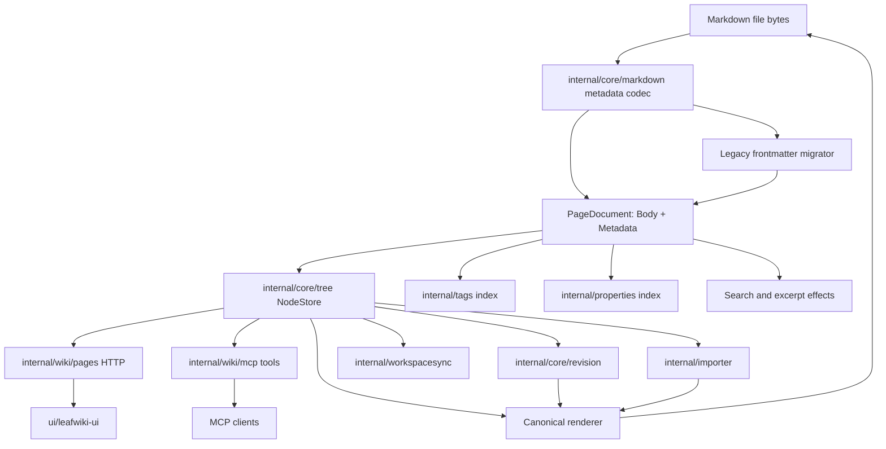
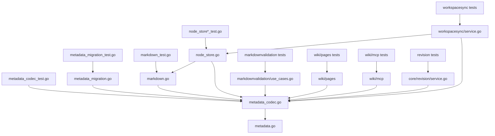
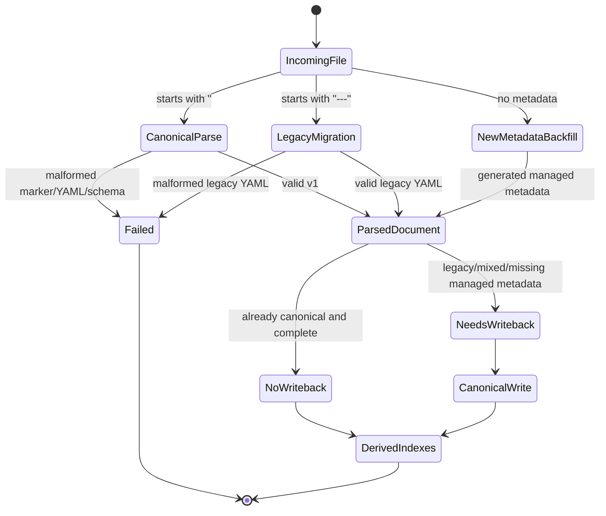

<!-- leafwiki
version: 1
page:
  id: oxh-uIaDR
  title: Page Metadata V1
  created_at: "2026-06-15T05:44:44.857713822Z"
  updated_at: "2026-06-15T05:44:44.857713822Z"
  creator_id: system
  last_author_id: system
fields:
  type: refactor
extra:
  date: 2026-06-13T00:00:00Z
-->


# Page Metadata V1 Implementation Plan

> **Historical note:** This plan predates the federated runtime cleanup. Runtime, MCP compatibility, revision-mode, or workspace-sync flag examples in this artifact are historical and do not describe current startup; current LeafWiki uses `--mcp` and always-on Git-backed workspace sync.

## Goal & Context

### Objective

Implement LeafWiki Page Metadata V1 by separating Markdown body from page metadata internally, migrating legacy YAML frontmatter to strict top-of-file HTML comment metadata, and ensuring all write paths emit only the canonical comment format.

### Context

- Current Codex thread ID: unavailable in this planning runtime.
- Conversation link: unavailable.
- Notion tickets: none provided.
- Bug reports: none provided.
- Dependent plans:
  - `plans/canonical_markdown_links.PLAN.md`
  - `plans/workspace-sync.PLAN.md`
  - `plans/workspace_sync_service.PLAN.md`
  - `plans/mcp-tools.PLAN.md`
  - `plans/llm_wiki_companion_skill.PLAN.md`
- Prerequisites:
  - Existing LeafWiki tests should be runnable locally with `rtk`.
  - Implementation agent must follow repo instruction `@/Users/jakubtomanik/.codex/RTK.md`, meaning shell commands are run through `rtk`.
  - This plan assumes no sidecar metadata work has already landed.

### Decisions from Discussion

**Key Decisions:**

1. Separate Markdown body and metadata in the internal model.
   - Reason: Storage format work should not keep leaking into API, indexing, revision, import, and UI behavior.

2. Use top-of-file HTML comment metadata containing YAML as v1 canonical storage.
   - Reason: It is hidden by GitHub Markdown rendering, keeps one file per page, and is easier than sidecar storage now.

3. Keep legacy frontmatter as migration input only.
   - Reason: Long-term dual-format runtime support would preserve the same ambiguity this refactor is meant to remove.

4. Expand the canonical link migration pattern to metadata.
   - Reason: LeafWiki already decided that old syntax should be canonicalized during ingestion/import/write paths rather than polluting the internal model.

5. Preserve raw incoming file state before automatic migration writeback.
   - Reason: Revision/workspace sync history must show both the user-provided state and the automatic canonicalization.

6. Keep API names stable for now.
   - Reason: The storage change should not force HTTP/MCP/UI consumers to learn a new public API shape.

7. Allow `fields` values to be YAML scalar string/number/bool in storage.
   - Reason: This is a small storage-level extension point for upcoming richer metadata without implementing typed field UI now.

8. Do not add `document` classification/template binding in v1.
   - Reason: Templates and document types are expected soon, but their requirements are not settled.

9. Defer sidecar metadata.
   - Reason: Sidecar files add rename/delete/conflict/revision complexity before the model boundary is proven.

**Alternatives Considered:**

- Keep YAML frontmatter.
  - Rejected because it remains visible in GitHub render and keeps storage/body concepts entangled.

- Move YAML to the end as backmatter.
  - Rejected because it is still renderable content in many tools and creates trailing-content ambiguity.

- Use sidecar files immediately.
  - Deferred because it is cleaner conceptually but much more expensive across sync, Git, rename, delete, import, and revision restore.

- Support frontmatter and comment metadata forever.
  - Rejected because dual canonical formats create inconsistent behavior and test burden.

- Add document/template binding now.
  - Rejected because v1 should leave room for this future work without guessing the schema.

**Open Questions Resolved:**

- Q: Where should canonical metadata live?
  - A: Strict top-of-file HTML comment.

- Q: What is inside the comment?
  - A: YAML with top-level `version`, `page`, `tags`, `fields`, and `extra`.

- Q: What are the exact markers?
  - A: Opening line exactly `<!-- leafwiki`, closing line exactly `-->`.

- Q: What happens to malformed canonical metadata?
  - A: Fail ingestion/validation. No fallback.

- Q: What happens to frontmatter after canonical comment exists?
  - A: Canonical metadata wins; legacy metadata is stripped during migration/writeback.

- Q: What happens to unknown legacy frontmatter?
  - A: Scalar string/number/bool fields move to `fields`; non-scalars move to `extra`.

- Q: Can `leafwiki_*` appear in `fields`?
  - A: No.

- Q: Is body cleanup required?
  - A: Yes. Public Markdown body should be renderable content only.

## Summary

This plan introduces a shared parsed page document model under `internal/core/markdown`, adds a strict canonical comment metadata codec, migrates legacy YAML frontmatter at ingestion/write boundaries, and updates all runtime callers to consume body plus metadata instead of parsing raw frontmatter themselves.

The implementation is intentionally narrow:

- One canonical storage format: top-of-file comment metadata.
- One v1 schema: current managed page metadata, tags, scalar fields, and preservation `extra`.
- Existing public API names remain.
- Typed scalar storage is preserved, but broad typed field editing/querying is deferred.
- Sidecar metadata and document templates are deferred.

## Scope Boundaries

### In Scope

- Add `PageDocument`/`PageMetadata` style internal model in `internal/core/markdown`.
- Add canonical HTML comment YAML parser and renderer.
- Add legacy YAML frontmatter migration into canonical metadata.
- Update Markdown file loading/writing to render canonical comments only.
- Update tree reconstruction and managed metadata writeback.
- Update page create/update/import flows.
- Update tags, properties, search, and excerpt extraction so metadata is not treated as body text.
- Update Markdown validation and MCP validation to use canonical parsing.
- Update workspace sync to capture raw input before migration and migration writebacks afterward.
- Update revision capture/restore to use canonical metadata snapshots.
- Update HTTP and MCP metadata update paths.
- Update importer planning/execution/fixtures to canonicalize legacy frontmatter.
- Update frontend naming/copy where it says "frontmatter" to user-facing "metadata" without changing the broad UX.
- Add focused unit, integration, and E2E coverage.
- Update docs and fixtures that describe page metadata storage.

### Out of Scope / Deferred

- Sidecar metadata files such as `document.yaml`.
- Document type, issue-template-style document classification, or template binding.
- Full typed fields public API.
- Typed fields editor UI.
- Database schema redesign for typed property querying unless existing tests prove a minimal change is required.
- Import/export support for multiple canonical metadata formats.
- A general plugin metadata framework.
- Large UI redesign of metadata panels.
- Backward-compatible write support for YAML frontmatter.

### Intentional Limitations

- Existing `properties` HTTP/MCP/UI behavior remains string-oriented in v1.
- Numeric and boolean `fields` are preserved in canonical storage and internal metadata, but not newly editable/queryable through current `properties` APIs.
- `extra` is only a preservation bucket, not a documented extension API.
- Legacy frontmatter migration happens only on ingestion/import/save/sync paths, not on arbitrary read-only page access.
- Malformed canonical metadata blocks are hard failures even if a valid legacy frontmatter block also exists.

## Assumptions

- The canonical schema is:

```yaml
version: 1
page:
  id: string
  title: string
  created_at: timestamp string
  updated_at: timestamp string
  creator_id: string
  last_author_id: string
tags:
  - string
fields:
  key: string | number | bool
extra:
  any: preserved YAML value
```

- Timestamps should continue using the existing project timestamp conventions.
- Canonical renderer emits LF newlines; parser accepts LF and CRLF input.
- Renderer emits one blank line between closing marker and body when body exists.
- Empty `tags`, `fields`, and `extra` may be omitted or rendered as empty maps/lists only if tests pin deterministic behavior. Prefer omitting empty optional sections unless existing style strongly favors explicit empties.
- The existing public page DTO can continue exposing `RawContent` until callers are migrated, but new runtime logic should treat raw content as storage-layer bytes.
- Existing `properties` maps remain `map[string]string` at public boundaries.
- Existing string properties are backed by canonical `fields` entries whose values are strings.
- Numeric/bool `fields` survive body/tag/string-property edits without being stringified.
- Legacy unknown `null` values are preserved under `extra`, not promoted to `fields`.
- Legacy unknown keys colliding with canonical top-level names are preserved under `extra` rather than promoted.

## Impact Analysis

### Existing Code Impact

| File | Change | Downstream Impact |
|---|---|---|
| `internal/core/markdown/frontmatter.go` | Keep as legacy migrator or replace with canonical metadata codec entry points | All current frontmatter callers must move to new parsing API |
| `internal/core/markdown/markdown.go` | Change `MarkdownFile` to store body plus canonical metadata | File writes emit HTML comment metadata instead of YAML frontmatter |
| `internal/core/tree/node_store.go` | Rework reconstruction, metadata writeback, create/update, and import paths | Page identity migration must happen before ID generation |
| `internal/core/tree/tree_service.go` | Clarify `FromImport` semantics around raw input canonicalization | Import/update behavior no longer preserves YAML frontmatter |
| `internal/core/tree/page.go` | Reduce runtime reliance on `RawContent`; add or use parsed metadata | API/index/revision callers stop parsing storage bytes directly |
| `internal/wiki/pages/metadata.go` | Extract tags/properties from canonical metadata | Page responses stay stable while storage changes |
| `internal/wiki/pages/routes.go` | Build/update canonical metadata instead of YAML frontmatter | HTTP saves no longer reintroduce frontmatter |
| `internal/wiki/pages/partial_edit.go` | Patch canonical metadata fields/tags | String property behavior remains stable |
| `internal/wiki/mcp/tools_pages.go` | Update MCP page write path to canonicalize metadata | MCP writes use canonical storage |
| `internal/wiki/mcp/tools_partial_edit.go` | Patch canonical metadata instead of frontmatter | MCP metadata-only edits preserve body and typed fields |
| `internal/wiki/mcp/tools_validation.go` | Validate canonical metadata and legacy migration input | Validation aligns with ingestion |
| `internal/tags/tags_service.go` | Parse tags from canonical metadata | Tag index handles migrated files |
| `internal/properties/properties_service.go` | Parse string fields from canonical metadata | Existing property index remains string-oriented |
| `internal/wiki/pagesave/search_effect.go` | Ensure search indexes body only | Metadata comment does not leak into search |
| `internal/core/excerpt/excerpt.go` | Strip canonical metadata before excerpting | Excerpts start from Markdown body |
| `internal/core/markdownvalidation/use_cases.go` | Replace frontmatter validation with metadata validation/migration checks | Malformed canonical comments fail deterministically |
| `internal/workspacesync/service.go` | Capture raw input, migrate metadata, capture writeback | Sync/revision history records automatic canonicalization |
| `internal/core/revision/service.go` | Replace extra-frontmatter enrichment/restore with canonical metadata snapshots | Historical restore emits canonical comments |
| `internal/importer/planner.go` | Read titles/metadata through new parser | Import planning handles legacy and canonical inputs |
| `internal/importer/executor.go` | Emit canonical metadata after migration | Imported files do not keep YAML frontmatter |
| `internal/importer/content_transformer.go` | Transform body separately from metadata | Metadata fields are not accidentally rewritten as Markdown content |
| `ui/leafwiki-ui/src/features/editor/frontmatter.ts` | Rename concepts or adapt to metadata model | Avoid user-facing frontmatter language |
| `ui/leafwiki-ui/src/features/editor/components/PageFrontmatterPanel.tsx` | Copy and behavior cleanup | UI continues editing tags/string properties |

### Existing Tests Requiring Updates

| File | Change | Downstream Impact |
|---|---|---|
| `internal/core/markdown/frontmatter_test.go` | Convert or supplement with canonical codec and legacy migration tests | Defines strict parser/renderer behavior |
| `internal/core/markdown/markdown_test.go` | Update serialized file assertions | Writes now use comment metadata |
| `internal/core/tree/node_store_test.go` | Update create/update/preserve tests | NodeStore writes canonical comments |
| `internal/core/tree/node_store_reconstruct_test.go` | Add legacy migration and malformed canonical cases | Reconstruction preserves IDs before backfill |
| `internal/core/markdownvalidation/use_cases_test.go` | Replace frontmatter validation cases | Validation follows v1 rules |
| `internal/tags/tags_service_test.go` | Move fixtures to canonical comments | Tag extraction reads new metadata |
| `internal/properties/properties_service_test.go` | Move fixtures to canonical comments and preserve typed scalar tests | String properties remain queryable; number/bool preserved elsewhere |
| `internal/wiki/pages/*_test.go` | Update page metadata enrichment and update tests | HTTP behavior stable, storage different |
| `internal/wiki/mcp/*_test.go` | Update safe edit and page write tests | MCP metadata writes remain body-safe |
| `internal/wiki/pagesave/*_test.go` | Update side-effect raw content expectations | Search/excerpt/indexing ignore metadata comments |
| `internal/core/excerpt/excerpt_test.go` | Update excerpt fixtures and leakage assertions | Excerpts start from Markdown body, not metadata comments or metadata values |
| `internal/core/revision/*_test.go` | Update capture/restore expectations | Restores produce canonical metadata |
| `internal/workspacesync/*_test.go` | Add migration writeback and idempotence coverage | Sync does not lose identity |
| `internal/importer/*_test.go` | Update fixtures and output assertions | Importer canonicalizes frontmatter |
| `internal/http/router_test.go` | Update serialized page/update expectations | HTTP route stores canonical metadata |
| `e2e/tests/page.spec.ts` | Assert UI metadata behavior and file output when relevant | Page saves hide metadata in rendered body |
| `e2e/tests/importer.spec.ts` | Assert imported metadata canonicalization | Import no longer preserves YAML frontmatter |
| `e2e/tests/workspace-sync.spec.ts` | Assert raw capture plus migration writeback | Sync migration is observable and idempotent |
| `e2e/tests/mcp-safe-edits.spec.ts` | Assert MCP metadata updates use canonical storage | MCP safe edits stay body-safe |
| `e2e/tests/history.spec.ts` | Assert restore uses canonical metadata | Revision history remains coherent |
| `e2e/tests/editor.spec.ts` | Assert editor body excludes storage metadata | Editable body remains public Markdown only |

### Module & Target Boundaries

| Area | Boundary |
|---|---|
| `internal/core/markdown` | Owns parsing, rendering, migration, and storage document model |
| `internal/core/tree` | Owns filesystem reconstruction and page writeback using parsed documents |
| `internal/wiki/pages` | Owns HTTP page behavior and public metadata enrichment |
| `internal/wiki/mcp` | Owns MCP-facing tools and schemas; must not parse storage metadata ad hoc |
| `internal/tags` and `internal/properties` | Own derived indexes; consume shared metadata parser |
| `internal/core/revision` | Owns revision snapshots and restore rendering |
| `internal/workspacesync` | Owns raw capture, migration writeback capture, and sync status |
| `internal/importer` | Owns import-time legacy input canonicalization |
| `ui/leafwiki-ui` | Owns existing metadata editing UI and user-facing copy |

### Access Control

| Type/File | Public API | Internal/Private |
|---|---|---|
| `internal/core/markdown.PageMetadata` | No external HTTP/MCP exposure | Internal canonical metadata model |
| `internal/core/markdown.PageDocument` | No external HTTP/MCP exposure | Internal body plus metadata model |
| `internal/core/markdown.ParsePageDocument` | Internal package API used across backend | Parser/migrator entry point |
| `internal/core/markdown.RenderPageDocument` | Internal package API used by writes/restores | Canonical renderer |
| `internal/http/dto/page.go` | Existing page DTO names stay stable | DTO maps internal metadata to public shape |
| `internal/wiki/mcp/schema.go` | Existing MCP names stay stable | Schema maps internal metadata to public shape |
| `ui/leafwiki-ui/src/lib/api/pages.ts` | Existing API type remains string-property oriented | Frontend storage details remain hidden |

## Architecture & Design

### Architecture Non-Goals

- Do not create sidecar metadata storage.
- Do not add a document/template metadata section.
- Do not implement typed-field filtering/query UI.
- Do not make every package support both legacy and canonical formats.
- Do not rewrite unrelated page save, revision, or workspace sync architecture beyond what canonical metadata requires.

### Required Components

#### Architecture Diagram



#### Module Structure Tree

Proposed file organization. Exact filenames can change if an existing local pattern is stronger, but keep the ownership boundaries.

```markdown
internal/core/markdown/
+-- frontmatter.go                 # legacy frontmatter structs/helpers retained only for migration
+-- frontmatter_test.go            # legacy migration tests or deprecated helper tests
+-- metadata.go                    # PageMetadata, PageDocument, FieldValue
+-- metadata_codec.go              # canonical comment parser/renderer
+-- metadata_codec_test.go         # canonical parser/renderer tests
+-- metadata_migration.go          # legacy frontmatter -> v1 metadata migration
+-- metadata_migration_test.go     # legacy/mixed-state migration tests
+-- markdown.go                    # MarkdownFile updated to use PageDocument
+-- markdown_test.go               # file load/write round-trip tests

internal/core/tree/
+-- node_store.go                  # reconstruction/writeback uses PageDocument
+-- node_store_test.go
+-- node_store_reconstruct_test.go

internal/wiki/pages/
+-- metadata.go                    # API metadata extraction from PageMetadata
+-- partial_edit.go                # metadata patching on canonical model
+-- routes.go                      # update/create paths render canonical metadata

internal/wiki/mcp/
+-- tools_pages.go                 # page write tools use canonical model
+-- tools_partial_edit.go          # metadata patch tool uses canonical model
+-- tools_validation.go            # validation uses canonical parser

internal/workspacesync/
+-- service.go                     # raw capture and migration writeback sequencing

internal/core/revision/
+-- service.go                     # canonical metadata snapshots and restore

internal/importer/
+-- planner.go                     # title/metadata detection through parser
+-- executor.go                    # canonical output
+-- content_transformer.go         # transform body separately
```

#### Dependency Graph



#### Key Design Decisions

1. `internal/core/markdown` owns all storage metadata parsing, rendering, and migration.
2. Canonical metadata is strict and versioned.
3. Legacy frontmatter helpers stay only as migration internals or test fixtures.
4. `PageDocument.Body` is the renderable Markdown body.
5. `PageDocument.Metadata` is canonical application metadata.
6. `PageDocument.RawContent` should not be necessary for normal domain logic. If kept for transport/history, document it as storage bytes.
7. All write paths call the canonical renderer.
8. All read/reconstruct/import/sync paths call the parser/migrator before using metadata.
9. Public `properties` remains string-oriented in v1.
10. Typed scalar `fields` are preserved in storage even when not visible through current UI/API.

#### Pattern References

- `internal/core/markdown/frontmatter.go`
  - Current deterministic YAML rendering and unknown field preservation pattern.

- `internal/core/markdown/markdown.go`
  - Current `MarkdownFile` body plus metadata shape. Use it as the starting seam, not as the final API if names become misleading.

- `internal/core/tree/node_store.go`
  - Current reconstruction/writeback behavior. This is the highest-risk area.

- `internal/wiki/mcp/tools_partial_edit.go`
  - Current metadata-only patch behavior and version/body preservation expectations.

- `plans/canonical_markdown_links.PLAN.md`
  - Migration-input-only precedent and sync writeback semantics.

- `plans/workspace-sync.PLAN.md`
  - Raw capture before automatic writebacks.

- `plans/mcp-tools.PLAN.md`
  - Safe edit and version precondition expectations.

#### Concurrency & Data Isolation

| Component | Isolation | Reason |
|---|---|---|
| Metadata parser/renderer | Pure functions with no shared mutable state | Easier deterministic tests and safe reuse |
| NodeStore reconstruction | Existing store locking/transaction model | Must avoid races while migrating identity metadata |
| Workspace sync migration writeback | Existing sync batch boundaries | Raw capture and writeback capture must remain ordered |
| Revision capture/restore | Existing revision service ownership | Avoid split-brain between storage bytes and revision metadata |
| HTTP/MCP metadata edits | Existing version precondition checks | Prevent stale metadata patch overwrites |

#### State Machine Documentation



## Test Specifications

**Key Principle:** Write the failing tests before implementation code. Each Gherkin scenario below must map to at least one automated test, or the implementation PR must explicitly justify why it was removed.

### Test Non-Goals

- No broad typed-fields UI test suite in this phase.
- No sidecar storage tests.
- No document-template/type tests.
- No performance benchmark suite.
- No GitHub-render screenshot test; the storage assertion is enough because HTML comments are not rendered as Markdown content.

### Test Types Required

| Included | Type | When Required | Scope |
|---|---|---|---|
| Yes | Unit Tests | Always | Parser, renderer, migration, metadata patching, extraction |
| Yes | Integration Tests | Required | Tree reconstruction, page save, validation, revision, workspace sync, importer, HTTP/MCP |
| Yes | E2E Tests | Required for critical flows | UI page save, importer, workspace sync, MCP safe metadata edits, revision restore |

### Gherkin Test Scenarios

#### Unit Test Scenarios

##### Happy Path Scenarios

```gherkin
Given a Markdown file starts with a valid LeafWiki metadata comment
When the canonical metadata parser reads the file
Then it returns a PageDocument with Body containing only the Markdown body
And it returns PageMetadata populated from the YAML comment
And it reports that no migration writeback is required
```

```gherkin
Given a PageDocument has metadata and Markdown body
When the canonical renderer serializes it
Then the output starts with "<!-- leafwiki"
And the output contains "version: 1"
And the output closes the metadata block with a line containing only "-->"
And the Markdown body starts after exactly one blank line
```

```gherkin
Given legacy YAML frontmatter contains leafwiki managed fields, tags, and string properties
When the migration parser reads the file
Then managed fields are mapped into metadata.page
And tags are mapped into metadata.tags
And string properties are mapped into metadata.fields
And the returned body excludes the legacy frontmatter
And the result requires canonical writeback
```

```gherkin
Given legacy YAML frontmatter contains number and boolean scalar fields
When the migration parser reads the file
Then those fields are preserved as typed scalar metadata.fields values
And they are not converted to strings
```

##### Error Scenarios

```gherkin
Given a Markdown file starts with "<!-- leafwiki"
And the YAML inside the metadata comment is malformed
When the canonical metadata parser reads the file
Then parsing fails
And the parser does not fallback to legacy frontmatter parsing
```

```gherkin
Given a Markdown file has a LeafWiki metadata-looking comment with an indented opening marker, extra opening text, or a non-standalone closing marker
When the canonical metadata parser reads the file
Then parsing fails with a canonical marker error
And the parser does not treat the content as legacy frontmatter
```

```gherkin
Given legacy frontmatter has malformed YAML
When the migration parser reads the file
Then parsing fails with a migration error
And no replacement page ID is generated
```

```gherkin
Given canonical metadata has version 2
When the v1 parser reads the file
Then parsing fails with an unsupported version error
```

```gherkin
Given canonical metadata contains an unsupported top-level key
When the parser validates metadata
Then parsing fails with a schema validation error
And no PageDocument is returned
```

```gherkin
Given canonical metadata.fields contains a list or map value
When the parser validates metadata
Then parsing fails with a schema validation error
And no PageDocument is returned
```

```gherkin
Given canonical fields contains a key starting with "leafwiki_"
When the parser validates metadata
Then parsing fails with a reserved field error
```

##### Edge Case Scenarios

```gherkin
Given a Markdown file starts with canonical metadata
And the body immediately starts with valid legacy YAML frontmatter
When the migration parser reads the file
Then canonical metadata wins
And the legacy frontmatter block is removed from the body on writeback
And the result requires canonical writeback
```

```gherkin
Given legacy frontmatter contains an unknown list field
When the migration parser reads the file
Then the list is preserved under metadata.extra
And it is not promoted to metadata.fields
```

```gherkin
Given legacy frontmatter contains an unknown map field
When the migration parser reads the file
Then the map is preserved under metadata.extra
```

```gherkin
Given legacy frontmatter contains an unknown null field
When the migration parser reads the file
Then the null value is preserved under metadata.extra
And it is not promoted to metadata.fields
```

```gherkin
Given legacy frontmatter contains unknown keys named "version", "page", "fields", and "extra"
When the migration parser reads the file
Then those values are preserved under metadata.extra
And they are not interpreted as canonical metadata sections
And the result requires canonical writeback
```

```gherkin
Given Markdown body starts with a horizontal rule but no metadata block
When the parser reads the file
Then the horizontal rule remains part of the body unless it forms a valid legacy frontmatter block at the top of incoming storage
```

##### Corner Case Scenarios

```gherkin
Given canonical metadata uses CRLF line endings
When the parser reads the file
Then it accepts the metadata block
And the renderer normalizes output to LF
```

```gherkin
Given canonical metadata is valid and the body is empty
When the renderer serializes the document
Then it does not append extra trailing body whitespace beyond the deterministic canonical format
```

```gherkin
Given a rendered canonical document is parsed and rendered again
When the second render completes
Then the output bytes are identical to the first render
```

##### Implementation Notes

- Prefer table-driven tests for parser cases.
- Assert exact serialized strings for canonical output.
- Keep legacy frontmatter tests only around migration behavior.
- Add explicit tests proving no runtime path writes YAML `---` frontmatter.
- Use `t.TempDir()` for file round-trip tests.

##### Test Target Locations

- `internal/core/markdown/metadata_codec_test.go`
- `internal/core/markdown/metadata_migration_test.go`
- `internal/core/markdown/markdown_test.go`
- Existing `internal/core/markdown/frontmatter_test.go` only for legacy migrator support if retained.

#### Integration Tests Scenarios

##### Happy Path Scenarios

```gherkin
Given a root directory contains a legacy frontmatter Markdown file with a leafwiki_id
When NodeStore reconstructs the tree
Then the page keeps the same ID
And the stored file is written back with canonical comment metadata
And the body content is unchanged
```

```gherkin
Given a page is updated through the HTTP API with body, tags, and string properties
When the update succeeds
Then the stored Markdown file contains canonical comment metadata
And it does not contain YAML frontmatter
And the API response still exposes tags and properties with existing names
```

```gherkin
Given a stored page file starts with canonical LeafWiki metadata
When a client reads the page through GET /api/pages/:id and GET /api/pages/by-path
Then the response content contains only the Markdown body
And the response content does not contain "<!-- leafwiki"
And the response still exposes tags and string properties with existing response names
```

```gherkin
Given a page is stored with canonical LeafWiki metadata
When an MCP client calls wiki_get_page and wiki_get_page_by_path
Then the returned page content is only the Markdown body
And it does not contain canonical metadata markers
And tags and string properties are still returned through the existing MCP page fields
```

```gherkin
Given a page has number and boolean fields in canonical metadata
When the body is updated through the existing HTTP API
Then number and boolean fields remain typed in stored metadata
And existing string properties remain visible through the properties API
```

```gherkin
Given a page is indexed with body text, tags, and string properties
When a metadata-only save changes tags and string properties without changing the body
Then tag queries reflect the new tags
And property queries reflect the new string properties
And old tag/property index entries are removed
And search results for body text are still available
And metadata-only values are not indexed as body text
```

```gherkin
Given an imported package contains legacy frontmatter
When the importer writes pages into LeafWiki
Then imported pages are stored with canonical metadata comments
And unknown non-scalar legacy metadata is preserved under extra
```

```gherkin
Given workspace sync sees a legacy frontmatter file from disk
When sync runs
Then the raw incoming file state is captured first
And the canonical metadata migration writeback is captured afterward
And the next sync run is a no-op for metadata formatting
```

##### Error Scenarios

```gherkin
Given a root directory contains a malformed canonical metadata comment
When reconstruction or workspace sync runs
Then the operation fails or reports validation failure according to the existing sync error path
And derived indexes are not rebuilt from partial metadata
```

```gherkin
Given two files contain the same canonical page ID
When Markdown validation runs
Then duplicate ID validation fails deterministically
```

```gherkin
Given one Markdown file has canonical metadata with page.id "same-id"
And another Markdown file has legacy frontmatter with leafwiki_id "same-id"
When Markdown validation runs
Then duplicate ID validation fails deterministically
And the validation message identifies both conflicting files
```

```gherkin
Given an MCP metadata patch uses a stale version
When the patch is applied
Then the operation fails before mutation
And stored metadata remains unchanged
```

```gherkin
Given workspace sync sees a file with malformed legacy YAML frontmatter
When sync runs
Then the raw incoming file state is captured
And metadata migration fails without generating a replacement page ID
And no canonical writeback is committed for that file
And derived indexes are not rebuilt from the malformed metadata
```

##### Edge Case Scenarios

```gherkin
Given a file contains canonical metadata followed by legacy frontmatter
When reconstruction runs
Then canonical metadata is used for identity
And the legacy block is removed on writeback
```

```gherkin
Given a root directory contains a Markdown file with no metadata block
When NodeStore reconstructs the tree
Then the page receives generated canonical metadata
And the stored file starts with a LeafWiki metadata comment
And the original Markdown body is unchanged
```

```gherkin
Given a client updates a page through the normal HTTP page update API
And the submitted Markdown body starts with a literal "<!-- leafwiki" comment
When the update succeeds
Then the literal comment remains in the page body returned by the API
And existing stored page metadata is preserved
And the storage file still has exactly one canonical metadata block before the body
```

```gherkin
Given a page has canonical metadata with string properties, typed scalar fields, and extra metadata
When a metadata-only HTTP or MCP patch changes tags and one string property
Then the body remains unchanged
And untouched typed scalar fields remain typed in storage
And untouched extra metadata remains present in storage
And only string properties are exposed through the public properties field
```

```gherkin
Given a page has canonical metadata containing a unique token in tags, fields, and extra
And the Markdown body does not contain that token
When page-save side effects rebuild search and excerpts
Then searching for the metadata-only token does not return the page as a body-text match
And generated excerpts do not contain the metadata-only token
And searching for body text still returns the page
```

```gherkin
Given a revision created before this migration contains YAML frontmatter
When that revision is restored
Then the restored file is written with canonical comment metadata
And body content matches the historical body
```

```gherkin
Given an imported Markdown file has legacy frontmatter with leafwiki_id and user-defined scalar and non-scalar metadata
When the importer writes the page into LeafWiki
Then the stored page uses a new LeafWiki page ID
And user-defined scalar metadata is preserved in fields
And user-defined non-scalar metadata is preserved in extra
And no legacy frontmatter remains
```

```gherkin
Given link rewriting runs during import
When imported content contains canonical metadata
Then Markdown link rewriting applies to the body
And metadata values are not rewritten as Markdown body content
```

##### Corner Case Scenarios

```gherkin
Given metadata migration writeback fails after raw sync capture
When workspace sync reports the result
Then the failure is surfaced
And the system does not silently rebuild indexes from an unmigrated partial state
```

```gherkin
Given a page has an empty tag list and no string properties
When it is saved
Then the canonical metadata render remains deterministic
And no YAML frontmatter is emitted
```

```gherkin
Given a page has canonical metadata with tags, fields, and extra
When only metadata changes and revision capture runs
Then a new revision is recorded
When that revision is restored later
Then the restored file uses canonical comment metadata
And the historical metadata values are restored
And the current page identity and route path remain valid
```

##### Implementation Notes

- Reuse existing NodeStore/root-dir/workspace sync test helpers where possible.
- Pin exact file bytes for migration output.
- For workspace sync, assert both revision ordering and idempotence.
- For HTTP/MCP, assert body preservation separately from metadata mutation.

##### Test Target Locations

- `internal/core/tree/node_store_test.go`
- `internal/core/tree/node_store_reconstruct_test.go`
- `internal/core/markdownvalidation/use_cases_test.go`
- `internal/wiki/pages/*_test.go`
- `internal/wiki/mcp/*_test.go`
- `internal/tags/tags_service_test.go`
- `internal/properties/properties_service_test.go`
- `internal/wiki/pagesave/*_test.go`
- `internal/core/excerpt/excerpt_test.go`
- `internal/core/revision/*_test.go`
- `internal/wiki/revisions/*_test.go`
- `internal/workspacesync/*_test.go`
- `internal/importer/*_test.go`
- `internal/http/router_test.go`

#### E2E Tests Scenarios

##### Happy Path Scenarios

```gherkin
Given a user edits a page in the UI
When the page is saved with tags and string properties
Then the rendered page shows only Markdown body content
And the saved file uses canonical comment metadata
And the page still shows the expected tags and properties in LeafWiki
```

```gherkin
Given a user imports Markdown files with legacy frontmatter
When the import completes
Then the imported pages render without visible frontmatter
And their stored files use canonical metadata comments
And tags/properties from legacy metadata are preserved
```

```gherkin
Given a user imports a Markdown file with legacy frontmatter
When the import completes and the imported page is opened
Then the viewer renders only the Markdown body
And GET /api/pages/by-path returns content without legacy frontmatter or canonical metadata comments
And the editor body contains only the Markdown body
And the metadata panel still shows imported tags and string properties
```

```gherkin
Given an MCP client calls wiki_update_page_metadata
When it patches tags and string properties
Then the page body remains unchanged
And the stored file uses canonical metadata comments
```

##### Error Scenarios

```gherkin
Given a workspace file contains malformed canonical metadata
When workspace sync runs
Then LeafWiki surfaces a validation/sync problem
And it does not silently overwrite the file with generated metadata
```

##### Edge Case Scenarios

```gherkin
Given a workspace file still uses legacy frontmatter
When workspace sync runs twice
Then the first run migrates the file
And the second run has no metadata-format writeback
```

##### Corner Case Scenarios

```gherkin
Given a page is restored from history
When the historical revision came from YAML frontmatter storage
Then the restored current file is canonical comment metadata
And the restored body is the historical Markdown body
```

##### Implementation Notes

- Prefer existing E2E helpers and fixtures.
- Only assert raw file bytes in E2E where root-dir/workspace sync already exposes file storage.
- Do not add flaky UI timing assertions around hidden comments.

##### Test Target Locations

- `e2e/tests/page.spec.ts`
- `e2e/tests/importer.spec.ts`
- `e2e/tests/tags.spec.ts`
- `e2e/tests/workspace-sync.spec.ts`
- `e2e/tests/mcp-safe-edits.spec.ts`
- `e2e/tests/history.spec.ts`
- `e2e/tests/editor.spec.ts`

## Implementation

### Implementation Non-Goals

- Do not implement sidecar metadata.
- Do not add document template/type metadata.
- Do not expose a new typed fields API.
- Do not keep YAML frontmatter as a runtime write format.
- Do not refactor unrelated page editor UX.
- Do not rewrite workspace sync beyond the required migration ordering and writeback capture.
- Do not silently recover from malformed canonical metadata.

### Implementation Steps

#### U1 - Add Canonical Metadata Model and Codec

Files:

- `internal/core/markdown/metadata.go`
- `internal/core/markdown/metadata_codec.go`
- `internal/core/markdown/metadata_codec_test.go`

Tasks:

- Define `PageDocument` with body and metadata.
- Define `PageMetadata` with `Version`, `Page`, `Tags`, `Fields`, and `Extra`.
- Define `FieldValue` or equivalent typed scalar representation for string/number/bool.
- Implement strict canonical comment detection.
- Implement YAML parse/render using `gopkg.in/yaml.v3`.
- Implement schema validation:
  - version must be `1`.
  - `page.id` rules match existing page ID expectations.
  - `fields` values must be string/number/bool.
  - `fields` keys must not start with `leafwiki_`.
  - unsupported top-level keys fail for canonical metadata unless intentionally captured in `extra`.
- Implement deterministic rendering.
- Add unit tests from the unit Gherkin scenarios.

Done when:

- Parser/renderer tests fail before implementation and pass after.
- Round-trip rendering is byte-stable.
- Malformed canonical comments never fallback to legacy parsing.

#### U2 - Add Legacy Frontmatter Migration

Files:

- `internal/core/markdown/frontmatter.go`
- `internal/core/markdown/metadata_migration.go`
- `internal/core/markdown/metadata_migration_test.go`

Tasks:

- Keep current frontmatter parsing available only as migration plumbing.
- Implement migration from legacy frontmatter to `PageMetadata`.
- Map managed fields:
  - `leafwiki_id` -> `page.id`
  - `leafwiki_title` -> `page.title`
  - `title` -> `page.title` only when managed title is absent
  - `leafwiki_created_at` -> `page.created_at`
  - `leafwiki_updated_at` -> `page.updated_at`
  - `leafwiki_creator_id` -> `page.creator_id`
  - `leafwiki_last_author_id` -> `page.last_author_id`
- Map `tags` list to metadata tags.
- Map unknown string/number/bool values to `fields`.
- Map unknown list/map/null values to `extra`.
- Preserve legacy key collisions under `extra`.
- Implement mixed canonical-plus-legacy cleanup.
- Return parse metadata indicating whether canonical writeback is required.

Done when:

- Legacy migration tests cover scalar, non-scalar, managed fields, mixed state, and malformed YAML.
- No migration path generates replacement IDs before reading legacy metadata.

#### U3 - Update MarkdownFile and Core File Round Trips

Files:

- `internal/core/markdown/markdown.go`
- `internal/core/markdown/markdown_test.go`

Tasks:

- Replace `MarkdownFile` internals with `PageDocument` or wrap the new model without leaking frontmatter semantics.
- Update `LoadMarkdownFile`, `NewMarkdownFileFromRaw`, `WriteToFile`, and metadata setters to use canonical parse/render.
- Rename or deprecate frontmatter-named helpers if they become misleading.
- Keep narrow compatibility shims only where needed to reduce blast radius, but make them call the new model.
- Ensure write paths emit canonical comments only.

Done when:

- File load/write tests assert canonical output.
- Existing tests that expected YAML frontmatter are updated to canonical metadata.
- Any remaining frontmatter-named API is either migration-only or a temporary shim with tests.

#### U4 - Update Tree Reconstruction and Page Writes

Files:

- `internal/core/tree/node_store.go`
- `internal/core/tree/tree_service.go`
- `internal/core/tree/page.go`
- `internal/core/tree/page_node.go`
- `internal/core/tree/node_store_test.go`
- `internal/core/tree/node_store_reconstruct_test.go`

Tasks:

- Use the new parser during reconstruction before generating missing managed metadata.
- Preserve legacy IDs/titles/timestamps during migration.
- Replace `metadataFromFrontmatter` with metadata extraction from `PageMetadata`.
- Replace `writeReconstructedFrontmatter` with canonical metadata writeback.
- Replace `syncManagedFrontmatter` with canonical metadata synchronization.
- Update `CreatePage`, `UpsertContent`, and `UpsertContentPreservingFrontmatter`.
- Rename `UpsertContentPreservingFrontmatter` if practical, or change it to "accept raw Markdown and canonicalize metadata".
- Preserve the behavior where normal user-authored leading `---` text in plain body updates is not accidentally interpreted as metadata unless the update path explicitly accepts raw/imported Markdown.
- Keep `RawContent` as storage-layer output only where needed.

Done when:

- Reconstruction preserves legacy page IDs.
- Create/update writes canonical metadata.
- Mixed state strips legacy frontmatter.
- Malformed canonical metadata blocks fail.
- Plain body updates do not accidentally create frontmatter metadata.

#### U5 - Update Derived Metadata Consumers

Files:

- `internal/wiki/pages/metadata.go`
- `internal/tags/tags_service.go`
- `internal/properties/properties_service.go`
- `internal/wiki/pagesave/tags_effect.go`
- `internal/wiki/pagesave/properties_effect.go`
- `internal/wiki/pagesave/search_effect.go`
- `internal/core/excerpt/excerpt.go`
- Related tests under those packages.

Tasks:

- Extract tags from `PageMetadata.Tags`.
- Extract string properties from `PageMetadata.Fields` values that are strings.
- Preserve number/bool fields in storage without exposing them as current string properties.
- Ensure search and excerpt generation use `PageDocument.Body`.
- Ensure metadata comments are not included in search text.
- Update page response enrichment to use shared parser.

Done when:

- Tags and string properties work for canonical metadata.
- Search/excerpts never include metadata comments.
- Numeric/bool fields survive unrelated saves but are not forced into string property output.

#### U6 - Update Validation

Files:

- `internal/core/markdownvalidation/use_cases.go`
- `internal/wiki/mcp/tools_validation.go`
- `internal/core/markdownvalidation/use_cases_test.go`
- `internal/wiki/mcp/*validation*_test.go`

Tasks:

- Validate canonical metadata with the shared parser.
- Treat malformed canonical comments as hard errors.
- Treat legacy frontmatter as migration input in ingestion/sync paths, not as valid canonical storage after writeback.
- Preserve duplicate ID detection across canonical and legacy input.
- Update reserved-key validation for v1 schema.
- Update validation output text to reference metadata, not frontmatter, where user-facing.

Done when:

- Validation tests cover malformed canonical metadata, duplicate canonical IDs, legacy migration input, and reserved `fields` names.

#### U7 - Update HTTP and MCP Write Paths

Files:

- `internal/wiki/pages/routes.go`
- `internal/wiki/pages/partial_edit.go`
- `internal/wiki/mcp/tools_pages.go`
- `internal/wiki/mcp/tools_partial_edit.go`
- `internal/wiki/mcp/schema.go`
- `internal/http/dto/page.go`
- `internal/wiki/pages/*_test.go`
- `internal/wiki/mcp/*_test.go`
- `internal/http/router_test.go`

Tasks:

- Replace `BuildMarkdownWithExtraFrontmatter` and other frontmatter builders with canonical metadata updates.
- Keep `tags` and `properties` API names stable.
- Ensure metadata updates preserve body content.
- Ensure string property patches update string-valued `fields`.
- Ensure tags patches update metadata tags.
- Ensure body-only updates preserve existing metadata, including number/bool fields and `extra`.
- Keep version precondition behavior.
- Update MCP schemas only if descriptions mention frontmatter.

Done when:

- HTTP/MCP tests assert canonical storage output.
- Metadata-only patches do not change body.
- Stale version tests fail before mutation.

#### U8 - Update Importer

Files:

- `internal/importer/planner.go`
- `internal/importer/executor.go`
- `internal/importer/content_transformer.go`
- `internal/wiki/import_adapter.go`
- `internal/importer/*_test.go`
- `internal/importer/fixtures/**`

Tasks:

- Parse imported Markdown through the migration-capable parser.
- Use legacy metadata for title/tags/fields while canonicalizing output.
- Drop source managed IDs when importer semantics require new page identity, but preserve non-managed metadata.
- Move scalar unknowns to `fields` and non-scalars to `extra`.
- Apply link/content transformations to body, not metadata YAML.
- Update importer fixtures to expected canonical output.

Done when:

- Importer tests prove legacy frontmatter packages import as canonical metadata.
- Body link rewrites do not touch metadata values accidentally.

#### U9 - Update Workspace Sync and Revision Semantics

Files:

- `internal/workspacesync/service.go`
- `internal/core/revision/service.go`
- `internal/wiki/revisions/*`
- `internal/workspacesync/*_test.go`
- `internal/core/revision/*_test.go`
- `internal/wiki/revisions/*_test.go`

Tasks:

- In workspace sync, capture raw incoming files before metadata migration.
- Run reconstruction/migration after raw capture.
- Capture canonical metadata writebacks as automatic sync/revision history.
- Ensure second sync is idempotent.
- Ensure writeback failures are surfaced and do not produce partial derived indexes.
- Replace extra-frontmatter revision enrichment with canonical metadata snapshot behavior.
- Restore historical frontmatter revisions by parsing/migrating then rendering canonical metadata.

Done when:

- Sync tests assert raw capture before migration writeback.
- Revision tests assert canonical restore from both canonical and legacy historical content.
- No path writes YAML frontmatter during restore.

#### U10 - Update Frontend Naming and Existing Metadata UI

Files:

- `ui/leafwiki-ui/src/lib/api/pages.ts`
- `ui/leafwiki-ui/src/features/editor/frontmatter.ts`
- `ui/leafwiki-ui/src/features/editor/stores/pageEditorStore.ts`
- `ui/leafwiki-ui/src/features/editor/components/PageFrontmatterPanel.tsx`
- Related frontend tests if present.

Tasks:

- Keep API type names stable unless backend DTO changes require narrow updates.
- Replace user-facing "frontmatter" wording with "metadata".
- Keep tags and text properties editing behavior.
- Avoid introducing typed fields editing in this phase.
- Ensure frontend does not build visible YAML frontmatter for page saves.

Done when:

- UI still edits tags and string properties.
- User-facing copy no longer implies YAML frontmatter is canonical storage.

#### U11 - Clean Up Legacy Runtime Assumptions and Docs

Files:

- `plans/*` only if references are actively used by current docs; do not churn old plans unnecessarily.
- `README.md`
- `docs/**` if metadata storage is documented there.
- `internal/plantrace/*` if plan trace coverage is maintained for this project area.
- Any remaining production files found by `rtk rg "ParseFrontmatter|BuildMarkdownWithFrontmatter|BuildMarkdownWithExtraFrontmatter|ExtraFrontmatter|frontmatter" internal ui`.

Tasks:

- Search for remaining frontmatter runtime assumptions.
- Keep frontmatter references only for legacy migration, old fixtures, historical plans, or tests explicitly covering migration.
- Update docs describing page metadata storage.
- Add plan trace coverage if the repo pattern expects it for major plans.

Done when:

- Production runtime code no longer writes YAML frontmatter.
- Remaining frontmatter references are justified by migration/tests/docs.

## Verification

Run focused tests first:

```bash
rtk go test ./internal/core/markdown
rtk go test ./internal/core/tree
rtk go test ./internal/core/markdownvalidation
rtk go test ./internal/tags ./internal/properties
rtk go test ./internal/wiki/pages ./internal/wiki/mcp
rtk go test ./internal/importer
rtk go test ./internal/core/revision ./internal/wiki/revisions
rtk go test ./internal/workspacesync
rtk go test ./internal/http
```

Run the broader backend suite:

```bash
rtk make test
```

Run frontend checks if UI files changed:

```bash
rtk npm --prefix ui/leafwiki-ui run format:check
rtk npm --prefix ui/leafwiki-ui run lint
rtk npm --prefix ui/leafwiki-ui run build
```

The UI package currently has no `test` script; use the E2E checks below for browser coverage.

Run targeted E2E checks:

```bash
rtk env E2E_RUN_MODE=local ./e2e/run.sh e2e/tests/page.spec.ts
rtk env E2E_RUN_MODE=local ./e2e/run.sh e2e/tests/importer.spec.ts
rtk env E2E_RUN_MODE=local ./e2e/run.sh e2e/tests/mcp-safe-edits.spec.ts
rtk env E2E_RUN_MODE=local E2E_ENABLE_WORKSPACE_SYNC=1 ./e2e/run.sh e2e/tests/workspace-sync.spec.ts
rtk env E2E_RUN_MODE=local ./e2e/run.sh e2e/tests/history.spec.ts
```

Manual inspection commands:

```bash
rtk rg -n "^---$|leafwiki_id|leafwiki_title|BuildMarkdownWithFrontmatter|BuildMarkdownWithExtraFrontmatter|ParseFrontmatter|ExtraFrontmatter" internal ui
rtk rg -n "<!-- leafwiki" data internal/importer/fixtures e2e
```

Expected manual inspection result:

- Runtime frontmatter parser/builder usage exists only inside legacy migration code or tests.
- New/updated fixtures use `<!-- leafwiki` metadata comments.
- No write path emits top-of-file YAML frontmatter.

## Definition Of Done

- The repo has an explicit internal body-plus-metadata model for Markdown pages.
- Canonical page metadata storage is strict top-of-file HTML comment YAML with exact opening line `<!-- leafwiki` and closing line `-->`.
- Every production write path for LeafWiki-managed Markdown pages emits canonical comment metadata, not YAML frontmatter.
- Legacy YAML frontmatter is accepted only as migration input during ingestion/import/save/sync paths and is removed on canonical writeback.
- Malformed canonical metadata fails ingestion/validation with no fallback.
- Malformed legacy frontmatter fails migration without generating replacement page identity.
- Existing managed metadata, tags, and string properties migrate correctly.
- Unknown legacy scalar string/number/bool fields migrate to `fields`.
- Unknown legacy non-scalar or null fields migrate to `extra`.
- Numeric and boolean `fields` remain typed in storage and survive unrelated body/tag/string-property edits.
- Existing public HTTP/MCP/UI `tags` and string `properties` behavior remains compatible.
- Search, excerpts, rendered page body, and body returned to user-facing APIs do not include metadata comments.
- Workspace sync captures raw incoming files before automatic metadata migration and captures canonical migration writeback afterward.
- Revision restore writes canonical comment metadata even for historical YAML-frontmatter revisions.
- Importer writes canonical metadata for imported Markdown and does not rewrite metadata values while transforming body links.
- All Gherkin scenarios in this plan are mapped to automated tests, or the PR explicitly documents why a scenario was removed.
- The focused Go test packages listed in Verification pass.
- `rtk make test` passes, or any failure is unrelated, reproducible before the change, and documented with evidence.
- Targeted E2E tests for page save, importer, MCP safe edits, workspace sync, and history pass, or environment-gated failures are documented with exact command output.
- A final search confirms production runtime code no longer writes YAML frontmatter except inside legacy migration/test-only paths.
