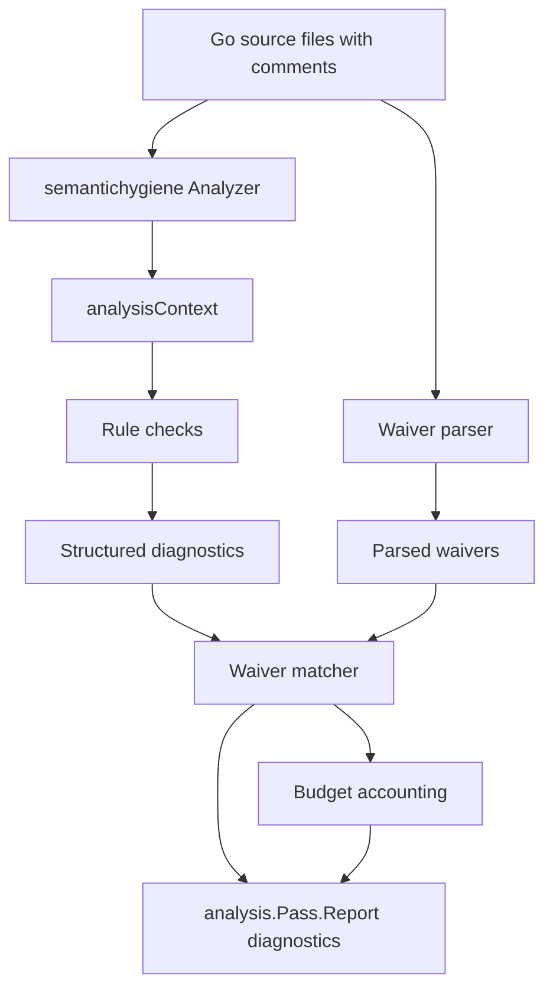
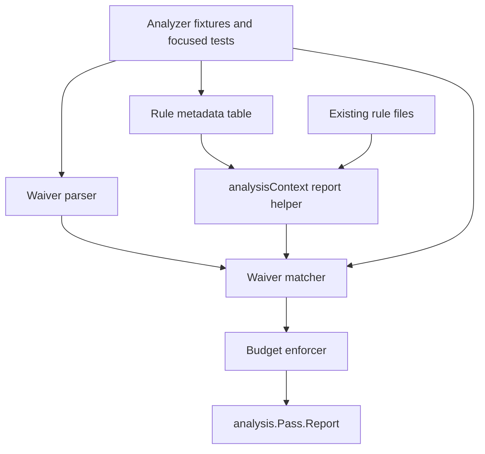

<!-- leafwiki
version: 1
page:
  id: semantic-hygiene-waivable-diagnostics-plan-20260701
  title: Semantic Hygiene Waivable Diagnostics Implementation Plan
  created_at: "2026-07-01T00:00:00Z"
  updated_at: "2026-07-01T00:00:00Z"
  creator_id: system
  last_author_id: system
tags:
  - plans
fields:
  type: refactor
-->

# Semantic Hygiene Waivable Diagnostics Implementation Plan

## Goal & Context

### Objective

Add budgeted, rule-specific inline waivers to LeafWiki's semantic hygiene checker so judgment-heavy BDD/readability diagnostics can have accountable exceptions while semantic leaks and dangerous test patterns remain hard failures.

### Context

- Workflow: `docs/plans/planning.aibasic.txt`.
- Current thread: `019f1c68-23fd-7bf3-8825-53ecb49465f3`.
- Current thread link: `codex://threads/019f1c68-23fd-7bf3-8825-53ecb49465f3`.
- Source thread: `019f1527-f284-7ed3-8b91-072d53850114`.
- Source thread link: `codex://threads/019f1527-f284-7ed3-8b91-072d53850114`.
- Parent checker plan: `docs/plans/semantic-hygiene-checker.PLAN.md`.
- Policy doc: `docs/typed-ids.md`.
- Observation artifact: `docs/plans/semantic-hygiene-waivable-diagnostics.OBSERVE.md`.
- Context artifact: `docs/plans/semantic-hygiene-waivable-diagnostics.CONTEXT.md`.
- Decision artifact: `docs/plans/semantic-hygiene-waivable-diagnostics.DECISION.md`.
- Workflow state: `docs/plans/semantic-hygiene-waivable-diagnostics.planning.aibasic.json`.
- Implementation commands should be prefixed with `rtk`.

Prerequisites:

- The current semantic hygiene checker exists under `internal/analysis/semantichygiene`.
- `scripts/check-semantic-hygiene.sh` remains the authoritative reviewer command.
- Existing unrelated `go.mod` and `go.sum` worktree edits must not be reverted or folded into this implementation.

### Decisions from Discussion

**Key Decisions:**

1. Add waivable diagnostics, not ordinary warnings.
   - Reason: non-failing warnings are ignored by agents and do not preserve the checker as a gate.

2. Keep semantic leaks and dangerous test behavior as hard errors.
   - Reason: raw semantic primitives, raw prose, weak error-string assertions, unsafe async assertions, and committed focused/pending specs are the core failures this checker exists to prevent.

3. Use inline rule-specific waivers with required explanations.
   - Reason: justification belongs beside the exceptional code and should be reviewed with that code.

4. Use stable dotted rule IDs.
   - Reason: diagnostic text should become more helpful without breaking waivers.

5. Keep v1 budgets in analyzer Go code.
   - Reason: budget policy is reviewer-owned checker policy and does not need an external config language yet.
   - Budget accounting is package-local in v1 because the current
     `singlechecker` runner creates analyzer state per package; repo-wide
     aggregation is deferred.

6. Fail on unknown, malformed, stale, non-waivable, duplicate, and over-budget waivers.
   - Reason: the waiver mechanism must stay accountable and should not become a broad suppression channel.

7. Add waiver infrastructure before adding new BDD/readability rules.
   - Reason: new judgment-heavy rules need the exception model before they can be enforced humanely.

8. Use rule metadata to decide waiver scope.
   - Reason: expression, statement, call, and declaration diagnostics need different local scopes without file-wide suppression.

**Alternatives Considered:**

- Advisory warnings.
  - Rejected because they do not affect the gate.

- Output parsing after `go vet`.
  - Rejected because waiver validation needs AST comments, positions, rule metadata, and stale-waiver accounting.

- External waiver budget config.
  - Rejected for v1 because Go policy tables are simpler, compiled, testable, and reviewer-owned.

- File-wide waivers.
  - Rejected because they recreate broad allowlists.

- Diagnostic-text-based waivers.
  - Rejected because message wording should be free to improve.

**Open Questions Resolved:**

- Q: Should v1 support declaration-scoped waivers?
  - A: Yes. Rule metadata should allow declaration scope for function/type/helper diagnostics and next-node scope for statement/expression diagnostics.

### Summary

This plan introduces a structured diagnostic layer in the existing Go analyzer, parses inline `semh:allow` comments, matches valid waivers against waivable diagnostics, fails invalid waiver states, enforces waiver budgets, and documents the policy. It then adds `ginkgo.top-level-it` as the first new waivable BDD-readability rule to prove the mechanism against a real judgment-heavy diagnostic.

The correction pass also makes the Ginkgo checker see ordinary repo packages, adds hard migrated-test-residue rules for behavior names and `testing.T` usage inside specs, and adds a conservative `ginkgolinter` gate for portable Ginkgo/Gomega mechanics. Existing migrated-test residue surfaced by these rules is follow-up remediation scope; this checker-extension slice must report the counts, not hide the diagnostics or rewrite the real suite.

## Scope Boundaries

**In Scope:**

- Structured rule metadata and rule IDs in `internal/analysis/semantichygiene`.
- A central reporting helper used by all checker rules.
- Inline waiver parsing for `// semh:allow <rule-id> -- <explanation>`.
- Waiver scope matching for next-node, call, and declaration diagnostics.
- Invalid-waiver diagnostics and stale-waiver detection.
- Total and per-rule budget enforcement in Go policy code.
- Analyzer fixture tests and focused unit tests for waiver behavior.
- Conversion of existing rule callsites from direct `Reportf` to structured reports.
- A new `ginkgo.top-level-it` waivable rule.
- Hard `ginkgo.test-name` and `ginkgo.testing-t-in-spec` rules for migrated-test residue.
- A dedicated `ginkgolinter` golangci-lint gate for generic mechanics.
- Documentation in `docs/typed-ids.md`.

**Out of Scope / Deferred:**

- Advisory warnings.
- External config files for budgets.
- Package-wide, file-wide, or directory-wide waivers.
- Frontend ESLint waiver support.
- Auto-fixes.
- Baseline files for existing diagnostics.
- BDD readability rules beyond the accepted current set, including `ginkgo.long-it`,
  `ginkgo.multiple-behaviours`, and `ginkgo.vague-container-name`.
- Product/test cleanup outside analyzer fixtures.

**Intentional Limitations:**

- V1 allows one rule ID per waiver comment.
- V1 allows one waiver to suppress one diagnostic.
- V1 does not attempt whole-file comment association.
- V1 does not print suppressed diagnostics as warnings.

## Assumptions

- `analysis.Pass.Report` can be delayed safely until the analyzer run has collected diagnostics and comments for the current package.
- Package-local waiver accounting is enough because the checker runs over packages and CI only needs aggregate pass/fail.
- Budget diagnostics may be emitted on waiver comment positions rather than through a separate summary-only output channel.
- Existing `analysistest` fixtures can validate rule IDs through diagnostic message prefixes.
- The implementation can keep `cmd/leafwiki-vet` on `singlechecker.Main`; if finalization needs a custom driver, that decision must be documented before changing the runner shape.

## Impact Analysis

### Existing Code Impact

| File | Change | Downstream Impact |
|---|---|---|
| `internal/analysis/semantichygiene/analyzer.go` | Add analyzer finalization around structured diagnostics and waiver validation | All rule files report through the new context helper |
| `internal/analysis/semantichygiene/diagnostics.go` | Add rule IDs and metadata-aware diagnostic constructors | Existing fixture `// want` strings must include or match rule IDs |
| `internal/analysis/semantichygiene/policy.go` | Add waiver policy, budgets, scope helpers, and rule metadata tables | Reviewer-owned policy surface grows |
| `internal/analysis/semantichygiene/rules_*.go` | Replace direct `ctx.pass.Reportf` calls with structured reporting | Behavior should stay equivalent except for rule ID prefixes and waiver suppression |
| `internal/analysis/semantichygiene/testdata/...` | Add waiver fixtures and update expected diagnostics | Analyzer tests prove hard and waivable behavior |
| `docs/typed-ids.md` | Document waiver policy | Reviewers and implementers get the source of truth |

### Existing Tests Requiring Updates

| File | Change | Downstream Impact |
|---|---|---|
| `internal/analysis/semantichygiene/analyzer_test.go` | Continue running fixture packages | Fixture expectations change where diagnostic messages gain rule IDs |
| `internal/analysis/semantichygiene/rule_edges_gomega_test.go` | Add focused tests for parser, matcher, budgets, and reporting helper | Gives fast feedback without full fixture packages |
| `internal/analysis/semantichygiene/policy_test.go` | Add rule metadata and budget policy coverage | Prevents unknown or non-waivable rules entering policy accidentally |
| `cmd/leafwiki-vet/main_test.go` | Usually no change | Only update if implementation replaces `singlechecker.Main` |

### Module & Target Boundaries

The implementation stays inside the Go semantic checker, analyzer fixtures, docs,
and lint/CI configuration for the dedicated `ginkgolinter` gate.

It must not modify runtime packages, frontend code, or product tests except
analyzer testdata. Existing real-suite diagnostics from newly hardened rules
must be captured as follow-up cleanup work rather than hidden behind rollout
gates, package allowlists, broad suppressions, or mass rewrites in this slice.

### Access Control

| Type/File | Public API | Internal/Private |
|---|---|---|
| `scripts/check-semantic-hygiene.sh` | Reviewer command | Calls internal checker |
| `cmd/leafwiki-vet` | Repo-local CLI | Thin driver for internal analyzer |
| `internal/analysis/semantichygiene` | No public runtime API | Reviewer-owned policy and analyzer implementation |
| `docs/typed-ids.md` | Team policy doc | Documents internal review contract |

## Architecture & Design

### Architecture Non-Goals

- Do not make the semantic hygiene analyzer a generic linter framework.
- Do not add a separate suppression language.
- Do not make the analyzer configurable by arbitrary packages.
- Do not move semantic policy out of Go code in this slice.
- Generic Ginkgo/Gomega mechanics may be delegated to a conservative
  `ginkgolinter` golangci-lint gate; LeafWiki-specific semantic policy remains
  in `internal/analysis/semantichygiene`.

### Required Components

#### Architecture Diagram



#### Module Structure Tree

```markdown
internal/analysis/semantichygiene/
├── analyzer.go
├── diagnostics.go
├── policy.go
├── rules_cast.go
├── rules_dependency.go
├── rules_ginkgo.go
├── rules_gomega.go
├── rules_literal.go
├── rules_message.go
├── rules_signature.go
├── rules_string.go
├── analyzer_test.go
├── policy_test.go
├── rule_edges_gomega_test.go
└── testdata/src/github.com/perber/wiki/internal/analysis/semantichygiene/testdata/
    └── repotests/repo_test.go
```

#### Dependency Graph



### Key Design Decisions

1. Diagnostics become structured inside the analyzer.
   - A diagnostic carries rule ID, position, message, and waiver eligibility derived from rule metadata.

2. Reporting is delayed until the analyzer can match waivers.
   - Rule files call `ctx.report(...)`.
   - The analyzer finalization step decides whether to suppress, report, or report waiver validation failures.

3. Rule IDs are typed constants.
   - This avoids string drift and makes unknown rule IDs a testable policy failure.

4. Waiver parser reads comments from the AST.
   - This gives line positions and avoids parsing formatted checker output.

5. Waiver matching is local and deterministic.
   - The same source should produce the same result independent of package load order.

6. Budgets are policy data.
   - The budget table lives beside rule metadata and is covered by policy tests.

### Pattern References

- `internal/analysis/semantichygiene/analyzer.go` - central AST traversal and analyzer setup.
- `internal/analysis/semantichygiene/policy.go` - current policy tables and helper predicates.
- `internal/analysis/semantichygiene/diagnostics.go` - current diagnostic message constructors.
- `internal/analysis/semantichygiene/rules_ginkgo.go` - current Ginkgo safety and quality checks.
- `internal/analysis/semantichygiene/rules_gomega.go` - current Gomega semantic matcher checks.
- `internal/analysis/semantichygiene/rule_edges_gomega_test.go` - focused helper-test harness.
- `internal/analysis/semantichygiene/testdata/src/github.com/perber/wiki/internal/analysis/semantichygiene/testdata/repotests/repo_test.go` - analyzer fixture style.

## Test Specifications

**Key Principle:** write analyzer tests before implementation code for every rule and waiver behavior.

### Test Non-Goals

- No runtime product tests.
- No frontend tests.
- No browser tests.
- No tests that depend on current repo-wide diagnostic counts.

### Test Types Required

| Included | Type | Scope |
|---|---|---|
| Yes | Unit tests | Parser, metadata, matching, budgets, and helper functions |
| Yes | Analyzer fixture tests | End-to-end analyzer behavior through `analysistest` |
| Yes | Script smoke check | Existing semantic hygiene script after implementation |
| No | E2E tests | No user-facing runtime behavior changes |

### Gherkin Test Scenarios

#### Unit Test Scenarios

Happy path scenarios:

```gherkin
Given a waiver comment with a known waivable rule ID and explanation
When the waiver parser reads the file comments
Then it records the rule ID, explanation, position, and unused state
```

```gherkin
Given a waivable diagnostic on the next matching node
And a waiver for the same rule ID immediately before that node
When diagnostics are finalized
Then the diagnostic is suppressed
And the waiver counts toward the package-local total and per-rule budgets
```

Error scenarios:

```gherkin
Given a waiver comment with an unknown rule ID
When diagnostics are finalized
Then the checker reports `waiver.unknown-rule`
```

```gherkin
Given a waiver comment for a non-waivable rule
When diagnostics are finalized
Then the checker reports `waiver.non-waivable-rule`
And the original hard diagnostic is not suppressed
```

```gherkin
Given a waiver comment without explanation text after `--`
When diagnostics are finalized
Then the checker reports `waiver.missing-explanation`
```

```gherkin
Given a valid waiver that matches no diagnostic
When diagnostics are finalized
Then the checker reports `waiver.stale`
```

Edge case scenarios:

```gherkin
Given two diagnostics with the same rule ID near one waiver
When diagnostics are finalized
Then the waiver suppresses only one diagnostic
And the second diagnostic still reports
```

```gherkin
Given more active waivers than the total budget
When diagnostics are finalized
Then the checker reports `waiver.budget-exceeded`
```

```gherkin
Given more active waivers for one rule than that rule's budget
When diagnostics are finalized
Then the checker reports `waiver.budget-exceeded` for that rule
```

Corner case scenarios:

```gherkin
Given a valid waiver for a declaration-scoped rule
When the diagnostic is emitted on the declaration name
Then the waiver suppresses the declaration diagnostic
```

```gherkin
Given a valid waiver for an expression-scoped rule
When a diagnostic is emitted on an unrelated later expression
Then the waiver does not suppress the later diagnostic
```

Implementation notes:

- Use the existing `ruleHarness` style for focused tests where possible.
- Use `analysistest` fixtures for source-comment and stale-waiver behavior because comment positions are part of the contract.
- Fixture diagnostics should match stable rule IDs rather than full prose when possible.

Test target locations:

- `internal/analysis/semantichygiene/rule_edges_gomega_test.go`
- `internal/analysis/semantichygiene/policy_test.go`
- `internal/analysis/semantichygiene/analyzer_test.go`
- `internal/analysis/semantichygiene/testdata/src/github.com/perber/wiki/internal/analysis/semantichygiene/testdata/repotests/repo_test.go`

#### Integration Test Scenarios

Happy path scenarios:

```gherkin
Given a fixture file containing a waivable `ginkgo.top-level-it` diagnostic
And a valid `semh:allow ginkgo.top-level-it` comment with explanation
When the analyzer runs through `analysistest`
Then the fixture package passes without the `ginkgo.top-level-it` diagnostic
```

Error scenarios:

```gherkin
Given a fixture file containing a valid waiver for a hard semantic leak
When the analyzer runs through `analysistest`
Then the hard semantic diagnostic still reports
And the non-waivable waiver diagnostic reports
```

Edge case scenarios:

```gherkin
Given a fixture package with active waivers within budget
When the semantic hygiene script runs
Then it exits successfully
```

Corner case scenarios:

```gherkin
Given a fixture package with an unused waiver after the offending code is removed
When the analyzer runs
Then the stale waiver diagnostic reports at the waiver comment
```

Implementation notes:

- Keep integration fixture cases small and grouped by waiver behavior.
- Do not add broad repo fixtures that require unrelated production cleanup.

Test target locations:

- `internal/analysis/semantichygiene/testdata/src/github.com/perber/wiki/internal/analysis/semantichygiene/testdata/repotests/repo_test.go`
- `scripts/check-semantic-hygiene.sh`

#### E2E Test Scenarios

Happy path scenarios:

- None. This plan changes a static analyzer, not runtime behavior.

Error scenarios:

- None. Analyzer fixture tests cover failure behavior more directly than E2E tests.

Edge case scenarios:

- None.

Corner case scenarios:

- None.

Implementation notes:

- Do not add E2E coverage for waiver behavior.

Test target locations:

- None.

## Implementation

### Implementation Non-Goals

- Do not refactor runtime code.
- Do not add frontend waiver support.
- Do not add a baseline.
- Do not broaden existing semantic allowlists.
- Do not create package-wide suppressions.
- Do not use `ginkgolinter` ignore comments as an alternate suppression model;
  raw `ginkgo-linter:ignore-*` comments are hard semantic-hygiene failures.

### U1 - Add Rule Metadata And Structured Diagnostic Types

Goal: Introduce stable rule IDs and a structured diagnostic type without changing analyzer behavior.

Files:

- Modify: `internal/analysis/semantichygiene/diagnostics.go`
- Modify: `internal/analysis/semantichygiene/policy.go`
- Modify: `internal/analysis/semantichygiene/policy_test.go`

Approach:

- Define a typed `ruleID`.
- Add rule metadata with message prefix, waiver eligibility, and scope kind.
- Add metadata for every existing rule family before changing report callsites.
- Add waiver subsystem rule IDs such as `waiver.unknown-rule` and `waiver.stale`.
- Preserve current diagnostic text as the human-readable message.

Execution note: start with policy tests that prove every registered rule has metadata and no waivable rule is missing a per-rule budget decision.

Test scenarios:

- Known hard rule metadata returns non-waivable.
- Known waivable rule metadata returns waivable and scope kind.
- Unknown rule IDs are rejected by policy helpers.
- Every budgeted rule is registered.
- Every waivable rule has an explicit per-rule budget entry.

Verification:

- Focused policy tests pass.
- No analyzer rule behavior changes yet.

### U2 - Add Structured Reporting To analysisContext

Goal: Replace direct `pass.Reportf` with a central reporting helper that records structured diagnostics.

Files:

- Modify: `internal/analysis/semantichygiene/analyzer.go`
- Modify: `internal/analysis/semantichygiene/policy.go`
- Modify: `internal/analysis/semantichygiene/rule_edges_gomega_test.go`

Approach:

- Add a diagnostics slice to `analysisContext`.
- Add `ctx.report(ruleID, pos, message)` or equivalent.
- Add a finalization method that reports all collected diagnostics with the existing behavior when no waivers exist.
- Keep diagnostic positions unchanged.
- Keep the current checker red/green behavior unchanged.

Execution note: first migrate one small rule in a focused test, then convert the rest in U5.

Test scenarios:

- Reporting helper records rule ID, position, and message.
- Finalization emits the same message shape with a stable `semh:<rule-id>:` prefix.
- Diagnostics still fail analyzer tests when no waiver suppresses them.

Verification:

- Focused helper tests pass.
- One migrated rule fixture fails and passes exactly as expected after updating `// want`.

### U3 - Parse Inline Waiver Comments

Goal: Parse `semh:allow` comments and validate syntax independently of diagnostic matching.

Files:

- Modify: `internal/analysis/semantichygiene/policy.go`
- Modify: `internal/analysis/semantichygiene/rule_edges_gomega_test.go`
- Modify: `internal/analysis/semantichygiene/testdata/src/github.com/perber/wiki/internal/analysis/semantichygiene/testdata/repotests/repo_test.go`

Approach:

- Collect comments from `pass.Files`.
- Parse only line comments.
- Accept `semh:allow <rule-id> -- <explanation>`.
- Store parsed waivers with file, line, rule ID, explanation, and used flag.
- Report malformed waiver comments as structured hard diagnostics.
- Ignore ordinary comments that do not start with `semh:`.

Test scenarios:

- Valid waiver parses.
- Missing rule ID reports malformed waiver.
- Missing `--` reports missing explanation.
- Empty explanation reports missing explanation.
- Unknown rule ID reports unknown rule.
- Block comments do not create waivers.
- Ordinary comments do not create waivers.

Verification:

- Parser unit tests pass.
- Fixture tests show invalid waiver diagnostics at comment lines.

### U4 - Match Waivers And Enforce Stale Detection

Goal: Suppress valid waivable diagnostics and report stale or invalid waiver usage.

Files:

- Modify: `internal/analysis/semantichygiene/policy.go`
- Modify: `internal/analysis/semantichygiene/rule_edges_gomega_test.go`
- Modify: `internal/analysis/semantichygiene/testdata/src/github.com/perber/wiki/internal/analysis/semantichygiene/testdata/repotests/repo_test.go`

Approach:

- Match waivers by rule ID and rule scope kind.
- Mark a waiver as used only after it suppresses one matching diagnostic.
- Reject a waiver for a non-waivable rule.
- Report unused valid waivers as stale.
- Do not allow one waiver to suppress multiple diagnostics.
- Keep unmatched diagnostics reporting normally.

Test scenarios:

- Valid next-node waiver suppresses one waivable diagnostic.
- Declaration-scoped waiver suppresses one declaration diagnostic.
- Rule ID mismatch leaves the diagnostic reporting and reports stale waiver.
- Non-waivable waiver reports a waiver error and does not suppress the hard diagnostic.
- One waiver near two matching diagnostics suppresses only the first matching diagnostic.

Verification:

- Focused matching tests pass.
- Fixture tests prove suppressed and stale behavior end to end.

### U5 - Migrate Existing Rule Callsites To Structured Reporting

Goal: Route all existing diagnostics through the structured reporting helper and assign stable rule IDs.

Files:

- Modify: `internal/analysis/semantichygiene/rules_cast.go`
- Modify: `internal/analysis/semantichygiene/rules_dependency.go`
- Modify: `internal/analysis/semantichygiene/rules_ginkgo.go`
- Modify: `internal/analysis/semantichygiene/rules_gomega.go`
- Modify: `internal/analysis/semantichygiene/rules_literal.go`
- Modify: `internal/analysis/semantichygiene/rules_message.go`
- Modify: `internal/analysis/semantichygiene/rules_signature.go`
- Modify: `internal/analysis/semantichygiene/rules_string.go`
- Modify: `internal/analysis/semantichygiene/testdata/src/github.com/perber/wiki/internal/analysis/semantichygiene/testdata/semanticcases/semanticcases.go`
- Modify: `internal/analysis/semantichygiene/testdata/src/github.com/perber/wiki/internal/analysis/semantichygiene/testdata/semanticcases/policy_gaps.go`
- Modify: `internal/analysis/semantichygiene/testdata/src/github.com/perber/wiki/internal/analysis/semantichygiene/testdata/repotests/repo_test.go`

Approach:

- Convert direct `ctx.pass.Reportf` calls to the reporting helper.
- Assign rule IDs from metadata, not ad hoc strings.
- Keep hard rules non-waivable.
- Update fixture expectations to include rule ID prefixes.
- Keep message text documentation-oriented where touched, but do not rewrite all prose in this slice.

Execution note: migrate by rule file and run analyzer tests after each file family.

Test scenarios:

- Existing hard semantic fixtures still fail without waivers.
- Existing Ginkgo/Gomega fixtures still fail without waivers.
- A waiver for a hard semantic fixture does not suppress it.
- A waiver for a currently waivable existing rule suppresses it only when policy says it is waivable.

Verification:

- `rtk go test ./internal/analysis/semantichygiene` passes.
- No direct `ctx.pass.Reportf` calls remain in rule files except inside the finalization/reporting helper.

### U6 - Enforce Waiver Budgets

Goal: Count active waivers and fail when package-local total or per-rule budgets
are exceeded.

Files:

- Modify: `internal/analysis/semantichygiene/policy.go`
- Modify: `internal/analysis/semantichygiene/policy_test.go`
- Modify: `internal/analysis/semantichygiene/rule_edges_gomega_test.go`
- Modify: `internal/analysis/semantichygiene/testdata/src/github.com/perber/wiki/internal/analysis/semantichygiene/testdata/repotests/repo_test.go`

Approach:

- Add `totalWaiverBudget` for one analyzer package.
- Add package-local per-rule budgets for waivable rules.
- Count only used waivers.
- Report budget diagnostics at waiver comment positions or the first over-budget waiver for the rule.
- Keep default per-rule budget zero so new waivable rules require explicit budget decisions.

Test scenarios:

- Used waivers under package-local total and per-rule budgets pass.
- Total budget exceeded reports budget diagnostic.
- Per-rule budget exceeded reports budget diagnostic.
- Stale waivers do not count as used budget but still fail as stale.
- Non-waivable waiver does not count as used budget.

Verification:

- Focused budget tests pass.
- Fixture tests prove over-budget failure through `analysistest`.

### U7 - Add `ginkgo.top-level-it` As First New Waivable Rule

Goal: Prove the waiver infrastructure with a real BDD/readability rule.

Files:

- Modify: `internal/analysis/semantichygiene/rules_ginkgo.go`
- Modify: `internal/analysis/semantichygiene/diagnostics.go`
- Modify: `internal/analysis/semantichygiene/policy.go`
- Modify: `internal/analysis/semantichygiene/testdata/src/github.com/perber/wiki/internal/analysis/semantichygiene/testdata/repotests/repo_test.go`

Approach:

- Detect Ginkgo `It` or `Specify` calls not inside a Ginkgo container.
- Emit `ginkgo.top-level-it` as waivable.
- Message should explain the documentation problem, not just naming style.
- Allow valid waiver comments for tiny invariant specs.
- Do not flag suite bootstrap or non-Ginkgo Go tests.

Test scenarios:

- Top-level `It` reports `ginkgo.top-level-it`.
- Top-level `It` with valid waiver is suppressed.
- `It` inside `Describe`, `Context`, or `When` does not report.
- Top-level `DescribeTable` is not flagged by this rule unless a separate rule is added later.
- Non-Ginkgo functions named `It` are not flagged.

Verification:

- Analyzer tests pass.
- The new rule is listed as waivable with a per-rule budget.

### U8 - Document Waiver Policy

Goal: Make the waiver model clear to reviewers and implementers.

Files:

- Modify: `docs/typed-ids.md`
- Modify: `docs/plans/semantic-hygiene-waivable-diagnostics.PLAN.md` only if implementation discovers a planning correction

Approach:

- Add terminology for error, waivable diagnostic, waiver, stale waiver, and budget.
- Document syntax: `// semh:allow <rule-id> -- <explanation>`.
- State that semantic leaks and dangerous test patterns are never-waivable.
- State that unknown, stale, malformed, non-waivable, and over-budget waivers fail the checker.
- Point reviewers to `scripts/check-semantic-hygiene.sh`.

Test scenarios:

- Documentation-only; no automated doc test required unless existing plantrace tests cover `docs/typed-ids.md`.

Verification:

- Docs describe syntax and failure modes.
- Docs preserve reviewer-owned policy language.

### U9 - Verification And Cleanup

Goal: Prove the checker behavior and leave no abandoned implementation scaffolding.

Files:

- Modify only files touched by earlier units if verification reveals missed diagnostics or docs drift.

Approach:

- Run focused analyzer tests first.
- Run the semantic hygiene script.
- Run broader Go tests if checker behavior touches shared analyzer setup.
- Run whitespace/diff checks.
- Inspect the diff for accidental runtime changes, broad allowlists, package-wide suppressions, or config drift.

Test scenarios:

- No new test scenarios; this unit validates the aggregate plan.

Verification:

- `rtk go test ./internal/analysis/semantichygiene` passes.
- `rtk go test ./cmd/leafwiki-vet` passes.
- `rtk bash scripts/check-semantic-hygiene.sh` is run fresh. If it fails only
  because newly hardened Ginkgo rules expose existing migrated-test residue,
  capture counts by `semh:` rule ID and leave cleanup as a follow-up remediation
  goal. Any other semantic-hygiene failure must be fixed in this slice.
- `rtk go run github.com/golangci/golangci-lint/v2/cmd/golangci-lint@v2.12.2 run --config=.golangci.ginkgolinter.yml --timeout=5m --output.text.colors=false --max-issues-per-linter=0 --max-same-issues=0`
  passes for the configured generic Ginkgo/Gomega mechanics gate.
- `rtk git diff --check` passes.
- Any broader `rtk go test ./...` failure is either fixed if in scope or reported with exact unrelated cause.

## Verification

Run these gates after implementation:

```sh
rtk go test ./internal/analysis/semantichygiene
rtk go test ./cmd/leafwiki-vet
rtk bash scripts/check-semantic-hygiene.sh
rtk go run github.com/golangci/golangci-lint/v2/cmd/golangci-lint@v2.12.2 run --config=.golangci.ginkgolinter.yml --timeout=5m --output.text.colors=false --max-issues-per-linter=0 --max-same-issues=0
rtk git diff --check
```

Run broader verification when the implementation changes analyzer wiring or command behavior:

```sh
rtk go test ./...
```

Expected outcomes:

- Existing semantic checker diagnostics still fail when unwaived.
- Valid waivers suppress only matching waivable diagnostics.
- Invalid waiver states fail the analyzer.
- Budgets are enforced.
- The semantic hygiene script remains the reviewer command.

## Definition Of Done

The implementation is done when LeafWiki's semantic hygiene checker supports accountable waivers for waivable diagnostics without weakening hard semantic hygiene policy.

Completion requires:

- Structured rule IDs exist for all current checker diagnostics.
- Existing diagnostics route through the structured reporting helper.
- Inline waiver parsing supports `// semh:allow <rule-id> -- <explanation>`.
- Valid waivers suppress exactly one matching waivable diagnostic in the allowed scope.
- Unknown, malformed, stale, non-waivable, duplicate, and over-budget waivers fail.
- Package-local total and per-rule budgets are enforced from Go policy code.
- `ginkgo.top-level-it` exists as the first new waivable BDD/readability rule.
- `docs/typed-ids.md` documents the waiver policy.
- Analyzer fixtures and focused tests cover happy paths, invalid waiver failures, stale waivers, hard-rule non-waivability, and budgets.
- Verification commands in this plan pass, except that the semantic hygiene script
  may remain red only for reported existing migrated-test residue from newly
  hardened Ginkgo rules.
- The final diff contains no broad allowlists, file-wide suppressions, baseline files, runtime product cleanup, or unrelated changes.
