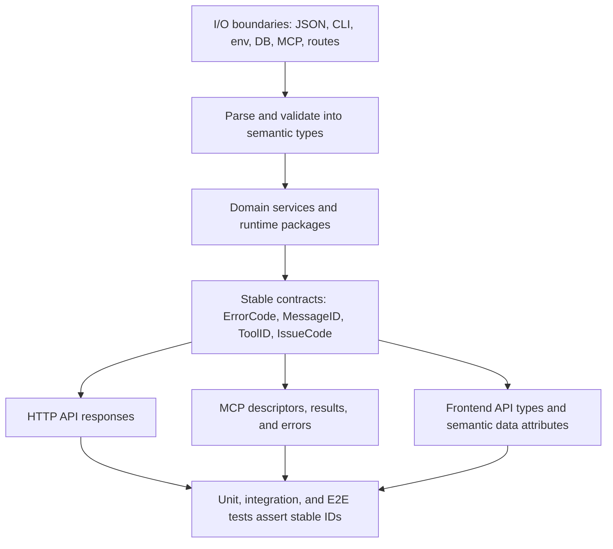
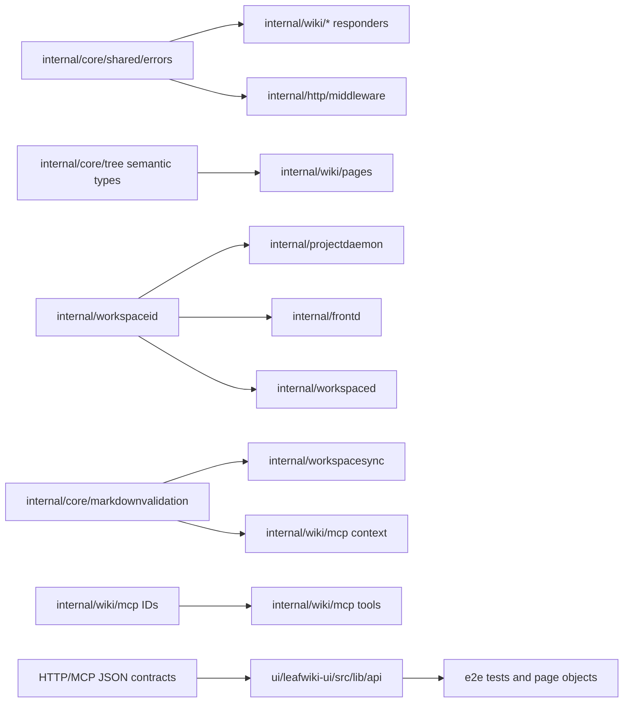

<!-- leafwiki
version: 1
page:
  id: semantic-types-ids-plan-20260622
  title: Semantic Types And IDs Implementation Plan
  created_at: "2026-06-21T22:19:24Z"
  updated_at: "2026-06-21T22:19:24Z"
  creator_id: system
  last_author_id: system
tags:
  - plans
fields:
  type: refactor
-->

# Semantic Types And IDs Implementation Plan

## Goal & Context

### Objective

Introduce semantic, typed, stable IDs and high-value semantic primitive types across LeafWiki so user/agent-facing contracts and cross-boundary values are no longer represented as interchangeable raw strings, numbers, or timestamps.

This plan supersedes `docs/plans/semantic-ids.PLAN.md`. It keeps that plan's original stable-ID direction and expands it with the user's newer requirement: semantic types for common string, numeric, and date/time inputs that currently rely on naming and local context.

### Context

- Workflow: `docs/plans/planning.aibasic.txt`.
- Initial conversation reference: `codex://threads/019ea755-a3e3-7571-a8cf-c70a33fea656`.
- Superseded plan: `docs/plans/semantic-ids.PLAN.md`.
- Observation artifact: `docs/plans/semantic-types-and-ids.OBSERVE.md`.
- Context artifact: `docs/plans/semantic-types-and-ids.CONTEXT.md`.
- Decision artifact: `docs/plans/semantic-types-and-ids.DECISION.md`.
- Relevant recent plans:
  - `docs/plans/federated-runtime-sync-cleanup.PLAN.md`
  - `docs/plans/federated-workspaces.PLAN.md`
  - `docs/plans/wikid-frontd-extraction.PLAN.md`
  - `docs/plans/mcp-tools.PLAN.md`
  - `docs/plans/page-metadata-v1.PLAN.md`
- Relevant skills for execution:
  - `superpowers:test-driven-development`
  - `superpowers:subagent-driven-development`
  - `superpowers:verification-before-completion`
  - `compound-engineering:ce-work`
  - `compound-engineering:ce-code-review`
- Implementation commands should follow `@/Users/jakubtomanik/.codex/RTK.md` and run through `rtk`.

### Decisions from Discussion

**Key Decisions:**

1. Stable IDs and semantic primitive types are both in scope.
   - Reason: the real problem is primitive ambiguity, not only future localization.

2. Preserve the three-way split: contract ID, message ID, rendered text.
   - Reason: machine contracts and copy have different stability requirements.

3. Do not add `go-i18n` in this slice.
   - Reason: typed contracts should come before translation catalogs.

4. Use defined Go types for high-risk values.
   - Reason: aliases do not prevent accidental mixing of page IDs, workspace IDs, route paths, and error codes.

5. Keep domain-owned type definitions by default.
   - Reason: the repo already uses domain-owned types such as `NodeKind`, `RevisionType`, `RoleName`, `WorkspaceState`, `GrantRole`, and `gitrevisions.Reason`.

6. Allow raw primitives at I/O edges.
   - Reason: JSON, CLI, env, DB, route params, filesystem reads, and MCP serialization naturally start or end as primitives.

7. Keep existing rendered English and JSON compatibility fields.
   - Reason: this refactor should harden contracts without changing current UX or breaking clients.

8. Treat MCP as an agent-facing protocol, not an implementation detail.
   - Reason: MCP tool IDs, descriptions, result messages, and error codes are exactly the kind of context coding agents rely on.

9. Keep existing frontend `data-testid`s and add semantic attributes selectively.
   - Reason: structural locators are useful; state/error/status assertions need stable non-English oracles.

10. Tests should assert stable IDs for protocol/status/error behavior.
    - Reason: English copy should be mutable unless visible copy is the behavior under test.

**Alternatives Considered:**

- Patch `semantic-ids.PLAN.md` in place.
  - Rejected because the old plan predates current runtime boundaries and lacks semantic primitive scope.

- Introduce a global IDs package for every domain.
  - Rejected initially because it risks a dependency sink and fights existing local patterns.

- Type every raw string, int, and time value.
  - Rejected because it would create churn without proportionate safety.

- Replace all E2E text assertions.
  - Rejected because content, accessibility, and visible-copy tests legitimately use text.

**Open Questions Resolved:**

- Q: Should user-authored slugs, tags, titles, and Markdown become stable IDs?
  - A: No. They remain content. Validated route/path/slug values may still get semantic value types.

- Q: Should public route literals, JSON field names, CSS classes, flags, and env var names become message IDs?
  - A: No.

- Q: Should existing English `message` fields disappear?
  - A: No. Add stable IDs first; remove compatibility fields only in a future explicit plan.

## Summary

The implementation introduces a small set of shared typed contracts, then applies them vertically through backend API errors, validation, MCP, runtime/presence boundaries, frontend API types, and E2E tests.

The target end state:

- Error payloads have typed `code` and `messageId`.
- Field validation has stable field-level codes.
- MCP descriptors and result messages have typed IDs.
- High-risk cross-boundary values use semantic types after parsing.
- Frontend API/domain boundaries use branded or narrow types.
- E2E and integration tests assert IDs for status/error/protocol behavior.
- English copy remains current default output, but is no longer the primary oracle for machine contracts.

## Scope Boundaries

### In Scope

- Evolve `internal/core/shared/errors` with typed `ErrorCode`, `MessageID`, `ErrorDefinition`, typed `FieldError`, and compatibility constructors.
- Convert existing `ErrCode*` constants in wiki domains to typed error codes.
- Add domain `MessageID*` constants or equivalent definitions for existing API errors.
- Add `messageId` to API localized error payloads and frontend API error types.
- Add stable field validation codes/message IDs to shared validation errors.
- Type validation issue codes and severities for markdown/workspace sync validation.
- Add semantic types for high-risk entity IDs and versions at backend boundaries:
  - `WorkspaceID`
  - `PageID`
  - `UserID`
  - `RevisionID`
  - `CommitHash`
  - `SessionID`
  - `MCPAPIKeyID`
  - `PageVersion`
- Add semantic types for high-risk path/address values:
  - `RoutePath`
  - `MarkdownPath`
  - `WorkspaceSourcePath`
  - `Slug`
  - `AssetName`
- Add selective numeric/time semantic types where units or adjacent parameters create risk:
  - limits and offsets
  - tree depth
  - byte size
  - ports
  - auth/session TTLs
  - presence and revision timestamps where serialization semantics matter
- Type MCP `ToolID`, descriptor description IDs, result message IDs, and recommended tool IDs.
- Add `messageId` to MCP message-only success payloads while retaining `message`.
- Type agent hook provider/event/source/tool semantics where they are currently raw strings.
- Type presence mode/source/state/status contracts in Go and TypeScript.
- Add structured error code/message ID responses for frontd/workspaced/projectdaemon agent-facing diagnostics where currently English-only.
- Add frontend branded/narrow types at API/helper/store boundaries.
- Add semantic frontend attributes for error/status/state UIs:
  - `data-error-code`
  - `data-l10n-id`
  - `data-validation-code`
  - `data-import-status`
  - `data-history-change`
  - `data-revision-badge`
- Update E2E and integration tests to assert stable IDs where English is not the behavior under test.
- Create `docs/typed-ids.md`.
- Add the hard-fail semantic hygiene checker for untyped contract additions and semantic boundary regressions.

### Out of Scope / Deferred

- Adding `go-i18n`, translation catalogs, or locale switching.
- Removing existing `message`, `template`, or `args` JSON fields.
- Renaming public route paths, JSON field names, CLI flags, env vars, or CSS classes.
- Rewriting all local variables or component props to branded types.
- Replacing all accessibility/name assertions in E2E tests.
- Creating a global catch-all ID registry.
- Database schema migrations solely for type names.
- Changing current rendered English copy except where tests need stable attributes.
- Removing compatibility fields after the typed IDs are introduced.

### Intentional Limitations

- Some raw primitives will remain at I/O boundaries by design.
- Some text assertions will remain where text is the behavior under test.
- The first implementation should not attempt to type every numeric or time value.
- Existing domain-specific typed enums should remain where they are; do not duplicate them into shared packages.

## Assumptions

- Current runtime contract is federated `wikid`/`frontd`/`workspaced`; legacy runtime/revision/sync paths should not return.
- Existing English messages are the compatibility fallback for API, MCP, CLI, and UI.
- Current MCP `wiki_*` tool names remain the public tool names.
- Existing frontend `data-testid`s remain stable structural locators.
- TypeScript branded types are acceptable at API/helper/store boundaries if they do not create large component churn.
- Go defined types are preferred for high-risk concepts.
- Constructors/parsers are required only where raw input needs validation or normalization.
- The implementation can proceed by domain without freezing all feature work.

## Impact Analysis

### Existing Code Impact

| Area | Files | Change | Downstream Impact |
|---|---|---|---|
| Shared errors | `internal/core/shared/errors/localized_error.go`, `field_error.go` | Add typed `ErrorCode`, `MessageID`, `ErrorDefinition`, typed fields and constructors | All localized error users can migrate without losing existing JSON fields |
| Domain responders | `internal/wiki/*/errors.go` | Convert `ErrCode*` constants and add message IDs | API tests assert typed codes/message IDs |
| Page service boundaries | `internal/core/tree`, `internal/wiki/pages` | Introduce page ID, page version, slug, route path types around parsing/service inputs | Reduces adjacent string mixups in page mutation flows |
| Workspace identity | `internal/workspaceid`, `internal/wiki/workspace.go`, `internal/projectdaemon`, `internal/frontd`, `internal/workspaced`, `internal/wikid` | Return/use validated `WorkspaceID` instead of raw strings after parsing | Runtime routing and descriptor code has a single workspace identity vocabulary |
| Validation | `internal/core/markdownvalidation`, `internal/workspacesync`, `internal/wiki/mcp` | Define validation issue code/severity types and preserve details | Workspace sync, MCP context, and frontend validation use same stable codes |
| MCP descriptors | `internal/wiki/mcp/tool_descriptors.go`, `schema.go`, `types.go` | Type tool IDs and add description/message IDs | Tool listing and result schemas become agent-stable |
| MCP tool errors | `internal/wiki/mcp/*` | Extract stable codes/message IDs instead of formatting text-only errors | Integration tests stop depending on English fragments |
| Agent hooks | `internal/agenthooks`, `internal/projectdaemon/agent_presence.go` | Type provider/event/source/tool semantics | Presence summaries and agent diagnostics become less stringly |
| Presence | `internal/wiki/presence`, `ui/leafwiki-ui/src/lib/api/presence.ts` | Type modes, sources, states, timestamps where useful | UI and MCP context align on presence vocabulary |
| Runtime diagnostics | `internal/frontd`, `internal/workspaced`, `internal/projectdaemon`, `cmd/leafwiki` | Add structured error code/message ID wrappers for agent-facing failures | CLI/API/MCP consumers can test errors without prose |
| Frontend API types | `ui/leafwiki-ui/src/lib/api/*` | Add branded/narrow domain types and `messageId` to errors | Components get clearer contracts with minimal rendering changes |
| Frontend UI hooks | Tree, editor, importer, users, history components | Add semantic `data-*` attributes for status/error/state | E2E locators become copy-independent where appropriate |
| E2E helpers | `e2e/pages/*`, `e2e/tests/*`, `e2e/tests/mcpClient.ts` | Add typed helper values and assert stable IDs | Tests become less fragile under copy changes |
| Docs | `docs/typed-ids.md`, `docs/mcp.md` | Document taxonomy and payload examples | Future contributors and agents have explicit rules |

### Existing Tests Requiring Updates

| Test Area | Files | Expected Update |
|---|---|---|
| Shared errors | `internal/core/shared/errors/*_test.go` | Add direct tests for typed definitions, compatibility constructors, JSON fields, and field errors |
| Domain error responders | `internal/wiki/*/errors_test.go` | Assert `code`, `messageId`, `message`, `template`, and `args` compatibility |
| Middleware errors | `internal/http/middleware/auth/*_test.go`, `internal/http/middleware/security/*_test.go` | Replace raw English-only error assertions with structured error checks where responses are user/agent-facing |
| Page mutation contracts | `internal/core/tree/*_test.go`, `internal/wiki/pages/*_test.go` | Add tests around page ID/version/slug constructors and stale-version errors |
| Markdown validation | `internal/core/markdownvalidation/*_test.go` | Assert typed validation issue code/severity |
| Workspace sync | `internal/workspacesync/*_test.go`, `internal/workspacesync/gitrevisions/*_test.go` | Preserve existing typed reason/source behavior and add validation code tests |
| MCP descriptors and schemas | `internal/wiki/mcp/*_test.go` | Assert typed tool IDs and `messageId` in success schemas |
| MCP integration errors | `internal/wiki/mcp/mcp_integration_test.go` | Change helpers to extract stable code/message ID before checking copy |
| Runtime boundaries | `internal/frontd/*_test.go`, `internal/workspaced/*_test.go`, `internal/projectdaemon/*_test.go`, `internal/wikid/*_test.go` | Add workspace ID parsing and structured diagnostic assertions |
| CLI/config | `cmd/leafwiki/main_test.go`, `internal/runtimeconfig/*_test.go` | Add typed config/setting error assertions while preserving stderr text |
| Frontend units | `ui/leafwiki-ui/src/**/*.test.*` if present | Add branded type and error mapping coverage where tests exist |
| E2E | `e2e/pages/*`, `e2e/tests/mcp-api-keys.spec.ts`, `workspace-sync.spec.ts`, `history.spec.ts`, `importer.spec.ts`, `page.spec.ts`, `mcp-agent-context.spec.ts` | Replace status/error English oracles with semantic attributes/codes |

### Module/Target Boundaries

- Backend package ownership should follow existing domain packages.
- Frontend branded types should stay under `ui/leafwiki-ui/src/lib` and not leak unnecessary details into presentational components.
- E2E helpers may define local brands only where they make helper contracts clearer.
- MCP public JSON remains string-valued for compatibility even when Go types are defined.

### Access Control

This refactor must not change authorization behavior:

- Auth role and grant checks remain unchanged.
- Structured auth errors must not leak secrets or distinguish sensitive cases more than current behavior.
- MCP API key diagnostics keep the existing security posture.
- Frontd/workspaced routing errors must avoid exposing private filesystem paths or tokens.

## Architecture & Design

### Non-Goals

- No translation runtime.
- No global registry of every ID in the system.
- No full public API cleanup.
- No removal of compatibility fields.
- No broad UI redesign.

### Required Components

1. Shared error/message contract types.
2. Domain error definitions and responder adapters.
3. Semantic primitive parsers/constructors for selected high-risk values.
4. MCP tool/message ID contract.
5. Runtime/presence typed contracts.
6. Frontend branded types and semantic state attributes.
7. Test helpers that assert IDs rather than English prose.
8. Documentation and scan guidance.

### Architecture Diagram



### Proposed Module Structure

```text
internal/
  core/
    shared/
      errors/
        localized_error.go      # ErrorCode, MessageID, ErrorDefinition, LocalizedError
        field_error.go          # FieldErrorCode/messageId support
        definitions_test.go
    tree/
      ids.go                    # PageID/PageVersion/Slug/RoutePath if import graph allows
      path_types.go             # RoutePath/MarkdownPath helpers if split is clearer
    markdownvalidation/
      issue_codes.go            # ValidationIssueCode/ValidationSeverity
  workspaceid/
    validate.go                 # return/parse WorkspaceID in addition to validation
  wiki/
    mcp/
      tool_descriptors.go       # ToolID/DescriptionID
      message_ids.go            # Tool result message IDs
      errors.go                 # extraction helpers if needed
  projectdaemon/
    semantic_types.go           # only for projectdaemon-owned provider/state/session values
ui/
  leafwiki-ui/
    src/lib/
      domainTypes.ts            # shared frontend brands if not domain-local
      api/errors.ts             # ApiErrorCode/MessageID/messageId
      api/*.ts                  # domain-branded API contracts
docs/
  typed-ids.md
```

This tree is a guide, not a mandate. If implementation reveals import cycles, keep types closer to their owning packages or introduce a smaller neutral package with only the shared vocabulary that needs it.

### Dependency Graph



### Key Design Decisions

- Use domain-owned defined types unless a shared contract is truly cross-cutting.
- Keep string serialization at public boundaries.
- Keep existing fields and add IDs; do not replace fields in this plan.
- Let existing typed enums stay in place.
- Prefer constructors for validated external input.
- Keep semantic frontend attributes focused on state, status, validation, and errors.
- Document every remaining English assertion category after scan triage.

### Pattern References

Existing local type patterns:

- `internal/core/tree/page_node.go`: `NodeKind`.
- `internal/core/revision/types.go`: `RevisionType`.
- `internal/workspacesync/gitrevisions/store.go`: `Reason`, `Source`.
- `internal/projectdaemon/roles.go`: `RoleName`, `RoleState`.
- `internal/wikid/grants.go`: `GrantRole`.
- `internal/wikid/workspace_supervisor.go`: `WorkspaceState`.
- `ui/leafwiki-ui/src/lib/api/import.ts`: `ImportExecutionStatus`.
- `ui/leafwiki-ui/src/lib/api/presence.ts`: `PresenceMode`.

### Concurrency And Data Isolation

- Semantic types should not change locking, goroutine, watcher, or daemon lifecycle behavior.
- Workspace IDs used across runtime processes must serialize exactly as before.
- MCP session bindings and presence events may receive typed internal fields, but persisted/session JSON shape should remain compatible unless explicitly tested.
- Do not change workspace sync ordering or Git revision semantics.

### State Machines

Several state machines should become typed but not behaviorally changed:

- Import plan execution status.
- Workspace supervision state.
- Presence heartbeat/session state.
- Workspace sync validation severity.
- Page history revision badge/change state.
- MCP client/tool result state.

## Test Specifications

### Key Principle

Use TDD. For each implementation unit, first add or update tests that fail because the stable type/ID contract does not exist yet. Then implement the smallest compatibility-preserving change that makes those tests pass.

### Test Non-Goals

- Do not rewrite all E2E locators.
- Do not assert message catalogs or translated text.
- Do not remove text assertions that validate user content, Markdown rendering, or accessibility labels.
- Do not add brittle compile-time-only tests that require intentionally broken code.

### Unit Scenarios

```gherkin
Feature: Shared error contract
  Scenario: Localized error exposes typed code and message ID
    Given an error definition with an ErrorCode and MessageID
    When a localized error is constructed from that definition
    Then the error exposes the same code
    And the error exposes the same messageId
    And message, template, and args remain available

  Scenario: Old localized error constructor remains compatible
    Given existing code constructs a localized error with raw strings
    When the error is serialized
    Then existing message and template fields are still present
    And the code is converted into the typed ErrorCode representation

  Scenario: Field validation includes stable codes
    Given validation adds an error for the slug field
    When the validation error is serialized
    Then the field error contains field, code, messageId, and message
    And clients can assert the code without comparing the English message
```

```gherkin
Feature: Semantic primitive parsing
  Scenario: Workspace ID parser rejects invalid input
    Given a raw workspace ID with uppercase letters or whitespace
    When it is parsed into WorkspaceID
    Then parsing fails with a typed validation code
    And no internal service receives the invalid ID

  Scenario: Page and workspace IDs cannot be mixed at service boundaries
    Given a page service operation needs both page ID and workspace ID
    When the input struct is constructed
    Then each field uses a distinct semantic type
    And adjacent raw string parameters are avoided

  Scenario: Page version bypass is internal-only
    Given a caller wants to bypass version checks
    When the caller is outside the tree package boundary
    Then it cannot pass the raw unchecked version sentinel
    And public APIs continue to require normal version strings
```

```gherkin
Feature: Validation issue contracts
  Scenario: Markdown validation reports duplicate leafwiki IDs with typed issue code
    Given two Markdown files share the same leafwiki ID
    When workspace validation runs
    Then the issue code is the duplicate-leafwiki-id constant
    And severity is the typed error severity
    And the human message may include file-specific details

  Scenario: Empty validation code falls back through a single typed default
    Given a validation issue is created without a specific code
    When it is converted for workspace sync and MCP context
    Then both surfaces use the same typed fallback issue code
```

### Integration Scenarios

```gherkin
Feature: HTTP API stable errors
  Scenario: Page version conflict exposes stable IDs
    Given a stale page update request
    When the API returns a conflict
    Then error.code is "page_version_conflict"
    And error.messageId is "errors.page.version_conflict"
    And message and template remain present for compatibility

  Scenario: Auth middleware rejection is structured
    Given a private API request without valid authentication
    When middleware rejects it
    Then the response contains a structured error object
    And the response does not depend on a raw English string body

  Scenario: Workspace routing error is agent-addressable
    Given frontd receives a request for an invalid workspace ID
    When routing fails
    Then the response contains a stable workspace error code
    And the rendered message does not leak private paths or secrets
```

```gherkin
Feature: MCP stable contracts
  Scenario: Tool descriptors use typed tool IDs
    Given the MCP server lists tools
    When descriptors are returned
    Then each descriptor name matches a ToolID constant
    And code associates each descriptor with a DescriptionID

  Scenario: Message-only success response carries messageId
    Given wiki_move_page succeeds
    When the MCP tool returns structured content
    Then structuredContent.messageId identifies the move success message
    And structuredContent.message remains the current English text

  Scenario: MCP tool error exposes stable code
    Given wiki_update_page receives a stale version
    When the tool fails
    Then the MCP test helper extracts page_version_conflict
    And the test does not depend on an English error fragment

  Scenario: MCP context validation issue codes are typed
    Given wiki_get_context returns workspace validation issues
    When the issues are converted into MCP output
    Then each issue has typed code and severity values
    And missing-code fallback uses the same default as workspace sync
```

```gherkin
Feature: Runtime and presence contracts
  Scenario: Agent hook provider and event are typed
    Given a Codex PreToolUse hook payload
    When it is normalized
    Then provider and event use typed constants
    And unsupported events are classified without ad hoc string matching

  Scenario: Presence heartbeat mode is typed
    Given a web heartbeat with an invalid mode
    When the registry validates it
    Then validation fails with a stable code
    And a valid heartbeat stores a typed mode internally

  Scenario: Project daemon descriptor preserves serialized compatibility
    Given a descriptor includes workspace identity and runtime state
    When descriptor JSON is written
    Then serialized fields remain compatible
    And internal construction uses semantic workspace and role/state types
```

### E2E Scenarios

```gherkin
Feature: UI errors use stable semantic hooks
  Scenario: Save conflict toast is independent of English copy
    Given a page save returns page_version_conflict
    When the editor shows the conflict UI
    Then E2E locates data-error-code="page_version_conflict"
    And data-l10n-id identifies the displayed message
    And the test does not assert "Page was changed by another request"

  Scenario: Workspace sync validation banner is copy-independent
    Given duplicate leafwiki IDs exist on disk
    When the workspace sync banner renders
    Then E2E locates data-validation-code for the duplicate ID issue
    And path-specific details are still visible to the user

  Scenario: MCP API key dialog load failure is stable
    Given API key loading fails
    When the dialog renders the error state
    Then E2E locates the dialog by existing test ID
    And asserts data-error-code or data-l10n-id for the failure state
    And retry remains reachable by stable test ID
```

```gherkin
Feature: UI status contracts use semantic state
  Scenario: Importer states are stable
    Given an import plan is running, failed, canceled, or complete
    When the importer renders status
    Then E2E asserts data-import-status
    And does not assert "Running", "Failed", "Canceled", or "Completed" as the status oracle

  Scenario: History structure changes are stable
    Given title and slug changed between revisions
    When the history structure view renders
    Then E2E asserts data-history-change="title" and data-history-change="slug"
    And user-specific old and new values remain visible

  Scenario: Revision badge state is stable
    Given the active revision is displayed
    When the history sidebar renders
    Then E2E asserts data-revision-badge for the active state
    And visible copy can change without breaking the state assertion
```

### Test Target Locations

- `internal/core/shared/errors`
- `internal/core/tree`
- `internal/core/markdownvalidation`
- `internal/workspaceid`
- `internal/workspacesync`
- `internal/workspacesync/gitrevisions`
- `internal/wiki/pages`
- `internal/wiki/auth`
- `internal/wiki/assets`
- `internal/wiki/branding`
- `internal/wiki/importer`
- `internal/wiki/revisions`
- `internal/wiki/search`
- `internal/wiki/tags`
- `internal/wiki/properties`
- `internal/wiki/links`
- `internal/wiki/mcp`
- `internal/wiki/presence`
- `internal/http/middleware`
- `internal/projectdaemon`
- `internal/frontd`
- `internal/workspaced`
- `internal/wikid`
- `internal/runtimeconfig`
- `cmd/leafwiki`
- `ui/leafwiki-ui/src/lib`
- `ui/leafwiki-ui/src/features`
- `e2e/pages`
- `e2e/tests`

## Implementation

### Non-Goals

- Do not implement translation catalogs.
- Do not remove compatibility fields.
- Do not type every primitive in one pass.
- Do not reintroduce legacy runtime or revision mode branches.
- Do not churn E2E tests that are intentionally content/accessibility focused.

### U1. Shared Error And Message Contracts

Add typed shared contracts in `internal/core/shared/errors`:

- `ErrorCode`
- `MessageID`
- `ErrorDefinition`
- `FieldErrorCode` if field codes need a separate type
- typed `LocalizedError` fields
- typed field validation fields
- compatibility constructors/wrappers for old call sites

Tests:

- New shared error unit tests.
- JSON compatibility tests for old and new constructors.
- Field validation serialization tests.

Acceptance:

- Existing callers can still compile through compatibility wrappers.
- New code has a typed definition-based path.
- Serialized payloads include `messageId` where definitions provide it.

### U2. Backend Domain Error Definitions

Convert domain error code constants and responders:

- Pages.
- Auth.
- Assets.
- Branding.
- Importer.
- Revisions.
- Search.
- Tags.
- Properties.
- Links.
- Workspace sync routes.
- HTTP middleware where responses are user/agent-facing.

For each domain:

- Convert `ErrCode*` constants to typed error codes.
- Add message IDs.
- Keep existing messages/templates/args.
- Update responder tests to assert IDs and compatibility fields.

Acceptance:

- Domain errors have stable typed codes and message IDs.
- Existing frontend rendering still works.
- Tests no longer need English text as the primary oracle for these errors.

### U3. Semantic Backend Primitive Types

Introduce semantic value types where they reduce real ambiguity. This implementation slice covers the current high-risk page/wiki/MCP/error/runtime boundaries and the adjacent same-primitive call sites touched by those flows:

- Workspace identity through `internal/workspaceid` and runtime boundaries.
- Page identity/version/slug/route path at tree/wiki page boundaries.
- Revision IDs at revision route, MCP, and service callbacks.
- User IDs and API key IDs at auth API-key use-case boundaries.
- Project-daemon session handles at runtime heartbeat/release boundaries.

Commit hashes at lower-level git revision storage boundaries and selected numeric unit wrappers for limits, offsets, byte sizes, ports, and TTLs remain follow-up candidates unless a touched boundary already needed them.

Do this through input structs and constructors where direct signature conversion would create too much churn. Prioritize call sites with adjacent same-primitive parameters.

Acceptance:

- Raw values are parsed or wrapped once at the implemented HTTP/MCP/runtime boundaries.
- Internal services in the implemented scope receive semantic values or typed input structs.
- Remaining commit-hash and numeric-unit candidates are documented as follow-up scope rather than claimed complete in this slice.
- Existing public JSON and CLI behavior remains unchanged.

### U4. Validation And Workspace Sync Codes

Unify validation codes/severity across Markdown validation, workspace sync, MCP context, and frontend API types:

- Add typed validation issue code and severity definitions.
- Replace literal fallbacks such as workspace sync validation defaults with one typed source.
- Preserve detailed human messages with file/path specifics.
- Update workspace sync status and validation tests.

Acceptance:

- Duplicate IDs, invalid slugs, missing titles, scan errors, and sync errors expose stable codes.
- MCP context and HTTP workspace sync routes agree on code/severity values.
- Frontend can render validation issues with `data-validation-code`.

### U5. MCP Tool, Message, And Error Contracts

Strengthen MCP contracts:

- Type tool IDs in descriptors and tool-name lists.
- Add descriptor message IDs for tool descriptions in code.
- Add `messageId` to success payloads that currently return only `message`.
- Update schemas to include `messageId`.
- Add helpers to extract structured error code/message ID from tool failures.
- Update MCP integration tests to assert stable IDs.

Acceptance:

- Tool names remain the same serialized `wiki_*` strings.
- Tool descriptors and success outputs have stable IDs in code and payloads where appropriate.
- MCP tests do not rely on English fragments for error/status behavior.

### U6. Runtime, Agent, And Presence Contracts

Apply semantic types to current federated runtime boundaries:

- Workspace ID through `projectdaemon`, `frontd`, `workspaced`, and `wikid`.
- Agent hook provider/event/source/tool metadata.
- Presence mode/source/state/status.
- Runtime descriptor role/state/session semantics.
- Structured frontd/workspaced/projectdaemon diagnostics for agent-facing failures.

Acceptance:

- Runtime serialized JSON remains compatible.
- Workspace ID validators and agent/presence validation expose stable codes. Frontd/wikid malformed workspace route segments remain route-miss or workspace-not-found responses by design, so invalid route probing is not part of the structured validation JSON contract.
- Existing role/state types are reused instead of duplicated.

### U7. Frontend API Types And Semantic UI Hooks

Add frontend branded or narrow types at high-value boundaries:

- `PageID`
- `WorkspaceID`
- `RevisionID`
- `UserID`
- `MCPAPIKeyID`
- `PageVersion`
- `ApiErrorCode`
- `MessageID`
- `WorkspaceSyncIssueCode`
- `MCPToolID`

Add semantic attributes to state/error/status UI:

- Workspace sync validation banner.
- Editor save conflict and frontmatter errors.
- MCP API key dialog error/empty/retry states.
- Importer status/result states.
- History revision badge and structure-change rows.
- Dialog/panel/toolbar IDs where current stores widen to plain strings.

Acceptance:

- Existing `data-testid`s remain.
- E2E can assert stable error/status IDs without visible English.
- TypeScript API/helper/store boundaries reject obvious ID mixups.

### U8. Documentation And Semantic Hygiene Guardrails

Create `docs/typed-ids.md` covering:

- Taxonomy.
- Naming conventions.
- Type ownership.
- Boundary rule.
- Compatibility rule.
- Frontend semantic attribute guidance.
- Testing rules.
- Examples and exclusions.
- Original conversation reference.

Update `docs/mcp.md` if MCP examples gain `messageId`.

Use `rtk bash scripts/check-semantic-hygiene.sh` as the semantic review command
for risky raw contract additions and semantic boundary regressions. Any future
text/E2E triage belongs outside this semantic hygiene gate and must not be used
as a substitute for the hard-fail checker.

Acceptance:

- Future agents have an explicit policy.
- Semantic hygiene regressions fail through `scripts/check-semantic-hygiene.sh`.
- New user/agent-facing contracts have documented expectations.

## Verification

Run targeted tests as each unit lands, then full verification.

### Targeted Backend

```bash
rtk go test ./internal/core/shared/errors
rtk go test ./internal/core/tree ./internal/core/markdownvalidation ./internal/workspaceid
rtk go test ./internal/wiki/pages ./internal/wiki/auth ./internal/wiki/assets ./internal/wiki/branding ./internal/wiki/importer ./internal/wiki/revisions ./internal/wiki/search ./internal/wiki/tags ./internal/wiki/properties ./internal/wiki/links
rtk go test ./internal/wiki/mcp
rtk go test ./internal/wiki/presence ./internal/projectdaemon ./internal/frontd ./internal/workspaced ./internal/wikid ./internal/runtimeconfig
rtk go test ./internal/workspacesync ./internal/workspacesync/gitrevisions
rtk go test ./cmd/leafwiki
```

### Frontend And E2E

```bash
rtk npm --prefix ui/leafwiki-ui run lint
rtk npm --prefix ui/leafwiki-ui run build
rtk npm --prefix e2e run lint
rtk make run-e2e-local-fast GREP="MCP API Keys|Workspace Sync|history|page|import"
rtk make run-e2e-local-fast GREP="mcp|MCP|presence|agent"
```

### Full Suite

```bash
rtk go test ./...
rtk bash scripts/test-run.sh
```

### Semantic Hygiene Gate

Run before completion:

```bash
rtk bash scripts/check-semantic-hygiene.sh
```

This is the hard-fail semantic review command. Do not replace it with manual
text scans or broad test/E2E exception triage.

## Definition of Done

- `docs/plans/semantic-types-and-ids.*` artifacts exist and supersede `docs/plans/semantic-ids.PLAN.md`.
- `docs/typed-ids.md` exists and includes the original conversation reference.
- Shared backend errors expose typed `ErrorCode` and `MessageID`.
- Field validation errors expose stable field-level codes/message IDs.
- Existing API error domains expose typed codes and message IDs while keeping current compatibility fields.
- MCP tool descriptors use typed tool IDs in code and preserve serialized tool names.
- MCP success messages that are currently message-only include `messageId`.
- MCP and HTTP error tests assert stable IDs instead of English fragments where English is not the behavior.
- High-risk backend domain values in the implemented scope use semantic types or typed input structs after parsing/wrapping.
- `rtk bash scripts/check-semantic-hygiene.sh` is the hard-fail reviewer command for semantic boundary regressions, with no baseline.
- Workspace ID validation returns or constructs a semantic workspace ID for internal use.
- Runtime, agent hook, and presence contracts use typed provider/event/mode/source/state/status values where useful.
- Frontend API/helper/store boundaries use branded or narrow types for high-value IDs and statuses.
- Stateful/error/status UI exposes semantic attributes needed by E2E.
- Existing rendered English behavior remains compatible unless a deliberate test documents otherwise.
- `rtk bash scripts/check-semantic-hygiene.sh` has no remaining semantic diagnostics.
- All verification commands pass or any residual failures are documented with owner and reason.
