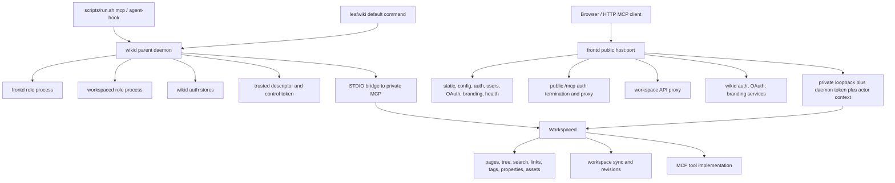
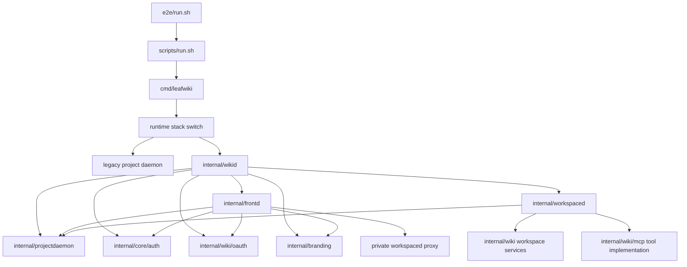
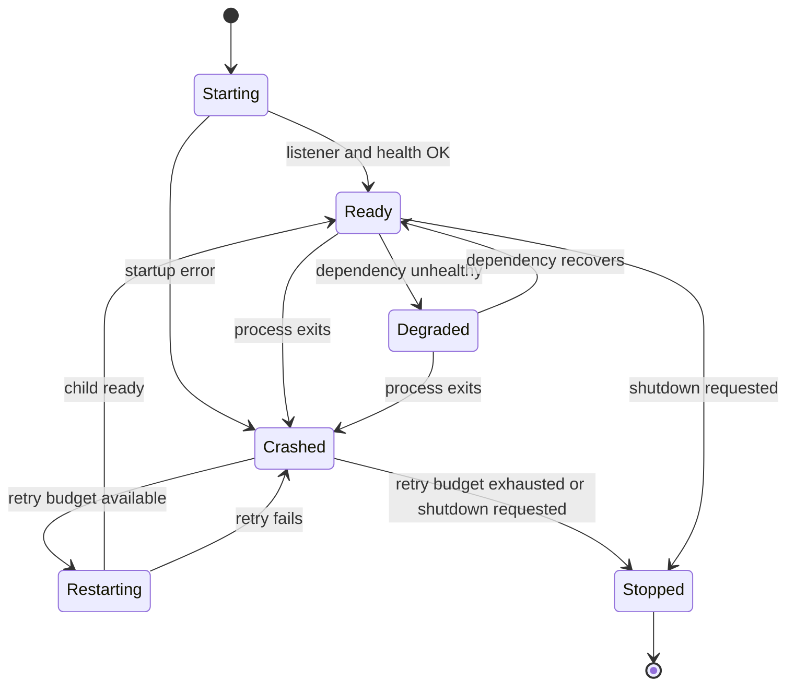

<!-- leafwiki
version: 1
page:
  id: A9_bQO-Dg
  title: Wikid Frontd Extraction Implementation Plan
  created_at: "2026-06-16T10:58:35.729522977Z"
  updated_at: "2026-06-16T10:58:35.729522977Z"
  creator_id: system
  last_author_id: system
-->

# Wikid Frontd Extraction Implementation Plan

> **For agentic workers:** REQUIRED SUB-SKILL: Use `superpowers:subagent-driven-development` or `superpowers:executing-plans` to implement this plan task-by-task. Steps use checkbox (`- [ ]`) syntax for tracking.

**Goal:** Extract LeafWiki's current one-workspace runtime into `wikid`, `frontd`, and `workspaced` roles while preserving current user-visible behavior and the stable `scripts/run.sh` MCP/agent-hook surface.

**Architecture:** Keep one `leafwiki` executable with hidden same-binary role processes. `wikid` owns supervision, descriptors, auth/user/API-key/OAuth services, and runtime identity. `frontd` owns the public HTTP ingress and proxies workspace traffic to one private `workspaced`. `workspaced` owns workspace semantics and MCP tools, receiving only verified actor context over private daemon channels.

**Tech Stack:** Go, Gin, existing `internal/projectdaemon` descriptor/control patterns, existing `internal/wiki` service packages, shell wrapper tests, Playwright E2E, React/Vite frontend build.

---

## Goal & Context

### Objective

Implement a hidden, testable `wikid`/`frontd`/`workspaced` runtime stack for one project workspace, then flip it to default only after wrapper, route, auth, MCP, workspace, and failure behavior match the current runtime.

### Context

- Source workflow: `docs/plans/planning.aibasic.txt`.
- Observation artifact: `docs/plans/wikid-frontd-extraction.OBSERVE.md`.
- Context artifact: `docs/plans/wikid-frontd-extraction.CONTEXT.md`.
- Decision artifact: `docs/plans/wikid-frontd-extraction.DECISION.md`.
- Discovery source: `docs/discovery/sessiond-frontd-extraction.md`.
- Related discovery: `docs/discovery/federated-workspaces-session-daemon.md`.
- Planning state: `docs/plans/wikid-frontd-extraction.planning.aibasic.json`.
- Current thread ID: not exposed to the agent in this environment.
- Conversation link: not available.
- Notion tickets: none provided.
- Bug reports: none provided.
- Prerequisites:
  - Discovery decisions in `docs/discovery/sessiond-frontd-extraction.md` are accepted.
  - No active plan should attempt federated workspaces, grants, registry, or multi-workspace UI in this slice.
  - Implementers must preserve user changes already present in the working tree.

## Decisions

**Key Decisions:**

1. Use `wikid` as the parent daemon name.
   - Reason: it owns runtime supervision, descriptors, health, auth/user services, and visibility, not only sessions.

2. Use hidden same-binary role processes: `wikid`, `frontd`, and `workspaced`.
   - Reason: the extraction must prove process lifecycle, descriptor, private-routing, and restart behavior before federation.

3. Treat `scripts/run.sh` as the stable public compatibility boundary.
   - Reason: common MCP client usage invokes `run.sh mcp`, including downstream project configs.

4. Allow deeper direct CLI changes behind the wrapper.
   - Reason: implementation can make cleaner cuts if `run.sh`, config mode, docs, and tests keep practical behavior stable.

5. Support one project workspace only.
   - Reason: this is a runtime extraction, not federated workspaces.

6. Move auth, users, sessions, API keys, OAuth, and user management out of `workspaced`.
   - Reason: `workspaced` should be workspace-authority code, not identity-authority code.

7. Do not migrate legacy auth data.
   - Reason: admins will recreate users/API keys in `wikid`; migration complexity is not needed for v1.

8. Delete only known legacy auth DB paths on launch.
   - Reason: cleanup is accepted, but must not risk unrelated workspace data.

9. Keep admin bootstrap behavior equivalent to current LeafWiki behavior.
   - Reason: setup should remain operationally familiar after auth storage moves.

10. Keep branding and favicon global to `wikid`/`frontd`.
    - Reason: no per-workspace branding is allowed in this extraction.

11. Preserve one public OAuth MCP resource.
    - Reason: public clients keep using `<public-origin><base-path>/mcp`.

12. Make `wikid` the only supervisor.
    - Reason: `frontd` should report state, not create a second lifecycle authority.

**Alternatives Considered:**

- Keep the current single runtime - rejected because it leaves federation blocked behind coupled ownership.
- Implement federation now - rejected because the slice must be reviewable and one-workspace.
- Use `sessiond` - rejected because the parent role is broader than sessions.
- Use `controld` - rejected because it reads narrower than the selected role.
- Use goroutine-only roles - rejected because it does not prove child role failure, descriptors, or restart behavior.
- Migrate legacy auth DB contents - rejected by discovery decision.
- Add workspace-specific OAuth resources now - rejected to avoid leaking federation concepts into v1.
- Let `frontd` parse MCP frames - rejected because `workspaced` owns MCP implementation.

**Open Questions Resolved:**

- Q: Should `workspaced` keep auth/user storage?
  - A: No. It must not own active auth stores.
- Q: Should the plan preserve direct CLI behavior exactly?
  - A: Preserve direct startup enough to be usable, but make `run.sh` the compatibility contract.
- Q: Should old auth DBs be migrated?
  - A: No. Delete only known legacy auth DB files and create fresh `wikid` stores.
- Q: Should branding be per workspace?
  - A: No. Branding is global to `wikid`/`frontd`.
- Q: Should OAuth publish workspace-specific resource URLs?
  - A: No. Keep one public MCP resource.
- Q: Who restarts child daemons?
  - A: Only `wikid`.

## Summary

This plan extracts the current transparent project-daemon runtime into three internal roles without adding federation product behavior.

The public URL remains stable and is served by `frontd`. Browser routes, auth routes, global branding, OAuth metadata/routes, public config, health, and public `/mcp` live at that URL. Workspace APIs and MCP tools move behind a private `workspaced` listener and are reached by `frontd` with verified actor context. `wikid` owns child role startup, descriptors, auth/user/API-key/OAuth stores, private tokens, and health state.

The implementation uses a hidden runtime switch while legacy and extracted stacks coexist. Tests first prove each new boundary, then parity tests compare the extracted stack to current behavior. The default flips only after wrapper and runtime parity are green.

## Scope Boundaries

### In Scope

- Add internal role packages:
  - `internal/wikid`
  - `internal/frontd`
  - `internal/workspaced`
- Extend shared runtime primitives in or near `internal/projectdaemon`.
- Preserve `<data-dir>/.leafwiki/project-daemon.json` as the attach compatibility point.
- Add a hidden runtime switch such as `LEAFWIKI_RUNTIME_STACK=wikid-frontd`.
- Start `wikid`, `frontd`, and one `workspaced` as same-binary internal role processes.
- Move auth/user/session/API-key/OAuth service ownership to `wikid`.
- Store new auth data under:
  - `<data-dir>/.leafwiki/wikid/auth/users.db`
  - `<data-dir>/.leafwiki/wikid/auth/sessions.db`
  - `<data-dir>/.leafwiki/wikid/auth/api_keys.db`
  - `<data-dir>/.leafwiki/wikid/oauth/`
- Delete known legacy auth DBs at launch:
  - `<data-dir>/users.db`
  - `<data-dir>/sessions.db`
  - `<data-dir>/api_keys.db`
- Preserve admin bootstrap behavior.
- Move public frontend/auth/config/OAuth/branding/static/health ownership to `frontd`.
- Keep workspace pages, tree, search, links, tags, properties, assets, import, revisions, sync, and MCP tools in `workspaced`.
- Add verified actor-context forwarding from `frontd` or `wikid` to `workspaced`.
- Preserve public HTTP MCP through the stable `frontd` URL.
- Preserve STDIO MCP through `scripts/run.sh mcp`.
- Add failure/restart behavior owned by `wikid`.
- Update tests and docs required to prove compatibility.

### Out Of Scope / Deferred

- Multiple registered workspaces.
- Home workspace concept.
- Multi-workspace UI.
- Workspace discovery.
- Workspace grants or selected-workspace access.
- Cross-workspace search, activity, or navigation.
- Federation APIs.
- Per-workspace branding.
- Migration of legacy auth DB contents.
- Transparent reconnect for existing HTTP MCP streams or STDIO sessions after `workspaced` crashes.
- Public documentation for hidden role commands beyond maintainer/debug notes.

### Intentional Limitations

- The first extracted runtime remains project-scoped under the current data dir.
- `workspaced` may temporarily reuse existing `internal/wiki` subpackages while composition roots move.
- The old runtime may remain temporarily for parity testing and rollback.
- Child role descriptors can be v1 practical and do not need to solve future multi-workspace registry details.
- `frontd` may return 503/502 during workspace failure; it does not need transparent request replay.

## Assumptions

- Current `internal/projectdaemon` descriptor/control behavior is the correct local pattern to extend.
- The existing lock model remains valid for deciding whether a stale descriptor may be replaced.
- Role processes can use hidden flags or hidden subcommands similar to `--internal-project-daemon`.
- Existing auth store constructors can be safely adapted to explicit storage paths or a `wikid` auth storage root.
- Existing route registrars can be moved gradually by composition before physical package moves.
- Existing E2E infrastructure can run local extracted-stack tests through environment flags.
- Existing public OAuth behavior and recent Fosite migration decisions remain the compatibility baseline.
- `run.sh` can translate stable wrapper arguments into new internal runtime arguments without changing user-facing command shape.

## Impact Analysis

### Existing Code Impact

| File | Change | Downstream Impact |
|---|---|---|
| `cmd/leafwiki/main.go` | Add runtime stack selection, hidden role entrypoints, `wikid` attach/start path, and bridge updates | Main startup behavior changes; descriptor, lock, logging, STDIO, and agent-hook tests need updates |
| `internal/projectdaemon/config.go` | Add role-aware descriptor/config primitives or compatible v2 schema | Existing descriptor trust and config mismatch tests must be preserved |
| `internal/projectdaemon/descriptor.go` | Preserve trusted local descriptor rules for `wikid` and child descriptors | Startup security and stale descriptor replacement depend on this |
| `internal/projectdaemon/control.go` | Extract or extend private control token/client helpers for role control | Private health, session, MCP, and actor context forwarding rely on this |
| `internal/wiki/wiki.go` | Stop being the single composition root; split services between roles | Most route/service wiring changes flow from here |
| `internal/http/router.go` | Allow `frontd` router composition and maybe private `workspaced` router composition | Frontend/static/fallback behavior must stay public through `frontd` |
| `internal/wiki/auth/routes.go` | Move public route registration to `frontd`; service calls backed by `wikid` | Login/user/API-key route tests move to frontd-level assertions |
| `internal/core/auth/*_store.go` | Support `wikid` storage paths under `.leafwiki/wikid/auth` | Store path tests and admin bootstrap tests change |
| `internal/wiki/oauth/routes.go` | Move public OAuth metadata/routes to `frontd`/`wikid` | Metadata root/base-path behavior must remain unchanged |
| `internal/wiki/mcp/routes.go` | Split public auth termination from private MCP tool implementation | HTTP MCP goes through `frontd`; MCP tools stay in `workspaced` |
| `internal/wiki/branding/*` and `internal/branding/*` | Move public/global ownership to `frontd`/`wikid` | Branding/favicon tests assert no `workspaced` ownership |
| `internal/wiki/presence/routes.go` | Split session surface from workspace page context | Presence tests may need frontd/workspaced routing assertions |
| `internal/wiki/workspace.go` | Update reserved data-dir handling for legacy auth DB cleanup | Root/data-dir validation must not block accepted cleanup |
| `scripts/run.sh` | Preserve public flags while routing to extracted stack | Shell tests become compatibility gate |
| `scripts/test-run.sh` | Add wrapper parity for extracted stack and NOWATCH-style config | Prevents silent wrapper regressions |
| `e2e/run.sh` | Add extracted-stack env plumbing if needed | E2E can exercise `run.sh` and new runtime mode |
| `docs/mcp.md`, `README.md`, `scripts/README.md`, `docs/agent-hooks.md` | Update only where runtime behavior or verification commands change | Public docs must not expose unsupported federation concepts |

### New Code Units

| File or Package | Responsibility |
|---|---|
| `cmd/leafwiki/main.go` | Same-binary runtime role dispatch, owner composition, private `wikid` endpoints, descriptor publication |
| `internal/wikid/supervisor.go` | Role state machine and bounded restart backoff |
| `internal/wikid/auth_storage.go` | Auth storage paths, legacy DB cleanup, admin bootstrap integration |
| `internal/frontd/router.go` | Public route registration and static/frontend ownership |
| `internal/frontd/proxy.go` | Workspace API reverse proxy with private daemon auth and actor context |
| `internal/workspaced/router.go` | Private workspace route registration |
| `internal/workspaced/actor_context.go` | Trusted actor-context decoding and validation |
| `internal/projectdaemon/roles.go` | Shared role names, role health, state constants, descriptor helpers |
| `internal/projectdaemon/actor_context.go` | Shared actor-context envelope, encoding/decoding, expiry helpers |
| `internal/wiki/health/*` | Optional aggregate runtime role health in control-plane health responses |

### Existing Tests Requiring Updates

| File | Change | Downstream Impact |
|---|---|---|
| `cmd/leafwiki/main_test.go` | Add extracted-stack startup/attach/descriptor/STDIO/config tests | Main process behavior gate |
| `internal/projectdaemon/*_test.go` | Add role-aware descriptor/control tests while preserving old trust behavior | Runtime attach security gate |
| `internal/http/router_test.go` | Split route assertions between `frontd` public routes and `workspaced` private absence | Prevents accidental public route drift |
| `internal/wiki/mcp/*_test.go` | Adapt HTTP MCP auth/proxy behavior and keep API-key/OAuth compatibility | MCP behavior gate |
| `internal/wiki/auth/*_test.go` | Verify moved store roots and service behavior through `wikid` | Auth boundary gate |
| `internal/wiki/oauth/*_test.go` | Verify public metadata/resource behavior through `frontd`/`wikid` | OAuth compatibility gate |
| `scripts/test-run.sh` | Add extracted runtime and NOWATCH-style wrapper cases | Public wrapper gate |
| `e2e/tests/mcp-*.spec.ts` | Add extracted-stack parity where needed | Real MCP client gate |
| `e2e/tests/agent-hooks.spec.ts` | Ensure hooks remain fail-open and attach through wrapper | Agent integration gate |
| `e2e/tests/health.spec.ts` | Assert aggregate/frontd/workspaced degraded semantics | Failure visibility gate |
| `e2e/tests/workspace-sync.spec.ts` | Ensure workspace behavior still works through `frontd` | Workspace parity gate |

### Module & Target Boundaries

- New role composition lives in `internal/wikid`, `internal/frontd`, and `internal/workspaced`.
- Shared role primitives live in or near `internal/projectdaemon`.
- Existing feature packages under `internal/wiki/*` may be reused initially, but ownership must be represented by the role composition roots.
- Frontend code changes should be minimal and only for route/config behavior that changes after extraction.
- Shell wrapper compatibility stays under `scripts/`.
- E2E environment plumbing stays under `e2e/`.

### Access Control

| Type/File | Public API | Internal/Private |
|---|---|---|
| `scripts/run.sh` | Stable wrapper command surface | Translates to hidden runtime details |
| `cmd/leafwiki/main.go` | Usable direct startup | Hidden internal role flags/subcommands |
| `internal/frontd/router.go` | Public frontend/auth/config/OAuth/branding/health/MCP ingress | Private upstream selection |
| `internal/frontd/proxy.go` | Public workspace API proxy | Daemon token and actor-context forwarding |
| `internal/workspaced/router.go` | None intended for users | Private workspace API listener |
| `internal/workspaced/actor_context.go` | None | Rejects missing/expired/spoofed context |
| `internal/wikid/auth_storage.go` | None | Owns auth DB paths and cleanup |
| `internal/projectdaemon/descriptor.go` | Local attach contract | Trusted descriptor validation and private tokens |

## Architecture & Design

### Architecture Non-Goals

- Do not implement federated workspaces.
- Do not add workspace grants or selected-workspace access.
- Do not add workspace-specific OAuth resources.
- Do not add per-workspace branding.
- Do not migrate legacy auth data.
- Do not make hidden role commands public product features.
- Do not redesign page storage, workspace sync, revisions, or MCP tools beyond routing/ownership changes.

### Required Components

#### Architecture Diagram



#### Module Structure Tree

```markdown
internal/
+-- projectdaemon/
|   +-- actor_context.go
|   +-- config.go
|   +-- control.go
|   +-- descriptor.go
|   +-- roles.go
|   +-- *_test.go
+-- wikid/
|   +-- auth_storage.go
|   +-- auth_storage_test.go
|   +-- control.go
|   +-- descriptor.go
|   +-- runtime.go
|   +-- runtime_test.go
|   +-- supervisor.go
|   +-- supervisor_test.go
+-- frontd/
|   +-- auth_routes.go
|   +-- auth_routes_test.go
|   +-- branding.go
|   +-- proxy.go
|   +-- proxy_test.go
|   +-- router.go
|   +-- router_test.go
|   +-- runtime.go
+-- workspaced/
|   +-- actor_context.go
|   +-- actor_context_test.go
|   +-- mcp.go
|   +-- router.go
|   +-- router_test.go
|   +-- runtime.go
|   +-- runtime_test.go
+-- wiki/
    +-- auth/
    +-- branding/
    +-- mcp/
    +-- oauth/
    +-- ...

cmd/leafwiki/
+-- main.go

scripts/
+-- run.sh
+-- test-run.sh

e2e/
+-- run.sh
+-- tests/
```

#### Dependency Graph



#### Key Design Decisions

1. `project-daemon.json` remains the local attach compatibility point.
2. Descriptors and private tokens remain `0600` same-user local files.
3. Runtime role state is explicit: `starting`, `ready`, `degraded`, `restarting`, `crashed`, `stopped`.
4. `wikid` starts child roles and owns restart/backoff decisions.
5. `frontd` handles public auth and strips public credentials before proxying.
6. Actor context is versioned and accepted only with valid private daemon auth.
7. `workspaced` route tests must prove identity routes and branding routes are absent.
8. HTTP MCP is proxied by `frontd` without frame parsing.
9. STDIO MCP goes through the wrapper attach flow, not public HTTP.
10. Auth storage cleanup is explicit and bounded to known old DB paths.
11. Old and extracted runtimes coexist behind a hidden switch until parity is proven.
12. Public docs should describe stable user behavior, not internal role machinery unless needed for maintainers.

#### Pattern References

- `cmd/leafwiki/main.go` - current daemon attach/start, internal owner mode, STDIO bridge, agent hook path.
- `cmd/leafwiki/main_test.go` - current startup, descriptor, config mismatch, stale descriptor, STDIO, and logging tests.
- `internal/projectdaemon/config.go` - descriptor identity and config hash model.
- `internal/projectdaemon/descriptor.go` - trusted descriptor file behavior.
- `internal/projectdaemon/control.go` - private token-gated control server.
- `internal/http/router.go` - frontend/static routing and HTML injection.
- `internal/wiki/wiki.go` - current composition root to split.
- `internal/wiki/auth/routes.go` - browser auth and user/API-key route surface.
- `internal/wiki/oauth/routes.go` - OAuth root/base-path metadata behavior.
- `internal/wiki/mcp/routes.go` - MCP route and auth behavior.
- `internal/wiki/mcp/helpers.go` - current user reload and role enforcement patterns.
- `internal/branding/branding_store.go` - current branding storage.
- `scripts/run.sh` and `scripts/test-run.sh` - wrapper contract and shell parity patterns.
- `e2e/tests/mcpClient.ts` - MCP client helpers for HTTP, STDIO, and OAuth.

#### Concurrency & Data Isolation

| Component | Isolation | Reason |
|---|---|---|
| Descriptor writes | Atomic write plus `0600` same-owner validation | Prevents attach to untrusted local state |
| `wikid` supervisor | Single owner goroutine or mutex-guarded state table | Avoids split-brain child lifecycle decisions |
| Child role readiness | Context-bound startup wait with timeout | CLI startup needs deterministic failure |
| Actor context | Short expiry plus private daemon token | Prevents stale or public spoofed identity |
| Auth stores | `wikid`-only open handles | Ensures `workspaced` does not own identity |
| HTTP MCP proxy | Stream forwarding tied to `req.Context()` | Preserves cancellation and avoids buffering |
| STDIO bridge | One foreground bridge per client process | Keeps stdin/stdout hygiene and client lifecycle simple |
| Workspace services | Private `workspaced` process | Keeps page/sync/MCP behavior isolated from public auth |

#### State Machine Documentation



#### Actor Context Envelope

V1 should use a versioned envelope similar to:

```json
{
  "version": 1,
  "issuer": "wikid",
  "subject": "user:<id>",
  "username": "admin",
  "email": "",
  "role": "admin",
  "scopes": ["leafwiki:workspace:read", "leafwiki:workspace:write", "leafwiki:mcp"],
  "workspaceId": "current",
  "authMethod": "cookie|oauth|api_key|disabled",
  "sessionId": "<optional-session-id>",
  "issuedAt": "2026-06-16T09:00:00Z",
  "expiresAt": "2026-06-16T09:05:00Z"
}
```

Transport can be private headers for v1:

```http
X-LeafWiki-Daemon-Token: <private-token>
X-LeafWiki-Actor-Context: <base64url-json>
```

Rules:

- Reject missing, malformed, expired, wrong-workspace, or wrong-issuer contexts.
- Reject actor context unless daemon token and private channel checks pass.
- Ignore or strip public actor-context headers before public routing.
- Keep the envelope shape future-compatible with signed assertions.

#### Storage Layout

New `wikid` auth storage:

```text
<data-dir>/.leafwiki/wikid/auth/users.db
<data-dir>/.leafwiki/wikid/auth/sessions.db
<data-dir>/.leafwiki/wikid/auth/api_keys.db
<data-dir>/.leafwiki/wikid/oauth/
```

Known legacy auth DBs to delete on launch:

```text
<data-dir>/users.db
<data-dir>/sessions.db
<data-dir>/api_keys.db
```

Descriptor/runtime storage:

```text
<data-dir>/.leafwiki/project-daemon.json
<data-dir>/.leafwiki/runtime/wikid.json
<data-dir>/.leafwiki/runtime/frontd.json
<data-dir>/.leafwiki/runtime/workspaced-current.json
```

The `project-daemon.json` file may be the `wikid` descriptor or a compatibility pointer to it. Either way, existing attach code and wrapper behavior must keep working.

## Test Specifications

**Key Principle:** Write failing tests for each boundary before moving implementation code across that boundary.

### Test Non-Goals

- No federation UI tests.
- No multi-workspace registry tests.
- No grants or cross-workspace authorization tests.
- No legacy auth data migration tests beyond proving no migration occurs.
- No transparent MCP reconnect tests after `workspaced` crash.
- No performance benchmarks.

### Test Types Required

| Included | Type | Scope |
|---|---|---|
| Yes | Unit tests | Descriptor primitives, actor context, auth storage paths, legacy cleanup, supervisor state |
| Yes | Integration tests | Startup/attach, route split, proxy behavior, auth/OAuth/API-key/MCP through roles |
| Yes | Shell tests | `scripts/run.sh` wrapper compatibility, dry-run, redaction, stdout hygiene |
| Yes | E2E tests | Representative browser, MCP, STDIO, auth, agent-hook, workspace-sync flows |
| Yes | Documentation validation | LeafWiki refresh and plan page validation |

### Gherkin Test Scenarios

#### Unit Test Scenarios

##### Happy Path Scenarios

```gherkin
Given a wikid descriptor is written under the data-dir .leafwiki directory
When the current user reads it through the trusted descriptor path
Then the descriptor is accepted
And the role state includes wikid, frontd, and workspaced health entries
And the control token is not exposed in mismatch error text
```

```gherkin
Given wikid auth storage is initialized for a data dir
When the user, session, and API-key stores are opened
Then they are created under .leafwiki/wikid/auth
And no users.db, sessions.db, or api_keys.db file is created at the data-dir root
```

```gherkin
Given legacy auth DB files exist at the data-dir root
When wikid performs startup cleanup
Then users.db, sessions.db, and api_keys.db are deleted
And unrelated files remain
And new wikid auth DB files remain
```

```gherkin
Given frontd creates an actor context for an admin user
When workspaced receives it over a private request with a valid daemon token
Then workspaced accepts the actor context
And workspace authorization sees the admin role
```

```gherkin
Given the wikid supervisor has a ready frontd and ready workspaced
When workspaced exits once
Then the supervisor records the crash
And schedules a bounded restart
And reports workspaced as restarting or degraded
```

##### Error Scenarios

```gherkin
Given a request contains X-LeafWiki-Actor-Context on the public frontd listener
When the request is proxied to workspaced
Then frontd ignores the public header
And workspaced does not trust it as identity
```

```gherkin
Given a workspaced private request has an actor context but no valid daemon token
When workspaced validates the request
Then the request is rejected before workspace mutation logic runs
```

```gherkin
Given a descriptor file is world-readable or owned by another user
When the runtime attempts to attach
Then the descriptor is rejected as untrusted
And it is not used to obtain a control token
```

```gherkin
Given repeated workspaced crashes exceed the retry budget
When wikid evaluates supervisor state
Then workspaced remains crashed
And no tight restart loop is scheduled
```

##### Edge Case Scenarios

```gherkin
Given disabled-auth mode is active
When frontd forwards a workspace request
Then the actor context uses authMethod disabled
And workspaced enforces the same role behavior as the current runtime
```

```gherkin
Given a base path is configured
When frontd builds OAuth metadata and actor context
Then public URLs include the base path
And workspaced private URLs do not leak into metadata
```

##### Corner Case Scenarios

```gherkin
Given frontd or workspaced loses its wikid parent lease
When the lease remains lost past the tolerated interval
Then the child role self-exits
And it does not continue as a supported public runtime
```

##### Implementation Notes

- Prefer table-driven tests for descriptor trust and legacy cleanup.
- Use temp directories and do not rely on developer-local data paths.
- Preserve secret redaction assertions whenever config mismatch or descriptor diagnostics change.

##### Test Target Locations

- `internal/projectdaemon/*_test.go`
- `internal/wikid/auth_storage_test.go`
- `internal/wikid/supervisor_test.go`
- `internal/frontd/proxy_test.go`
- `internal/workspaced/actor_context_test.go`

#### Integration Test Scenarios

##### Happy Path Scenarios

```gherkin
Given LEAFWIKI_RUNTIME_STACK=wikid-frontd is set
When leafwiki starts with a data dir and root dir
Then wikid starts frontd on the configured public host and port
And wikid starts one workspaced on private loopback
And project-daemon.json can be used by a later attach
```

```gherkin
Given the extracted runtime is ready
When a browser requests /api/config, /api/auth/me, /favicon.svg, and the SPA fallback
Then frontd serves those routes
And workspaced is not required for static shell delivery
```

```gherkin
Given the extracted runtime is ready
When a user creates, reads, updates, and searches pages through the public URL
Then frontd proxies the requests to workspaced
And the user-visible responses match legacy behavior
```

```gherkin
Given OAuth metadata is requested at root and base-path well-known routes
When frontd owns the public URL
Then issuer is the public origin plus base path
And resource is the public origin plus base path plus /mcp
And no private workspaced URL appears
```

```gherkin
Given an HTTP MCP client connects to public /mcp
When it sends initialize and tool calls
Then frontd terminates auth
And forwards the stream to workspaced
And mcp-session-id and mcp-protocol-version behavior remains compatible
```

```gherkin
Given scripts/run.sh mcp is invoked with --data-dir, --root-dir, and --markdown-link-root-prefix
When the extracted runtime is selected
Then the wrapper attaches to or starts wikid
And bridges STDIO to the current workspaced
And MCP stdout remains protocol-clean
```

##### Error Scenarios

```gherkin
Given workspaced is starting, restarting, or crash-looping
When frontd receives a workspace API request or public /mcp request
Then frontd returns 503 Service Unavailable
And includes Retry-After
And /api/health remains reachable
```

```gherkin
Given frontd receives an OAuth authorization request with the wrong resource
When wikid validates the request
Then the request is rejected with the current compatible OAuth error shape
And workspaced is not called
```

```gherkin
Given an API key is deleted in wikid
When an HTTP MCP request uses that key
Then frontd rejects the request
And workspaced does not receive the public credential
```

```gherkin
Given a stale descriptor points to a dead process
When a new wrapper invocation starts
Then the descriptor is reused only if trusted and healthy
And replacement happens only when project locks are free
```

##### Edge Case Scenarios

```gherkin
Given a non-loopback public web owner is running
When scripts/run.sh mcp attaches over STDIO
Then it uses private loopback control
And it does not require public HTTP MCP on loopback
```

```gherkin
Given scripts/run.sh mcp --config leafwiki.yaml is invoked
When the extracted runtime starts
Then config-file mode remains compatible
And wrapper dry-run output redacts secrets
```

##### Corner Case Scenarios

```gherkin
Given two STDIO MCP clients attach concurrently
When both use the same runtime identity
Then descriptor matching excludes per-session API keys
And both sessions can heartbeat or release independently
```

##### Implementation Notes

- Keep legacy-mode tests until extracted parity is proven.
- Use environment flags to select runtime stack in tests rather than changing global defaults immediately.
- Assert route absence on `workspaced`, not only route presence on `frontd`.

##### Test Target Locations

- `cmd/leafwiki/main_test.go`
- `internal/http/router_test.go`
- `internal/frontd/router_test.go`
- `internal/frontd/proxy_test.go`
- `internal/workspaced/router_test.go`
- `internal/wiki/mcp/*_test.go`
- `internal/wiki/oauth/*_test.go`

#### E2E Test Scenarios

##### Happy Path Scenarios

```gherkin
Given the extracted runtime is selected in local E2E mode
When the user opens the app through the public URL
Then the frontend loads
And /api/config, branding, favicon, and page APIs work through frontd
```

```gherkin
Given the extracted runtime is selected
When the MCP OAuth E2E completes dynamic client registration and authorization
Then the client connects to public /mcp
And tool calls operate on the current workspace
```

```gherkin
Given the extracted runtime is selected
When scripts/run.sh mcp is used as the MCP command
Then STDIO MCP works for disabled-auth and API-key modes
And stdout remains protocol-only
```

```gherkin
Given agent hooks are enabled
When scripts/run.sh agent-hook receives valid and malformed hook payloads
Then hooks remain fail-open
And presence updates use the extracted runtime attach path
```

##### Error Scenarios

```gherkin
Given workspaced is unavailable during an E2E health scenario
When the browser requests workspace routes
Then the public route returns 503 with Retry-After
And the health route explains the workspaced state
```

##### Edge Case Scenarios

```gherkin
Given a root dir and markdown link root prefix match the NOWATCH-style MCP config
When run.sh mcp starts in local E2E mode
Then workspace paths and links resolve as before
```

##### Corner Case Scenarios

```gherkin
Given workspace sync is enabled
When MCP safe edit and agent context flows run through frontd and workspaced
Then synced file updates and validation behavior match legacy mode
```

##### Implementation Notes

- Add extracted-runtime env plumbing to `e2e/run.sh` only if needed.
- Keep the existing local E2E command style.
- Include at least one E2E path that starts through `scripts/run.sh`, not only direct binary startup.

##### Test Target Locations

- `e2e/tests/health.spec.ts`
- `e2e/tests/mcp-oauth.spec.ts`
- `e2e/tests/mcp-api-keys.spec.ts`
- `e2e/tests/mcp-stdio-disable-auth.spec.ts`
- `e2e/tests/mcp-stdio-api-keys.spec.ts`
- `e2e/tests/mcp-agent-context.spec.ts`
- `e2e/tests/mcp-safe-edits.spec.ts`
- `e2e/tests/agent-hooks.spec.ts`
- `e2e/tests/workspace-sync.spec.ts`
- `e2e/run.sh`

## Implementation

### Implementation Non-Goals

- Do not implement multiple workspaces.
- Do not introduce public federation terminology.
- Do not rewrite workspace storage or page APIs except where routing/composition requires it.
- Do not add auth migration.
- Do not expose internal role commands as documented user features.
- Do not remove the legacy runtime until parity tests have covered the extracted runtime.

### Implementation Steps

#### Phase 0 - Baseline And Guardrails

- [ ] Add or identify a runtime switch, likely `LEAFWIKI_RUNTIME_STACK=legacy|wikid-frontd`, without changing the default yet.
- [ ] Add failing tests in `cmd/leafwiki/main_test.go` proving extracted mode should start through a separate code path.
- [ ] Add `scripts/test-run.sh` cases for extracted-mode dry-run shape and NOWATCH-style `run.sh mcp --data-dir --root-dir --markdown-link-root-prefix`.
- [ ] Document in test names that `run.sh` is the compatibility boundary.
- [ ] Run legacy focused tests before making behavior changes:

```bash
rtk bash scripts/test-run.sh
rtk go test ./cmd/leafwiki ./internal/projectdaemon ./internal/wiki ./internal/wiki/mcp ./internal/locking
```

Done when the tests fail only for the expected missing extracted runtime behavior.

#### Phase 1 - Shared Role Descriptor And Control Primitives

- [ ] Add role names, role states, role health structs, and descriptor schema helpers in `internal/projectdaemon`.
- [ ] Preserve current descriptor trust rules: atomic writes, `0600`, regular file, same-user owner, trusted loopback control URL.
- [ ] Decide whether `project-daemon.json` is the evolved `wikid` descriptor or a pointer to `runtime/wikid.json`; test whichever shape is chosen.
- [ ] Add tests for descriptor read/write, untrusted descriptor rejection, stale descriptor replacement rules, config hash mismatch, and secret redaction.
- [ ] Add shared actor-context envelope types and encoding/decoding helpers in `internal/projectdaemon` or a package agreed by code ownership.

Likely files:

- `internal/projectdaemon/roles.go`
- `internal/projectdaemon/actor_context.go`
- `internal/projectdaemon/config.go`
- `internal/projectdaemon/descriptor.go`
- `internal/projectdaemon/*_test.go`

Done when existing descriptor tests still pass and new role descriptor tests pass.

#### Phase 2 - Add `wikid` Runtime Shell And Supervisor

- [ ] Add `internal/wikid` package with runtime, descriptor, supervisor, and private control skeletons.
- [ ] Add hidden `cmd/leafwiki` entrypoint for `wikid` and internal child role process startup.
- [ ] Extend current attach/start flow so extracted mode attaches to or starts `wikid`.
- [ ] Preserve lock behavior from the current project daemon.
- [ ] Add supervisor tests for child state transitions, readiness timeout, bounded backoff, crash-loop exhaustion, and parent shutdown.
- [ ] Add parent lease/heartbeat contract tests for child self-exit behavior.

Likely files:

- `internal/wikid/runtime.go`
- `internal/wikid/supervisor.go`
- `internal/wikid/control.go`
- `internal/wikid/descriptor.go`
- `cmd/leafwiki/main.go`
- `cmd/leafwiki/main_test.go`

Done when extracted mode can start a `wikid` process that owns a trusted descriptor and reports empty or placeholder child role health.

#### Phase 3 - Move Auth Storage And Services To `wikid`

- [ ] Add explicit auth storage path helpers under `internal/wikid`.
- [ ] Adapt `internal/core/auth` store constructors to accept explicit file paths or a `wikid` auth storage root without breaking existing tests.
- [ ] Initialize user, session, API-key, and OAuth services from `wikid`.
- [ ] Preserve admin bootstrap behavior against the new store location.
- [ ] Add legacy cleanup for exactly `<data-dir>/users.db`, `<data-dir>/sessions.db`, and `<data-dir>/api_keys.db`.
- [ ] Add tests proving cleanup does not delete unrelated files or new `wikid` stores.
- [ ] Add tests proving `workspaced` can start without opening active auth stores.

Likely files:

- `internal/wikid/auth_storage.go`
- `internal/core/auth/user_store.go`
- `internal/core/auth/session_store.go`
- `internal/core/auth/api_key_store.go`
- `internal/wiki/oauth/*`
- `internal/wiki/wiki.go`
- `cmd/leafwiki/main_test.go`

Done when fresh `wikid` auth DBs are created under `.leafwiki/wikid/auth`, legacy DB cleanup is bounded, and admin bootstrap tests pass.

#### Phase 4 - Extract `workspaced` Private Workspace Runtime

- [ ] Add `internal/workspaced` package and private runtime composition root.
- [ ] Move workspace route registration into a workspaced-owned router composition path.
- [ ] Keep page/tree/search/assets/import/revisions/sync/link/tag/property behavior unchanged.
- [ ] Keep MCP tool implementation in `workspaced`, but remove public auth store ownership from the path.
- [ ] Add route-absence tests proving auth, users, API keys, OAuth metadata/routes, branding, favicon, static frontend, and SPA fallback are not supported workspaced routes.
- [ ] Add actor-context validation to workspace request handling and MCP tool context.

Likely files:

- `internal/workspaced/runtime.go`
- `internal/workspaced/router.go`
- `internal/workspaced/actor_context.go`
- `internal/workspaced/mcp.go`
- `internal/wiki/wiki.go`
- `internal/wiki/mcp/routes.go`
- `internal/wiki/mcp/helpers.go`
- `internal/wiki/pages/*`
- `internal/wiki/workspacesync/*`

Done when workspaced private tests can exercise workspace APIs with verified actor context and reject missing/spoofed context.

#### Phase 5 - Extract `frontd` Public Router

- [ ] Add `internal/frontd` package and public runtime composition root.
- [ ] Move frontend/static shell ownership from `internal/http/router.go` into frontd composition or adapt the router so frontd owns it.
- [ ] Move `/api/config`, auth routes, user/API-key routes, OAuth metadata/routes, branding/favicons, and aggregate health to frontd.
- [ ] Back those routes with `wikid` services where appropriate.
- [ ] Add tests proving frontd exposes public routes and workspaced does not.
- [ ] Preserve base-path behavior and frontend HTML injection.

Likely files:

- `internal/frontd/router.go`
- `internal/frontd/router_test.go`
- `internal/frontd/proxy.go`
- `internal/frontd/proxy_test.go`
- `internal/http/router.go`
- `internal/wiki/auth/routes.go`
- `internal/wiki/oauth/routes.go`
- `internal/wiki/branding/routes.go`

Done when public route tests pass through frontd and existing browser/auth/config behavior remains compatible.

#### Phase 6 - Add Frontd-To-Workspaced Proxy And Actor Context

- [ ] Add a workspace API reverse proxy in `internal/frontd/proxy.go`.
- [ ] Preserve request method, path, query, body, response status, and response headers required by current APIs.
- [ ] Strip public cookies and bearer credentials before proxying to workspaced.
- [ ] Add private daemon token and versioned actor context to upstream requests.
- [ ] Reject or ignore public actor-context headers.
- [ ] Add tests for happy path, spoofing, expired actor context, wrong workspace, missing token, and proxied response behavior.
- [ ] Ensure presence routes are split so public session behavior and workspace page context land on the correct side.

Likely files:

- `internal/frontd/proxy.go`
- `internal/frontd/proxy_test.go`
- `internal/workspaced/actor_context.go`
- `internal/workspaced/router.go`
- `internal/wiki/presence/routes.go`

Done when public workspace APIs succeed through frontd and direct private requests without valid daemon auth fail.

#### Phase 7 - Preserve HTTP MCP, OAuth Metadata, And Public Resource Behavior

- [ ] Move public `/mcp` route ownership to frontd.
- [ ] Keep MCP tool implementation in workspaced.
- [ ] Implement streaming-preserving HTTP MCP proxy behavior in `internal/frontd/proxy.go`.
- [ ] Preserve `GET`, `POST`, `DELETE`, request bodies, response flushing, cancellation, `mcp-session-id`, and `mcp-protocol-version`.
- [ ] Ensure frontd terminates OAuth/API-key/cookie auth and forwards verified context only.
- [ ] Preserve `WWW-Authenticate` metadata URLs on public `/mcp`.
- [ ] Ensure issuer/resource metadata uses public origin plus base path and never private workspaced URLs.
- [ ] Add tests for wrong resource, omitted resource, duplicate resource, revoked API key, deleted user, and downgraded role.

Likely files:

- `internal/frontd/proxy.go`
- `internal/frontd/proxy_test.go`
- `internal/wiki/mcp/routes.go`
- `internal/wiki/mcp/*_test.go`
- `internal/wiki/oauth/metadata.go`
- `internal/wiki/oauth/routes.go`
- `e2e/tests/mcp-oauth.spec.ts`
- `e2e/tests/mcp-api-keys.spec.ts`

Done when HTTP MCP clients connect to public `/mcp` through frontd and existing OAuth/API-key behavior remains compatible.

#### Phase 8 - Preserve STDIO MCP And Agent Hooks Through `run.sh`

- [ ] Update `scripts/run.sh` internals to attach to or start `wikid` in extracted mode while preserving command shape.
- [ ] Keep `run.sh mcp --data-dir --root-dir --markdown-link-root-prefix` stable.
- [ ] Keep `run.sh mcp --config` behavior stable.
- [ ] Keep `--api-key` and `LEAFWIKI_MCP_API_KEY` behavior stable without putting secrets in argv.
- [ ] Keep dry-run redaction and stdout hygiene.
- [ ] Route STDIO bridge through `wikid` to current workspaced private MCP endpoint.
- [ ] Preserve `run.sh agent-hook <provider>` fail-open behavior and presence recording.
- [ ] Add at least one E2E path that uses `scripts/run.sh` as the real MCP command.

Likely files:

- `scripts/run.sh`
- `scripts/test-run.sh`
- `cmd/leafwiki/main.go`
- `cmd/leafwiki/main_test.go`
- `e2e/run.sh`
- `e2e/tests/mcp-stdio-disable-auth.spec.ts`
- `e2e/tests/mcp-stdio-api-keys.spec.ts`
- `e2e/tests/agent-hooks.spec.ts`

Done when shell tests and STDIO E2E pass in extracted mode with protocol-clean stdout.

#### Phase 9 - Failure, Restart, And Health Behavior

- [ ] Implement `wikid` child role restart with bounded backoff.
- [ ] Implement child role parent lease/heartbeat and self-exit.
- [ ] Implement aggregate health in frontd backed by wikid role state.
- [ ] Return 503 with `Retry-After` for workspace routes and public `/mcp` while workspaced is unavailable.
- [ ] Return 502 for unexpected upstream proxy failures that are not planned degraded states.
- [ ] Ensure frontd stays up when workspaced crashes.
- [ ] Ensure wikid restarts frontd when frontd crashes.
- [ ] Ensure next wrapper/default startup handles dead wikid descriptors like current project-daemon descriptors.
- [ ] Add log assertions or structured logging tests where practical to prevent control-token/auth-secret leaks.

Likely files:

- `internal/wikid/supervisor.go`
- `internal/wikid/control.go`
- `internal/frontd/router.go`
- `internal/frontd/proxy.go`
- `cmd/leafwiki/main.go`
- `cmd/leafwiki/main_test.go`
- `e2e/tests/health.spec.ts`

Done when role failure tests cover workspaced crash/restart, frontd crash/restart, crash-loop exhaustion, orphan self-exit, and stable user-visible failure responses.

#### Phase 10 - Parity, Default Flip, And Cleanup

- [ ] Run focused parity tests in legacy and extracted modes.
- [ ] Run wrapper shell tests in extracted mode.
- [ ] Run selected E2E tests in extracted mode.
- [ ] Flip the default runtime to extracted stack only after parity is green.
- [ ] Keep legacy path briefly if it is still needed for rollback or comparison.
- [ ] Remove legacy-only code only when it stops carrying unique test value.
- [ ] Update docs to describe stable user behavior and any changed maintainer diagnostics.
- [ ] Refresh and validate LeafWiki pages touched by the plan or docs.

Done when the extracted runtime is default, public behavior is compatible, and the implementation PR includes evidence for each verification command.

## Verification

### Focused Commands

```bash
rtk bash scripts/test-run.sh
rtk bash -n scripts/run.sh scripts/test-run.sh scripts/install-all-macos.sh scripts/test-install-all-macos.sh
rtk go test ./cmd/leafwiki ./internal/projectdaemon ./internal/wikid ./internal/frontd ./internal/workspaced ./internal/wiki ./internal/wiki/mcp ./internal/locking
```

### Full Local Commands

```bash
rtk go test ./...
rtk npm --prefix e2e run lint
rtk npm --prefix e2e run format:check
rtk npm --prefix ui/leafwiki-ui run lint
rtk npm --prefix ui/leafwiki-ui run build
```

### Focused E2E Commands

```bash
rtk env E2E_RUN_MODE=local E2E_ENABLE_MCP_LOCAL=1 E2E_MCP_CLIENT_TRANSPORT=stdio ./e2e/run.sh tests/mcp-stdio-disable-auth.spec.ts
rtk env E2E_RUN_MODE=local E2E_ENABLE_MCP_API_KEYS_LOCAL=1 E2E_MCP_CLIENT_TRANSPORT=stdio ./e2e/run.sh tests/mcp-stdio-api-keys.spec.ts
rtk env E2E_RUN_MODE=local E2E_ENABLE_MCP_LOCAL=1 ./e2e/run.sh tests/mcp-disable-auth.spec.ts
rtk env E2E_RUN_MODE=local E2E_ENABLE_MCP_API_KEYS_LOCAL=1 ./e2e/run.sh tests/mcp-api-keys.spec.ts
rtk env E2E_RUN_MODE=local E2E_ENABLE_MCP_OAUTH_LOCAL=1 ./e2e/run.sh tests/mcp-oauth.spec.ts
rtk env E2E_RUN_MODE=local E2E_ENABLE_MCP_LOCAL=1 E2E_ENABLE_WORKSPACE_SYNC=1 ./e2e/run.sh tests/mcp-agent-context.spec.ts
rtk env E2E_RUN_MODE=local E2E_ENABLE_MCP_LOCAL=1 E2E_ENABLE_WORKSPACE_SYNC=1 ./e2e/run.sh tests/mcp-safe-edits.spec.ts
rtk env E2E_RUN_MODE=local E2E_ENABLE_AGENT_HOOKS_LOCAL=1 E2E_ENABLE_MCP_LOCAL=1 E2E_MCP_CLIENT_TRANSPORT=stdio ./e2e/run.sh tests/agent-hooks.spec.ts
```

### Documentation And Wiki Validation

- Refresh LeafWiki after Markdown edits.
- Validate:
  - `plans/wikid-frontd-extraction-observe`
  - `plans/wikid-frontd-extraction-context`
  - `plans/wikid-frontd-extraction-decision`
  - `plans/wikid-frontd-extraction-plan`
- Run whole-wiki validation when practical.
- If unrelated pre-existing missing assets remain, record them as unrelated validation noise rather than hiding them.

## Definition Of Done

- The extracted runtime stack starts one `wikid`, one `frontd`, and one `workspaced` for the current project workspace.
- `frontd` serves the configured public host/port and preserves current browser, config, auth, branding, OAuth, health, workspace API, and HTTP MCP behavior from the user's point of view.
- `workspaced` is private and owns workspace semantics and MCP tools, but does not own or open active user, session, API-key, OAuth, or branding stores.
- `wikid` owns auth/user/session/API-key/OAuth services, creates fresh stores under `.leafwiki/wikid`, deletes only known legacy auth DBs, and preserves admin bootstrap behavior.
- `scripts/run.sh mcp` and `scripts/run.sh agent-hook` keep their current user-facing command shape, dry-run behavior, redaction, config mode, and stdout hygiene.
- OAuth issuer/resource metadata and `WWW-Authenticate` challenges use the public `frontd` URL and preserve the single public MCP resource.
- Public actor-context spoofing is rejected, and `workspaced` accepts actor context only over private daemon-authenticated channels.
- `wikid` is the only supervisor and implements tested bounded restart/backoff, parent leases, child self-exit, descriptor replacement rules, and non-leaking logs.
- Every Gherkin scenario in this plan maps to at least one automated test or is explicitly removed with rationale in the implementation PR.
- The focused and full verification commands in this plan pass, except for documented unrelated pre-existing validation noise.
- The default runtime is flipped only after legacy/extracted parity is demonstrated for wrapper, auth, route, MCP, STDIO, workspace sync, and failure behavior.
