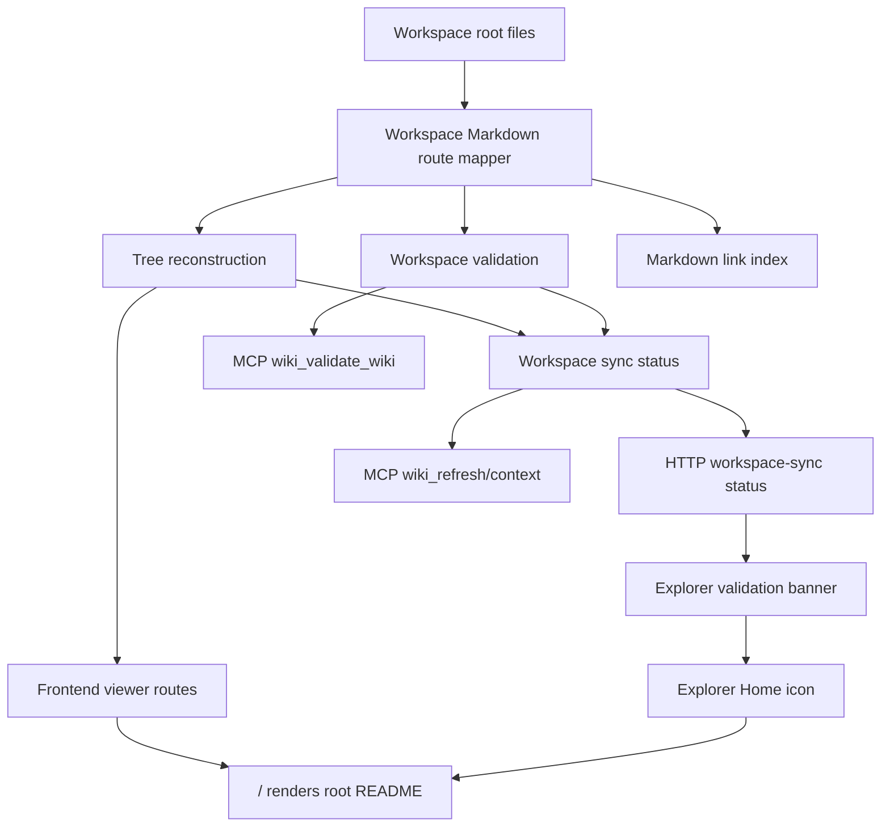
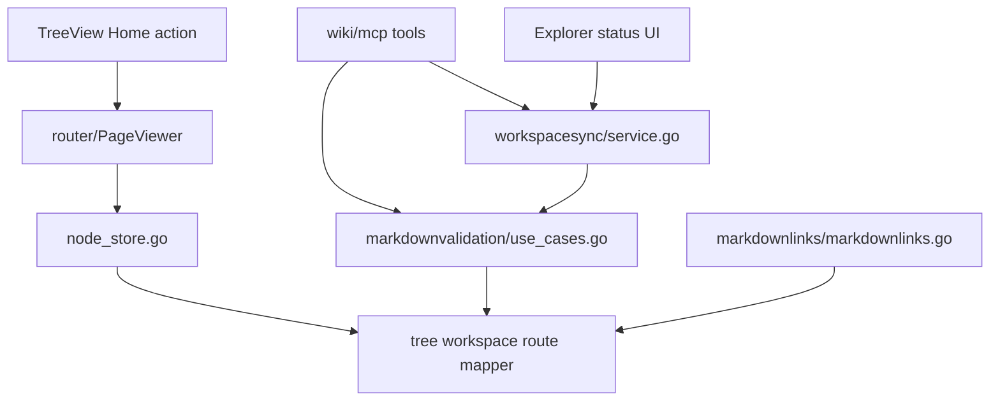
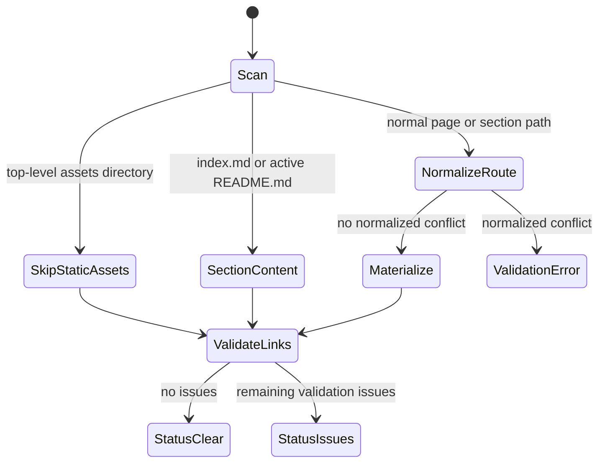

<!-- leafwiki
version: 1
page:
  id: plan-workspace-route-plan
  title: Workspace Markdown Route Normalization Implementation Plan
  created_at: "2026-06-14T18:41:17Z"
  updated_at: "2026-06-14T18:54:52Z"
  creator_id: system
  last_author_id: system
-->

# Workspace Markdown Route Normalization Implementation Plan

> **For agentic workers:** REQUIRED SUB-SKILL: Use `superpowers:subagent-driven-development` or `superpowers:executing-plans` to implement this plan task-by-task. Steps use explicit test-first units and must preserve user changes in the working tree.

**Goal:** Fix workspace sync so documentation-style Markdown filenames under the wiki root import as route-safe pages instead of being skipped as invalid slugs, while keeping LeafWiki's public route slug contract strict. Also make active root `README.md` content reachable as the main wiki page at `/`.

**Architecture:** Add one shared filesystem-to-route mapper for workspace Markdown. Use it from tree reconstruction, workspace validation, and markdown-link indexing. Preserve valid routes, normalize invalid file and directory segments, skip top-level static `assets/`, and report normalized route collisions. Update the frontend root route and Explorer navigation so `/` shows root content instead of always redirecting to the first child.

**Tech Stack:** Go 1.25.x, LeafWiki workspace sync, LeafWiki markdown validation, LeafWiki markdown link index, React/Vite Explorer status UI, Playwright E2E, MCP validation/refresh tools.

---

## Goal & Context

### Objective

Implement shared workspace Markdown route normalization so `docs/plans/agent_hooks.PLAN.md` and similar files become visible LeafWiki pages instead of sync validation errors, while `docs/assets` stops appearing as a reserved wiki section. Restore expected root README behavior so `docs/README.md` renders as the main wiki page when no `docs/index.md` exists.

### Context

- Source workflow: `docs/plans/planning.aibasic.txt`.
- Observation artifact: `docs/plans/workspace-markdown-route-normalization.OBSERVE.md`.
- Context artifact: `docs/plans/workspace-markdown-route-normalization.CONTEXT.md`.
- Decision artifact: `docs/plans/workspace-markdown-route-normalization.DECISION.md`.
- Browser evidence: `http://127.0.0.1:8080/plans` shows an empty `plans` section and 27 workspace sync issues.
- MCP evidence: `wiki_get_context` reports the same sync validation errors and an empty `plans` subtree.
- Related README evidence: `docs/README.md` is active root content when `docs/index.md` is absent, but the frontend `/` route currently redirects to the first root child through `RootRedirect`.
- Prerequisite: continue using `rtk` for shell commands in this repository.

### Decisions from Discussion

**Key Decisions:**

1. Fix behavior in LeafWiki rather than renaming the current files.
   - Reason: workspace sync should accept common Markdown documentation filenames as source input.

2. Use a shared mapper instead of patching only validation or UI.
   - Reason: reconstruction, validation, and link indexing must agree on the route represented by a file.

3. Preserve the strict public slug contract.
   - Reason: slugs with dots and underscores create route and link ambiguity.

4. Preserve raw workspace history before any repair or writeback.
   - Reason: workspace sync revisions must remain truthful about incoming filesystem state.

5. Skip top-level `assets/` as non-page static content.
   - Reason: `/assets` is LeafWiki's managed asset namespace and docs often keep non-Markdown media there.

6. Report normalized route collisions.
   - Reason: reconstruction should not silently pick between two files that normalize to the same route.

7. Render active root README content at `/`.
   - Reason: root README fallback is the main wiki page, not a child page.

8. Add an Explorer Home icon for `/`.
   - Reason: the sidebar renders root children only, so root content needs an explicit navigation affordance.

**Alternatives Considered:**

- Rename only plan files: rejected because it is a workaround, not a product fix.
- Special-case `*.PLAN.md`: rejected because the bug applies to many filename shapes.
- Broaden slug validation: rejected because it weakens the route contract.
- Auto-suffix every collision: rejected because collision repair should be user-visible.

**Open Questions Resolved:**

- Q: Should `agent_hooks.PLAN.md` become a page?
  - A: Yes, with a normalized route such as `agent-hooks-plan`.

- Q: Should `assets` become a wiki section?
  - A: No, skip top-level static `assets/`.

- Q: Should direct validation and stored sync status become one cached surface?
  - A: No. Keep both, but share mapping rules.

- Q: Should `README.md` show as the main wiki page?
  - A: Yes, when it is `docs/README.md` and no `docs/index.md` exists. It should render at `/`.

---

## Summary

This plan introduces a shared workspace route mapper and applies it to all filesystem readers that turn Markdown paths into LeafWiki routes. After implementation, the moved plan files under `docs/plans/` should import as child pages of the `plans` section, the Explorer validation banner should disappear for those files, and MCP validation should agree with workspace sync.

The plan intentionally does not rename the existing plan files. It changes LeafWiki's ingestion behavior so the current files can remain ordinary documentation files.

The plan also fixes the related root README visibility problem. When root `README.md` is active section content, `/` must render that root page instead of redirecting to the first child. The Explorer sidebar should provide a Home icon that navigates to `/`.

---

## Scope Boundaries

### In Scope

- Add a shared workspace Markdown path-to-route mapping utility.
- Normalize invalid file basenames and directory segments into route-safe slugs.
- Preserve already-valid route segments.
- Skip top-level `assets/` during tree reconstruction and workspace slug validation.
- Detect normalized route collisions for pages and sections.
- Update tree reconstruction to use normalized route slugs while reading from original disk paths.
- Update workspace validation to use normalized route paths.
- Update markdown-link indexing to use the same normalized route paths.
- Preserve `index.md`, active `README.md`, non-active `README.md`, uppercase `INDEX.MD`, and dot-directory behavior.
- Make `/` render root content when active root `README.md` or `index.md` exists.
- Add a compact Explorer Home icon that navigates to `/`.
- Add Go tests for mapper, reconstruction, validation, markdownlinks, workspace sync, and MCP parity.
- Add focused E2E coverage for the visible Explorer banner behavior and root README navigation.
- Update docs that describe workspace sync filename expectations.

### Out of Scope / Deferred

- Renaming existing files in `docs/plans/`.
- Creating route aliases from raw filenames to normalized routes.
- Supporting both raw and normalized route addresses forever.
- Turning static relative image files into managed LeafWiki page assets.
- Rewriting copied repository README links such as `docs/workspace-sync.md`.
- Redesigning the Explorer validation banner.
- Changing the public slug rules for user-created pages.
- Broad i18n or stable-string work for the banner.

### Intentional Limitations

- Normalized collisions remain errors requiring user action.
- Top-level `assets/` is skipped only as workspace root static content; managed LeafWiki assets under the data directory remain unchanged.
- Existing valid uppercase slugs continue to work, but invalid mixed punctuation filenames normalize through the slug service.

---

## Assumptions

- The wiki root is `docs` in the observed local environment.
- Workspace sync should treat source filenames like importer input, not like already-approved route slugs.
- `SlugService.GenerateValidSlug` remains the canonical way to turn unsafe text into a valid slug.
- Already-valid slug segments should not be lowercased or otherwise rewritten.
- Collision reporting is safer than automatic suffixing during filesystem reconstruction.
- `wiki_validate_wiki` can continue rescanning the workspace directly.
- E2E should validate visible behavior through Playwright because the UI has no component-test harness.
- Root `README.md` fallback is intentional existing behavior, and the frontend should expose it at `/`.

---

## Impact Analysis

### Existing Code Impact

| File | Change | Downstream Impact |
|---|---|---|
| `internal/core/tree/slug_service.go` | Reuse existing normalization helpers; add small helper only if current helpers cannot express preserve-valid-else-normalize behavior | Keeps route normalization centralized |
| `internal/core/tree/route_path.go` | Add workspace-aware route mapping helpers or delegate to a new focused file in the same package | Consumers stop deriving routes by stripping `.md` only |
| `internal/core/tree/node_store.go` | Use normalized route segments during reconstruction while retaining original file paths for IO | Plan files with dotted/underscore names import as pages |
| `internal/core/markdownvalidation/use_cases.go` | Use the shared mapper and collision data for workspace validation | MCP and sync validation stop reporting importable filenames as invalid slug errors |
| `internal/core/markdownlinks/markdownlinks.go` | Build entries from the shared mapper | Canonical link validation resolves the same routes as reconstruction |
| `internal/workspacesync/service.go` | Preserve status behavior while consuming updated validation results | Explorer banner clears after refresh when only these filename issues existed |
| `internal/wiki/mcp/tools_validation.go` | No broad rewrite expected; verify it uses the updated validation engine | `wiki_validate_wiki` parity with sync mapping |
| `internal/wiki/mcp/tools_workspace_sync.go` | No broad rewrite expected; verify sync validation codes survive refresh responses | `wiki_refresh` parity |
| `ui/leafwiki-ui/src/features/router/router.tsx` | Route `/` to `PageViewer` or otherwise allow root content to render | Active root README becomes reachable |
| `ui/leafwiki-ui/src/features/page/RootRedirect.tsx` | Remove, narrow, or replace first-child redirect behavior | `/` no longer skips root content |
| `ui/leafwiki-ui/src/lib/api/workspaceSync.ts` | Preserve `code` and `severity` in the validation error type if currently omitted | E2E and future UI can assert stable issue codes |
| `ui/leafwiki-ui/src/features/tree/TreeView.tsx` | Add a Home icon button for `/`; adjust typed validation fields if needed | Root content has a sidebar navigation affordance and existing banner remains visible |
| `docs/workspace-sync.md` | Document workspace filename normalization and static `assets/` behavior | Future users know docs filenames need not already be slugs |
| `docs/mcp.md` | Mention validation/refresh parity if existing docs describe workspace validation | Agent-facing behavior stays accurate |
| `docs/README.md` or adjacent docs | Clarify root README behavior if user-facing docs describe workspace root files | Users understand why `/` is home and `/README` is not a child |

### Existing Tests Requiring Updates

| File | Change | Downstream Impact |
|---|---|---|
| `internal/core/tree/route_path_test.go` | Add normalized workspace route mapping cases | Pins mapping contract |
| `internal/core/tree/node_store_reconstruct_test.go` | Add reconstruction cases for dotted, underscore, reserved, and collision paths | Proves pages materialize or conflicts surface |
| `internal/core/markdownvalidation/use_cases_test.go` | Add normalized filename validation and collision cases | Validation agrees with reconstruction |
| `internal/core/markdownlinks/markdownlinks_test.go` | Add index-from-root cases for normalized routes | Canonical links resolve imported pages |
| `internal/workspacesync/service_test.go` | Replace or narrow invalid-slug expectations for normalizable filenames | Sync status reports only true conflicts |
| `internal/wiki/mcp/mcp_integration_test.go` | Add `wiki_validate_wiki` and `wiki_refresh` parity cases | MCP sees the fixed behavior |
| `internal/wiki/mcp/tools_context_test.go` | Confirm validation issue code/severity handling still separates warnings and errors | Context remains stable |
| `ui/leafwiki-ui/src/lib/wikiPath.test.ts` or nearby frontend tests if present | Add root route helper expectations if a frontend unit-test pattern exists | `/` lookup remains root-safe |
| `e2e/tests/workspace-sync.spec.ts` | Add visible `/plans`-style scenario and root README home scenario | Browser banner clears, page tree shows normalized plan pages, and `/` renders root README |

### Module & Target Boundaries

- Backend domain: `internal/core/tree`, `internal/core/markdownvalidation`, `internal/core/markdownlinks`, `internal/workspacesync`, `internal/wiki/mcp`.
- Frontend domain: `ui/leafwiki-ui/src/features/router/router.tsx`, `ui/leafwiki-ui/src/features/page/RootRedirect.tsx`, `ui/leafwiki-ui/src/lib/api/workspaceSync.ts`, `ui/leafwiki-ui/src/features/tree/TreeView.tsx`.
- E2E domain: `e2e/tests/workspace-sync.spec.ts`, with MCP parity in `e2e/tests/mcp-agent-context.spec.ts` only if an existing fixture pattern fits cleanly.

### Access Control

| Type/File | Public API | Internal/Private |
|---|---|---|
| Workspace route mapper | Internal only | Used by reconstruction, validation, links |
| HTTP workspace sync status | Existing public local API shape preserved | May carry `code` and `severity` to UI |
| MCP validation tools | Existing tool names and response concepts preserved | Use updated validation engine |
| UI banner | Existing copy preserved | Issue code/severity remains mostly non-visual |

---

## Architecture & Design

### Architecture Non-Goals

- Do not introduce a filename alias table.
- Do not add database state for raw-to-normalized route mapping.
- Do not change the page create/update slug validation rules.
- Do not rewrite plan filenames as part of this implementation.

### Required Components

#### Architecture Diagram



#### Module Structure Tree

```markdown
internal/core/tree/
├── route_path.go
├── route_path_test.go
├── workspace_route.go            # new or equivalent focused helper
├── workspace_route_test.go       # new if helper is split
├── node_store.go
└── node_store_reconstruct_test.go

internal/core/markdownvalidation/
├── use_cases.go
└── use_cases_test.go

internal/core/markdownlinks/
├── markdownlinks.go
└── markdownlinks_test.go

internal/workspacesync/
├── service.go
└── service_test.go
```

#### Dependency Graph



### Key Design Decisions

1. The mapper is owned by `internal/core/tree` because route slugs are tree concepts.
2. The mapper returns both original disk paths and normalized route paths; callers keep reading/writing original paths.
3. Valid slug segments are preserved exactly.
4. Invalid segments are normalized through `GenerateValidSlug`.
5. Collision detection is path and kind aware, matching page/section twin semantics.
6. Top-level `assets/` is skipped by workspace tree scans and workspace slug validation.
7. Markdown link indexing uses mapped route entries but still resolves hrefs with filesystem-relative semantics.

### Pattern References

- `internal/importer/planner.go`: importer normalization precedent.
- `internal/core/tree/slug_service.go`: slug normalization and reserved-name handling.
- `internal/core/tree/node_store_reconstruct_test.go`: section sentinel and reconstruction test patterns.
- `internal/core/markdownvalidation/use_cases.go`: validation issue shape.
- `internal/workspacesync/service_test.go`: sync status validation behavior.
- `e2e/tests/workspace-sync.spec.ts`: Explorer banner E2E patterns.

### State Machine Documentation



---

## Test Specifications

### Test Principle

Write failing tests before implementation. Use Gherkin scenarios from this plan as the contract. Do not remove existing invalid-slug tests without replacing them with narrower tests for still-invalid cases.

### Test Non-Goals

- No visual redesign snapshot tests.
- No broad browser matrix beyond the workspace sync scenario.
- No benchmark coverage.
- No full docs asset ingestion redesign.

### Test Types Required

| Included | Type | Scope |
|---|---|---|
| Yes | Unit Tests | Mapper, route path normalization, collision detection |
| Yes | Integration Tests | Reconstruction, workspace validation, workspace sync, MCP |
| Yes | E2E Tests | Explorer banner, page tree visibility, and root README home navigation |

### Gherkin Test Scenarios

#### Unit Test Scenarios

Happy path:

```gherkin
Given a workspace Markdown file at "plans/agent_hooks.PLAN.md"
When the workspace route mapper maps the path
Then the route path is "plans/agent-hooks-plan"
And the source path remains "plans/agent_hooks.PLAN.md"
```

```gherkin
Given a workspace Markdown file at "docs/ABCD.md"
When the workspace route mapper maps the path
Then the route path preserves the valid slug segment "docs/ABCD"
```

```gherkin
Given a workspace section content file at "plans/index.md"
When the workspace route mapper maps the path
Then the route path is "plans"
And the kind is section
```

Error scenarios:

```gherkin
Given workspace files "plans/foo_bar.md" and "plans/foo-bar.md"
When workspace routes are collected
Then validation reports a normalized route conflict
And reconstruction does not silently choose one page
```

```gherkin
Given a directory segment that normalizes to an empty slug
When workspace routes are collected
Then validation reports an invalid slug issue
```

Edge cases:

```gherkin
Given a top-level directory "assets" containing only image files
When workspace routes are collected
Then "assets" is skipped as static content
And no wiki section "assets-1" is created
And no invalid_slug issue is reported for "assets"
```

```gherkin
Given "docs/index.md" and "docs/README.md" both exist
When workspace routes are collected
Then "docs/index.md" is the section content
And "docs/README.md" remains a page route
```

```gherkin
Given root "README.md" exists
And root "index.md" does not exist
When workspace routes are collected
Then "README.md" is root section content
And no child page route "README" is produced
```

Implementation notes:

- Put mapper-focused tests near route path tests unless the helper is split into its own file.
- Use table-driven Go tests.
- Include source path, route path, kind, and skip/conflict expectations in each case.

Test target locations:

- `internal/core/tree/route_path_test.go`
- `internal/core/tree/workspace_route_test.go` if a new helper file is added
- `internal/core/tree/node_store_reconstruct_test.go`

#### Integration Test Scenarios

Happy path:

```gherkin
Given the workspace root contains "plans/index.md"
And the workspace root contains "plans/agent_hooks.PLAN.md" with title "Agent Hooks Plan"
When tree reconstruction runs
Then the tree contains a section "plans"
And the section has a child page with route "plans/agent-hooks-plan"
And the page content comes from "plans/agent_hooks.PLAN.md"
```

```gherkin
Given the workspace root contains "plans/agent_hooks.PLAN.md"
When workspace validation runs
Then no invalid_slug issue is reported for that path
And the validation route for the page is "plans/agent-hooks-plan"
```

```gherkin
Given "plans/agent_hooks.PLAN.md" exists
And another page links to "/plans/agent-hooks-plan.md"
When workspace validation builds the markdown link index
Then the link resolves to the normalized page
```

Error scenarios:

```gherkin
Given "plans/a_b.md" and "plans/a-b.md" both exist
When workspace sync runs
Then sync remains available
And sync status includes a path conflict validation error
And the Explorer banner lists the conflicting paths
```

```gherkin
Given "plans/!!!.md" exists
When workspace validation runs
Then validation reports an invalid slug issue for "plans/!!!.md"
```

Edge cases:

```gherkin
Given top-level "assets/install/image.png" exists
And "install/raspberry.md" references "../assets/install/image.png"
When workspace sync runs
Then "assets" is not reported as a reserved slug
And no "assets/index.md" file is materialized
```

```gherkin
Given "plans/README.md" exists without "plans/index.md"
When reconstruction runs
Then "plans/README.md" is section content for route "plans"
```

```gherkin
Given workspace root "README.md" exists
And workspace root "index.md" does not exist
When reconstruction runs
Then the root section content comes from "README.md"
And the tree root has path ""
And the tree does not contain a child page route "README"
```

Implementation notes:

- Update the existing invalid slug tests instead of deleting their coverage.
- Keep one test proving still-invalid names remain errors.
- Keep conflict behavior separate from normalization behavior.

Test target locations:

- `internal/core/markdownvalidation/use_cases_test.go`
- `internal/core/markdownlinks/markdownlinks_test.go`
- `internal/workspacesync/service_test.go`
- `internal/wiki/mcp/mcp_integration_test.go`
- `internal/wiki/mcp/tools_workspace_sync_test.go`

#### E2E Test Scenarios

Happy path:

```gherkin
Given local E2E workspace sync is enabled
And "plans/index.md" exists
And "plans/agent_hooks.PLAN.md" exists
When the user opens the "plans" section in the browser
Then the Explorer tree shows a child page for the normalized plan file
And the workspace sync validation banner is not shown for that filename
```

```gherkin
Given local E2E workspace sync is enabled
And workspace root "README.md" exists with heading "LeafWiki"
And workspace root "index.md" does not exist
And the workspace has at least one root child page
When the user opens "/"
Then the main viewer shows the root README content
And the browser remains on "/"
When the user clicks the Explorer Home icon
Then the browser navigates to "/"
And the main viewer still shows the root README content
```

Error scenario:

```gherkin
Given two Markdown files normalize to the same route
When the browser opens the wiki
Then the Explorer banner is visible
And the issue list shows a route conflict rather than an invalid slug for a normalizable filename
```

Implementation notes:

- Follow existing cleanup patterns in `e2e/tests/workspace-sync.spec.ts`.
- Prefer one new focused E2E case over a broad browser matrix.
- If default ports are noisy, use the repo's existing `E2E_RUN_MODE=local`, `E2E_SKIP_UI_BUILD=1`, and alternate `E2E_PORT` pattern.

Test target locations:

- `e2e/tests/workspace-sync.spec.ts`
- `e2e/tests/mcp-agent-context.spec.ts` only if MCP-browser parity needs a visible proof beyond backend integration tests

---

## Implementation

### Implementation Non-Goals

- Do not rename user files.
- Do not add a new route alias table.
- Do not replace workspace sync validation status shape.
- Do not redesign asset validation.
- Do not change user-facing page creation slug rules.

### Implementation Units

### U1. Shared Workspace Route Mapper

- **Goal:** Add one internal mapper for workspace Markdown paths.
- **Files:**
  - Modify: `internal/core/tree/route_path.go`
  - Create: `internal/core/tree/workspace_route.go` if the helper deserves its own file
  - Modify or create tests: `internal/core/tree/route_path_test.go`, `internal/core/tree/workspace_route_test.go`
- **Requirements:** R1, R2, R3, R4, R6.
- **Dependencies:** none.
- **Approach:** Build a mapper that accepts root-relative paths and produces route path, node kind, content path, source path, skip reason, or validation issue. Use existing slug service helpers. Preserve valid segments. Normalize invalid segments. Keep section sentinel handling in one place.
- **Execution note:** Start with failing table-driven unit tests for plan-style filenames, valid uppercase slugs, reserved words, static `assets/`, `index.md`, and `README.md`.
- **Patterns to follow:** `internal/core/tree/slug_service.go`, `internal/core/tree/route_path_test.go`, `internal/importer/planner.go`.
- **Test scenarios:** all unit happy path, edge, and error scenarios above.
- **Verification:** Mapper tests pass and no consumer-specific code duplicates the normalization logic.

### U2. Reconstruction Uses Normalized Routes

- **Goal:** Make filesystem reconstruction materialize pages and sections from normalized route slugs while reading original files.
- **Files:**
  - Modify: `internal/core/tree/node_store.go`
  - Modify: `internal/core/tree/node_store_reconstruct_test.go`
- **Requirements:** R1, R2, R3, R4, R5, R6.
- **Dependencies:** U1.
- **Approach:** Replace raw directory and basename `IsValidSlug` gates with mapper output. Keep original disk paths for loading Markdown, section content detection, metadata writeback, and modification time lookup. Use normalized route slug for `PageNode.Slug`. Detect normalized sibling conflicts using existing page/section twin rules.
- **Execution note:** Add characterization tests around current `index.md` and `README.md` behavior before changing reconstruction.
- **Patterns to follow:** existing reconstruction tests in `internal/core/tree/node_store_reconstruct_test.go`.
- **Test scenarios:** reconstruction happy path, top-level assets skip, section sentinel behavior, and normalized conflict behavior.
- **Verification:** Reconstruction imports `plans/agent_hooks.PLAN.md` as a child page and still skips dot directories.

### U3. Validation and Markdown Links Share the Mapper

- **Goal:** Align validation and markdown-link indexing with reconstruction.
- **Files:**
  - Modify: `internal/core/markdownvalidation/use_cases.go`
  - Modify: `internal/core/markdownvalidation/use_cases_test.go`
  - Modify: `internal/core/markdownlinks/markdownlinks.go`
  - Modify: `internal/core/markdownlinks/markdownlinks_test.go`
- **Requirements:** R1, R2, R4, R6, R7.
- **Dependencies:** U1.
- **Approach:** Use mapper output when collecting workspace files and link index entries. Store normalized route paths in validation state. Preserve original source paths in validation messages when useful. Keep percent-encoded and filesystem-relative link behavior from existing markdownlinks tests.
- **Execution note:** Write validation tests before implementation so `plans/agent_hooks.PLAN.md` fails first under current behavior.
- **Patterns to follow:** `ValidateWorkspaceMarkdownFiles`, `NewIndexFromRoot`, canonical link tests in `internal/core/markdownlinks/markdownlinks_test.go`.
- **Test scenarios:** validation happy path, normalized link resolution, collision error, static assets skip.
- **Verification:** `wiki_validate_wiki` no longer reports `invalid_slug` for normalizable plan files after this unit, and markdownlinks resolves normalized page routes.

### U4. Workspace Sync, MCP, and HTTP Status Parity

- **Goal:** Ensure sync status, MCP refresh, direct MCP validation, and HTTP status agree on normalized filename behavior.
- **Files:**
  - Modify: `internal/workspacesync/service_test.go`
  - Modify: `internal/wiki/mcp/mcp_integration_test.go`
  - Modify: `internal/wiki/mcp/tools_workspace_sync_test.go`
  - Modify: `internal/wiki/mcp/tools_context_test.go` only if code/severity expectations need adjustment
  - Modify: `internal/workspacesync/service.go` only if status merge logic needs normalized conflict handling
- **Requirements:** R1, R4, R5, R7, R8.
- **Dependencies:** U2, U3.
- **Approach:** Keep status source behavior the same, but update tests and any status conversion code so normalized filenames are no longer surfaced as invalid slugs. Preserve `code` and `severity` for true validation errors.
- **Execution note:** Add one parity test proving `wiki_validate_wiki` and `wiki_refresh.syncStatus.validationErrors` agree for normalizable paths.
- **Patterns to follow:** MCP invalid workspace tests and workspace sync validation tests listed in the observe artifact.
- **Test scenarios:** sync imports normalizable files, sync reports conflict for normalized duplicates, MCP remains available when true conflicts exist.
- **Verification:** Backend parity tests pass without changing MCP tool names or broad response shape.

### U5. Explorer Visible Behavior

- **Goal:** Update frontend typing and E2E coverage so the visible `/plans` import-error behavior is fixed and future regressions are caught.
- **Files:**
  - Modify: `ui/leafwiki-ui/src/lib/api/workspaceSync.ts`
  - Modify: `ui/leafwiki-ui/src/features/tree/TreeView.tsx` only if needed for type-safe issue data
  - Modify: `e2e/tests/workspace-sync.spec.ts`
- **Requirements:** R7, R8.
- **Dependencies:** U4.
- **Approach:** Preserve the current banner design. Ensure validation issue types carry `code` and `severity`. Add a focused E2E fixture with `plans/index.md` plus `plans/agent_hooks.PLAN.md`; assert that the child page appears and the invalid slug banner does not list that filename.
- **Execution note:** Keep UI changes minimal; this is primarily a backend behavior fix with E2E proof.
- **Patterns to follow:** existing `workspace-sync-status` assertions in `e2e/tests/workspace-sync.spec.ts`.
- **Test scenarios:** E2E happy path and collision visible error scenario if cheap.
- **Verification:** E2E demonstrates the current browser issue no longer occurs.

### U6. Root README Home Navigation

- **Goal:** Make active root README content reachable from the frontend.
- **Files:**
  - Modify: `ui/leafwiki-ui/src/features/router/router.tsx`
  - Modify or delete: `ui/leafwiki-ui/src/features/page/RootRedirect.tsx`
  - Modify: `ui/leafwiki-ui/src/features/tree/TreeView.tsx`
  - Modify: `ui/leafwiki-ui/src/features/viewer/PageViewer.tsx` only if root lookup needs explicit handling
  - Modify: `e2e/tests/workspace-sync.spec.ts`
- **Requirements:** R4, R10, R11.
- **Dependencies:** U2, U4.
- **Approach:** Stop redirecting `/` to the first root child when root content exists. Prefer routing `/` through `PageViewer`, because `wikiPageLookupInputForBrowserRoute('/')` already resolves to the root lookup path. Add a compact Home icon button to the Explorer toolbar using the existing `TreeViewActionButton` and a lucide Home icon; clicking it navigates to `/` with normal navigation visit state.
- **Execution note:** Do not model root as a fake child node. The tree root remains the tree root; the Home icon is a navigation affordance.
- **Patterns to follow:** `TreeViewActionButton` usage in `ui/leafwiki-ui/src/features/tree/TreeView.tsx`, route lookup helpers in `ui/leafwiki-ui/src/lib/wikiPath.ts`, and existing root README reconstruction tests.
- **Test scenarios:** E2E root README home scenario above.
- **Verification:** Opening `/` renders `docs/README.md` when no `docs/index.md` exists, and the Home icon returns to `/` from a child route.

### U7. Documentation and Plantrace Cleanup

- **Goal:** Document the new filename behavior and update stale plan references that still point at `plans/`.
- **Files:**
  - Modify: `docs/workspace-sync.md`
  - Modify: `docs/mcp.md` if it describes validation/refresh behavior
  - Modify: `docs/README.md` or adjacent docs if root README behavior is documented there
  - Modify: `internal/plantrace/canonical_markdown_links_test.go` if stale `plans/` paths still fail or mislead
- **Requirements:** R9, R10, R11.
- **Dependencies:** U1, U2, U3, U4, U6.
- **Approach:** Explain that workspace Markdown filenames may be normalized into route-safe slugs, while public routes remain strict. Note that top-level `assets/` is skipped as static content. Document that root `README.md` is active root content when no root `index.md` exists, and that `/` is the home route. Update plantrace references to `docs/plans/` when they are part of test evidence.
- **Execution note:** Keep docs concise and factual; do not promise raw filename aliases.
- **Test scenarios:** Documentation has no automated behavior test except plantrace if updated.
- **Verification:** Documentation references match current paths and do not describe invalid workaround-only behavior.

---

## Requirements

- R1. Normalizable Markdown filenames under the workspace root import as pages instead of invalid slug errors.
- R2. Existing valid route slug segments preserve their route values.
- R3. Top-level static `assets/` is not imported as a wiki section and does not produce a reserved slug error.
- R4. `index.md`, active `README.md`, non-active `README.md`, and uppercase `INDEX.MD` behavior remains compatible with current tests.
- R5. Workspace sync captures raw Markdown before reconstruction or automatic writeback.
- R6. Normalized route collisions are reported explicitly and never silently overwrite.
- R7. Reconstruction, validation, markdown-link indexing, MCP validation, MCP refresh, HTTP status, and UI status use the same route mapping rules.
- R8. The Explorer banner clears for the current `docs/plans/*.PLAN.md` filename class once sync refreshes, unless unrelated validation errors remain.
- R9. Docs explain the normalized filename behavior and do not ask users to rename files as the only fix.
- R10. Active root `README.md` remains section content and renders as the main wiki page at `/` when root `index.md` is absent.
- R11. The Explorer sidebar provides a Home icon that navigates to `/` without representing root as a fake child node.

---

## Verification

Run targeted checks first:

```bash
rtk go test ./internal/core/tree ./internal/core/markdownlinks ./internal/core/markdownvalidation ./internal/workspacesync ./internal/wiki/mcp
```

Run broader backend verification:

```bash
rtk go test ./...
```

Run repo-level verification:

```bash
rtk make test
```

Run focused E2E when backend tests pass:

```bash
E2E_RUN_MODE=local E2E_SKIP_UI_BUILD=1 rtk make run-e2e-workspace-sync
```

Run MCP/browser spot checks after starting the local app:

```bash
rtk make run
```

Then verify through MCP:

- `wiki_refresh` returns no `invalid_slug` issue for `plans/agent_hooks.PLAN.md`.
- `wiki_validate_wiki` returns no `invalid_slug` issue for normalizable `docs/plans/*.PLAN.md` files.
- `wiki_get_subtree` for `plans` shows imported child pages.

Then verify through browser:

- Open `http://127.0.0.1:8080/plans`.
- Confirm `plans` is not empty.
- Confirm no `invalid_slug` issue remains for `plans/agent_hooks.PLAN.md`.
- Open `http://127.0.0.1:8080/`.
- Confirm `/` renders root README content when `docs/README.md` exists and `docs/index.md` does not.
- Navigate to a child page and use the Explorer Home icon to return to `/`.
- Confirm any remaining banner issues are unrelated and documented.

---

## Definition Of Done

- A shared workspace Markdown route mapper exists and is used by reconstruction, validation, and markdown-link indexing.
- `docs/plans/agent_hooks.PLAN.md` maps to a route-safe page under `plans`.
- All `docs/plans/*.PLAN.md`, `.OBSERVE.md`, `.CONTEXT.md`, and `.DECISION.md` style filenames that normalize to unique routes import as pages.
- Top-level `docs/assets/` no longer appears as `slug 'assets' is reserved`.
- `index.md` and `README.md` section behavior remains covered by existing or updated tests.
- Normalized collisions are covered by tests and reported as validation errors.
- MCP direct validation and MCP refresh agree on normalizable filename behavior.
- `/` renders active root README content instead of redirecting to the first root child.
- The Explorer sidebar has a Home icon that navigates to `/`.
- The Explorer validation banner no longer lists normalizable plan filenames after sync refresh.
- Targeted Go tests, broad Go tests, repo-level tests, and focused E2E are run or any unrelated failures are documented with exact failing commands and output summaries.
- Documentation describes the behavior without requiring users to rename files as the only path.
